# 1. From Recursion to Dynamic Programming

> Recursion is the process of repeating a procedure.

<br>
  <div align="center">
      
      <br>
      <code>Different types of Linear recursion</code>
  </div>
</br>

### Non-linear recursion

<br>
  <div align="center">
      
      <br>
      <code>Binary recursion: A type of Non-linear recursion</code>
  </div>
</br>

#### Coding exercise

  <p>Given a string, <code>str</code>, and a character, <code>char</code>, your function <code>countChar</code> should count the number of <code>char</code> characters in the string <code>str</code>. We have written a helper function <code>countChar_</code> for you, but it only works for substring <code>str[1:]</code>. This means that you have to do processing for <code>str[0]</code> character while the rest of the answer can be found in the <code>countChar_</code> function</p>

#### Solution

```python
def countChar(str, char):

  if len(str) <= 0:
    return 0
  if str[0] == char:
    return 1 + countChar_(str[1:], char)
  else:
    return countChar_(str[1:], char)
```

#### Input
```python
countChar("abacada", 'a')
```

#### Output
```python
countChar("abacada", 'a') = 4
```

#### Coding exercise

  <p>We are going to discuss Fibonacci numbers in the next lesson, but why don’t you take a look at the problem now that you know how simple recursion actually is!</p>

#### Solution

```python
def fib(n):

  if n == 0:
    return 0
  if n == 1:
    return 1
  else:
    return fib_(n-1) + fib_(n-2)
```

#### Input

```python
fib(6) = 8
```

<br>
  <div align="center">
      
  </div>
</br>

## Challenge: Find ALL Permutations of a String

<p>Given a string, <code>str</code>, you are required to output an array containing all the possible permutations of that string. By permutation, we simply mean all the different arrangements of the characters of that string.</p>

#### Input

```python
str = "abc"
```

#### Output

```python
permutations(str) = ["abc", "acb", "bac", "bca", "cab", "cba"]
```

#### [Solution Code](01Recursion\Challenge1.py)

<br>
  <div align="center">
      
  </div>
</br>

## Challenge: Place N Queens on an NxN Chessboard

<p>You are given an NxN chessboard, and you are required to place N queens on this chessboard such that no queen is under threat from any other queen.</p>

> In chess a queen can move any number of steps horizontally, vertically, or diagonally.

#### Input

```python
n = 4
board = ["----",
         "----",
         "----",
         "----"
         ]
```

#### Output
```python
placeNQueens(n, board) =
       ["-q--",
        "---q",
        "q---",
        "--q-"
        ]
```

#### [Solution Code](01Recursion\Challenge2.py)

<br>
  <div align="center">
      
  </div>
</br>

## What is Dynamic Programming

> Those who cannot remember the past are condemned to repeat  <b>~ George Santayana</b>

> For the problem that depends on subproblems that are being repeatedly re-evaluated, we can store results of these subproblems to avoid re-evaluation.

<p>There are two basic approaches to solve a problem using dynamic programming. These approaches differ from each other in the way they start solving a problem. In the bottom-up approach, we start from the most basic unit (sub-problem) and then build-up to the solution. Whereas, in the top-down approach, we start from the problem and build and use smaller components(sub-problem) as needed.</p>

#### [DynamicProgramming Fibo](01Recursion\Fibonacci\DynamicProgramming.py)

#### Dynamic programming, the ‘selective’ magic wand#

<p>As amazing as dynamic programming is, you cannot use it on every kind of problem. There are a number of problems that entail an exponential complexity, but their complexity cannot be reduced even after using dynamic programming. In fact, a problem needs to meet very strict prerequisites before it can be solved using dynamic programming. These prerequisites are <code>optimal substructure</code> and <code>overlapping subproblems.</code></p>

#### Optimal substructure

<p>This property means that an optimal solution to a problem can be built using the optimal solutions to that problem’s subproblems. Essentially, we should be able to specify the problem in terms of its subproblems in such a way that if we know the optimal answer to the subproblem, the evaluation of the problem can simply use that answer. This might seem straightforward, but it is a little tricky.</p>

> Top-Down: subproblems are evaluated before the main problem

> Bottom-Up: main problem is evaluated before the subproblems

# 2. Top-Down Dynamic Programming with Memoization

### Memoization

> The act of storing results of costly function call, and retrieving them from the store when needed again to avoid re-ecaluation.

[The most typical way to memoize results is by using hashtables](02TopDownDP_memoization/01Memoization/01wayToMemoizeHashtables.py)

<b>hashtables allow an average-case complexity of constant time and are much easier to use. Therefore, hashtables are recommended over lists for memoization</b>

#### [Optimizing Fibonacci number's algorithm](02TopDownDP_memoization/01Memoization/02FibonacciNumbers_Memoization.py)

<br>
  <div align="center">
      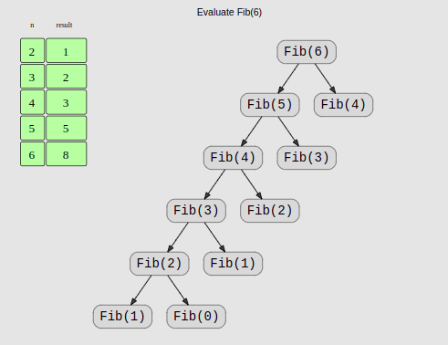
</div>
</br>

<p>This reduces the time complexity of our algorithm from <b>O(2<sup>n</sup>)</b> to <b>O(n)</b></p>

## Challenge: The Staircase Problem

<p>Nick is standing next to a staircase that leads to his apartment. The staircase has <code>n</code> total steps; Nick knows he can climb anywhere between <code>1</code> and <code>m</code> steps in one jump. He thinks about how many ways there are to climb this staircase. He realizes it is a big number since there are a lot of possible combinations. So, he has asked you to write an algorithm for him that tells him the number of possible ways to climb a staircase given <code>n</code> (number of steps) and, <code>m</code> (number of steps covered in biggest jump).</p>

#### Input
```python
n = 4
m = 2
```

#### Output
```python
staircase(n, m) = 5
```

#### [Solution 1](02TopDownDP_memoization/Challenge1_sol1.py)

<p>The problem is similar to the Fibonacci numbers algorithm. Instead of binary recursion, we have an m-ary recursion here. Which means every recursive makes, at most, m recursive calls.</p>

<br>
  <div align="center">
      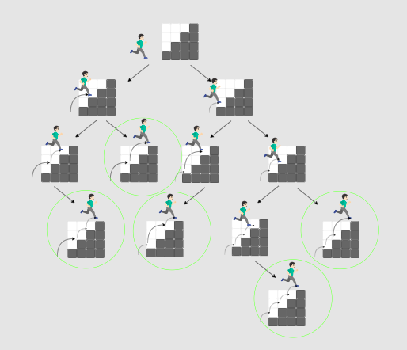
</div>
</br>


#### Time Complexity

<p>m x m x m...m = m<sup>n</sup>, <b>O(m<sup>n</sup>)</b></p>

#### [Solution 2 with memoization](02TopDownDP_memoization/Challenge1_sol2.py)

<br>
  <div align="center">
      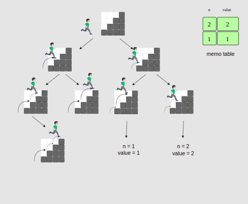
</div>
</br>

## Challenge 2: The Knapsack Problem

<p>Given a list of weights and a list of costs, find the optimal subset of things that form the highest cumulative price bounded by the capacity of the Knapsack.</p>

#### Input
```python
weights = [2, 1, 1, 3]
prices = [2, 8, 1, 10]
capacity = 4
```

#### Output
```python
Knapsack(weights, prices, capacity) = 18
```

#### [Solution 1](02TopDownDP_memoization/Challenge2_sol1.py)

<br>
  <div align="center">
      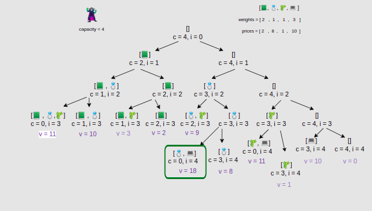
</div>
</br>

<p><b>Time complexity</b>: O(2<sup>n</sup>)</p>

#### [Solution 2 With memoization](02TopDownDP_memoization/Challenge2_sol2.py)

<br>
  <div align="center">
      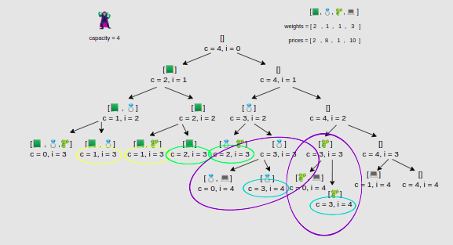
</div>
</br>

# 3. Bottom-Up Dynamic Programming with Tabulation

## Limitations of Top-Down Dynamic Programming

[Maasive amount of recursion](/02TopDownDP_memoization/01Memoization/02FibonacciNumbers_Memoization.py)

```
input: fib(1000)
```

> 💡 Stack is the memory provided to the program to store temporary variables and return addresses. When a program makes function calls, variables and return addresses are pushed onto the stack. When a function call has been evaluated, the return address is popped from the stack and the program continues execution from the statement at the return address.

### Expensive recursion

In addition to being costly in terms of the stack memory, recursion is also incredibly expensive in terms of program execution. Every function call means pushing that function’s variables and return address onto the stack and moving the instruction pointer to the address of that function. When a function is returned it pops the address from the stack and moves the instruction pointer to the return address. While this may look trivial at first, this cost adds on with every recursive call. Compare this to a simple loop. A loop involves just a conditional jump to the address, which is not an expensive operation at all. There is no creation of new variables, storing of return addresses, or manipulation of the stack. This makes loops faster and more scalable than recursion. This is why most of the programs are written iteratively (using loops) instead of recursively, even though recursion is more intuitive.

### How to avoid recursion?

This is why we need a new approach to dynamic programming that does not include recursion. Remember how recursion was nothing but the breaking down of a problem into subproblems until those subproblems were evaluated; and when subproblems were evaluated, the main problem also evaluated. Now if we want to avoid recursion, we will go the opposite way. We will solve subproblems first and then whenever the main problem requires answers to the subproblems, we will return the answers we had already evaluated. This approach of starting with the evaluation of subproblems and then building up to the solution of the main problem is called <b>bottom-up dynamic programming.</b>

## What is Tabulation

As we discussed in the <b>bottom-up</b> approach, we start from the bottom, the smallest subproblem, or the base case. After evaluating the base case, we evaluate a slightly bigger problem and store its result. We continue doing this, i.e., build on the solution of smaller subproblems to evaluate bigger and bigger subproblems until we find the solution to our main problem.

In bottom-up dynamic programming, the process of storing results of evaluated subproblems in an array is called <b>tabulation.</b>

## The Fibonacci Numvers Algortihm with tabulation

### [Bottom-up dynamic programming](03BottonUp_tabulation/Tabulation/fibonacci_tabul.py)

<br>
  <div align="center">
      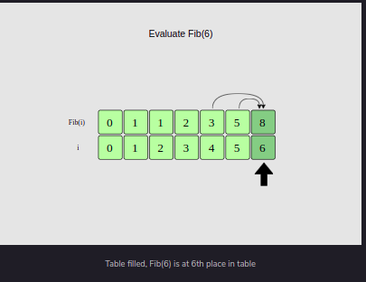
</div>
</br>

#### Time comlexity: O(n)

## Optimizing the Fibonacci Numbers Algorithm

<b>Space complexity from 0(n) to 0(1)</b>

[optimizing_fibo](03BottonUp_tabulation/fibonacci/optimizing_fibo.py)

<br>
  <div align="center">
      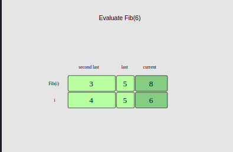
</div>
</br>

## Challenge: The [Catalen Numbers](https://en.wikipedia.org/wiki/Catalan_number)

### Applications of the Catalan numbers

The Catalan numbers readily appear in many interesting counting problems.

* The number of ways to put parentheses around n numbers for multiplication.

* The number of paths to climb up a 2n x 2n grid without going above the diagonal.

* The number of possible binary trees with n leaf nodes. This has been shown in the visualization below.

### input

<mark>n = 4</mark>

### Output

<mark>catalan(4) = 14</mark>

<mark>catalan(6) = 132</mark>

### [Solution 1: Simple recursion](03BottonUp_tabulation/chall1CatalanNumbes/Solution1SimpleRecursion.py)

<br>
  <div align="center">
      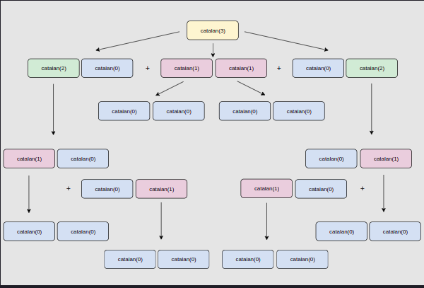
</div>
</br>

#### 0(n!)

### [Solution 2: Top-down approach](03BottonUp_tabulation/chall1CatalanNumbes/Solution2TopDown.py)

#### O(n)

### [Solution 3: Bottom-up dynamic programming](03BottonUp_tabulation/chall1CatalanNumbes/Solution3BottomUp.py)

<br>
  <div align="center">
      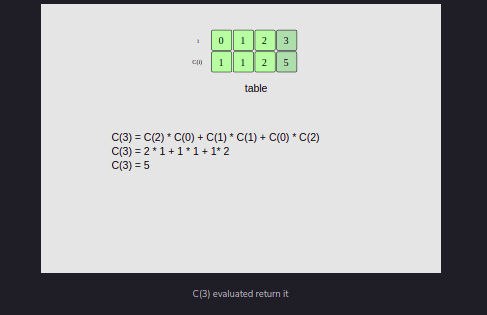
</div>
</br>

#### O(n)

## Challenge 2: Longest Common Substring

<p>Given two strings, we want to find the length of the longest substring common in both these strings. For example, if we have two strings, <code>"hello elf"</code> and <code>"hello yourself"</code>, we can see two prominent substrings: <code>"hello "</code> and <code>"elf"</code>. Since <code>"hello "</code> is longer, this will be the longest common substring for the given pair of strings.</p>

### Input

<mark>
str1 = "hello elf"
<br>
str2 = "hello yourself"
</mark>

### Output

<mark>lcs("hello elf", "hello yourself") = 6 <br>
lcs("hel", "elf") = 2</mark>

### [Solution 1: Simple Recursion](03BottonUp_tabulation/chall2LongestCommonSubstring/Solution1SimpleRecursion.py)

<br>
  <div align="center">
      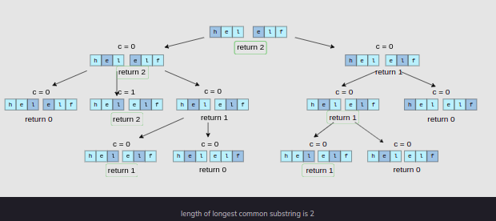
</div>
</br>

#### O(n<sup>m+n</sup>)

### [Solution 2: Top-down dynamic programming](03BottonUp_tabulation/chall1CatalanNumbes/Solution3TopDown.py)

<br>
  <div align="center">
      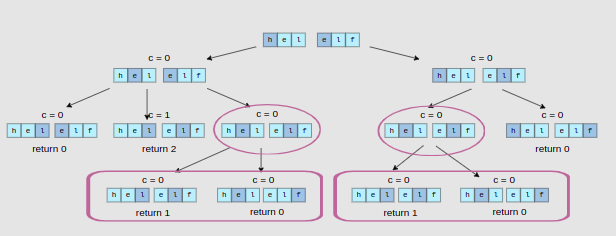
</div>
</br>

#### O(mn<sup>2</sup>)

### [Solution 3: Bottom-up dynamic programming](03BottonUp_tabulation/chall1CatalanNumbes/Solution3BottomUp.py)

<br>
  <div align="center">
      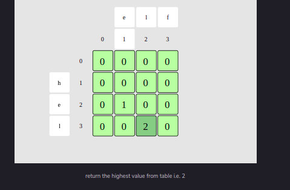
</div>
</br>

#### O(nm)

### [Solution 4: Space optimized bottom-up](03BottonUp_tabulation/chall2LongestCommonSubstring/Solution4SpaceOptimizedBottomUp.py)

#### O(n)

## Top-Down vs Bottom-Up

| Operation | Top-Down | Bottom-Up |
| :-------- | :------: | --------: |
| Ease of problem formulation | ✅ It is easier to formulate a problem in top-down dynamic programming because of its recursive nature | Thinking about a problem in a bottom-up manner can be slightly less intuitive |
| Stack management | Stack memory can quickly explode in top-down algorithms, thus making them less practical for larger inputs | ✅ In bottom-up algorithms, stack memory is never an issue because there are no recursive calls |
| Cost of recursion | Recursive calls can entail a lot of computation cost |	✅ There is no excessive computation cost due to recursive calls |
| Code readability | ✅ Top-down algorithms are typically much easier to read and comprehend | Bottom-up algorithms can sometimes be difficult to grasp |
| Subproblems solved | ✅ In top-down algorithms, we only evaluate a result on ad-hoc basis, i.e., when it is needed, meaning results that are not needed are never evaluated | Since we evaluate results in order starting from smallest to the largest, we may end up evaluating results that are not needed |
