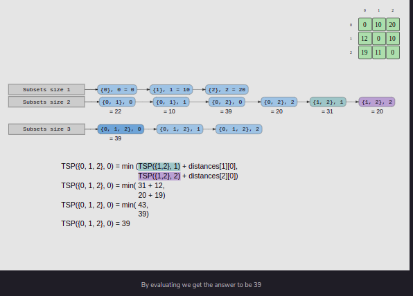

# Challenge1: Number of Ways to Represent N Dollars

### Problem statement

Given a list of currency bills, you are required to count the number of ways in which you can represent a certain amount. For example, if you have only two kinds of bills, $10 and $20, and you want to represent $30, there are only two ways:

* 3 bills of $10
* 1 bill of $20 and 1 bill of $10.

### Input

<mark>
bills = [10, 20]
<br>
amount = 30
</mark>

### Output

<mark>countways([10, 20], 30) = 2</mark>

### [Solutions](04PracticeProblems/01)

<br>
<div align="center">
  
  <br>
  <code>Simple Recursion</code>
</div>
<br>


<br>
<div align="center">
  
  <br>
  <code>Bottom-up DynamicProgramming</code>
</div>
<br>

# Challenge2: The Rod Cutting Problem

### Problem statement

You are given a rod of length <code>n</code> meters. You want to sell the rod and earn revenue. You can cut the rod into multiple smaller pieces of sizes 1 through n<sup>n</sup> and sell them too. You are given the price of each size of the rod. Since you want to earn more, you will have to look for the optimal cuts on the rod that would earn the most revenue.

### Input

```py
n = 4
prices = [2,3,7,8]
```

### Output

```py
rodCutting(n, prices) = 9
```

### [Solutions](04PracticeProblems/02)


<br>
<div align="center">
  
  <br>
  <code>Simple Recursive</code>
</div>
<br>


<br>
<div align="center">
  
  <br>
  <code>Bottom-up DynamicProgramming</code>
</div>
<br>


# Challenge3: Weighted Scheduling Problem

### Problem statement

You have one auditorium, and only one class can take place at the time; however, you have different options for these classes. Each class, c, is characterized by its start time, end time, and total utility we can get out of this class. The utility here could be the number of attendants of the class; the more attendants, the more money you can make as an auditorium owner. Here is your problem statement:

Given n number of classes, you have to find a schedule that maximizes the utility of an auditorium.

### Input

```py
schedule = [(0,2,25), (1,5,40), (6,8,170), (3,7,220)]
```

### Output

```py
WeightedSchedule(schedule) = 245
```

### [Solutions](04PracticeProblems/03)

<br>
<div align="center">
  
  <br>
  <code>Simple Recursive</code>
</div>
<br>

<br>
<div align="center">
  
  <br>
  <code>Bottom-up DynamicProgramming</code>
</div>
<br>


# Challenge4: The Matrix Chain Multiplication

### Problem statement

search google

### Input

```py
dims = [3,3,2,1]
```

### Output

```py
MinMultplications([3,3,2,1]) = 15
```

### [Solutions](04PracticeProblems/04)

<br>
<div align="center">
  
  <br>
  <code>Simple Recursive</code>
</div>
<br>

<br>
<div align="center">
  
  <br>
  <code>Bottom-up DynamicProgramming</code>
</div>
<br>

# Challenge5: The Traveling Salesman Problem

### Problem Statement

You are given a map that has n cities on it. All of the cities are connected directly to each other via distinct routes of variable lengths. You, being a salesman, have to travel to each of these cities on a business trip. But your company wants you to be very careful with the travel expenses and wants you to spend the least amount possible. Expenditure is a function of the distance traveled, so you want to minimize the total distance traveled. Find the length of the shortest path to travel all the cities.

### Input

```py
distances = [
      [0, 10, 20],
      [12, 0, 10],
      [19, 11, 0]
]
```

### Output

```py
TSP(distances) = 39
```

### [Solutions](04PracticeProblems/05)

<br>
<div align="center">
  
  <br>
  <code>Simple Recursive</code>
</div>
<br>

<br>
<div align="center">
  
  <br>
  <code>Bottom-up DynamicProgramming</code>
</div>
<br>

# Challenge6: Longest Common Subsequence

### Problem statement

Given two strings, find the length of the longest common subsequence between them. A common subsequence in a pair of strings is a sequence that follows the same order of characters, but the sequence does not necessarily have to be contiguous. For example, two strings <code>two</code> and <code>too</code> have a common subsequence of <code>to</code>. Even though <code>to</code> does not appear contiguously in <code>two</code>, the order of characters is still preserved, i.e., <code>o</code> follows <code>t</code>. While these strings had smaller subsequences as well, such as <code>t</code> and <code>o</code>, in the context of this problem, we are only interested in finding the length of the longest subsequence.

### Input

```py
str1 = "two"
str2 = "too"
```

### Output

```py
LCS("two", "too") = 2
```

### [Solutions](04PracticeProblems/06)

<br>
<div align="center">
  
  <br>
  <code>Simple Recursive</code>
</div>
<br>

<br>
<div align="center">
  
  <br>
  <code>Bottom-up DynamicProgramming</code>
</div>
<br>
