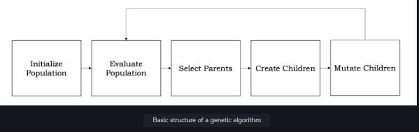

## What are genetic algorithms?

Genetic algorithms are a class of optimization algorithms based on evolution and natural selection. They use strategies loosely based on genetics and biology to produce optimal, or near-optimal, solutions to complicated problems. Initially conceived in the 1960s, genetic algorithms were intended simply as a technique for creating adaptable programs. Today, genetic algorithms are used in numerous applications in fields like artificial intelligence and finance. They’re great at solving difficult optimization problems and lend themselves nicely to parallel computing and distributed architectures. They can even yield solutions to the shipping problem described earlier.

>                   The First Genetic Algorithm
The first genetic algorithm was introduced by John Holland at the University of Michigan in the 1960s. However, evolutionary algorithms had been around long before that. Early artificial intelligence researchers believed evolution was the key to creating truly intelligent programs. Today, the field of evolutionary computation has many, somewhat loosely defined, branches of research, such as evolution strategies, genetic programming, and genetic algorithms.

At their core, optimization problems are search problems. Search problems require us to navigate an area, like a maze, to find an objective, like the end of the maze. Optimization problems are basically the same thing, only there are multiple possible solutions. Imagine a maze with multiple exits. Our goal is to exit the maze as quickly as possible. In other words, we want to find the shortest path to any of the maze exits.

### Informed search vs. brute-force search

In the last lesson, we introduced brute-force search and “informed search, the two basic approaches used to solve search problems. Let’s take a look in more detail and what differentiates them from one another.

An informed search is basically an algorithm that relies on a search strategy where we make smart decisions based on the available information. By contrast, in a brute-force search, we iterate over every possible solution linearly, and therefore, these searches use no knowledge of the search area to make decisions.

For example, in a maze, a brute-force solution would be to try every possible path, never stopping to consider whether or not the paths are becoming smaller or larger, or if the paths will even lead to an exit. Brute-force searches are naive. Eventually, we will find a solution, but it might take a long time, and it might not even be the best one.

### Genetic algorithm structure

Genetic algorithms work via transformations on populations of chromosomes over some number of generations. Imagine we’re playing a card game where the goal is to get the highest possible card after some number of turns. We are initially given five cards, and you can choose to keep any number of cards at the end of every turn.

In this example, a single card is a chromosome. It represents one solution to the problem. Your entire hand is the population; it’s a collection of possible solutions. The changes you make to your hand after every turn are transformations. Finally, every turn represents one generation, meaning one transformation of the population.

 

  
   
  <code>Basic structure of a genetic algorithm</code>

 
