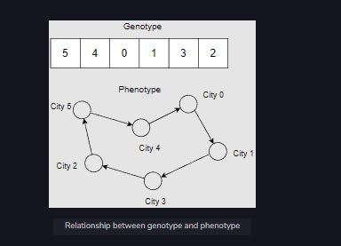

### Using structs to represent chromosomes

The framework we designed generalized the steps common to all genetic algorithms. The purpose of this exercise was both to better understand the structure of genetic algorithms and optimization problems and to make it easier for us to write genetic algorithms in the future.

The chromosomes we created in the previous chapters are enumerable objects that represent solutions to a problem. At the most fundamental level, this is correct. However, in practice, this isn’t a viable implementation.

Consider this: we’re attempting to solve a problem in which the age of the chromosome determines its fitness. One reason we’d do this is to ensure enough variance between generations. Ideally, we’d persist older chromosomes between generations to a certain point before killing them off once they’ve reached a certain age. In this respect, we ensure an equal distribution of both old and young chromosomes and, thus, naturally occurring variance in the population.

Creating a chromosome struct offers a number of conveniences that we wouldn’t have if we simply used an Enum or some other data type to represent a chromosome. For example, if we wanted to calculate the average fitness of a population, we would need to recalculate the fitness of each individual chromosome first, which can be a computationally expensive task. However, by using a struct, we can save time by only calculating the fitness once and then storing it as a key-value pair within the struct itself.

## What are genotypes?

One of the most important decisions we can make when using a genetic algorithm is the type of encoding you use to represent solutions. Encodingsare simply representations of a single solution. A good encoding needs to contain only the information necessary to represent a complete solution to a problem. If a solution is a path through a grid, an encoding of a solution would only need to contain the coordinates of each gridpoint it passes through.

The type of encoding scheme we use is known as a genotype. The genotype of a chromosome tells us what the chromosome should look like. It defines our search space. For example, if we’re trying to create an optimal shipping route through 15 cities, our genotype is a permutation of all 15 cities.

## Relationship between genotype and phenotype

While the genotype is the internal representation of solutions, the phenotype is the expressed representation of solutions. The following figure illustrates the relationship between genotype and phenotype:

 

    
     
    <code>Relationship between genotype and phenotype</code>

 

## Types of genotypes

Out of a number of different genotypes, this course will use three: binary, permutation, and real-value. This is mainly because these are the most common and sufficient for fully understanding genetic algorithms. We’ll also introduce a fourth, “tree-based,” because it’s relatively common, but we won’t use any in this course.
