# 1. Introduction - Understanding Blockchain

## 1.1 What is Blockchain

Blockchain is a term used to describe <b>DLT</b>, or <b>Distributed Ledger Technology</b>. Blockchain is used to create a storage system for data in a distributed and immutable manner.

These are the key features from a technological standpoint.

### Immutability

This means that once data is written to a blockchain data store or ledger, it cannot be changed – its there forever. In contrast, in a standard Relational Database, no matter how much security you implement, the data can be accessed and modified on the file system on which the data is persisted. This could be done by corrupt admin or a hacker.

A blockchain system ensures that even if a bit of data is changed at any level on the ledger, the entire system will report an `invalid` state. And since the data is `distributed` on multiple systems, the actual data with a valid state can be recovered from one of the systems.

### Distribution

As long as you see data on a blockchain and its in a `valid` state on a majority `distributed` nodes, you can trust that data to be accurate. This trust is key. This trust is achieved in a blockchain system by replicating the datastore on a number of peers(hosts) on the internet. If one of the misbehaving peers goes in an `invalid` state, the other peers can filter it out. As long as there is a majority of peers agreeing to a common `valid` state, you can completely trust the data that is stored on that system. This replication also guarantees high availability.

## 1.2 Lack of Trust in Current System of Records - Automobile Industry

### Trust Issues in the Automobile Industry

There are billions of dollars lost every year due to odometer tampering. In some cases, people have bought a used car and later found there to be a major accident on the car.

On the other hand, as a seller of a used car, if my car is extremely well kept I am not able to fully convince the buyer to get the right value for my well-kept car.

In countries like the US, there are also entities like Carfax, a middleman, which people ‘trust’ to some extent as a keeper of their data. This trust is put into Carfax because there are legal processes in place to hold them accountable if they were to alter the data for any car.

For car service records, we have paper-based car service books, which can, of course, very easily be faked. If one was to take a paper based service record and reconcile it with 10 different service providers to ensure validity of the data, it would be very time-consuming, since all service providers have their own system of records.

### Resolving trust issues using Blockchain

Now imagine the following scenario, all the service providers are pushing their service records to a blockchain and the mileage readings of car is being pushed on the blockchain by service providers & IoT devices in car. Moreover, insurance companies are pushing accident details of the car on blockchain. All the timestamped records function to reliably record what happened to the car and by whom. It would be a huge peace of mind for a customer, buying a car with such ‘trustable’ record. Insurance companies would benefit immensely as well, when looking at that data and deciding insurance premiums for a car. And if we were to maintain a mapping of cars to their owners on blockchain, insurance companies benefit further by studying driver behavior.

## 1.3 Terminology

Since there are multiple terms being used here lets clarify some so there is no confusion:

The data store that keeps all blockchain data is called a ledger. Each entry in the ledger is called a transaction. The transactions are timestamped and stored in groups of blocks.

On the ledger you can only add a new transaction or read the old ones. You can not update or delete anything.

The ledger is designed to be immutable using cryptographic algorithms (we will study in next chapter) and its distributed design. The ledger is replicated and maintained by multiple hosts or peers or nodes. This is why its called DLT or Distributed Ledger Technology.

## 1.4 Recap

### What?

Blockchain or Distributed Ledger Technology (DLT) is a ‘trustable data record’ built as a distributed system.

### Why?

Current system of records either lack trust or pay a cost for trust. There is a huge opportunity to solve these issues in current systems of records.

### Next: How?

In the next 2 chapters we will see from a tech perspective, how blockchain achieves this quality of ‘immutability and trust’.

# 2. The technology pre-reqs for understanding blockchain

## 2.1 Hash Functions

A hash value for a data is X is a function:

`HASH(X) = Y`

Such that:

- No other X’ can have HASH(X’) equal to Y. Its one to one mapping.

- The size of Y is fixed and the size of X can be arbitrary.

- Given Y you can not calculate X. Its a one-way function!

 

    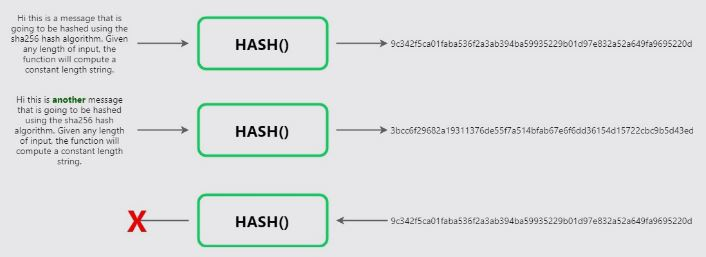

 

### Hash Functions for Checking Integrity

This means that I can take a huge text file and compute its unique digest using a hash function. If I send that file and its computed hash along with it to a receiver, Bob, Bob can then recompute the hash to ensure that the content of that file were not corrupted in the transmission. When we download a file from the internet, it uses the same hash functions to verify its integrity.

### SHA256 Hash Function

There are multiple standardized hash function implementations that are used, such as SHA256, which we will be using in our course.

You can find libraries that implement SHA256 hash in all technologies, so you never have to write your code for SHA256 implementation.

Here is a small Javascript widget that will calculate sha256 of any data you enter:

 

    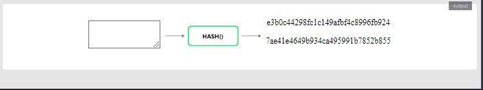

 

## 2.2 Public Key Cryptography

### What is public key cryptography?

Public key cryptography is a cryptographic system used for the encryption/decryption of data. It is not one way like a hash function, meaning that the data, once encrypted, can be decrypted if you have the required key.

You start by generating a special, related pair of keys. These keys can be generated in a pair only. They are output from single execution of a key generation algorithm.

 

    

 

---

### Key usage

Any key can lock or encrypt the data. To unlock or decrypt we need the other key. The only way to decrypt and make the data readable is by having the corresponding key.

 

    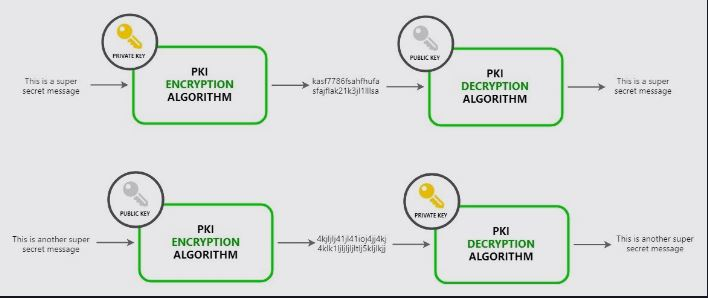

 

### Key generation playground

 

    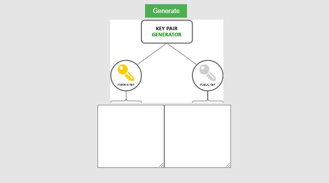

 

## 2.3 Secure Communication using Public Key Cryptography

Lets say Alice, Bob and Chris are connected through a network on which everyone can read data being transferred. If Alice was to send a secret message to Bob only, it would not be possible as Chris gets to read everything transmitted through the network.

 

    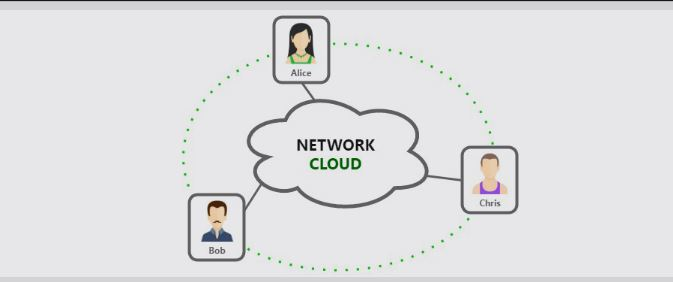

 

### How can we transmit a secret message using PKC?

1. Each participant generates their own key pairs.

 

    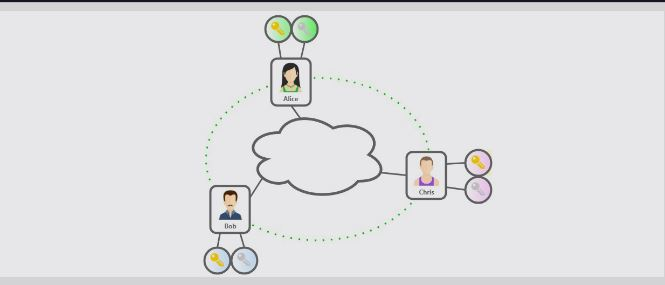

 

2. Each party guards their private key and broadcasts the public key on the network.

 

    

 

3. Now let’s say Alice wants to send a message to Bob saying “Let’s meet at noon tomorrow” but she does not want Chris to know about it. Alice will encrypt the message with Bob’s public key and share through the network.

 

    

 

4. Since the corresponding private key is only known to Bob, only Bob can decrypt it. Chris cannot make any sense of the encrypted message.

 

    

 

## 2.4 Digital Signatures using Public Key Cryptography

Where Bob receives a message, which when he decrypts says “Meet me at 11:00 tomorrow”. How can Bob know for sure that the message was sent by Alice and not Chris?

This can be achieved if the message is “signed” by its sender (Alice). The receiver of the message can then verify the signatures.

We need a way for Alice to “digitally sign” the message so the receiver of the message (Bob) can trust that the message was sent by Alice. Alice can add a digital signature to the message by using her private key to encrypt it. When the message is decrypted by her public key only, Bob can know for sure it came from Alice.

 

    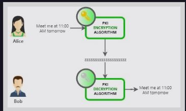

 

This works, but to make it more efficient, instead of signing the entire lengthy message the sender computes a hash (digest) of message and signs that with his public key instead. The receiver can then re-compute the message hash and compare it with the signed hash to ensure that message was not tampered with.

### Adding a Digital Signature

1. Alice computes a message digest by hashing the message she is about to send. SHA256(“Meet me at 11:00 tomorrow”).

2. Alice calculates the message digest = HASH(message);

3. Alice signs the message digest by encrypting it with her private key.

4. Alice appends the signed digest with message and encrypts with Bob’s public key Alice sends it over to Bob

 

    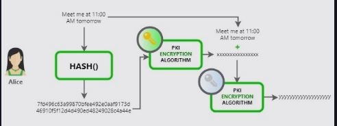
     
    <code>Alice sending digitally singed and encrypted message to Bob</code>

 

### Verifying a Digital Signature

1. Bob decrypts the message using his private key

2. Bob decrypts the digest using Alice’s’ public key

3. Bob computes digest of the message. If it matches the digest he received as signatures it confirms him that:

- Message is not tampered with

* Message has been sent by Alice only - Since only Alice’s public key could decrypt the hash

 

    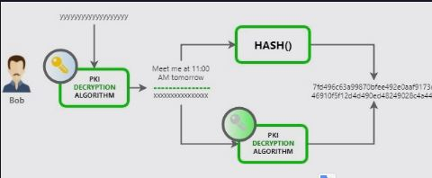
     
    <code>Bob verifying the message he received from Alice</code>

 

## 2.5 Public Key Infrastructure

To help solve this issue we have a concept of a trusted authority in the middle that all network participants trust. This trusted authority is called a CA or certificate authority.

 

    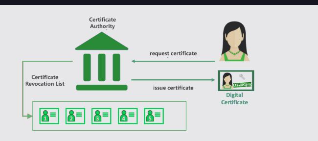
 

 

### Here is how it works with a CA:

1. Alice must contact the CA to get a certificate(digitally signed public key) to prove her public key to others. All other participants on the network will be able to trust the public key is Alice’s if they trust the CA.

2. The CA would take Alice through an approval/on-boarding/manual-verification process and issue a certificate. The certificate itself is a list of certified attributes of the entity its issued to Alice. It has attributes like the public key, name of the holder etc. All this data is digitally signed by the CA using its own private key.

3. Alice then shares this certificate as a proof of her public key to Bob.

4. Since Bob has the CA in his trusted CA list(CA’s public key), he can verify and trust the certificate shared by Alice and hence trust her public key.

### Chain of Trust

A chain of trust is established between a Root CA and a set of Intermediate CAs as long as the issuing CA for the certificate of each of these Intermediate CAs is either the Root CA itself or has a chain of trust to the Root CA.

 

    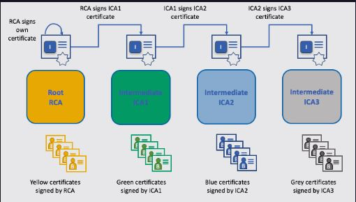
 

 

# 3. Blockchain data storage

### Distributed Consensus

Now, some of these peers might be evil and intentionally report a tampered version of blockchain data. The entire network uses democracy to come to a consensus on the current state of data and any non-conformant or outlier peers are ignored/blocked.

This means that in order for a blockchain network to be fair and valid, most of the nodes have to be fair. If 51% of the nodes are compromised the network is hacked. Since the networks are globally distributed, this is not a possibility.

### Data Storage in Blocks

Let’s see how blockchain stores data in blocks. Each block stores a data blob(which is usually a list of transactions), its block number, and hash of the previous block:

Each block is represented by a json object here for better understanding:

 

    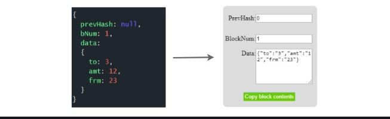
 

 
output:
 

    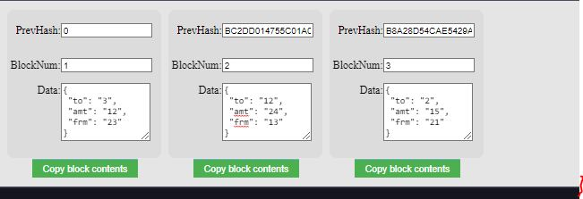
 

 

When creating a new block, the hash of the previous block is calculated and added to the next block. Now if the previous block is altered later in time, the next block will be invalid as the prevHash stored in it will not match the actual hash of previous block.

Using one-way hash functions, the data in the blockchain is safeguarded from tampering.

## Blockchain Big Picture

You have seen how we can store data in a structure called blockchain. In a distributed blockchain network:

Multiple peers have a process(peer.exe) running that maintains a ledger on their local storage.

 

    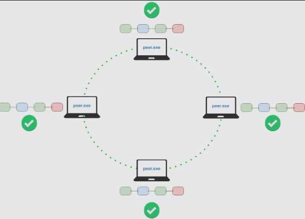
 

 

This process connects to other process instances running on other machines to receive updates on new blocks, transactions, health and validity checks etc to keep itself updated.

 

    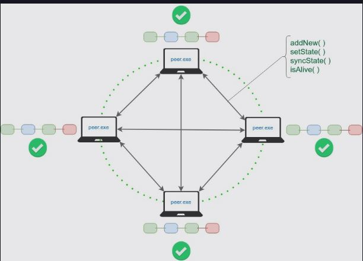
 

 

A transaction/block can be appended by any peer and is then broadcast-ed to all peers.

 

    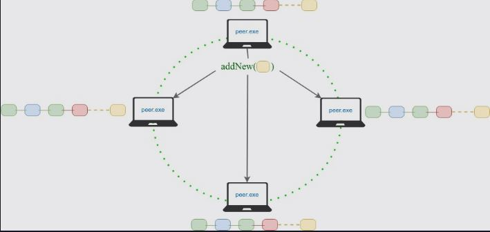
 

 

Since multiple peers are adding transactions/blocks simultaneously, the consensus protocol along with the ledger implementation ensures “validity” and ordering of transactions in blocks forming the blockchain.

# 4. Understanding the value of blockchain (Bitcoin example)

## The Bitcoin Blockchain History

The Bitcoin blockchain was born in 2009, by a pseudonym Satoshi Nakomoto.

Take a look here at the first block(block 0) or the “genesis block” of Bitcoin blockchain.

There is one transaction in this block to Satoshi Nakomoto’s address. Interestingly Satoshi’s account address has never been used to transfer out money so we don’t know if it’s intentional, or if the private key lost?

Now look at another block, this one has 1660 transactions.

> A transaction is a record of transfer of bitcoins from one address to another.

### Membership/Transaction Signing:

A transaction is always digitally signed by the ‘from’ an account holder to ensure that only the owner of account can perform a transaction using their balance.

In Bitcoin, anyone can generate an asymmetric keypair and start transacting on the Bitcoin blockchain.

 

    

 

### Calculating Account Totals:

Consider three blocks with multiple transactions in each block. The timestamp has been omitted here to give a simplified view:

 

    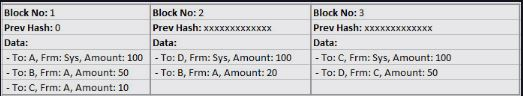

 

### Coin Generation:

each block has a transaction from “Sys” which awards some balance to an account. In Bitcoin, this is labelled as “newly generated coins” and these are the new coins the system awards to the miner of the block.

## Bitcoin Mining

### Mining

In Bitcoin implementation there is an extra field added in each block, called `nonce`.

 

    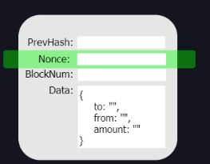

 

Mining peers continuously receive new transactions submitted on the chain. In order for a transaction to be confirmed, it should be put in a block, that needs to be created.

Simply adding transactions to a block is simple - you get the hash or prev block, increment the block number, add the list of transactions, and take its hash. Pretty fast! But in order to incentivize to run a node, Bitcoin awards miners for creating new blocks by giving them newly generated Bitcoins.

Since it would be very simple to mine a block and devalue the generated coin, Bitcoin has made the block creation process challenging. This difficulty self-adjusts to ensure the global pool of miners are able to mine around one block every 10 minutes. This ensures that the supply of new coins is not too fast, making bitcoin a valuable asset.

### Nonce Mining

So Bitcoin adds this extra requirement for a block to have a `nonce` value, such that the block hash of the new block with the nonce has X number of leading zeros. This X is adjusted by the protocol to control the speed of coin generation. The higher the value of X, the harder it is to calculate a nonce.

 

    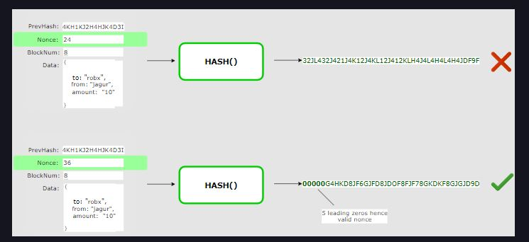

 

Now since hash functions are one-way functions the nonce cannot really be ‘calculated’. Miners do a hit and trial kind of algorithm to see if they can find a nonce that satisfies the requirement(X leading zeros) for the next block.

If we go back to our block # 40000 that we looked at [earlier](https://www.blockchain.com/btc/block/000000000000000004ec466ce4732fe6f1ed1cddc2ed4b328fff5224276e3f6f), you will find that its hash is `000000000000000004ec466ce4732fe6f1ed1cddc2ed4b328fff5224276e3f6f` which has 17 leading zeros.This means that when this block was mined in 2016, the value for X was 17.

### Exercise - Mining

The purpose of this exercise is to understand how block mining is ‘hard’.

Let’s say you have a list of transactions that you are mining a block for. And you are required to find a value for nonce that creates blockhash with 3 leading zeros. Input a value of nonce and the hash will adjust. See if you can find a good nonce in a minute.

 

    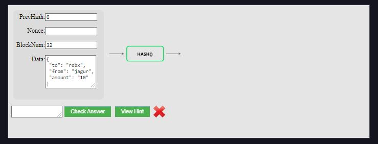

 

## How Bitcoin Becomes Valuable

Value for anything is driven by the balance of its demand and supply.

Anything found in abundance is of no great value. So, in order for something to be valuable, it must be limited in supply. Bitcoin is limited due to the proof-of-work requirement that adds new Bitcoins into the system.

Demand is higher for things people find useful. It could be something useful for two reasons:

1. In terms of the actual utility it provides.

- For example, cars provide a transportation utility.

- Bitcoin provides instant value transfer facilities which is not found in traditional currencies.

2. In terms of the satisfaction it brings.

- For example, people like to have diamonds for physiological satisfaction. Crystals are just as comparable in terms of utility.

- Decoration pieces - aesthetic satisfaction.

A supply-demand balance makes Bitcoin a valuable and desirable currency.

It’s nothing physical. It’s just a digital, immutable, trustable log of transfer transactions. But all these properties give it great utility and therefore value!

It’s important to keep in mind that money doesn’t really exist. ‘Moneyness’ is a property. This property of moneyness is held by fiat currency (legal tender whose value is backed by the government that issued it)and bills due to the State Bank (trusted authority) that promises to hold its value. This ‘moneyness’ is in anything that we deem valuable and therefore can be used as a unit of account, a store of value, or a medium of exchange.

Bitcoin has these properties of ‘moneyness’ making it a valuable asset.

- It allows you to store value

- It allows you to consume value (better than fiat)

- It allows you to exchange value (better than fiat)

# 5. Hyperledger Fabric - Concepts

## 5.1 Introduction

Blockchain technology is also referred to as Distributed Ledger Technology, or DLT, as it works on a ledger that is distributed on multiple peers.

Now that we have a high-level understanding of what DLT is we are ready to jump into Hyperledger Fabric.

In this section, we will understand core Hyperledger fabric concepts and terminology at a high level and explore a “hello world” smart contract built on Hyperledger fabric.

Hyperledger Fabric is a “blockchain platform for the enterprise”. It is open source and modular - allowing different modules to be used, plug and play style. This enables a wide variety of enterprise requirements. It is designed to provide speed and scalability that is lacking in public chains due to proof of work requirement, which is essentially nonce mining.

Hyperledger fabric is ideal for building a permissioned, private blockchain business network. By private, it means that it should not be publicly open for everyone to run a peer or transact on the network. For enterprises, this a big requirement that Hyperledger fabric meets. Enterprises need more control on their data access policies. They also need a permissioned network so they can implement access control as per their own requirements.

At a high level, this is how a Hyperledger network works. The permission issuer issues or revokes permissions for all participants and infrastructure components of the network. This permission or access control in Fabric is based on X509 PKI infrastructure. Which means there is a trusted certificate authority that issues certificates to all participants.

Smart contracts hold logic that defines who can change what on the ledger. And participants write transactions on the ledger by invoking smart contracts.

 

    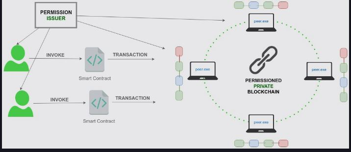

 

## 5.2 Network Concepts

 

    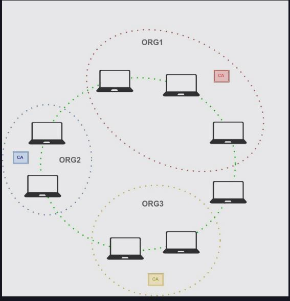

 

Multiple organizations can form a network. Each organization can have its own membership services provider which will issue and revoke identities for users and peers of that organization. This membership service provider can be a certificate authority hierarchy or a single root certificate authority. In order for other organizations to validate transactions by each other, they need to be set up by having trusted root certificate authorities pre-configured on them in something called an MSP (Membership Service Provider).

 

    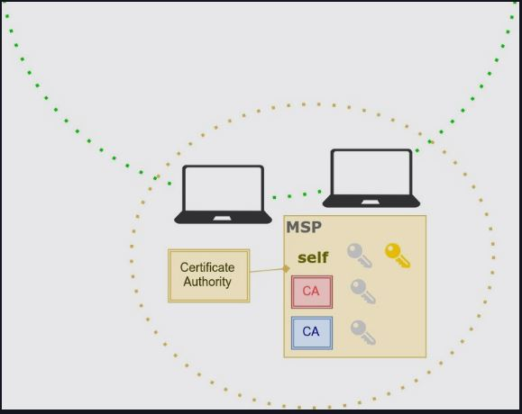

 

### Channels

In fabric there is a concept of channels. Each peer can join one or more channels. If there are some special transactions that need to be shared only by org1 and org2 and they don’t want any peer from org3 to read it, both the organizations can join a separate channel and be present on the main channel as well.

This provides privacy that does not exist in public blockchains.

Internally a separate ledger is maintained on each peer for each channel that it is on.

 

    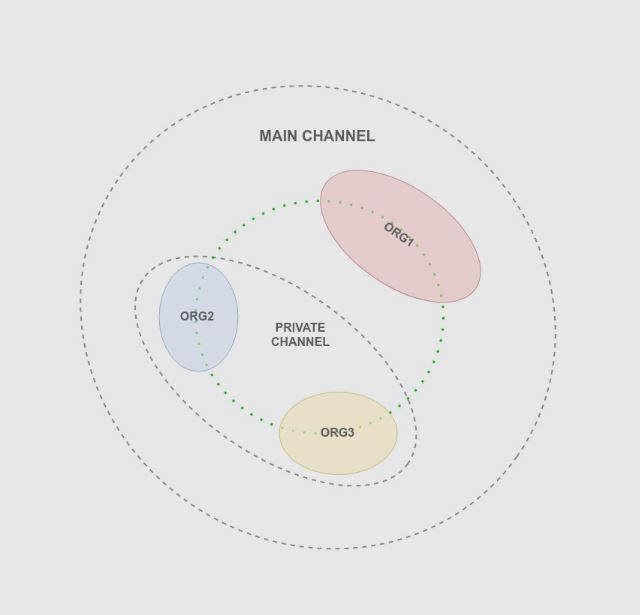

 

### Ledger

Each peer maintains a ledger. A ledger is essentially two things:

- Timestamped transactions organized in blocks and stored.

- A State Database which is the computed outcome of all transactions executed in order.

By having a state database it is easier to query the ledger as the current state is pre-calculated and stored on each peer.

The state database is essentially a key value based datastore(an instance of Apache CouchDB). The state database contains the final state of the ledger after applying all transactions recorded in blockchain. It is therefore like a cache. It helps make querying the blockchain faster, as the state is pre-calculated. It also gives developers an easier programming model to work with. Developers writing chaincode do not need to write transactions directly on blockchain, but rather, write to state in state database (the required transactions are generated under the hood).

The peers communicate with each other to ensure their final state is the same at all times using the gossip protocol.

### Chaincode

This is a piece of code that is part of the ledger. The chaincode provides logic on what, how, when, and by whom things can be written on ledger. It is essentially business rules coded to store data onto the ledger. For example the chaincode can make sure an account holder has enough balance before he transfers an amount to another account.

### Ordering Service

Ordering Service is a distributed(solo in dev mode) service that is responsible for organizing endorsed transactions into sequenced blocks and distributing to all peers. This service is run on multiple nodes. Typically each org will have at least one node of ordering service to ensure they are a part of the end to end transaction processing.

## 5.3 Transaction Processing

Here is the list of high-level steps being carried out when a transaction needs to be applied to the ledger.

1. Client App prepares the transaction signed by the user.

2. Client App connects to endorsing peers(as per endorsement policy) to collected signed endorsements on the transaction output. The peers simulate the transaction and return a signed endorsement.

3. Client App submits the endorsed transaction to ordering service, which puts it into a valid block and distributes to all peers.

 

    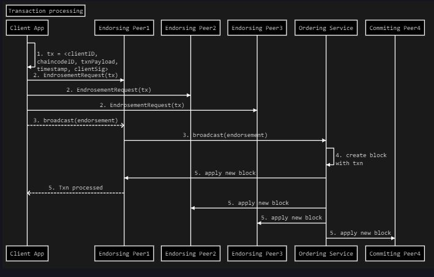

 

## 5.4 Development Components

There are 3 main development components for a basic end-to-end development flow:

1. Configure a `dev network`

2. Write and deploy `chaincode` on the `dev network`

3. Write application code that can invoke chaincode transactions on dev network.

 

    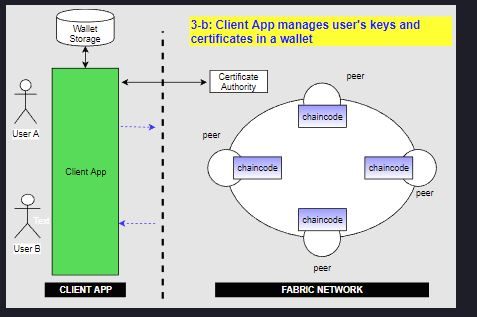

 

### Deploying a network#

Typically a network architect and network operator will deploy a network which will be distributed on multiple machines that are connected.

For development purposes however, we can launch a simple network on our developer’s local machine so we can test our code on it.

The developer would first:

1. Deploy a basic network on their local machine

2. Write chaincode. Deploy their chaincode on his basic network

3. Write application code that invokes the chaincode they deployed.
