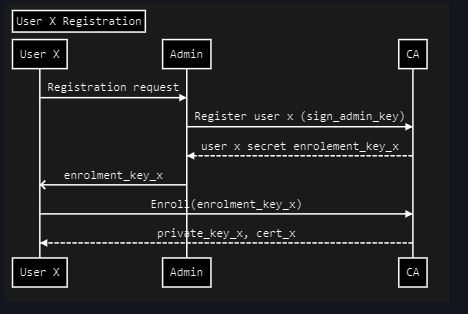

# Application Integration

Applications can interact with a chaincode deployed on a fabric network using a fabric SDK. Hyperledger Fabric 1.4 provides official SDK in node and java.

The node SDK has two important objects for interaction with a fabric network:

- Gateway

- Wallet

### The Wallet

The wallet provides storage and usage histories of user identities for transactions on the network. Remember, in our basic-network we deployed fabric-ca. The self-signed certificate for fabric-ca is configured on the network as a trusted root CA so only users that hold a valid certificate & corresponding key from our fabric-ca will be able to submit a transaction on the network. In our example code, we will be storing these keys and certificates in a file-based wallet to keep things simple to understand.

### The Gateway

The Gateway provides methods to connect to a network channel, using a user’s id from their wallet, and executes chaincode methods installed on the channel.

```js
// Create a new gateway for connecting to our peer node.
const gateway = new Gateway();
// Assuming the wallet has an identity saved by name user1
// The cpp object contains all network's connection urls
await gateway.connect(ccp, {
  wallet,
  identity: "user1",
  discovery: { enabled: false },
});

// Get the network (channel) our contract is deployed to.
const network = await gateway.getNetwork("mychannel");

// Get the contract from the network.
const contract = network.getContract("fabcar");

// Evaluate the specified transaction.
// queryCar transaction - requires 1 argument, ex: ('queryCar', 'CAR4')
// queryAllCars transaction - requires no arguments, ex: ('queryAllCars')
const result = await contract.evaluateTransaction("queryAllCars");
```

# Wallets and Identities

### Wallets and Identities in Client Application#

Now lets see how the wallet and user identities work.

We can issue a new user’s key and get CA signed cert by contacting the CA. Here are the needed steps:

1. A valid existing user A `registers` a new user X to CA. The CA returns the `enrollment key`.

2. The user A shares that `enrollment key` with X

3. User X/A contacts the CA to `enroll` user X and passes in the `enrollment key`. CA returns valid key and signed certificate for user X.

<br>
<div align="center">
    
</div>
<br>

### First User (Admin)

When deploying the CA we need to bootstrap it with one initial admin user that can further register new users. `The enrollment key` for this admin user is pre-set in our initial configuration and the admin user is hence already registered when CA starts. Hence, all we need to do is to enroll the admin user with right `enrollment` key on application first launch.

# Deploy Client Application

1. Run Fabric Network and deploy chaincode on it.

```bash
cd /usercode/infra-basic-network && ./exercise-1.sh && cd /usercode/chaincode && ./exercise-2.sh
```

2. Start the API server

```bash
cd /usercode/api && npm install && node src/index.js
```

3. Test your application

- Visit the /enrollAdmin endpoint first so admin user’s credentials are generated

- Visit the /query endpoint to view all data that was put in ledger by our chaincode init method

- Visit the /invoke endpoint to enter new data into ledger

- Visit the /query endpoint to verify that new data has been added to ledger
