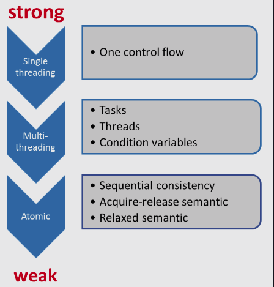

# The Contract

The foundation of multithreading is a well-defined memory model. From the reader’s perspective, it consists of two aspects. On the one hand, there is the enormous complexity of it, which often contradicts our intuition. On the other hand, it helps a lot to get a deeper insight into the multithreading challenges. In the first approach, I want to give you a mental model. That being said, the C++ memory model defines a contract.

### The Contract

This contract is between the programmer and the system. The system consists of the compiler that generates machine code and the processor that executes the machine code, and it includes the different caches that store the state of the program. The result is - in the good case - a well-defined executable that is fully optimized for the hardware platform. To be precise, there is not only a single contract, but a fine-grained set of contracts; i.e. the weaker the rules are that the programmer has to follow, the more potential there is for the system to generate a highly optimized executable.

There is a rule of thumb: the stronger the contract, the fewer liberties for the system to generate an optimized executable. Sadly, the other way around will not work. When the programmer uses an extremely weak contract or memory model, there are a lot of optimization choices. The consequences are that the program is only manageable by a handful of worldwide recognized experts worldwide, and neither you nor I am likely to belong to that group. Roughly speaking, there are three contract levels in C++11.

 

	

 

###First Level

Before C++11, there was only one contract. The C++ language specification did not include multithreading or atomics. The system only knew about one control flow and, therefore, there were only restricted opportunities to optimize the executable. The key point of the system was to guarantee–for the programmer–that the observed behavior of the program corresponded to the sequence of the instructions in the source code. Of course, this means that there was no memory model. Instead, there was the concept of a sequence point. Sequence points are points in the program, at which the effects of all instructions preceding it must be observable. The start or the end of the execution of a function are sequence points. When you invoke a function with two arguments, the C++ standard makes no guarantee about which arguments will be evaluated first, so the behavior is unspecified. The reason is straightforward: the comma operator is not a sequence point and this will not change in C++.

### Second Level

With C++11 everything has changed. C++11 is the first standard aware of multiple threads. The C++ memory model that was heavily inspired by the Java memory model is the reason for the well-defined behavior of threads. However, the C++ memory model goes - as always - a few steps further. The programmer has to obey a few rules in dealing with shared variables to get a well-defined program. The program is undefined if there exists at least one data race. As I already mentioned, you have to be aware of data races if your threads share mutable data. Tasks are a lot easier to use than threads or condition variables.

### Third Level

With atomics, we enter the domain of the experts. This will become more evident, the more we weaken the C++ memory model. We often talk about lock-free programming when we use atomics. I spoke in this subsection about the weak and strong rules; indeed, the sequential consistency is called the strong memory model, and the relaxed semantic is called the weak memory model.

## The Foundation

The C++ memory model has to deal with the following points:

* Atomic operations: operations that can be performed without interruption.

* Partial ordering of operations: sequences of operations that must not be reordered.

* Visible effects of operations: guarantees when operations on shared variables are visible to other threads.

The foundation of the contract are operations on atomics that have two characteristics: They are by definition atomic or indivisible, and they create synchronization and order constraints on the program execution. These synchronization and order constraints will also hold for operations on non-atomics. On one hand, an operation on an atomic is always atomic; on the other hand, you can tailor the synchronizations and order constraints to your needs.

