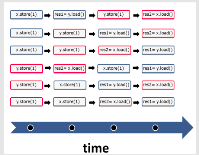

# 1. Strong Memory Model

### Strong Memory Model

Java 5.0 got its current memory model in 2004, and C++ got its model in 2011. Before that, Java had an erroneous memory model and C++ had no memory model. Those who think this is the endpoint of a long process are completely wrong. The foundations of multithreaded programming are 40 to 50 years old; Leslie Lamport defined the concept of sequential consistency in 1979.

<b>Sequential consistency provides two guarantees</b>:

* The instructions of a program are executed in source code order.

* There is a global order of all operations on all threads.

The first guarantee of the sequential consistency is that the instructions will be executed in the order defined in the source code. This is easy; no store operation can overtake a load operation.

The second guarantee of the sequential consistency is that all instructions of all threads have to follow a global order. In the case listed above, it means that thread 2 sees the operations of thread 1 in the same order in which thread 1 executes them. This is the key observation: thread 2 sees all operations of thread 1 in the source code order of thread 1. The same holds from the perspective of thread 1. You can think about characteristic number 2 as a global clock which all threads have to obey. The global clock is the global order. Each time the clock makes a tick, one atomic operation takes place, but you never know which one.

We are not yet done with our riddle! We still need to look at the different interleaving executions of the two threads. So, the following six interleavings of the two threads are possible.

<br>
<div align="center">
	
</div>
<br>

That was easy, right? That was sequential consistency, also known as the Strong Memory Model.

# 2. Weak Memory Model

The programmer uses atomics in this particular example; He obeys his part of the contract. The system guarantees well-defined program behavior without data races. In addition to that, the system can execute the four operations in each combination. If the programmer uses the relaxed semantic, the pillars of the contract dramatically change. On one hand, it is a lot more difficult for the programmer to understand possible interleavings of the two threads. On the other hand, the system has a lot more optimization possibilities.

### With Relaxed Semantic

With the relaxed semantic - also called Weak Memory Model - many more combinations of the four operations are possible. The counter-intuitive behavior is that thread 1 can see the operations of thread 2 in a different order, so there is no view of a global clock. From the perspective of thread 1, it is possible that the operation <code>res2= x.load()</code> overtakes <code>y.store(1)</code>. It is even possible that thread 1 or thread 2 do not perform their operations in the order defined in the source code. For example, thread 2 can first execute <code>res2= x.load()</code> and then <code>y.store(1)</code>.


### With Acquire-Release Semantic

There are a few models between the sequential consistency and the relaxed-semantic. The most important one is the acquire-release semantic. With the acquire-release semantic, the programmer has to obey weaker rules than with sequential consistency. In contrast, the system has more optimization possibilities. The acquire-release semantic is the key to a deeper understanding of synchronization and partial ordering in multithreading programming because the threads will be synchronized at specific synchronization points in the code. Without these synchronization points, it’s not possible to have well-defined behavior of threads, tasks, or condition variables possible.

```c++
x.store(1);
res = x.load();
```

is equivalent to the following piece of code:

```c++
x.store(1, std::memory_order_seq_cst);
res = x.load(std::memory_order_seq_cst);
```

# 3. std::atomic<bool>

### std::atomic<bool>

<code>std::atomic<bool></code> has a lot more to offer than <code>std::atomic_flag</code>. It can explicitly be set to <code>true</code> or <code>false</code>.

> <code>atomic</code> is not <code>volatile</code>

What does the keyword <code>volatile</code> in C# and Java have in common with the keyword volatile in C++? Nothing! It’s so easy in C++. That is the difference between volatile and std::atomic.

* <b>volatile:</b> is for special objects, on which optimized read or write operations are not allowed

* <b>std::atomic:</b> defines atomic variables, which are meant for a thread-safe reading and writing

It’s so easy, but the confusion starts exactly here. The keyword volatile in Java and C# has the meaning of std::atomic in C++, i.e. volatile has no multithreading semantic in C++.

<b>volatile</b> is typically used in embedded programming to denote objects which can change independently of the regular program flow. One example is an object which represents an external device (memory-mapped I/O). Because these objects can change independently of the regular program flow and their value will directly be written into main memory, no optimized storing in caches takes place.

# 4. All Atomic Operations

| Method | atomic_flag | atomic<bool> | atomic<T\*> | atomic<integral> | atomic<user defined> |
| :----- | ----------- | ------------ | ----------- | ---------------- | -------------------- |
| test_and_set									|yes	|no	|no 		| no  |	no	|
| clear											|yes	|no	|no			| no  |	no	|
| is_lock_free									|yes	|no	|no			| no  |	no	|
| load											|no		|yes	|yes	| yes |	yes	|
| store											|no		|yes	|yes	| yes |	yes	|
| exchange										|no		|yes	|yes	| yes |	yes	|
| compare_exchange_strong compare_exchange_weak	|no		|yes |yes	| yes |	yes	|
| fetch_add, += fetch_sub, -=					|no		|no	|yes		| yes |	no	|
| fetch_or, = fetch_and, &= fetch_xor, ^= |		no		|no	|no			| yes |	no	|
| ++, --										|no		|no	|yes		| yes |	no  |

# 4. Free Atomic Functions

The functionality of the flag std::atomic_flag and the class template std::atomic can also be used with free functions. Because these functions use pointers instead of references, they are compatible with C. The atomic free functions are available for the types that you can use with the class template std::atomic.

There is one prominent exception to the rule: you can apply the atomic free functions to the smart pointer std::shared_ptr.

### std::shared_ptr

```c++
#include<iostream>
#include<atomic>
#include<thread>

int main(){
  std::shared_ptr<int> ptr = std::make_shared<int>(2011);

  for (auto i= 0; i<10; i++){
     std::thread([ptr]{                           
       std::shared_ptr<int> localPtr(ptr);       
       localPtr = std::make_shared<int>(2014);
       std::cout<<"localPtr: "<<*(localPtr)<<std::endl;
      }).detach(); 
    }
}  
```

```c++
#include<iostream>
#include<atomic>
#include<thread>

int main(){
  std::shared_ptr<int> ptr = std::make_shared<int>(2011);  

  for (auto i= 0; i<10; i++){
     std::thread([&ptr]{                         
       ptr= std::make_shared<int>(2014);
       std::cout<<"ptr: "<<*(ptr)<<std::endl;
     }).detach(); 
  }
}  
```

# 5. Atomic Operations on std::shared_ptr

There are specializations for the atomic operations load, store, compare, and exchange for an std::shared_ptr. By using the explicit variant, you can even specify the memory model. Here are the free atomic operations for std::shared_ptr:

```c++
std::atomic_is_lock_free(std::shared_ptr)
std::atomic_load(std::shared_ptr)
std::atomic_load_explicit(std::shared_ptr)
std::atomic_store(std::shared_ptr)
std::atomic_store_explicit(std::shared_ptr)
std::atomic_exchange(std::shared_ptr)
std::atomic_exchange_explicit(std::shared_ptr)
std::atomic_compare_exchange_weak(std::shared_ptr)
std::atomic_compare_exchange_strong(std::shared_ptr)
std::atomic_compare_exchange_weak_explicit(std::shared_ptr)
std::atomic_compare_exchange_strong_explicit(std::shared_ptr)
```


