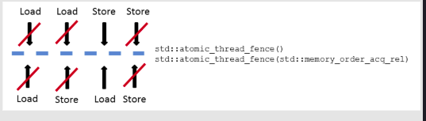
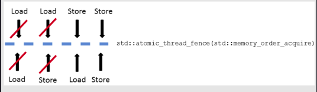
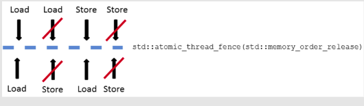
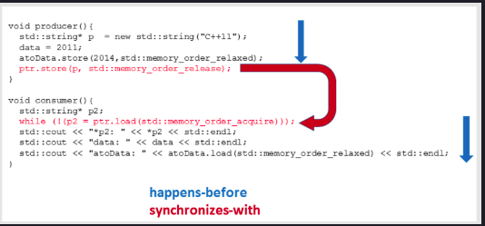

# 1. Fences as Memory Barriers

An `std::atomic_thread_fence` prevents specific operations from crossing a fence, and it doesn’t need an atomic variable; they are frequently just referred to as fences or memory barriers. You quickly get an idea of what an `std::atomic_thread_fence` is all about.

# 2. The Three Fences

Typically, three kinds of fences are used: full fence, acquire fence and release fence. As a reminder, acquire is a load, and release is a store operation. What happens if I place one of the three memory barriers between the four combinations of load and store operations?

* Full fence: A full fence std::atomic_thread_fence() between two arbitrary operations prevents the reordering of these operations, but guarantees that it won’t hold for StoreLoad operations. Also, they can be reordered.

* Acquire fence: An acquire fence std::atomic_thread_fence(std::memory_order_acquire) prevents a read operation before an acquire fence from being reordered with a read or write operation after the acquire fence.

* Release fence: A release fence std::atomic_thread_fence(std::memory_order_release) prevents a read or write operation before a release fence from being reordered with a write operation after a release fence.

### Full fence

 

	

 

Of course, instead of writing `std::atomic_thread_fence()` you can explicitly write `std::atomic_thread_fence(std::memory_order_seq_cst)`. Sequential consistency is applied to fences by default. If you use sequential consistency for a full fence, the `std::atomic_thread_fence` follows a global order.

### Acquire fence

 

	

 

### Release fence

 

	

 

The three memory barriers will be depicted even more concisely in the diagram below:

 

	

 

# 3. Synchronization with Atomic Variables

As a starting point, I’ve implemented a typical consumer-producer workflow with the acquire-release semantic. Initially, I will use atomics and then will switch to fences. Let’s start with atomics because most of us are comfortable with them. That will not hold for fences; they are almost completely ignored in the literature on the C++ memory model.

 

	

 

The program is well-defined because the happens-before relation is transitive. I only have to combine the three happens-before relations:

1. Lines 14 - 16 happens-before line 17 `ptr.store(p,std::memory_order_release)`.

2. Line 23 `while(!(p2= ptrl.load(std::memory_order_acquire)))` happens-before the lines 24 - 26.

3. Line 17 synchronizes-with line 23. => Line 17 happens-before line 23.

