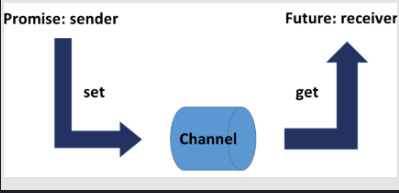

# 1. Introduction to Tasks

In addition to threads, C++ has tasks to perform work asynchronously. These tasks need the <future> header, and they will be parameterized with a work package. Additionally, they consist of two associated components: a promise and a future; Both are connected via a data channel. The promise executes the work packages and puts the result in the data channel; the associated future picks up the result. Both communication endpoints can run in separate threads. What is special is that the future can pick up the result at a later time; therefore, the calculation of the result by the promise is independent of the query of the result by the associated future.

<br>
<div align="center">
	
</div>
<br>

# 2. Threads vs Tasks

| Criteria | Threads | Tasks |
| :------- | ------- | ----: |
|Participants|creator and child thread | promise and future |
|Communication | shared variable       |communication channel|
|Thread creation | obligatory | optional |
|Synchronisation |via join() (waits) |get call blocks |
|Exception in child thread | child and creator threads terminates | return value of the promise |
|Kinds of communication | values | values, notifications, and exceptions |

# 3. Introduction to std::async

std::async behaves like an asynchronous function call. This function call takes a callable together with its arguments. std::async is a variadic template and can, therefore, take an arbitrary number of arguments. The call to std::async returns a future object fut. That’s your handle for getting the result via fut.get().

# 4. Introduction to std::packaged_task

std::packaged_task pack is a wrapper for a callable in order for it to be invoked asynchronously. By calling pack.get_future() you get the associated future. Invoking the call operator on pack (pack()) executes the std::packaged_task and, therefore, executes the callable.

Dealing with std::packaged_task usually consists of four steps:

I. Wrap your work:

```c++
std::packaged_task<int(int, int)> sumTask([](int a, int b){ return a + b; });
```

II. Create a future:

```c++
std::future<int> sumResult= sumTask.get_future();
```

III. Perform the calculation:

```c++
sumTask(2000, 11);
```

IV. Query the result:

```c++
sumResult.get();
```

# 5. Introduction to Promises and Futures

Promise and future are a mighty pair. A promise can put a value, an exception, or simply a notification into the shared data channel. One promise can serve many std::shared_future futures. With C++20 we may get extended futures that are compose-able.

### std::promise

std::promise enables you to set a value, a notification, or an exception. In addition, the promise can provide its result in a delayed fashion.

| Method 	|	Description |
| :------------ | ----------------: | 
| prom.swap(prom2) and | Swaps the promises. |
| std::swap(prom, prom2) |  |	
| prom.get_future() | Returns the future. |
| prom.set_value(val) |	Sets the value. |
| prom.set_exception(ex) | Sets the exception. |
| prom.set_value_at_thread_exit(val) |	Stores the value and makes it ready if the promise exits. |
|prom.set_exception_at_thread_exit(ex)|	Stores the exception and makes it ready if the promise exits. |

### std::future

A std::future enables you to

* pick up the value from the promise.

* ask the promise if the value is available.

* wait for the notification of the promise. This waiting can be done with a relative time duration or an absolute time point.

* create a shared future (std::shared_future).

| Method	| Description |
| :------------ | ----------: |
| fut.share() | Returns a std::shared_future. Afterwards, the result is not available anymore. |
| fut.get()  |	Returns the result which can be a value or an exception. |
| fut.valid() |	Checks if the result is available. After calling fut.get() it returns false. |
| fut.wait() |	Waits for the result. |
| fut.wait_for(relTime) | Waits for the result, but not longer than for a relTime. |
| fut.wait_until(absTime) | 	Waits for the result, but not longer than until abstime. |

If a future fut asks for the result more than once, a std::future_error exception is thrown.

# 6. Promise and Future: Return a Notification

If you use promises and futures to synchronize threads, they have a lot in common with condition variables. Most of the time, promises and futures are the better choices. 

| Criteria	 | Condition Variables |	Tasks |
| :------------- | ------------------- | -----------: |
| Multiple synchronizations | Yes |	No |
| Critical section | Yes | No |
| Error handling in receiver | No | Yes |
| Spurious wakeup | Yes | No |
| Lost wakeup	 |  Yes |No |


The advantage of a condition variable to a promise and future is that you can use condition variables to synchronize threads multiple times. In contrast to that, a promise can send its notification only once, so you have to use more promise and future pairs to get the functionality of a condition variable. If you use the condition variable for only one synchronization, the condition variable is a lot more difficult to use in the right way. A promise and future pair needs no shared variable and, therefore, it doesn’t have a lock, and isn’t prone to spurious or lost wakeups. In addition to that, tasks can handle exceptions. There are lots of reasons to prefer tasks to condition variables.


