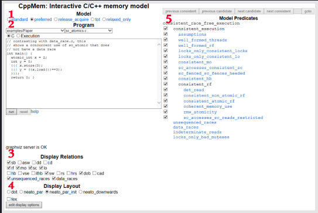

# Introduction to CppMem

I will start with a small program and successively improve it, then verify each step of my process with CppMem. CppMem is an interactive tool for exploring the behavior of small code snippets using the C++ memory model.

The program is quite simple. It consists of the two threads thread1 and thread2. thread1 writes the values x and y. thread2 reads the values x and y in the opposite sequence. This sounds straightforward, but even in this simple program we can get different results if we run it several times.

# CppMem: An Overview

CppMem is an interactive tool for exploring the behavior of small code snippets using the C++ memory model. It has to be in the toolbox of each programmer who seriously deals with the memory model.

The online version of CppMem - you can also install it on your PC - provides very valuable services in a twofold way:

1. CppMem verifies the behavior of small code snippets. Based on the C++ memory model, the tool considers all possible interleavings of threads, visualizes each of them in a graph, and annotates these graphs with additional details.

2. The very accurate analysis of CppMem gives you deep insight into the C++ memory model. In short, CppMem is a tool that helps you to get a better understanding of the memory model.

### The Overview

My simplified overview of CppMem is based on the default configuration. This overview will only provide you with the base for further experiments and should help you to understand my process of ongoing optimization.

 

	

 

1. Model

* Specifies the C++ memory model. preferred is a simplified variant of the C++11 memory model.

2. Program

* Contains the executable program (e.g. syntax) in a simplified *C or C++. To be precise, you cannot directly copy C or C++ code programs into CppMem.

* You can choose between a lot of programs that implement typical multithreading scenarios. To get the details of these programs, read the very well written article Mathematizing C++ Concurrency. Of course, you can also run your own code.

* CppMem is about multithreading; therefore, there are shortcuts.

	* You can easily define two threads using the expression {{{ ... ||| ... }}}. The three dots (...) represent the work package of each thread.

	* If you use the expression x.readvalue(1), CppMem will evaluate the interleavings of the threads for which the thread execution gives the value 1 for x.

