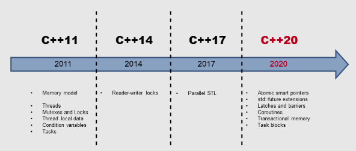

## Overview

- C++11 and C++14 have the basic building blocks for creating concurrent and parallel programs.
- With C++17 we have the parallel algorithms from the Standard Template Library (STL). That means that most STL based algorithms can be executed sequentially, parallel, or vectorized.
- The concurrency story in C++ goes on. With C++20 we can hope for extended futures, co-routines, transactions, and more.

 

	

 

### C++11 and C++14: The foundation

Multithreading was introduced in C++11. This support consists of two parts: A well-defined memory model, and a standardized threading interface. C++14 added reader-writer locks to the multithreading facilities of C++.

# Multithreading in C++

> Multithreading in C++ consists of threads, synchronization primitives for shared data, thread-local data, and tasks.

### Threads
 
A <code>std::thread</code> represents an independent unit of program execution. The executable unit, which is started immediately, receives its work package as a callable unit. A callable unit can be a named function, a function object, or a lambda function.

The creator of a thread is responsible for its lifecycle. The executable unit of the new thread ends with the end of the callable. Either the creator waits until the created thread <code>t</code> is done (<code>t.join()</code>), or the creator detaches itself from the created thread: (<code>t.detach()</code>). A thread <code>t</code> is joinable if no operation <code>t.join()</code> or <code>t.detach()</code> was performed on it. A joinable thread calls <code>std::terminate</code> in its destructor and the program terminates.

A thread that is detached from its creator is typically called a daemon thread because it runs in the background. A <code>std::thread</code> is a variadic template. This means that it can receive an arbitrary number of arguments by copy or reference; either the callable or the thread can get the arguments.

### Shared Data

You have to coordinate access to a shared variable if more than one thread is using it at the same time and the variable is mutable (non-const). Reading and writing a shared variable at the same time is a data race, and therefore, undefined behavior. Coordinating access to a shared variable is achieved with mutexes and locks in C++.

### Mutexes

A mutex (mutual exclusion) guarantees that only one thread can access a shared variable at any given time. A mutex locks and unlocks the critical section that the shared variable belongs to. C++ has five different mutexes; they can lock recursively, tentatively, and with or without time constraints. Even mutexes can share a lock at the same time.

### Locks

You should encapsulate a mutex in a lock to release the mutex automatically. A lock implements the RAII idiom by binding a mutex’s lifetime to its own. C++ has a <code>std::lock_guard</code> for the simple cases, and a</code>std::unique_lock</code> / </code>std::shared_lock</code> for the advanced use-cases, such as the explicit locking or unlocking of the mutex respectively.

### Thread-safe Initialization of Data

If shared data is read-only, it’s sufficient to initialize it in a thread-safe way. C++ offers various ways to achieve this including using constant expression, a static variable with block scope, or using the function <code>std::call_once</code> in combination with the flag <code>std::once_flag.</code>

### Thread Local Data

Declaring a variable as thread-local ensures that each thread gets its own copy; therefore, there is no shared variable. The lifetime of a thread local data is bound to the lifetime of its thread.

### Condition Variables

Condition variables enable threads to be synchronized via messages. One thread acts as the sender while another one acts as the receiver of the message, where the receiver blocks wait for the message from the sender. Typical use cases for condition variables are producer-consumer workflows. A condition variable can be either the sender or the receiver of the message. Using condition variables correctly is quite challenging; therefore, tasks are often the easier solution.

# C++17 Paralllel Algorithms of the Standard Template Library

### Execution Policy

With C++17, most of the STL algorithms will be available in a parallel implementation. This makes it possible for you to invoke an algorithm with a so-called execution policy. This policy specifies whether the algorithm runs sequentially <code>std::seq</code>, in parallel <code>std::par</code>, or in parallel with additional vectorization <code>std::par_unseq</code>.

### New Algorithms

In addition to the 69 algorithms that are available for parallel or vectorized executions in overloaded versions, we get eight new algorithms. These new ones are well suited for parallel reducing, scanning, or transforming.

# C++20: The Concurrent Future

###Atomic Smart Pointers

The smart pointers std::shared_ptr and std::weak_ptr have a conceptional issue in concurrent programs: they share an intrinsically mutable state. Therefore, they are prone to data races and, thus, lead to undefined behavior. std::shared_ptr and std::weak_ptr guarantee that the incrementing or decrementing of the reference counter is an atomic operation and the resource will be deleted exactly once, but neither of them can guarantee that the access to its resource is atomic. The new atomic smart pointers std::atomic_shared_ptr and std::atomic_weak_ptr solve this issue.

### Extended Futures

Tasks called promises and futures, introduced in C++11, have a lot to offer. However, they also have a drawback: tasks are not composable into powerful workflows. That limitation will not hold for the extended futures in C++20. Therefore, an extended future becomes ready when its predecessor (then) becomes ready, when_any one of its predecessors becomes ready, or when_all of its predecessors become ready.

### Latches and Barriers

C++14 has no semaphores, i.e. the variables used to control access to a limited number of resources. Worry no longer, because C++20 proposes latches and barriers. You can use latches and barriers for waiting at a synchronization point until the counter becomes zero. The difference between latches and barriers is that an std::latch can only be used once, while an std::barrier and std::flex_barrier can be used more than once. In contrast to a std::barrier, a std::flex_barrier can adjust its counter after each iteration.

### Coroutines

Coroutines are functions that can suspend and resume their execution while maintaining their state. Coroutines are often the preferred approach to implement cooperative multitasking in operating systems, event loops, infinite lists, or pipelines.

### Transactional Memory

The transactional memory is based on the ideas underlying transactions in database theory. A transaction is an action that provides the first three properties of ACID database transactions: Atomicity, Consistency, and Isolation. The durability that is characteristic for databases​ will not hold for the proposed transactional memory in C++. The new standard will have transactional memory in two flavors: synchronized blocks and atomic blocks. Both will be executed in total order and behave as if they were protected by a global lock. In contrast to synchronized blocks, atomic blocks cannot execute transaction-unsafe code.
