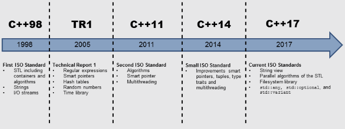

<br>
<div align="center">
  
</div>
<br>

# 1. Application of Libraries

## 1.1 Including Header Files

```c++
#include <iostream>
#include <vector>
```

## 1.2 Using Namespaces

### Using Declaration

A <code>using</code> declaration adds a name to the visibility scope, in which you applied the <code>using</code> declaration:

```c++
#include <iostream>
#include <chrono>
...
using std::cout;
using std::endl;
using std::chrono::system_clock;
...
cout << "Hello world:" << endl; // unqualified name
auto timeNow= now();            // unqualified name
```

### Using Directive

The <code>using</code> directive permits it to use all names of a namespace without qualification.

```c++
#include <iostream>
#include <chrono>
...
using namespace std;
...
cout << "Hello world:" << endl;            // unqualified name
auto timeNow= chrono::system_clock::now(); // partially qualified name
```

### Namespace Alies

```c++
#include <chrono>
...
namespace sysClock= std::chrono::system_clock;
auto nowFirst= sysClock::now();
auto nowSecond= std::chrono::system_clock::now();
```

## 1.3 Building an Executable

It is only seldom necessary to link explicitly against a library. That sentence is platform dependent. For example, with the current g++ or clang++ compiler, you have to link against the <code>pthread</code> library to get the multithreading functionality.

```c++
g++ -std=c++14 thread.cpp -o thread -pthread
```

# 2 Utilities in C++ Standard Library

Utilities are useful tools which can be used in many different contexts. They are not bound to a typical domain.

* Useful Functions
* Adaptors for Functions
* Pairs
* Tuples
* Reference Wrappers
* Smart Pointers
* Type Traits
* Time Library
* Values of Variables

## 2.1 Useful Functions

### The min, max and minmax functions

| Function | Description |
| :------------- | :------------- |
| min(a, b) | Returns the minimal value of a and b. |
| min(a, b, comp) | Returns the minimal value of a and b according to the predicate comp. |
| min(initializer list) | Returns the minimal value of the initializer list. |
| min(initializer list, comp) | Returns the minimal value of the initializer list according to the predicate comp. |
| max(a, b) |	Returns the maximal value of a and b. |
| max(a, b, comp) | Returns the maximal value of a and b according to the predicate comp. |
| max(initializer list) | Returns the maximal value of the initializer list. |
| max(initializer list, comp) |	Returns the maximal value of the initializer list according to the predicate comp. |
| minmax(a, b) | Returns the minimal and maximal value of a and b. |
| minmax(a, b, comp) | Returns the minimal and maximal value of a and b according to the predicate comp according to the predicate comp. |
| minmax(initializer list) | Returns the minimal and maximal value of the initializer list. |
| minmax(initializer list, comp) | Returns the minimal and maximal value of the initializer list according to the predicate comp. |

#### [implementation](./UsefulFunctions/minMax.cpp)

### Move vs. Copy

The function <code>std::move</code>, defined in the header <code><utility></code>, empowers the compiler to move its resource. In the so-called move semantic, the values from the source object are moved to the new object. copying is expensive and moving is cheap.

#### Vector Elements

```c++
#include <utility>
//...
std::vector<int> myBigVec(10000000, 2011);
std::vector<int> myVec;

myVec = myBigVec;             // copy semantic
myVec = std::move(myBigVec);  // move semantic
```

#### Classes

A class supports <b>copy semantics</b> if the class has a copy constructor and a copy assignment operator.

A class supports <b>move semantics</b> if the class has a move constructor and a move assignment operator.

If a class has a copy constructor, it should also have a copy assignment operator. The same holds true for the move constructor and move assignment operator.

```c++
class MyData{
    MyData(MyData&& m) = default; // move constructor
    MyData& operator = (MyData&& m) = default; // move assignment
    MyData(const MyData& m) = default; // copy constructor
    MyData& operator = (const myData& m) = default; // copy assignment
};
```

### Forward

Typical use cases for <code>std::forward</code> are factory functions or constructors. <b>Factory functions</b> are functions which create an object and must therefore identically pass the arguments. Constructors often use their arguments to initialize their base class with identical arguments.

```c++
// forward.cpp
...
#include <utility>
...
using std::initialiser_list;

struct MyData{
  MyData(int, double, char){};
};

template <typename T, typename...  Args>
  T createT(Args&&... args){
  return T(std::forward<Args>(args)... );
}

...

int a= createT<int>();
int b= createT<int>(1);

std::string s= createT<std::string>("Only for testing.");
MyData myData2= createT<MyData>(1, 3.19, 'a');

typedef std::vector<int> IntVec;
IntVec intVec= createT<IntVec>(initialiser_list<int>({1, 2, 3}));  
```

### Swap

With the function <code>std::swap</code> defined in the header <utility>, you can easily swap two objects.

```c++
// swap.cpp
...
#include <utility>
...
template <typename T>
inline void swap(T& a, T& b){
  T tmp(std::move(a));
  a= std::move(b);
  b= std::move(tmp);
}
```

## 2.2 Adaptors for functions

### std::bind and std::function

The two functions <code>std::bind</code> and <code>std::functions</code> fit very well together. While <code>std::bind</code> enables you to create new function objects on the fly, <code>std::function</code> takes these temporary function objects and binds them to a variable. Both functions are powerful tools from functional programming and need the header <code>`<functional>`</code>.

[implementation](./AdaptorsForFunctions/bind.cpp)

### Behavior of std::bind and std::function

Because of <code>std::bind</code>, you can create function objects in a variety of ways:

* bind the arguments to an arbitrary position,
* change the order of the arguments,
* introduce placeholders for arguments,
* partially evaluate functions,
* invoke the newly created function objects, use them in the algorithm of the STL or store them in std::function.

<code>std::function</code> can store arbitrary callables in variables. It’s a kind of polymorphic function wrapper. A callable may be a lambda function, a function object, or a function. <code>std::function</code> is always necessary and can’t be replaced by <code>auto</code>, if you have to specify the type of the callable explicitly.

```c++
// dispatchTable.cpp
#include <iostream>
#include <map>
#include <functional>
using std::make_pair;
using std::map;

int main(){
  map<const char, std::function<double(double, double)>> tab;
  tab.insert(make_pair('+', [](double a, double b){ return a + b; }));
  tab.insert(make_pair('-', [](double a, double b){ return a - b; }));
  tab.insert(make_pair('*', [](double a, double b){ return a * b; }));
  tab.insert(make_pair('/', [](double a, double b){ return a / b; }));

  std::cout << "3.5 + 4.5\t=  " << tab['+'](3.5, 4.5) << "\n";  //3.5 + 4.5	=  8
  std::cout << "3.5 - 4.5\t=  " << tab['-'](3.5, 4.5) << "\n";  //3.5 - 4.5	=  -1
  std::cout << "3.5 * 4.5\t=  " << tab['*'](3.5, 4.5) << "\n";  //3.5 * 4.5	=  15.75
  std::cout << "3.5 / 4.5\t=  " << tab['/'](3.5, 4.5) << "\n";  //3.5 / 4.5	=  0.777778

  return 0;
}
```

## 2.3 Pairs and Tuples

### Pair

With <code>std::pair</code>, you can build pairs of arbitrary types. The class template <code>std::pair</code> needs the header <code>`<utility>`</code>. <code>std::pair</code> has a default, copy and move constructor. Pair objects can be swapped: <code>std::swap(pair1, pair2)</code>.

#### std::make_pair

C++ has the practical help function <code>std::make_pair</code> to generate pairs, without specifying their types. <code>std::make_pair</code> automatically deduces their types.

[implementation](./PairsAndTuples/pair.cpp)

### Tuples

You can create tuples of arbitrary length and types with <code>std::tuple</code>. The class template needs the header <tuple>. <code>std::tuple</code> is a generalization of <code>std::pair</code>. You can convert between tuples with two elements and pairs.

The i-th element of a tuple t can be referenced by the function template <code>std::get</code>: <code>std::get<i-1>(t)</code>. By <code>std::get<type>(t)</code> you can directly refer to the element of the type <code>type</code>.

[implementation](./PairsAndTuples/tuple.cpp)

## 2.4 Reference Wrappers

A reference wrapper is a copy-constructible and copy-assignable wrapper for a object of type&, which is defined in the header <code>`<functional>`</code>. So you have an object, that behaves like a reference, but can be copied.

[implementation](./ReferenceWrappers/referenceWrapperRefCref.cpp)

## 2.5 Smart Pointers

Smart pointers are one of the most important additions to C++ because they empower you to implement explicit memory management in C++. Beside the deprecated <code>std::auto_ptr</code>, C++ offers three different smart pointers. They are defined in the header <code>`<memory>`</code>.

|Name	| Standard | Description |
| :------------- | :------------- | -----: |
| std::auto_ptr (deprecated) | C++98 | Owns exclusively the resource. Moves the resource while copying. |
| std::unique_ptr | C++11 | Owns exclusively the resource. Can’t be copied. |
| std::shared_ptr |	C++11 |	Has a reference counter for the shared variable. Manages the reference counter automatically. Deletes the resource, if the reference counter is 0. |
| std::weak_ptr |	C++11 |	Helps to break cycles of std::shared_ptr. Doesn’t modify the reference counter. |

<div align="center">
  
</div>

## 2.6 Type Traits

> <b>The type traits library and static_assert are a powerful pair</b>
The type traits library and the function <code>static_assert</code> are a powerful pair. On one side, the functions of the type traits library provide the type information at compile time. On the other side, the <code>static_assert</code> function checks the given information at compile time. All this happens transparently to the runtime of the program:

```c++
#include <type_traits>
template <typename T> T fac(T a){
     static_assert(std::is_integral<T>::value, "T not integral");
     //...
}
fac(10);
fac(10.1); // with T= double; T not integral
```
### Primary Type Categories
```c++
template <class T> struct is_void;
template <class T> struct is_null_pointer;
template <class T> struct is_integral;
template <class T> struct is_floating_point;
template <class T> struct is_array;
template <class T> struct is_pointer;
template <class T> struct is_member_object_pointer;
template <class T> struct is_member_function_pointer;
template <class T> struct is_enum;
template <class T> struct is_union;
template <class T> struct is_class;
template <class T> struct is_function;
template <class T> struct is_lvalue_reference;
template <class T> struct is_rvalue_reference;
```

### Composite Type Categories

| Composite type categories | Primary type category |
| :------------- | :------------- |
| is_arithmetic | is_floating_point or is_integral |
| is_fundamental |	is_arithmetic or is_void |
| is_object | is_arithmetic or is_enum or is_pointer or is_member_pointer |
| is_reference | is_lvalue_reference or is_rvalue_reference |
| is_compound |	complement of is_fundamental |
| is_member_pointer | is_member_object_pointer or is_member_function_pointer |

### Type Properties

```c++
template <class T> struct is_const;
template <class T> struct is_volatile;
template <class T> struct is_trivial;
template <class T> struct is_trivially_copyable;
template <class T> struct is_standard_layout;
template <class T> struct is_pod;
template <class T> struct is_literal_type;
template <class T> struct is_empty;
template <class T> struct is_polymorphic;
template <class T> struct is_abstract;

template <class T> struct is_signed;
template <class T> struct is_unsigned;

template <class T, class... Args> struct is_constructible;
template <class T> struct is_default_constructible;
template <class T> struct is_copy_constructible;
template <class T> struct is_move_constructible;

template <class T, class U> struct is_assignable;
template <class T> struct is_copy_assignable;
template <class T> struct is_move_assignable;
template <class T> struct is_destructible;
template <class T, class... Args> struct is_trivially_constructible;
template <class T> struct is_trivially_default_constructible;
template <class T> struct is_trivially_copy_constructible;
template <class T> struct is_trivially_move_constructible;
template <class T, class U> struct is_trivially_assignable;
template <class T> struct is_trivially_copy_assignable;
template <class T> struct is_trivially_move_assignable;

template <class T> struct is_trivially_destructible;

template <class T, class... Args> struct is_nothrow_constructible;
template <class T> struct is_nothrow_default_constructible;
template <class T> struct is_nothrow_copy_constructible;
template <class T> struct is_nothrow_move_constructible;

template <class T, class U> struct is_nothrow_assignable;
template <class T> struct is_nothrow_copy_assignable;
template <class T> struct is_nothrow_move_assignable;

template <class T> struct is_nothrow_destructible;
template <class T> struct has_virtual_destructor;
```

### Type Comparisons

| Function | Description |
| :------------- | :------------- |
| template class Base, class Derived> | Checks if Derived is derived from Base. |
| struct is_base_of	| |
| template <class From, class To> | Checks if From can be converted to To. |
| struct is_convertible	| |
| template <class T, class U> | Checks if the types T and U are the same. |
| struct is_same	| |

## 2.7 Time Library

The time library is a key component of the new multithreading capabilities of C++. So you can put the current thread by <code>std::this_thread::sleep_for(std::chrono::milliseconds(15)</code> for 15 milliseconds to sleep, or you try to acquire a lock for 2 minutes: <code>lock.try_lock_until(now + std::chrono::minutes(2))</code>. Beside that, the chrono library makes it easy to perform simple performance tests:

# 3. Interface of All Containers

You can construct each container by a multitude of constructors. To delete all elements of a container <code>cont</code>, you can use <code>cont.clear()</code>. It makes no difference if you create a container, if you delete them or if you add or remove elements. Each time the container takes care of the memory management. 

| Type | Example |
|:---- | ------: |
| Default | std::vector<int> vec1 |
| Range | std::vector<int> vec2(vec1.begin(), vec1.end()) |
| Copy | std::vector<int> vec3(vec2) |
| Copy | std::vector<int> vec3= vec2 |
| Move | std::vector<int> vec4(std::move(vec3)) |
| Move | std::vector<int> vec4= std::move(vec3) |
| Sequence (Initializer list) |	std::vector<int> vec5 {1, 2, 3, 4, 5} |
| Sequence (Initializer list) | std::vector<int> vec5= {1, 2, 3, 4, 5} |
| Destructor | vec5.~vector() |
| Delete elements | vec5.clear() |

# 4. Sequential Containers

The sequential container has a lot in common, but each container has its special domain. Before I dive into the details, I provide an overview of all five sequential containers of the std namespace.

| Criteria | Array | Vector | Deque | List | Forward List |
| :------- | ----- | ------ | ----  | ---- | -----------: |
| Size     |static | dynamic|dynamic|dynamic|dynamic      |
| Implementation | static array | dynamic array | sequence of arrays | doubly linked list | singly linked list |
| Access   | random|random  |random |forward and backward | forward |
| Optimized for insert and delete at | — | end: O(1) | begin and end: O(1) | begin and end: O(1); arbitrary: O(1) | begin(1); arbitrary: O(1) |
| Memory reservation |	— | yes | no | no | no |
| Release of memory | — | shrink_to_fit | shrink_to_fit | always | always |
| Strength | no memory allocation; minimal memory requirements | 95% solution |	insertion and deletion at the begin and end | insertion and deletion at an arbitrary position | fast insertion and deletion; minimal memory requirements |
| Weakness | no dynamic memory; memory allocation | Insertion and deletion; at an arbitrary position: O(n) | Insertion and deletion; at an arbitrary position: O(n) | no random access | no random access |


# 5. Associative Containers 

C++ has eight different associative containers. Four of them are associative containers with sorted keys: <code>std::set</code>, <code>std::map</code>, <code>std::multiset</code> and <code>std::multimap</code>. The other four are associative containers with unsorted keys: <code>std::unordered_set</code>, <code>std::unordered_map</code>, <code>std::unordered_multiset</code> and <code>std::unordered_multimap</code>. The associative containers are special containers. That means they support all of the operations described in the chapter Interface of all containers.

| Associative container | Sorted | Associated value | More identical keys | Access time |
| :-------------------- | -------| ---------------- | ------------------- | -----------:|
| std::set | yes | no | no | logarithmic |
| std::unordered_set | no | no | no | constant |
| std::map | yes | yes | no | logarithmic |
| std::unordered_map | no | yes | no | constant |
| std::multiset | yes |	no | yes | logarithmic |
| std::unordered_multiset | no | no | yes | constant |
| std::multimap | yes |	yes | yes | logarithmic |
| std::unordered_multimap | no | yes | yes | constant |

# 6. Adaptors for Containers 

C++ has with <code>std::stack</code>, <code>std::queue</code> and <code>std::priority_queue</code> three special sequential containers. I guess, most of you know these classic data structures from your education.

```c++
template <typename T, typename Container= deque<T>> 
class stack;
```

# 7. Callable Units 

Many of the STL algorithms and containers can be parametrized with callable units or short callables. A callable is something that behaves like a function. Not only are these functions but also function objects and lambda functions. Predicates are special functions that return a boolean as the result. If a predicate has one argument, it’s called a unary predicate if a predicate has two arguments, it’s called a binary predicate. The same holds for functions. A function taking one argument is a unary function; a function taking two arguments is a binary function.

| Function object for | Representative |
| :-----------------  | ------------:  |
| Negation	      |std::negate<T>()|
| Arithmetic | std::plus<T>(), std::minus<T>() 
	       std::multiplies<T>(), 
               std::divides<T>()
               std::modulus<T>()
| Comparison | std::equal_to<T>(), 
	       std::not_equal_to<T>()
               std::less<T>(), std::greater<T>()
	       std::less_equal<T>(), std::greater_equal<T>() |
| Logical | std::logical_not<T>() 
std::logical_and<T>(), std::logical_or<T>() |
| Bitwise | std::bit_and<T>(), std::bit_or<T>()
std::bit_xor<T>() |

# 8. New Algorithms with C++17

## Reduce 

The six new algorithms that are typically used for parallel execution are also known under the name prefix sum. If the given binary callables are not associative and commutative, the behavior of the algorithms is undefined.

This reduces the elements of the range. <code>init</code> is the start value.

```c++
ValType reduce(InpIt first, InpIt last)
ValType reduce(ExePol pol, InpIt first, InpIt last)

T reduce(InpIt first, InpIt last, T init)
T reduce(ExePol pol, InpIt first, InpIt last, T init)

T reduce(InpIt first, InpIt last, T init, BiFun fun)
T reduce(ExePol pol, InpIt first, InpIt last, T init, BiFun fun)
```

#### transform_reduce

```
T transform_reduce(InpIt first, InpIt last, InpIt first2, T init)
T transform_reduce(InpIt first, InpIt last, InpIt first2, T init, BiFun fun1, BiFun fun2)              

T transform_reduce(FwdIt first, FwdIt last, FwdIt first2, T init)
T transform_reduce(ExePol pol, FwdIt first, FwdIt last, FwdIt first2, T init, BiFun fun1, BiFun fun2)

T transform_reduce(InpIt first, InpIt last, T init, BiFun fun1, UnFun fun2)
T transform_reduce(ExePol pol, FwdIt first, FwdIt last, T init, BiFun fun1, UnFun fun2)
```

## Scan

<code>exclusive_scan:</code> computes the exclusive prefix sum using a binary operation

```
OutIt exclusive_scan(InpIt first, InpIt last, OutIt first, T init)
FwdIt2 exclusive_scan(ExePol pol, FwdIt first, FWdIt last, FwdIt2 first2, T init)

OutIt exclusive_scan(InpIt first, InpIt last, OutIt first, T init, BiFun fun)
FwdIt2 exclusive_scan(ExePol pol, FwdIt first, FwdIt last, FwdIt2 first2, T init, BiFun fun) 
```

<code>inclusive_scan:</code> computes the inclusive prefix sum using a binary operation

```
OutIt inclusive_scan(InpIt first, InpIt last, OutIt first2)
FwdIt2 inclusive_scan(ExePol pol, FwdIt first, FwdIt last, FwdIt2 first2)

OutIt inclusive_scan(InpIt first, InpIt last, OutIt first, BiFun fun)
FwdIt2 inclusive_scan(ExePol pol, FwdIt first, FwdIt last, FwdIt2 first2, BiFun fun)

OutIt inclusive_scan(InpIt first, InpIt last, OutIt firs2t, BiFun fun, T init)
FwdIt2 inclusive_scan(ExePol pol, FwdIt first, FwdIt last, FwdIt2 first2, BiFun fun, T init)
```

<code>transform_exclusive_scan:</code> first transforms each element and then computes the exclusive prefix sums

```
OutIt transform_exclusive_scan(InpIt first, InpIt last, OutIt first2, T init, BiFun fun, UnFun fun2)                               
FwdIt2 transform_exclusive_scan(ExePol pol, FwdIt first, FwdIt last, FwdIt2 first2, T init, BiFun fun, UnFun fun2)
```

<code>transform_inclusive_scan:</code> first transforms each element of the input range and then computes the inclusive prefix sums

```
OutIt transform_inclusive_scan(InpIt first, InpIt last, OutIt first2, BiFun fun, UnFun fun2)                          
FwdIt2 transform_inclusive_scan(ExePol pol, FwdIt first, FwdIt last, FwdIt first2, BiFun fun, UnFun fun2)
OutIt transform_inclusive_scan(InpIt first, InpIt last, OutIt first2, BiFun fun, UnFun fun2, T init)
FwdIt2 transform_inclusive_scan(ExePol pol, FwdIt first, FwdIt last, FwdIt first2, BiFun fun, UnFun fun2, T init)
```

## 8.1 Numeric

Random numbers are necessary for many domains, e.g., to test software, to generate cryptographic keys or for computer games. The random number facility of C++ consists of two components. There is the generation of the random numbers, and there is the distribution of these random numbers. Both components need the header <code>`<random>`</code>.

```c++
#include <random>
...
std::random_device seed;
std::mt19937 generator(seed());
```

### Random number distribution

```c++
#include <random>
...
std::random_device seed;
std::mt19937 gen(seed());
std::uniform_int_distribution<> unDis(0, 20); // distribution between 0 and 20
unDis(gen);                                   // generates a random number
```

C++ has several discrete and continuous random number distributions. The discrete random number distribution generates integers, the continuous random number distribution generates floating point numbers.

```c++
class bernoulli_distribution;
template<class T = int> class uniform_int_distribution;
template<class T = int> class binomial_distribution;
template<class T = int> class geometric_distribution;
template<class T = int> class negative_binomial_distribution;
template<class T = int> class poisson_distribution;
template<class T = int> class discrete_distribution;
template<class T = double> class exponential_distribution;
template<class T = double> class gamma_distribution;
template<class T = double> class weibull_distribution;
template<class T = double> class extreme_value_distribution;
template<class T = double> class normal_distribution;
template<class T = double> class lognormal_distribution;
template<class T = double> class chi_squared_distribution;
template<class T = double> class cauchy_distribution;
template<class T = double> class fisher_f_distribution;
template<class T = double> class student_t_distribution;
template<class T = double> class piecewise_constant_distribution;
template<class T = double> class piecewise_linear_distribution;
template<class T = double> class uniform_real_distribution;
```

## 8.2 Strings

A string is a sequence of characters. C++ has many methods to analyze or to change a string. C++strings are the safe replacement for C Strings: <code>`const char*`</code>. Strings need the header <code>`<string>`</code>.

| Methods | Example |
| :------ | ------: |
| Default | std::string str |
| Copies from a C++ string | std::string str(oth) |
| Moves from a C++ string | std::string str(std::move(oth)) |
| From the range of a C++ string | std::string(oth.begin(), oth.end()) |
| From a substring of a C++ string | std::string(oth, otherIndex) |
| From a substring of a C++ string | std::string(oth, otherIndex, strlen) |
| From a C string | std::string str("c-string") |
| From a C array | std::string str("c-array", len) |
| From characters | std::string str(num, 'c') |
| From a initializer list | std::string str({'a', 'b', 'c', 'd'}) |
| From a substring | str= other.substring(3, 10) |
| Destructor | str.~string() |

## 8.3 Regular Expressions 

| Text type | Regular expression type | Result type | Action type |
| :---------| ---------------------- | ----------- | -----------:|
| const char* |	std::regex | std::smatch | std::regex_search |
| std::string |	std::regex | std::smatch | std::regex_search |
| const wchar_t* | std::wregex | std::wcmatch |	std::wregex_search |
| std::wstring | std::wregex | std::wsmatch | std::wregex_search |


