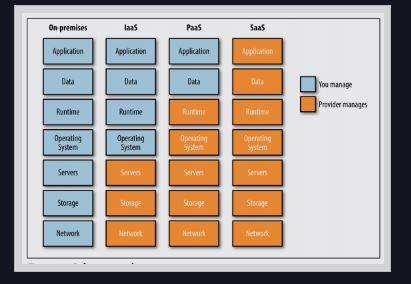

## Cloud Computing Models & Their Evolution

### On-Premises

In the On-Premises model, you as a customer own and manage your own Datacenter. Hard to manage and maintain. There are two models here -

1. The customer has the data center at the location where the dev team is located. It’s normally in a generic office building. Though this is only done when the hardware footprint is small the disadvantage of this setup is that when you grow it’s very hard to grow the hardware as there are physical space constraints. Also if your building loses power for some reason your infrastructure is affected.

2. You are co-located with several other tenants in a data center owned and operated by a third party. You pay a fee for the space, electricity you as a customer use. This is a very common mode of operation. However, in an event of a hardware/server failure, you need to send a technician to fix it.

### Infrastructure as a Service (IaaS)

Infrastructure as a Service (IaaS) offers the basic as well as advanced building blocks for the cloud and provides access to three things -

1. Compute

2. Storage

3. Networking.

IaaS provides you flexibility and management control over your IT resources that are similar to existing IT controls that most IT departments and developers are familiar with today.

IaaS supports services such as identity and access management (IAM), provisioning, and inventory systems. IaaS allows organizations to get rid of all of their in-house hardware and to rent VMs or physical servers from someone else. This frees up a lot of people’s resources and gets rid of processes that are needed for purchasing, maintenance, and in some cases eliminates the need for capacity planning. The magnitude of time and money organizations spend on managing their infrastructure on their own cannot be overstated.

Think about it you can provision hardware infrastructure anywhere in the world by simply clicking on a couple of buttons or you can mirror your entire datacenter deploy hundreds of machines and set up your VCN just with a few clicks or with a quick deployment script using cloud formation or terraform.

### Platform as a Service (PaaS)

Platform as a Service (PaaS) removes the need for your organization to manage the underlying infrastructure (usually hardware and operating systems) and allows you to focus on the deployment and management of your applications. This helps you be more efficient as you don’t need to worry about resource procurement, capacity planning, software maintenance, patching, or any of the other undifferentiated heavy lifting involved in running your application.

Think about the team of 100s of database engineers in an enterprise doing patching, tuning, etc now with a managed Database service your team would not need to worry about doing this. Platform As A Service basically takes the managing of a certain piece of software away from the user. The way you would pay for this is depending on your usage. There are advantages as well as disadvantages of using PaaS today.

Some of the key advantages would be that you do not need to own and operate something like your database. You do not necessarily need to get into contract negotiations with companies like Oracle. You don’t necessarily need to worry about managing the application. Your cloud provider gives you an SLA with a money-back guarantee.

The disadvantage would be that as a customer you would lose out on granular controls on when patches are done or what version of a patch you would want to use etc. Though cloud providers understand these pain points and are working to mitigate these.

### Software as a Service (SaaS)

Software as a Service (SaaS) provides you with a completed product that is run and managed by the service provider. In most cases, people referring to Software as a Service are referring to end-user applications. With a SaaS offering, you do not have to think about how the service is maintained or how the underlying infrastructure is managed; you only need to think about how you will use that particular piece of software.

A common example of a SaaS application is a web-based email which you can use to send and receive email without having to manage feature additions to the email product or maintain the servers and operating systems that the email application is running on.

 

  

 
