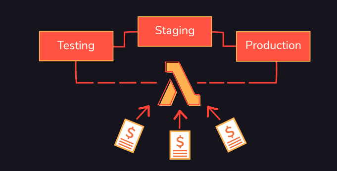
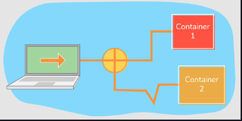
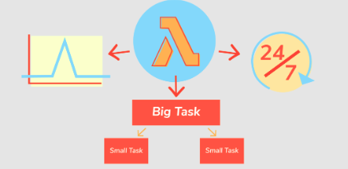

This chapter explains the financial and technical constraints of serverless deployments. You will learn when and why AWS Lambda is a good option for hosting software, and when a different service might be a better choice

### Introduction to serverless architecture

Serverless applications, at the most basic technical level, are software that runs in an environment where the hosting provider is fully responsible for infrastructural and operational tasks. These include receiving network requests, scaling the computing infrastructure on demand, monitoring, and recovery.

Instead of containers bundling application business logic with an operating system, network servers (such as web servers or message brokers) and business logic code, serverless applications only need to provide the code that should run when an event happens and configure the triggers in the execution environment to call that code.

In the Amazon Web Services cloud, the execution environment for serverless code is called AWS Lambda. It supports a wide array of potential triggers, including incoming HTTP requests, messages from a queue, customer emails, changes to database records, user authentication, messages coming to web sockets, client device synchronization, and much more.

Because application developers do not package or distribute the server code to control a network socket in AWS Lambda, their applications are serverless. The buzzword ‘serverless’ is a horrible marketing term, and the Internet is full of bad jokes about how there are still servers in a serverless environment. So, what do we mean by ‘running serverless’?.

### Benefits of serverless architecture

Compared with running applications in a container cluster or managing virtual machines directly, serverless deployments have two significant​ benefits:

* Shorter time to market for new features, leading to faster innovation and delivering value to customers sooner

* Reduced operational costs due to better resource utilization

### Adoption of AWS Lambda

In March 2018, Cloudability published the results of its State of the Cloud research of AWS customers, which suggested that adoption of Lambda had increased by 667% in a year. This is not surprising, because the combination of reduced operational cost and a faster path to customer value provides a very strong financial incentive for companies to adopt AWS Lambda and other similar services. The key factor in both reduced costs and faster development is ​the same. It is the serverless pricing model.

With serverless applications, developers write functions to coordinate and perform business features unique to their application, and use platform services to manage state or communicate with users. In the case of AWS, the pricing for most of those services is also structured around utilization, not reserved capacity. Amazon Simple Storage Service (S3), a scalable file system, charges users for transferred bytes in and out of the storage service. Amazon Simple Notification Service (SNS), a message topic system, charges for each sent message. The whole platform is designed so that how much you pay depends on how much you use the platform. Lambda is the universal glue that brings all those services together.

# 1. The Serverless Pricing Model

### Lambda pricing

Technically, AWS Lambda and similar systems are supercharged container management services. They provide standardized execution environments to​ activate applications very quickly, and algorithms to automatically scale containers according to the workload. Although running those services is technically challenging, this is just an incremental improvement on a decade-long journey towards application virtualization. That’s why technical architects (especially those who built and operated their own container clusters in large companies) sometimes complain about how serverless is just a marketing fad. The revolutionary part of Lambda is something that other cloud providers are quickly copying: the financial side of the story. The serverless pricing model is a lot more important than the technology for application developers.

### Reserved capacity

When using AWS Lambda to run code, you pay for actual usage, not for reserved capacity. If the application isn’t doing much, you don’t pay for anything. If millions of users suddenly appear, Lambda will spin up containers to handle those requests, charge you for doing so, and then remove them as soon as they are no longer necessary. You never pay for idle infrastructure or when tasks are waiting on user requests.

> Reserving minimum capacity
In December 2019, AWS enabled users to reserve minimum capacity for Lambda functions, ensuring that there is always a certain number of processes waiting on user requests. In AWS jargon, this is called Provisioned Concurrency. With provisioned concurrency, you will also pay a fixed price for reserved instances, regardless of whether they are used or not. However, most applications won’t need to use this feature, if you design them well.

Lambda pricing depends on two factors:

1. The maximum memory allowed for a task.

2. The time it spent executing for a task.

As an illustration, assuming a configuration with 512 MB allowed memory, AWS charged the following fees for Lambda in the USA:

* $0.0000002 per request.

* $0.000000833 for running 100ms with 512 MB of working memory.

### Comparison with AWS Elastic Compute Cloud (EC2)

For an infrequent task, say something that needs to run every five minutes for about 100 ms and needs 512 MB of memory, Lambda pricing would roughly work out to slightly less than 1 US cent a month. Renting a similar hardware configuration from AWS Elastic Compute Cloud (EC2), assuming there is a primary and a fail-over virtual machine in case of problems, would cost roughly 9 USD; three orders of magnitude more.

### MindMup

For serverless applications, the provider controls the infrastructure, not the application developers. Thi​s means that developers can focus on things that make their application unique (the core business logic) and not waste time on operational or infrastructural tasks.

* When moving MindMup from a hosted environment based on virtual machines to AWS Lambda, we realised that we could drop a lot of source code that performed infrastructural tasks, and since late 2016 have not needed to write any serious infrastructural code at all. We didn’t have to spend time building and integrating monitoring and scaling systems or worry about most operational issues. Lambda helped us go from a conceptual idea to getting our working software in front of users significantly faster.

# 2. How Request Pricing Affects Deployment Architecture

With serverless applications, developers write functions to coordinate and perform business features unique to their application, and use platform services to manage state or communicate with users. In the case of AWS, the pricing for most of those services is also structured around utilization, not reserved capacity. Amazon Simple Storage Service (S3), a scalable file system, charges users for transferred bytes in and out of the storage service. Amazon Simple Notification Service (SNS), a message topic system, charges for each sent message. The whole platform is designed so that how much you pay depends on how much you use the platform. Lambda is the universal glue that brings all those services together.

### Critical aspects of serverless architecture

In his conference talk [Why the Fuss about Serverless](https://www.youtube.com/watch?v=b7Nc_FJiosk), Simon Wardley argued that serverless is effectively platform-as-a-service, or more precisely what platform-as-a-service was supposed to be before marketers took over the buzzword. No doubt history will repeat itself, and in a few years things that have nothing to do with these ideas will be sold as ‘serverless’. But for now, here are what are considered the three critical aspects of a serverless application:

* Infrastructure providers are responsible for handling incoming network requests.

* Operational cost is based on actual utilisation, broken down by individual requests.

* Technical operations (deployment, scaling, security, and monitoring) are included in the price.

These three factors make up an interesting set of deployment constraints. For example, with request-based pricing and no overhead to set up or operate environments, it costs the same amount to send a million user requests to a single version of your application, or two different versions, or 50 different versions. 

> The number of requests matters, not the number of environments

 

	

 

Ever since the time of immortal mainframes, all popular deployment architectures had a significant overhead for creating a new execution environment. This is why staging and testing environments were commonly less powerful than the production environment, and why developers and testers often fought each other for control of a single integration test system in the company. Containers and virtual machines significantly reduced the time it takes to provision a new environment, but they did not change the mathematical formula for operational costs too much. Two equivalent copies of the production environment cost twice as much. That model created strong financial incentives to bundle features into applications that could be deployed together and reuse the same resources.

# 3. How Request Pricing Affects Security

Request-based pricing also has a big impact on application security. Modern server-side applications usually run some kind of a gatekeeper process to control user requests and dispatch work. That process needs access to all the back-end services and all the databases and all the resources. It’s possible to secure such processes tightly, but it’s a big hassle. Most web servers usually run with database privileges that provide full access to everything. If someone breaks into that process, the gates are completely open. With serverless deployments, security is much easier to control. Because there is no financial incentive to bundle tasks into a single application to reuse resources, each Lambda function can do a focused task and work under significantly restricted access privileges. It becomes easy to apply the principle of least privilege, allowing a task to only access the resources and information required for its purpose. This helps with reducing the security blast radius in case of vulnerable third-party dependencies or hacks.

### Example: Security vulnerability in Intel processors

With pricing focused on requests, applications tend to be optimised for transient environments and dynamic infrastructure. The infrastructure provider can easily remove and replace underlying systems without interrupting application work. This has major implications for security patches. One day in August 2018, we got an email from a concerned client’s IT administrator. He was asking about our plans to mitigate a security vulnerability in Intel processors, something that had hit the news the previous night. I pasted the security bulletin reference into Google to find out more details about the problem, and one of the first results was Amazon’s announcement that Lambda was already patched. We didn’t have to do anything. Because the service provider takes care of containers, it was able to easily drain traffic from old versions, send new requests to patched containers, and just manage the whole thing for us.

# 4. How Request Pricing Affects Product Decisions

Lambda pricing can also change how organisations release features. Say you have a customer with some very specific needs. You can implement a new feature for them in a few days, but it would take weeks more to build it up to work for all your other customers. With Lambda, you can launch a new version for the specific customer as soon as the feature is ready, and keep everyone else on the old version until the feature is fully developed. Running two environments doesn’t cost any more than a single one.

### Testing with AWS Lambda

Similarly, request-based pricing opens up new possibilities for testing features. Do you want to test how a change in a back-end process affects user conversion? Just create an experimental version of the application and send 10% of the traffic there. The number of users and requests is still the same, so running two versions costs the same as working with a single version. Running A/B split tests on the front end is easy, but organising that kind of work on back-end features was traditionally very expensive. Five years ago, only companies with massive computing resources, such as Google or Facebook, could run experiments on their back-end code continuously. With Lambda, that’s now available to everyone, even a single-person team. It doesn’t cost anything more than running a single version.

### Understanding the flow of capital on a granular level

Another interesting aspect of the new pricing model is granular cost breakdown, down to every single request. For​ AWS to charge you correctly, it accounts for each request, and this information is also available to you as a customer. So it’s now possible to understand the flow of capital through the application at a level of individual operations. You can calculate exactly how much money a single customer is costing you to serve, and decide whether it’s worth keeping them around or not. You can calculate exactly how much money certain features cost to operate, and then decide whether they are worth enhancing or perhaps removing.

# 5. Important AWS Lambda Technical Constraints

Lambda is still a relatively new service, and it is evolving quickly. I often talk about serverless development at conferences. It’s been quite fun to review my slides about problems and constraints and have to remove things every few months. Things like start-up times and Payment Card Industry (PCI) data compliance were a serious limitation in 2017, but then got fixed. A common complaint against Lambda was that there was no service-level agreement guarantee for it, but in October 2018, AWS published an [SLA for Lambda](https://aws.amazon.com/lambda/sla/) as well. (It’s currently 99.95%.) 

### Technical limitations

By the time you read this, the constraints might have changed slightly, but at the time this was written, there were four important technical limitations that you needed to consider when evaluating whether something should run in Lambda:

- No session affinity

- Non-deterministic latency

- Execution time-limited to 15 minutes

- No direct control over processing power

### No session affinity

Because the hosting provider controls scaling, you generally don’t get to decide about starting up or shutting down instances. Lambda will decide whether it needs to create new virtual machines to handle requests, as well as when to reuse an old machine and when to drop it. It might send two subsequent requests coming from the same user to the same container or to two different containers.

 

	

 

Purely on Lambda, there is no way to control request routing or somehow ensure that requests from the same source arrive in sequence to the same destination. You can achieve sequences and routing control with some other services such as AWS Kinesis, but Lambda can still decide at any point to throw away a virtual machine and start a new one.

### Non-deterministic latency

Lambda is optimized for maximizing throughput, not for minimizing latency. It prioritizes handling a large number of requests so that none of them have to wait too long to handle a single request in a minimum amount of time. This means that some requests will need to wait for a new Lambda instance to start, and some will not. The latency of processing a single request isn’t really deterministic.

### Execution time limited to 15 minutes

Another major technical constraint is the total allowed execution time. Currently, a Lambda function is allowed to run for three seconds by default, and you can configure it to allow up to 15 minutes. If a task does not complete in the allowed time, Lambda will kill the virtual machine and send back a timeout error.

The 15-minute limit is a hard constraint now, so unless you have a very special relationship with AWS, you can’t ask for a longer allowance. Long-running tasks need to be split and executed in different batches or executed on a different service. AWS offers some alternative services such as Fargate that cost more and start more slowly but can run for a longer period of time

#### AWS Step Functions

### No Direct control over processing power

The last major technical constraint of Lambda is around choosing processors. Today, it is usual for container execution environments to offer a whole buffet of processor combinations, including GPUs, various CPU speeds or numbers of cores, and instances optimised for certain types of tasks. However, with Lambda you don’t get to choose any of that. The only container choice you can make is the amount of memory, from 128 MB to about 3 GB. Lambda is not good for tasks that require GPUs.

#### Lambda CPU allocation

Memory configuration has an indirect impact on processing power. Lambda allocates CPU power in proportion to memory, so that at 1792 MB, a function has access to [one full virtual CPU](https://docs.aws.amazon.com/lambda/latest/dg/configuration-function-common.html). With Node.js, all tasks run through a single core anyway, so with JavaScript you won’t get any further processing speed improvements if you ask for more than 1.75 GB. With Java or other languages that can take advantage of multiple cores, asking for the maximum allowed memory might give you faster responses and lower cost for CPU-intensive tasks.

Lambda pricing depends on two factors: basic price for memory allocation and time spent executing. The fact that higher memory also leads to more CPU power can result in counter-intuitive cost structures. Allocating more memory raises the basic price, but more CPU power can lead to significantly shorter execution, reducing the price.

# 6. When to Use Lambda

## 6.1 When to use Lambda

 

	

 

### Maximising throughput

Lambda is great for use cases where throughput is critical and the tasks parallelise nicely. Typical web requests for dynamic content, involving access to a back-end database, or some user data manipulation usually fall into this category. Automatic email replies or chatbots are also a nice example. Any single request taking a few hundred milliseconds more than average won’t be noticeable to typical users and Lambda will ensure that everyone gets served relatively quickly regardless of traffic spikes.

### Splittable longer-running tasks
Longer on-demand computational tasks that can execute in less than 15 minutes, or could be split into independent segments that take less than 15 minutes, are also a good use case for Lambda. In these cases, the few hundred milliseconds required for Lambda functions to start won’t make an important difference to processing time. Some nice examples of tasks that fall into this category are file format conversions, generating previews or thumbnails, and running periodic reports.

### High availability tasks

Tasks that need high availability and good operational infrastructure, but do not need to guarantee latency, are also a great use case for AWS Lambda. This includes payment notifications from external systems, for example, PayPal or Stripe. These notifications must be handled reliably and relatively quickly, they might have unpredictable traffic patterns, and yet it’s not critically important if they are finished in one second or two seconds.

## 6.2 When not to use Lambda

### Latency guaranteed tasks

Lambda is currently not suitable for tasks that require guaranteed latency, such as in high-frequency trading systems or near-real-time control systems. If a task must be handled in under 10 or 20 ms, it’s much better to create a reserved cluster and have services directly connected to a message broker.

### Longer-running tasks

Another category where Lambda isn’t suitable right now is tasks that could potentially run for longer than 15 minutes. One notable example is video transcoding for large files. Connecting to a socket and consuming a continuous data feed is also not a good use case for Lambda, due to the time limit.

### Tasks demanding high processing power

The third category where you should not use Lambda right now is tasks that require a huge amount of processing power and coordination. For example, video rendering. Tasks like that are better suited to a reserved infrastructure with a lot of CPUs (or even GPUs).

### Tasks requiring no on-demand computation

Lastly, tasks that require no on-demand computation, such as serving static web files, are a poor use case for Lambda. In theory, it’s possible to use Lambda as a web server and send images and CSS files to clients, but this is a waste of money. It is much cheaper and faster to use a specialized product for that, for example, a content delivery network.

