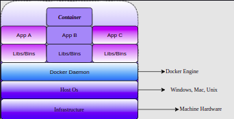
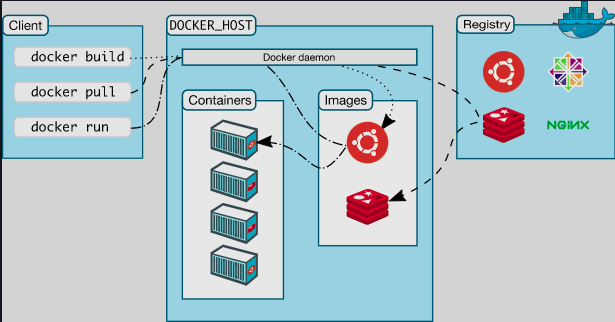
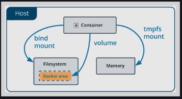
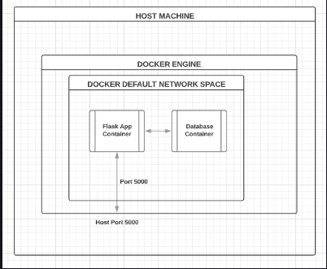
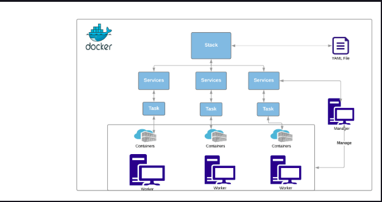
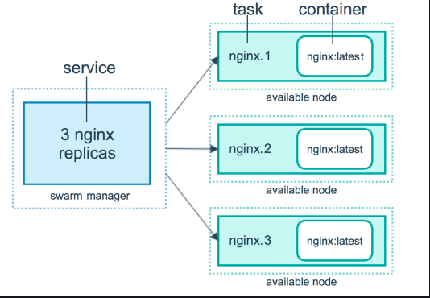

# 1 Getting Started With Docker

## Docker Architecture - Image, Container

<br>
<div align="center">
  
</div>
<br>

### Image

If you look at the diagram above, the top layer of apps and libs/bins above the Docker daemon is encapsulated in the container. Basically, the app is packaged with libraries and binaries required by it. But how does Docker achieve this packaging?

Docker provides the facility to create a custom image on top of the Linux kernel with your app and its libraries. The image is a blueprint of the container and the container is created from it.

For simplicity, if you take this from an object-oriented programming point of view, an image is a class, where all the requirements are defined and declared. A container is an instance of the image. These images are stored somewhere in the cloud and pulled as needed.

### Container

<b>Container:</b> A container is an instance of an image, which simulates the required environment with the use of the Linux kernel packaged in it. In the diagram, you can see app B is enclosed in one container. Similarly, you can enclose the other two apps as well.

Let’s take an example here. If your app only needs Python 3.5 from the system, you will only need that in your production environment as a dependency. Everything else will be an extra overhead. So, Docker provides the template built on the Linux kernel with the needed dependencies only and nothing is installed in that template. That template is called an image.

## Docker Architecture Client-server

### Docker ecosystem

* <strong>Docker Registry</strong>: Docker maintains all the images in the registry and they can be pulled from the registry too

* <strong>Docker Hub</strong>: This is the repository for all your custom-built images. Images can be pushed and accessed from the Hub

* <strong>Docker Client</strong>: The CLI tool used to interact with the Docker server

* <strong>Docker Daemon</strong>: The Docker server process responsible for pulling, pushing, and building the images. It is also used for running the container

### Communication between a Docker client and the Docker daemon

<br>
<div align="center">
  
</div>
<br>

# 2. Docker Fundamentals

## Layers

> Only the instructions RUN, COPY, and ADD create layers. Other instructions create temporary intermediate images and do not increase the size of the build. We will see in the next section what these instructions are.

## Docker Run - Accessing Containers

### Docker Run

> All the Docker images have the name format of <image name>:<version>. If you do not provide any version number, Docker will consider tag as :latest by default.

* <code>docker pull \<images-name>:\<version></code> : pulls image from Docker registry
* <code>docker run \<images-name>:\<version></code> : runs container from mentioned image
* <code>docker ps</code> : shows all running containers
* <code>docker ps -a</code>: shows all available containers
* <code>docker exec</code>: executes a command in a running container

```bash
$ docker ps -a
CONTAINER ID        IMAGE                 COMMAND                  CREATED             STATUS                      PORTS               NAMES
b1e466176116        python:3.5            "python3"                2 minutes ago       Exited (0) 2 minutes ago                        practical_shtern
```

<b>CONTAINER ID</b>: shows the unique ID of each container

<b>IMAGE</b>: the image from which the container is created

<b>COMMAND</b>: command executed in the container while starting it

<b>CREATED</b>: the time the container was created

<b>STATUS</b>: the current status of the container

<b>PORTS</b>: if any of the container ports is connected to the host machine, it will be displayed here

<b>NAMES</b>: this is the name of a container. If it is not provided while creating the container, Docker provides a unique name by default.

## Docker Commit Images

```bash
$ docker start 38c22dec7c2a
38c22dec7c2a

$ docker ps
CONTAINER ID    IMAGE       COMMAND  CREATED      STATUS            PORTS    NAMES
38c22dec7c2a    python:3.5  "bash"   42 seconds ago Up 2 seconds    laughing_grothendieck
```

```bash
$ docker exec -it 38c22dec7c2a bash
root@38c22dec7c2a:/#
```

> Make sure you work with the same container every time. If the container is stopped start it using the <code>docker start <container_id/name></code> command and work in it using <code>docker exec -it <container_id/name> bash</code> command.

## Managing Data for Containers

* docker volume --help: to get the volume help
* docker volume create: to create a new volume
* docker inspect volume: to inspect the created volume
* docker run -v: to mount a volume

<br>
<div align="center">
  
</div>
<br>

## Docker Commands Lookup Table

| Command | Action |
| :------------- | :------------- |
| docker ps | Lists all running containers. -a option will list stopped and running both |
| docker inspect [container_name] | Provides all info about the container |
| docker stop [container_name] | Stops the running container |
| docker kill [container_name] | Kills(stops) the container and removes the container from the system |
| docker rmi [image/s] | Removes the provided image |
| docker images	| Lists all images on the system |
| docker exec [-it] | Executes command in a Docker container |
| docker system | Gets the Docker system information such as memory usage and housekeeping stuff |
| docker system prune | This command will save you from getting the “No memory left” nightmare with production systems |

# 3. Advence Docker

## Introduction to Docker Networks

> The network is nothing but an area that allows somebody to reach others with defined permissions and protocols.

<br>
<div align="center">
  
</div>
<br>

```bash
$ docker network ls
NETWORK ID          NAME                DRIVER              SCOPE
915fe26ffbc8        bridge              bridge              local
3ac2c0505d62        host                host                local
753c94184c7b        none                null                local
```

<br>
<div align="center">
  
</div>
<br>

<br>
<div align="center">
  
</div>
<br>

<br>
<div align="center">
  
</div>
<br>

## Docker Swarm Commands Cheat Sheet

| Command |	Options |	Explanation |
| :------ | :-----: | ----------: |
| docker swarm init |  | Makes the current machine a swarm node |
| docker swarm leave | -f | Removes the current node from a swarm cluster. The -f is used to force a manager node to leave a swarm cluster |
| docker service create <image name> | -p, --env_file, --name, mount | Creates a service from an image. -p is used to map a host port to a service’s tasks ports. |
| docker network create <name> | --driver | Creates a new network. --driver specifies which driver to use for the network |
| docker service update [Options] <service ID> | --network-add | Updates existing service. You can attach a new network using the --network-add option. |
| docker service [Command] --help |  | A quick documentation of every command |
| docker service ls	| |  Lists all the services running on the current node |
| docker service scale <service Id>=<replica number> | | Scales services up and down using the replica numbers |
| docker stack deploy <stack name> | --compose-file | Deploys a new stack of services using a compose file. --compose-file specifies the compose-file to be used. |
| docker stack ls |	 |  Provides information about the current stack |
| docker stack ps <stack_name> | | Lists all the tasks or containers of a stack |
| docker stack services <stack name> | | Lists all the services in the stack |
| docker stack rm <stack name>	| | Removes specified stack from swarm |
