# Database Design

<div align="center">
  <br>
  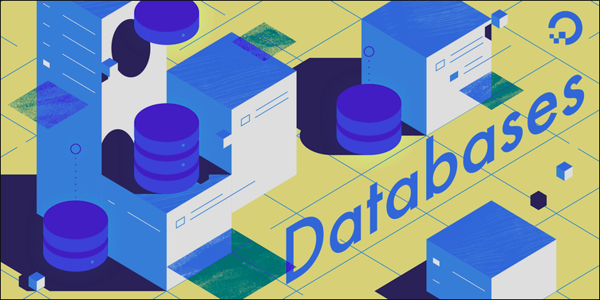
</div>
<br>

### File-based system

Мэдээллийг компьютерт байнгын файлд хадгалах явдал юм. Компануудын систем нь хэд хэдэн хэрэглээний програмуудтай байдаг тус бүр нь өгөгдлийн файлуудыг удирдахад зориулагдсан үүнийг файлд суурилсан систем гэж нэрлэдэг.

<div align="center">
  <br>
  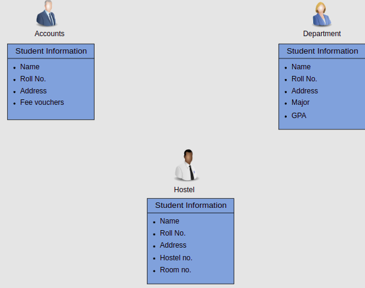
</div>
<br>

<p>Оюутнуудын талаарх мэдээллийг тус тусын хэсэгт, дансны хэсэг, дотуур байрны гэх мэтээр авах боломжтой. Зарим өгөгдөл нь бүх хэсэгт байдаг (сургалтын дугаар, нэр, хаяг, утасны дугаар гэх мэт). Нөгөөтэйгүүр, зарим өгөгдөл нь зөвхөн дотуур байрны хэсэг болох дотуур байрны хуваарилалтын дугаар гэх мэт тодорхой хэсэгт хамаарах болно.
</p>

### Disadvantages of File-Based system

1. <b>Data redundancy</b>: Байгууллага доторх файлууд болон программуудыг янз бүрийн хэлтэсийн өөр өөр байдаг. Энэ нь олон газар (файл) ижил өгөгдөл байх үед үүсдэг өгөгдлийн илүүдэл үүсэхэд хүргэдэг.

2. <b>Data inconsistency</b>: Өгөгдлийн олон хуулбар нь хоорондоо таарахгүй байвал өгөгдөл нь хоорондоо зөрчилддөг энэ нь хадгалах зайг дэмий үрж, тооцооллыг давхардуулдаг. Нягтлан бодох бүртгэлийн хэлтэс болон эрдэм шинжилгээний хэлтэст оюутны утасны дугаар өөр байгаа тохиолдолд энэ нь зөрчилтэй юм.

3. <b>Difficult data access</b>: Өөр нэг асуудал бол хэрэглэгч өгөгдөлд хандахын тулд тухайн файлын байршлыг мэддэг байх шаардлагатай.

4. <b>Security problems</b> : Файлд суурилсан системийг ашиглах нь өгөгдөлд зөвшөөрөлгүй хандахад хүргэж болзошгүй.

5. <b>Difficult concurrent access</b>


# 1. Fundamental Concepts

## 1.1 What's is a Database

A database is a shared collection of related **data**. By **data**, we mean known facts that can be recorded and that have implicit meaning.

<div align="center">
  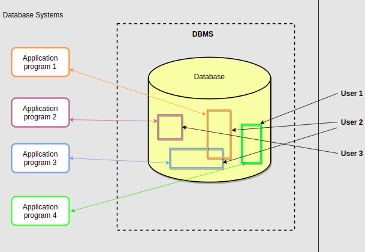
</div>
<br>

## 1.2 Database management systems (DBMS)

<p>Өгөгдлийн сангийн менежментийн систем (DBMS) нь компьютерийг хадгалах, олж авах, нэмэх, устгах, өөрчлөх боломжийг олгодог програм юм. DBMS нь өгөгдлийн сангийн бүх үндсэн асуудлыг хариуцдаг бөгөөд үүнд хэрэглэгчийг таньж баталгаажуулах, түүнчлэн өгөгдлийг оруулах, задлах гэх мэт өгөгдөл удирдах ажиллагааг удирдах. DBMS нь өгөгдлийн схем гэж нэрлэгддэг эсвэл өгөгдөл хадгалах бүтцийг тодорхойлдог.</p>

<b>The DBMS is instrumental in facilitating the processes</b> :

1. **Defining** a database involves defining the data types, structures, and constraints of the data to be stored in the database.

2. **Constructing** the database is the process of storing the data on a storage device that is controlled by the DBMS.

3. **Manipulating** a database involves querying the database to retrieve specific data, updating the database, etc.

4. **Sharing** a database allows multiple users and programs to access the database simultaneously.

Traditional banking system as shown in the diagram below:

<div align="center">
  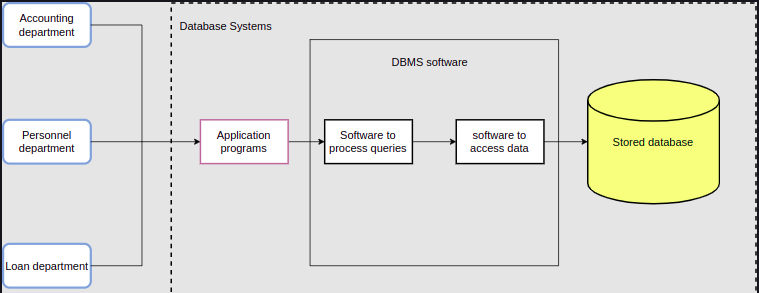
</div>
<br>

<h2 id="university-db"> 1.3 Жишээ: Их сургуулын өгөгдлийн сан </h2>

### Student table

| ID | First_Name | Last_Name | Class | Major |
|:---     | :--   | :-----:   | -----:| ----: |
| 2001 | Adam | Smith | Junior | CS |
| 2342 | Jonathan | Joestar | Sophomore | Economics |
| 2343 | Lucas | Klein | Senior | Physics | Physics |

### Course table

| Course_ID | Course_Name | Course_credits |
| :-------- | :-----------| -------------: |
| CS200 | Intro to programming | 4 |
| MATH100 | Calculus-I | 3 |
| CS300 | Advanced Programming | 3 |

### Department Table

| Department_Code | Department_Name |
| :------------- | :------------- |
| 1 | Computer Science |
| 2 | Electrical Engineering |
| 3 | Physics |
| 4 | Biology |

### Instructor Table

| Instructor_ID | Instructor_fname | Department_Code |
| :------------- | :------------- | -----------: |
| 12 | Sam | 1 |
| 22 | Tom | 2 |
| 04 | David | 3 |

### Grade Table

| ID | Course_ID | Grade |
| :---- | :---- | ------: |
| 2001 | CS200 | A+ |
| 2220 | EE100 | C |
| 2343 | PHY220 | B |


## 1.4 Characteristics of the Database Approach

Өгөгдлийн сангийн хандлагыг файлд суурилсан системээс хэд хэдэн шинж чанараар ялгадаг. Үүнд:

1. <strong>Self-describing nature of a database system</strong>

    Өгөгдлийн сангийн систем нь зөвхөн өгөгдлийн сангаас гадна өгөгдлийн сан дахь хүснэгтүүдийн, харилцаа холбоог тодорхойлдог. Мэдээллийг DBMS -ээр каталогт хадгалдаг. Өгөгдөл болон өгөгдлийн талаарх мэдээллийг тусгаарласнаар өгөгдлийн сангийн системийг уламжлалт файлд суурилсан системээс ялгаатай болгодог.

2. <strong>Inslation between program and data</strong>

    Файлд суурилсан системд өгөгдлийн файлын бүтцийг программуудаар тодорхойлдог тул хэрэв хэрэглэгч файлын бүтцийг өөрчлөхийг хүсвэл тухайн файлд ханддаг бүх програмыг мөн өөрчлөх шаардлагатай болдог.

    Өгөгдлийн сангийн системд өгөгдлийн бүтцийг программуудад биш системийн каталогт хадгалдаг. Иймээс файлын бүтцийг өөрчлөхөд нэг л өөрчлөлт л хангалттай.

3. <strong>Support for multiple views of data</strong>

    Өгөгдлийн сан нь өгөгдлийг олоноор харахыг дэмждэг.

4. <strong>Sharing data and multiuser system</strong>

    Өгөгдлийн сангийн системүүд нь олон хэрэглэгчдэд зориулагдсан. Тэдгээр нь олон хэрэглэгчдэд нэг мэдээллийн санд нэгэн зэрэг хандах боломжийг олгодог.

## 1.5 Benefits of the Database Approach

1. Control of data redundancy

2. Data Sharing

3. Enforcement of integrity constraints

4. Restriction of unauthorized access

5. Backup and recovery facilities

# 2 Data Modeling

> Өгөгдлийн загварчилал нь өгөгдөл, өгөгдлийн харилцаа, өгөгдлийн семантик, өгөгдлийн хязгаарлалтыг тайлбарлах ойлголт эсвэл тэмдэглэгээний цуглуулга юм.

## 2.1 Types of data models

1. <strong>High-level conceptual data models</strong>

   <p>High-level conceptual data models provide a way to present data that is similar to how people perceive data. A typical example is an entity-relationship model, which uses concepts like entities, attributes, and relationships.</p>

2. <strong>Record-based logical data models</strong>

   <p>Бичлэгт суурилсан логик өгөгдлийн загварууд нь хэрэглэгчдэд ойлгомжтой ойлголтуудыг өгдөг боловч өгөгдөл нь компьютер дээр хадгалагддагтай төстэй хэвээр байна. Энэ төрлийн гурван алдартай өгөгдлийн загварууд нь <b>hierarchical</b>, <b>network</b>, <b>relational</b> загварууд юм.</p>

   <b>hierarchical model</b>

   <p>Шаталсан загварт өгөгдлийг мод өгөгдлийн бүтэц болгон зохион байгуулдаг.</p>

   <br>
   <div align="center">
     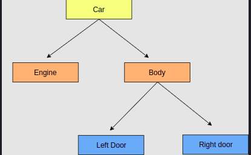
   </div>
   </br>

   <b>Network Model</b>

   <p>Сүлжээний загвар нь шаталсан бүтэц дээр өргөжин тэлж, бичлэг бүрд олон эх, хүүхдийн бүртгэлтэй байх боломжийг олгож, ерөнхий график бүтцийг бүрдүүлдэг.</p>

   <br>
   <div align="center">
     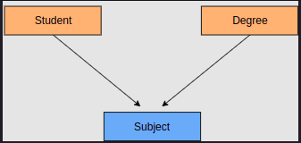
   </div>
   </br>

   <b>Relational Model</b>

   <p>Харилцааны загвар нь өгөгдлийг харилцаа эсвэл хүснэгт хэлбэрээр илэрхийлдэг. Жишээлбэл, <a href="#university-db">их сургуулийн өгөгдлийн сан</a> нь хэд хэдэн шинж чанар (багана) ба мөр (мөр)-тэй олон хүснэгт (харилцаа) агуулдаг.</p>

3. <strong>Physical data models</strong>

   <p>Физик өгөгдлийн загвар нь компьютерийн санах ойд өгөгдөл хэрхэн хадгалагдаж, санах ойд хэрхэн тархаж, дараалалд орсон, санах ойгоос хэрхэн яаж татаж авахыг илэрхийлдэг.</p>

   <br>
   <div align="center">
     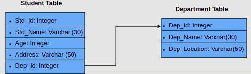
   </div>
   </br>

## 2.2 Schemas and Instances

<p>A schema is the blueprint of a database. The names of tables, columns of each table, datatype, function, and other objects are included in the schema.</p>

<strong>Schema diagram university database</strong>

<b>Student Table</b>

| ID | First_Name | Last_Name | Class | Major |
| :- | :--------  | --------: | ----: | ----: |

<b>Course Table</b>

| Course_ID | Course_Name | Course_credits |
| :--------  | --------: | ----: |

<b>Department Table</b>

| Department_Code | Department_Name |
| :--------  | ----: |

<b>Instructor Table</b>

| Instructor_ID | Instructor_fname | Department_Code |
| :--------  | --------: | ----: |

<b>Grade Table</b>

| ID | Course_ID | Grade |
| :--| --------: | ----: |

> It is important to note that the schema diagram is not the same thing as the Schema

### Database Instance

<p>Өгөгдлийн сангийн төлөв гэж нэрлэгддэг тодорхой цаг мөчид өгөгдлийн санд цуглуулсан мэдээлэл юм. Энэ нь өгөгдлийн сангийн одоогийн байдал юм. Өгөгдлийн санд оруулах, устгах бүрт өгөгдлийн сангийн төлөв өөрчлөгддөг.</p>

| ID | First_Name | Last_Name | Class | Major |
| :- | :--------- | :-------: | ----: | ----: |
| 1001 | Bob | Dylan | Junior | Maths |
| 1002 | Ceaser | Zappelli | Freshman | Economics |
| 1003 | Antony | Rodgers | Senior | Psychology |
| 1004 | George | Miller | Sophomore | Computer Science |
| ... | ... | ... | ... | ... |


## 2.3 The Three-Schema Architecture

<p>Гурван схемийн архитектур нь өгөгдлийн санг ашиглалт, бүтэц, системийн администраторууд, дизайнерууд болон эцсийн хэрэглэгчдийн гүйцэтгэх үүргийн дагуу гурван өөр ангилалд хуваадаг харилцааны өгөгдлийн сангийн дизайн юм.</p>

<br>
<div align="center">
  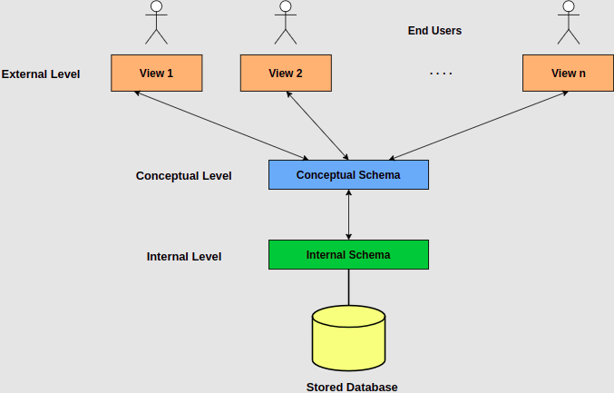
</div>
</br>

### 1. External Schema

  <p>
  An external schema describes the part of the database that a specific user is interested in. It hides the unrelated details of the database from the user like the exact process of retrieving or storing data from the database. There is a different external view for each user of the database.
  </p>

### 2. Conceptual Schema

  <p>
  The conceptual schema describes the database structure of the whole database for the community of users. This schema hides information about the physical storage structures and focuses on describing data types, entities, relationships, etc. Usually, a record-based logical data model is used to describe the conceptual schema when a database system is implemented.
  </p>

### 3. Internal Schema

  <p>
  The internal schema describes how the database is stored on physical storage devices such as hard drives. The internal schema uses a physical data model and describes the complete details of data storage and access paths for the database.
  </p>


<br>
<div align="center">
  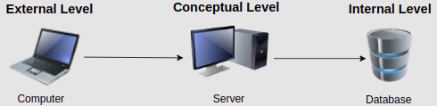
</div>
</br>

## 2.4 Classification of Database Management Systems

### Classification based on data model

<p>
Өнөө үед ашиглагдаж байгаа хамгийн алдартай өгөгдлийн загварчлал бол relational өгөгдлийн загвар юм. Oracle, MSSQL Server, DB2, MySQL зэрэг  DBMS-үүд энэ загварыг дэмждэг. hierarchical өгөгдлийн загвар, network өгөгдлийн загвар зэрэг бусад уламжлалт загваруудыг mainframe платформ дээр ашигладаг.

Сүүлийн жилүүдэд объект хандалтат өгөгдлийн шинэ загвар гарч ирсэн. Энэ загвар нь өгөгдлийг объект хандалтат програмчлалд ашигласан объект хэлбэрээр дүрсэлсэн DBMS юм. Объект хандалтат өгөгдлийн сангууд нь хүснэгтэд ханддаг relational өгөгдлийн сангаас ялгаатай юм. Object Oriented Database Management System (OODBMS)

Энэ өгөгдлийн загвар нь тийм ч өргөн хэрэглэгддэггүй. Жишээ: O2, ObjectStore, Jasmine.</p>

### Classification based on database distribution
<br>

* <b>Centralized Systems</b>

  <p>Төвлөрсөн мэдээллийн сангийн системийн хүрээнд DBMS болон мэдээллийн сан нь төвлөрсөн байдаг. Нэг байршилд хадгалагдаж, өөр хэд хэдэн системд ашиглагддаг.</p>     

  <br>
  <div align="center">
    
  </div>
  </br>

* <b>Distributed database system</b>

  <p>In a distributed database system, the actual database and the DBMS software are distributed across various sites that are connected by a computer network, as shown in the figure below:</p>

  <br>
  <div align="center">
    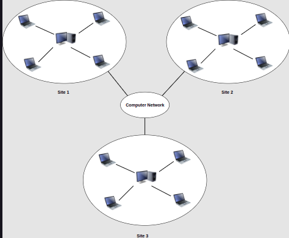
  </div>
  </br>

* <b>Homogeneous distributed database systems</b>

  <p>Homogeneous distributed database systems use the same DBMS software from multiple sites. Data exchanged between these various sites can be handled easily. For example, library information systems by the same vendor, such as Geac Computer Corporation, use the same DBMS software which allows easy data exchange between the various Geac library sites.</p>

* <b>Heterogeneous distributed database systems</b>

  <p>In a heterogeneous distributed database system, different sites might use different DBMS software, but there is additional common software to support data exchange between these sites. For example, the various library database systems use the same machine-readable cataloging (MARC) format to support library record data exchange.</p>


# 3. Entity-Relationship Data Model

<p>The entity-relationship (ER) data model is a high-level conceptual data model that has existed for over 35 years. It is well suited to data modeling for use with databases because it is fairly abstract and is easy to discuss and explain. ER models, also called ER schemas, are represented by ER diagrams.</p>

* <b>Entities</b>, defined as tables that hold specific information(data)

* <b>Relationships</b>, defined as the associations or interactions between entities

<br>
<div align="center">
  
</div>
</br>

### Жишээ: Компанийн өгөгдлийн сан (ER model)

<br>
<div align="center">
  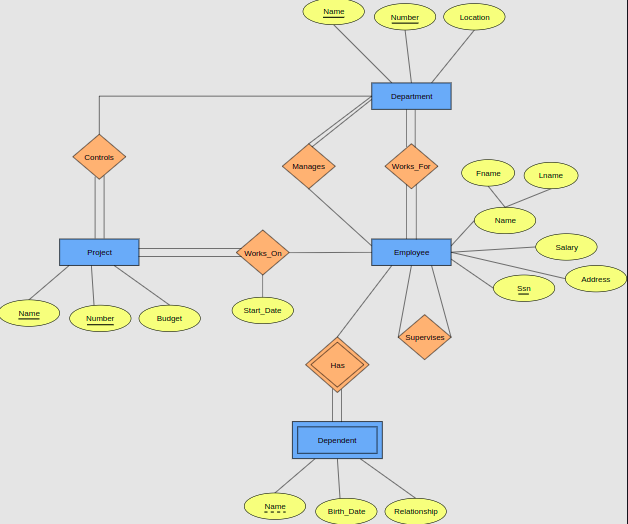
</div>
</br>

<br>
<div align="center">
  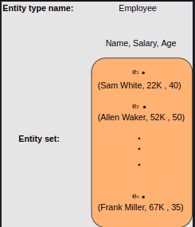
</div>
</br>

## 3.1 Attributes

<br>
<div align="center">
  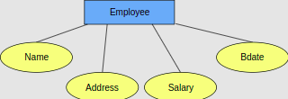

  An EMPLOYEE entity represented along with its attributes
</div>
</br>

* <b>Simple attributes</b>

  <p>Simple attributes are the atomic value, i.e., they cannot be further divided. They are also called single-value attributes. In the COMPANY database, an example of this would be: <code>Name</code> = ‘John’ and <code>Age</code> = 23.</p>

* <b>Composite attributes</b>

    <br>
    <div align="center">
      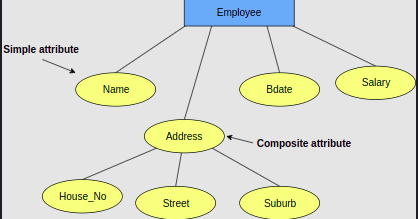
    </div>
    </br>

* <b>Multivalued attributes</b>

  <br>
  <div align="center">
    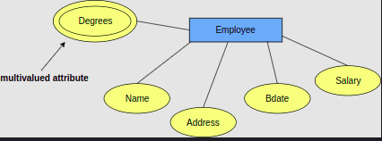
  </div>
  </br>

* <b>Derived attributes</b>

    <br>
    <div align="center">
      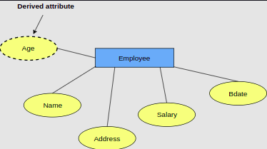
    </div>
    </br>

## 3.2 Relationship

<br>
<div align="center">
  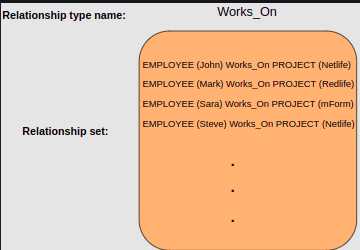

  <code>Example of relationship type and set</code>
</div>
</br>

<br>
<div align="center">
  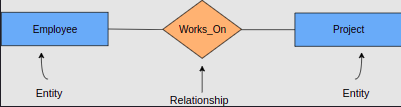

  <code>Representation of relationships in ER model</code>
</div>
</br>

### Degrees of relationship types

<br>
<div align="center">
  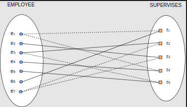

  <code>Unary (Recursive) Relationship Type</code>
</div>
</br>

<br>
<div align="center">
  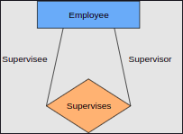

  <code>ER diagram unary relationship</code>
</div>
</br>

<br>
<div align="center">
  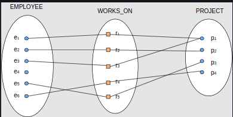

  <code>Binary Relationship Type</code>
</div>
</br>

<br>
<div align="center">
  

  <code>ER diagram binary relationship</code>
</div>
</br>

<br>
<div align="center">
  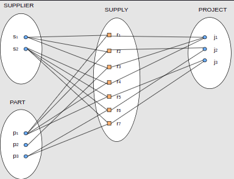

  <code>Ternary Relationship Type</code>
</div>
</br>

<br>
<div align="center">
  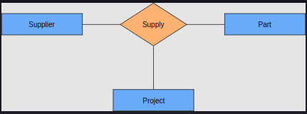

  <code>ER diagram ternary relationship</code>
</div>
</br>


<br>
<div align="center">
  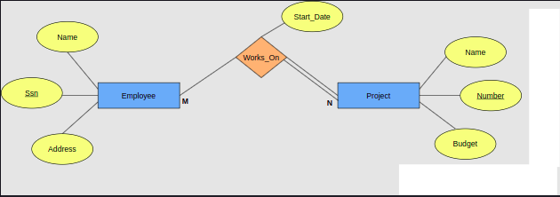

  <code>An example of an attribute associated with relationship types</code>
</div>
</br>

## Example 1: The University database

<p>Их сургуулийн өгөгдлийн санд их сургуулийн оюутнууд, хичээлүүд, тухайн оюутны сурсан семестрийн тухай мэдээлэл (мөн хэрэв төгссөн бол авсан оноо, дүн), оюутан бүр ямар зэрэгтэй хөтөлбөрт хамрагдаж байгаа талаарх мэдээллийг хадгалдаг.</p>

<b>Entities: </b>

* STUDENT entity.

* PROGRAM entity.

* COURSE entity.

<b>Attributes: </b>

* Students have one or more given names, a surname, a student identifier, a date of birth, and the year they first enrolled. We can treat all given names as a single object - for example, 'John Paul'

* A program has a name, a program identifier, the total credit points required to graduate, and the year it commenced.

* A course has a name, a course identifier, a credit point value, a year (for example, year 1) and a semester (for example, semester 1).

<b>Relationships :</b>

* The university offers one or more programs.

* A Program is made up of one or more courses

* A Student takes the courses that are part of his/her program.

* When a student takes a course, the year and semester he/she attempted it are recorded. When he/she finishes the course, a grade (such as A or B) and a mark (such as 60 percent) are recorded.


<br>
<div align="center">
  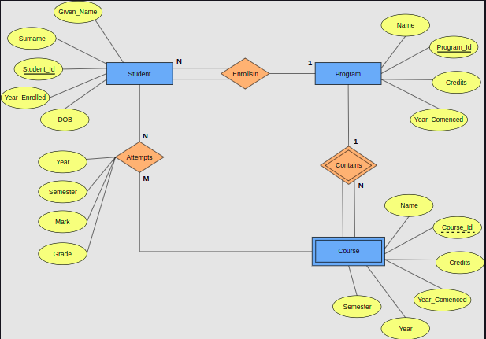

  <code>University Database with ER diagram</code>
</div>
</br>

### Тайлбар:

* STUDENT <code>student_Id</code> бол оюутнуудыг ялгах үндсэн түлхүүр юм.

* PROGRAM уудыг ялгахад ашигладаг <code>Program_Id</code> үндсэн түлхүүр юм.

* Each student must be enrolled in a program, so the STUDENT entity participates totally in the many-to-one ENROLLS_IN relationship with PROGRAM. A program can exist without having any enrolled students, so it participates partially in this relationship.

* A COURSE has meaning only in the context of a PROGRAM, so it’s a weak entity, with <code>Course_Id</code> as a weak key. This means that a COURSE entity is uniquely identified using its <code>Course_Id</code> and the <code>Program_Id</code> of its owning program.

* As a weak entity, COURSE participates totally in the many-to-one identifying relationship with its owning PROGRAM.

* STUDENT and COURSE are related through the many-to-many, ATTEMPTS relationships; a course can exist without a student, and a student can be enrolled without attempting any courses, so the participation is not total.

* When a student attempts a course, there are attributes needed to capture the <code>Year</code>, <code>Semester</code>, <code>Mark</code> and <code>Grade</code> of that course.

## Example 2 The flight database

<p>Нислэгийн өгөгдлийн сан нь агаарын тээврийн флот, нислэг, суудлын захиалгын талаарх дэлгэрэнгүй мэдээллийг хадгалдаг.</p>

<b>Entities :</b>

* AIRPLANE entity

* FLIGHT entity

* PASSENGER entity

* BOOKING entity

<b>Attributes :</b>

* An airplane has a model number, a unique registration number, and the capacity to take one or more passengers.

* An airplane flight has a unique flight number, a departure airport, a destination airport, departure date and time, and arrival date and time.

* A passenger has a first name, surname, and unique email address.

<b>Relationships :</b>

* Each flight is carried out by a single airplane.

* The airline has one or more airplanes.

* A passenger can book a seat on a flight

<br>
<div align="center">
  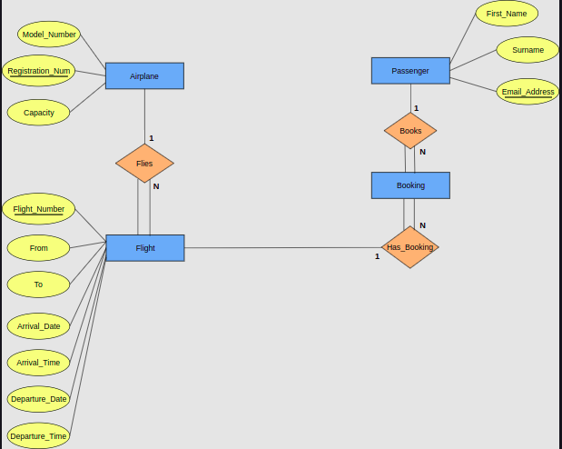

  <code>Flight Database with ER diagram</code>
</div>
</br>

### Тайлбар:

* An AIRPLANE is uniquely identified by its <code>Registration_Num</code>, so we use this as the primary key.

* A FLIGHT is uniquely identified by its <code>Flight_Number</code>, so we use the flight number as the primary key. The departure and destination airports are captured in the <code>From</code> and <code>To</code> attributes, and we have separate attributes for the departure and arrival date and time.

* Because no two passengers will share an email address, we can use the <code>Email_Address</code> as the primary key for the PASSENGER entity.

* An airplane can be involved in any number of flights, while each flight uses exactly one airplane, so the FLIES relationship between the AIRPLANE and FLIGHT entities has cardinality 1:N; because a flight cannot exist without an airplane, the FLIGHT entity participates totally in this relationship.

* A passenger can book any number of flights, while a flight can be booked by any number of passengers. We capture this by creating the entity BOOKING which has 1:N relationships between it and the PASSENGER and FLIGHT entities.

# 4. The Relational Data Model.

## 4.1 Relational Model Concepts

> Харилцааны өгөгдлийн загварыг C.F. 1970 онд Кодд. Одоогийн байдлаар энэ нь хамгийн өргөн хэрэглэгддэг өгөгдлийн загвар юм.

* Research on the theory of data/relationship/constraints

* Numerous database design methodologies

* The standard database access language called Structed Query Language(SQL)

* Almost all modern commercial database management systems.

### What is relational model?

<p>Харилцааны загвар нь өгөдлийн санг харилцааны цуглуулга хэлбэрээр илэрхийлдэг. Хүснэгтийн мөр бүр нь холбогдох өгөгдлийн утгуудын цуглуулгыг илэрхийлдэг.</p>

<p>Some popular relational database management systems are:</p>

* DB2 and  Dynamic Server - IBM

* Oracle and RDB - Oracle

* SQL Server and Access - Microsoft

### Funamental concepts of the relational data model

<br>
<div align="center">
  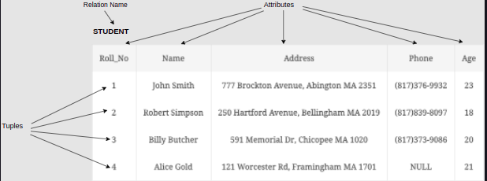

  <code>The STUDENT relation</code>
</div>
</br>

## 4.2 Properties of a Table

Although we defined relations as a table of values, certain characteristics make a relation different from a table. We highlight these properties with the help of the following table:

<b>Student Relation</b>

| Stud_Id | First_Name | Last_Name | Class | Major |
| :------ | :--------- | :-------: | -----:| ----: |
| 1 | Adam | Smith | Junior | CS |
| 2 | Jonathan | Joestar | Sophomore | Economics |
| 3 | Lucas | Klein | Senior | Physics |
| 4 | Brandon | Jones | Freshman | Biology |
| 5 | Ian | Damiani | Junior | Sociology |

1. <strong>Each row is unique</strong>

   <p>In the STUDENT relation above, we can see that the <code>Stud_Id</code> attribute is unique for every student, so it can be used to identify each student tuple in the STUDENT relation.</p>

2. <strong>Values are atomic</strong>

   <p>An <b>atomic value</b> is one that can not be broken down into smaller pieces. In other words, the table does not contain repeating groups or multivalued attributes.</p>

3. <strong>Column values are of the same kind</strong>

4. <strong>The sequence of columns is insignificant</strong>

5. <strong>The sequence of rows is insignificant</strong>

6. <strong>Each column has a unique name</strong>

## 4.3 Introduction to Database Keys

<p>Түлхүүрүүд нь харилцааны мэдээллийн сангийн загварын маш чухал хэсэг юм. Эдгээр нь хүснэгтүүдийн хоорондын хамаарлыг тогтоох, тодорхойлох, мөн хүснэгтийн доторх аливаа бүртгэл эсвэл өгөгдлийн мөрийг unique байдлаар тодорхойлоход ашиглагддаг.</p>

| Std_Id | Name | Phone |
| :---   | :--: | ----: |
| 1 | John | (201)6723452 |
| 2 | Adam | (202)1165674 |
| 3 | Bruce | (480)7867898 |
| 4 | James | (516)0080080 |

<strong>Super key</strong>

  <p>A super key is defined as a set of attributes within a table that can uniquely identify each record within a table.</p>

  <p>In the table defined above, the super key would include <code>Std_Id</code>, (<code>Std_Id</code>, <code>Name</code>), <code>Phone</code> etc.</p>

<strong>Candidate key</strong>

  <p>Candidate keys are defined as the minimal set of fields that can uniquely identify each record in a table. There can be more than one candidate key.</p>

  <p>In our example, <code>Std_Id</code> and <code>Phone</code> both are candidate keys for the STUDENT table. The (<code>Std_Id</code>, <code>Name</code>) super key is not a candidate key as we can remove the <code>Name</code> field and still be able to uniquely identify each record.</p>

<strong>Primary key</strong>

  <p>There can be more than one candidate key in a relation, out of which one can be chosen as the primary key. For Example, <code>Std_Id</code> as well as <code>Phone</code> both candidate keys for relation STUDENT but <code>Std_Id</code> can be chosen as the primary key (only one out of many candidate keys).</p>

  <br>
  <div align="center">
    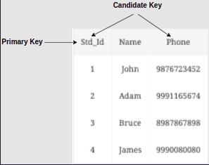
  </div>
  </br>

<strong>Composite key</strong>

  <p>A key that consists of two or more attributes that uniquely identify any record in a table is called a composite key. But the attributes which together form the composite key are not a key independently or individually.</p>

| Std_Id | Subject_Id |	Marks |
| :----- | :--------: | ----: |
| 1 | 8 | 70 |
| 1 |	12 | 90 |
| 2 |	12 | 65 |

  In the above MARKS table, we have the marks scored by a student in a particular subject. In this table <code>Std_Id</code> and <code>Subject_Id</code> together will form the primary key, hence it is a composite key.

<strong>Alternate key</strong>

  The candidate key other than the primary key is called an alternate key. For Example, <code>Std_Id</code> as well as <code>Phone</code>, are candidate keys for relation STUDENT but <code>Phone</code> will be the alternate key.

<strong>Foreign key</strong>

  <p>A foreign key is a column or group of columns in a relational database table that provides a link between the data in two tables. It acts as a cross-reference between tables because it references the primary key of another table, thereby establishing a link between them. </p>

## 4.4 Relational Database Schemas

<p>A relational database schema S is a set of relation schemas S = {R_1, R_2, … , R_m} and a set of integrity constraints <b>IC</b>. A relational database state <b>DB</b> of S is a set of relation states DB = {r_1, r_2, … ,r_m} such that each r_i is a state of R_i. The figure below shows a relational database schema that we call COMPANY = {EMPLOYEE, DEPARTMENT, DEPT_LOCATIONS, PROJECT, DEPENDENT}. In each relation schema, the underlined attribute represents the primary key.</p>

<br>
<div align="center">
  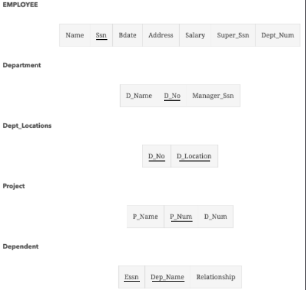
</div>
</br>


<br>
<div align="center">
  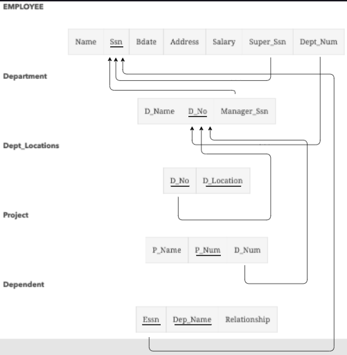

  <code>Relational database schema of COMPANY database</code>
</div>
</br>

# 5. Functional Dependencies

<p>One important theory developed for the entity relational (ER) model involves the notion of functional dependency (FD). The aim of studying this is to improve your understanding of relationships among data and to gain enough formalism to assist with practical database design.</p>

<p>A functional dependency is a relationship between two attributes, typically the primary key (PK) and other non-key attributes within a table. For any relation R, attribute Y is functionally dependent on attribute X, if, for every valid instance of X, that value of X uniquely determines the value of Y. This relationship is indicated by the representation below :</p>

<br>
<div align="center">
  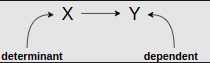
</div>
</br>

## Example

<b>STUDENT relation</b>

| Student_id | Name | Age |
| :--------- | :--: | --: |
| 1 | Spencer | 22 |
| 2 | Tony | 20 |
| 3 | Mark | 23 |
| 4 | Elyse | 21 |

From the table above, it is obvious that <code>Student_Id</code> is the primary key as it is unique for each student.

So, following the above definition for functional dependencies, we conclude that:

  * <code>Student_Id</code>---><code>Name</code>,

  * <code>Student_Id</code>---><code>Age</code>

## Dependency Diagrams

<p>A dependency diagram illustrates the various dependencies that might exist in a non-normalized table. A non-normalized table is one that has data redundancy in it. This is illustrated below:</p>

<br>
<div align="center">
  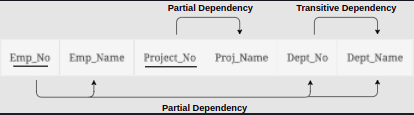

  <code>An example of a dependency diagram</code>
</div>
</br>

<p>As we can observe from the table above, <code>Project_No</code> and <code>Emp_No</code>, combined, are the primary key (as the combination of these two attributes can be used to identify each record uniquely).</p>

# 6. Structed Query Language

## 6.1 MySQL

### Why SQL?

* Create the database and table structures

* Perform basic data management chores (add, delete and modify)

* Perform complex queries to transform raw data into useful information.

### SQL Commands

<strong>DDL - Data Defination Language</strong>

| Command | Description |
| :------------- | :------------- |
| CREATE | Creates a new table, a view of a table, or other objects in the database |
| ALTER | Modifies an existing database object, such as a table. |
| DROP | Deletes an entire table, a view of a table or other objects in the database. |

<strong>DML - Data Manipulation Language</strong>

| Command | Description |
| :------------- | :------------- |
| SELECT | Retrieves certain records from one or more tables. |
| INSERT | Creates a record. |
| UPDATE | Modifies records. |
| DELETE | Deletes records. |

## 6.2 SQL Data Types and Operators

### Exact Numeric Data Types


| Data Type |	Ranges From |	To |
| :-------- | :---------: | ---: |
| int | -2,147,483,648 | 2,147,483,647 |
| bigint | -9,223,372,036,854,775,808 | 9,223,372,036,854,775,807 |
| smallint | -32,768 | 32,767 |
| tinyint |	0 |	255 |
| bit | 0 |	1 |
| decimal |	-10^38 +1 |	10^38 -1 |
| numeric |	-10^38 +1 |	10^38 -1 |

### Approximate Numeric Data Types

| Data Type | Ranges From	| To |
| :-------- | :---------: | -----: |
| float | -1.79E + 30 | 1.79E + 308 |
| real | -3.40E + 38 | 3.40E + 38 |

### Date and Time Data Types

| Data Type | Ranges From | To |
| :-------- | :---------  |---:|
| datetime | Jan 1, 1753 | Dec 31, 9999 |
| smalldatetime | Jan 1, 1900 |	Jun 6, 2079 |
| date | Stores a date like June 30, 1991 | - |
| time | Stores a time like 12:30 P.M. |  |
| - |  |  |

### Character Strings Data Types  

| DATA TYPE |	Description |
| :-------- | ----------: |
| char | Maximum length of 8,000 characters.( Fixed length non-Unicode characters) |
| varchar | Maximum of 8,000 characters. (Variable-length non-Unicode data). |
| varchar(max) | Maximum length of 2E + 31 characters, Variable-length non-Unicode data. |
| text | Variable-length non-Unicode data with a maximum length of 2,147,483,647 characters. |

### SQL arithmetic operators

<p>Assume variable 'a' holds 10 and variable 'b' holds 20.</p>

| Operator | Description | Example |
| :------- | :---------: | :------ |
| + (Addition) | Adds values on either side of the operator | a + b will give 30 |
| - (Subtraction) | Subtracts right-hand operand from left-hand operand	| a - b will give -10 |
| * (Multiplication) | Multiplies values on either side of the operator | a * b will give 200 |
| / (Division) | Divides left-hand operand by right-hand operand | b / a will give 2 |
| % (Modulus) | Divides left-hand operand by right-hand operand and returns remainder | b % a will give 0 |

### SQL comparison operators

<p>Assume 'variable a' holds 10 and 'variable b' holds 20.</p>

| Operator | Description | Example |
| :------- | :---------: | :------ |
| = | Checks if the values of two operands are equal or not, if yes then condition becomes true | (a = b) is not true |
| != | Checks if the values of two operands are equal or not, if values are not equal then condition becomes true | (a != b) is true |
| <> | Checks if the values of two operands are equal or not, if values are not equal then condition becomes true | (a <> b) is true |
| > | Checks if the value of the left operand is greater than the value of right operand, if yes then condition becomes true | (a > b) is not true |
| < | Checks if the value of the left operand is less than the value of right operand, if yes then condition becomes true | (a < b) is true |
| >= | Checks if the value of the left operand is greater than or equal to the value of right operand, if yes then condition becomes true | (a >= b) is not true |
| <= | Checks if the value of the left operand is less than or equal to the value of right operand, if yes then condition becomes true | (a <= b) is true |

## 6.3 SQL Constraints

### The NOT NULL constraints

<p>Ensures that a column cannot have a <code>NULL</code> value. By default, a column can hold <code>NULL</code> values. If you do not want a column to have a <code>NULL</code> value, then you need to define such a constraint on this column specifying that <code>NULL</code> is now not allowed for that column. A <code>NULL</code> is not the same as no data, rather, it represents unknown data.</p>

### The DEFAULT constraint

<p>Provides a default value for a column when none is specified.</p>

### The UNIQUE constraint

<p>Ensures that all the values in a column are different. The UNIQUE constraint prevents two records from having identical values in a column. In the CUSTOMER table, for example, you might want to prevent two or more people from having the same ID.</p>

### The PRIMARY key constraint

<p>Uniquely identifies each row/record in a database table. A primary key is a field that uniquely identifies each row/record in a database table. A primary key must contain unique values and cannot have NULL values. A table can have only one primary key, which may consist of single or multiple fields. When multiple fields are used as a primary key, they are called a composite key.</p>

### The FOREIGN key constraint

<p>Uniquely identifies a row/record in any other database table. A foreign key is a key used to link two tables together. This is sometimes also called a referencing key. It can be a column or a combination of columns whose values match a primary key in a different table.</p>

### The CHECK constraint

<p>Ensures that all values in a column satisfy certain conditions. It enables a condition to check the value being entered into a record. If the condition evaluates to false, the record violates the constraint and isn’t entered into the table. For example, in the CUSTOMER table, we can check if the customer is over 18 years old by applying the CHECK constraint on the <code>Age</code> attribute (column).</p>

## 6.4 CREATE, DROP, and USE Databases

### CREATE DATABASE

```SQL
CREATE DATABASE DatabaseName;
```

Example

```SQL
CREATE DATABASE testDB1;
CREATE DATABASE testDB2;
SHOW DATABASES;
```

### DROP DATABASE

```SQL
DROP DATABASE DatabaseName;
```

Example

```SQL
CREATE DATABASE testDB1;
SHOW DATABASES;

DROP DATABASE testDB1;
SHOW DATABASES;
```

> Be careful when using this operation because deleting an existing database would result in a complete loss of information stored in the database.

### USE Database

<p>When you have multiple databases in your SQL schema before starting your operation, you need to select the database where all the operations will be performed.</p>

```SQL
USE DatabaseName;
```

<p>Example</p>

```SQL
CREATE DATABASE testDB1;
CREATE DATABASE testDB2;
SHOW DATABASES;

USE testDB1;
```

## 6.5 CREATE, DROP, and INSERT Table

### CREATE TABLE

Syntax

```SQL
CREATE TABLE table_name(

   column1 datatype,

   column2 datatype,

   column3 datatype,

   .....

   columnN datatype,

   PRIMARY KEY(one or more columns)

);
```

Example

```SQL
CREATE TABLE CUSTOMERS(
  ID   INT             NOT NULL,
  NAME VARCHAR(20)     NOT NULL,
  AGE  INT             NOT NULL,
  ADDRESS  CHAR(25) ,
  SALARY   DECIMAL(18, 2),  /* The (18,2) simply means that we can have 18 digits with 2 of them after decimal point*/
  PRIMARY KEY (ID)
);

DESC CUSTOMERS;
```

### DROP TABLE

> You should be very careful while using this command because once a table is deleted, all the information available in that table will also be lost forever.

```SQL
DROP TABLE table_name;
```

Example

```SQL
CREATE TABLE CUSTOMERS(
 ID   INT              NOT NULL,
 NAME VARCHAR (20)     NOT NULL,
 AGE  INT              NOT NULL,
 ADDRESS  CHAR (25) ,
 SALARY   DECIMAL (18, 2),  /* The (18,2) simply means that we can have 18 digits with 2 of them after decimal point*/
 PRIMARY KEY (ID)
);

DESC CUSTOMERS;

DROP TABLE CUSTOMERS;

DESC CUSTOMERS;
```

### INSERT INTO

<p>The SQL <code>INSERT INTO</code> statement is used to add new rows of data to a table in the database.</p>

Syntax

```SQL
INSERT INTO TABLE_NAME (column1, column2, column3,...columnN)  

VALUES (value1, value2, value3,...valueN);
```

```SQL
INSERT INTO TABLE_NAME VALUES (value1,value2,value3,...valueN);
```

Example

```SQL
CREATE TABLE CUSTOMERS(
  ID   INT              NOT NULL,
  NAME VARCHAR (20)     NOT NULL,
  AGE  INT              NOT NULL,
  ADDRESS  CHAR (25) ,
  SALARY   DECIMAL (18, 2),  /* The (18,2) simply means that we can have 18 digits with 2 of them after decimal point*/
  PRIMARY KEY (ID)
);

INSERT INTO CUSTOMERS (ID, NAME, AGE, ADDRESS, SALARY)
VALUES (1, 'Mark', 32, 'Texas', 50000.00 );

INSERT INTO CUSTOMERS (ID, NAME, AGE, ADDRESS, SALARY)
VALUES (2, 'John', 25, 'NY', 65000.00 );

INSERT INTO CUSTOMERS (ID, NAME, AGE, ADDRESS, SALARY)
VALUES (3, 'Emily', 23, 'Ohio', 20000.00 );

INSERT INTO CUSTOMERS (ID, NAME, AGE, ADDRESS, SALARY)
VALUES (4, 'Bill', 25, 'Chicago', 75000.00 );

INSERT INTO CUSTOMERS (ID, NAME, AGE, ADDRESS, SALARY)
VALUES (5, 'Tom', 27, 'Washington', 35000.00 );

INSERT INTO CUSTOMERS (ID, NAME, AGE, ADDRESS, SALARY)
VALUES (6, 'Jane', 22, 'Texas', 45000.00 );
```

```SQL
CREATE TABLE CUSTOMERS(
  ID   INT              NOT NULL,
  NAME VARCHAR (20)     NOT NULL,
  AGE  INT              NOT NULL,
  ADDRESS  CHAR (25) ,
  SALARY   DECIMAL (18, 2),  /* The (18,2) simply means that we can have 18 digits with 2 of them after decimal point*/
  PRIMARY KEY (ID)
);

INSERT INTO CUSTOMERS
VALUES (1, 'Mark', 32, 'Texas', 50000.00 );

INSERT INTO CUSTOMERS
VALUES (2, 'John', 25, 'NY', 65000.00 );

INSERT INTO CUSTOMERS
VALUES (3, 'Emily', 23, 'Ohio', 20000.00 );

INSERT INTO CUSTOMERS
VALUES (4, 'Bill', 25, 'Chicago', 75000.00 );

INSERT INTO CUSTOMERS
VALUES (5, 'Tom', 27, 'Washington', 35000.00 );

INSERT INTO CUSTOMERS
VALUES (6, 'Jane', 22, 'Texas', 45000.00 );
```

<p>The code written from <b>lines 10-26</b> will create the following table:</p>

| ID | NAME | AGE | ADDRESS | SALARY |
| :--- | :--- | :----: | -----: | ------: |
| 1 | Mark | 32 | Texas | 50000.00 |
| 2 |	John | 25 | NY | 65000.00 |
| 3 |	Emily |	23 | Ohio | 20000.00 |
| 4 |	Bill | 25 | Chicago | 75000.00 |
| 5 | Tom | 27 | Washington | 35000.00 |
| 6 |	Jane | 22 | Texas | 45000.00 |

## 6.6 The SELECT Clause

### The SELECT clause

Syntax

```SQL
SELECT column1, column2, ... columnN FROM table_name;
```

EXAMPLE

| ID | NAME | AGE | ADDRESS | SALARY |
| :--- | :--- | :----: | -----: | ------: |
| 1 | Mark | 32 | Texas | 50000.00 |
| 2 |	John | 25 | NY | 65000.00 |
| 3 |	Emily |	23 | Ohio | 20000.00 |
| 4 |	Bill | 25 | Chicago | 75000.00 |
| 5 | Tom | 27 | Washington | 35000.00 |
| 6 |	Jane | 22 | Texas | 45000.00 |

```SQL
CREATE TABLE CUSTOMERS(
  ID   INT              NOT NULL,
  NAME VARCHAR (20)     NOT NULL,
  AGE  INT              NOT NULL,
  ADDRESS  CHAR (25) ,
  SALARY   DECIMAL (18, 2),  /* The (18,2) simply means that we can have 18 digits with 2 of them after decimal point*/
  PRIMARY KEY (ID)
);

INSERT INTO CUSTOMERS (ID, NAME, AGE, ADDRESS, SALARY)
VALUES (1, 'Mark', 32, 'Texas', 50000.00 );

INSERT INTO CUSTOMERS (ID, NAME, AGE, ADDRESS, SALARY)
VALUES (2, 'John', 25, 'NY', 65000.00 );

INSERT INTO CUSTOMERS (ID, NAME, AGE, ADDRESS, SALARY)
VALUES (3, 'Emily', 23, 'Ohio', 20000.00 );

INSERT INTO CUSTOMERS (ID, NAME, AGE, ADDRESS, SALARY)
VALUES (4, 'Bill', 25, 'Chicago', 75000.00 );

INSERT INTO CUSTOMERS (ID, NAME, AGE, ADDRESS, SALARY)
VALUES (5, 'Tom', 27, 'Washington', 35000.00 );

INSERT INTO CUSTOMERS (ID, NAME, AGE, ADDRESS, SALARY)
VALUES (6, 'Jane', 22, 'Texas', 45000.00 );

SELECT ID, NAME, SALARY FROM CUSTOMERS;
```

## 6.7 WHERE clause

Syntax

```SQL
SELECT column1, column2, ... columnN

FROM table_name

WHERE [condition];
```

EXAMPLE 1

```SQL
SELECT ID, NAME, SALARY
FROM CUSTOMERS
WHERE SALARY > 50000;
```

## 6.8 AND & OR Clauses

```SQL
SELECT column1, column2, ... columnN

FROM table_name

WHERE [condition1] AND [condition2]...AND [conditionN];
```

EXAMPLE

```SQL
SELECT ID, NAME, SALARY
FROM CUSTOMERS
WHERE SALARY >= 20000 AND age < 25;
```

## 6.9 Aggregate Functions in SQL

<p>In database management, an aggregate function is a function where the values of multiple rows are grouped together to form a single value of more significant meaning.</p>

* COUNT()
* SUM()
* AVG()
* MIN()
* MAX()

```SQL
SELECT COUNT(column_name)

FROM table_name

WHERE condition;
```

```SQL
SELECT SUM(column_name)

FROM table_name

WHERE condition;
```

```SQL
SELECT AVG(column_name)

FROM table_name

WHERE condition;
```

```SQL
SELECT MAX(column_name)

FROM table_name

WHERE condition;
```

```SQL
SELECT MIN(column_name)

FROM table_name

WHERE condition;
```

## 6.10 ORDER BY & GROUP BY

### order by

```SQL
SELECT *
FROM CUSTOMERS
ORDER BY NAME;
```

```SQL
SELECT *
FROM CUSTOMERS
ORDER BY NAME DESC;
```

```SQL
SELECT *
FROM CUSTOMERS
ORDER BY NAME ASC;
```

### GROUP BY

```SQL
SELECT NAME, SUM(SALARY)
FROM CUSTOMERS
GROUP BY NAME
ORDER BY NAME;
```

## 6.11 The HAVING clause

<p>The HAVING clause is utilized in SQL as a conditional clause with the <code>GROUP BY</code> clause. This conditional clause only returns rows where aggregate function results are matched with given conditions.</p>

Syntax

```SQL
SELECT column1, column2, ... columnN

FROM table_name

WHERE [ conditions ]

GROUP BY column1, column2, ... columnN

HAVING [ conditions ]

ORDER BY column1, column2, ... columnN;
```

EXAMPLE

```SQL
SELECT ADDRESS, COUNT(ID)
FROM CUSTOMERS
GROUP BY ADDRESS
HAVING COUNT(ID) > 2;
```

## 6.12 Alias Syntax

<p>You can rename a table or a column temporarily by giving another name known as an Alias. The use of table aliases is to rename a table in a specific SQL statement. Column aliases are used to rename a table’s columns for a particular SQL query. This renaming is a temporary change and the actual table/column name does not change in the database.</p>

Syntax

```SQL
SELECT column1, column2 ... columnN

FROM table_name AS alias_name

WHERE condition;
```

```SQL
SELECT column_name AS alias_name

FROM table_name

WHERE condition;
```

EXAMPLE

```SQL
/* This is the same table we created in the previous lessons.*/
CREATE TABLE CUSTOMERS(
  ID   INT              NOT NULL,
  NAME VARCHAR (20)     NOT NULL,
  AGE  INT              NOT NULL,
  ADDRESS  CHAR (25) ,
  SALARY   DECIMAL (18, 2),  /* The (18,2) simply means that we can have 18 digits with 2 of them after decimal point*/
  PRIMARY KEY (ID)
);

INSERT INTO CUSTOMERS (ID, NAME, AGE, ADDRESS, SALARY)
VALUES (1, 'Mark', 32, 'Texas', 50000.00 );

INSERT INTO CUSTOMERS (ID, NAME, AGE, ADDRESS, SALARY)
VALUES (2, 'John', 25, 'NY', 65000.00 );

INSERT INTO CUSTOMERS (ID, NAME, AGE, ADDRESS, SALARY)
VALUES (3, 'Emily', 23, 'Ohio', 20000.00 );

INSERT INTO CUSTOMERS (ID, NAME, AGE, ADDRESS, SALARY)
VALUES (4, 'Bill', 25, 'Chicago', 75000.00 );

INSERT INTO CUSTOMERS (ID, NAME, AGE, ADDRESS, SALARY)
VALUES (5, 'Tom', 27, 'Washington', 35000.00 );

INSERT INTO CUSTOMERS (ID, NAME, AGE, ADDRESS, SALARY)
VALUES (6, 'Jane', 22, 'Texas', 45000.00 );

/*We will now create the ORDERS table*/
CREATE TABLE ORDERS(
  ORDER_ID   INT        NOT NULL,
  DATE VARCHAR (20)     NOT NULL,
  CUSTOMER_ID  INT      NOT NULL,
  AMOUNT   INT,
  PRIMARY KEY (ORDER_ID),
  FOREIGN KEY (CUSTOMER_ID) REFERENCES CUSTOMERS(ID) /* We must specify the table to which this foriegn key refers*/
);

INSERT INTO ORDERS (ORDER_ID, DATE, CUSTOMER_ID, AMOUNT)
VALUES (100, '2019-09-08', 2, 5000 );

INSERT INTO ORDERS (ORDER_ID, DATE, CUSTOMER_ID, AMOUNT)
VALUES (101, '2019-08-20', 5, 3000 );

INSERT INTO ORDERS (ORDER_ID, DATE, CUSTOMER_ID, AMOUNT)
VALUES (102, '2019-05-12', 1, 1000 );

INSERT INTO ORDERS (ORDER_ID, DATE, CUSTOMER_ID, AMOUNT)
VALUES (103, '2019-02-02', 2, 2000 );

SELECT C.ID, C.NAME, C.AGE, O.AMOUNT
FROM CUSTOMERS AS C, ORDERS AS O
WHERE  C.ID = O.CUSTOMER_ID;
```

## 6.13 Exercise 1

### Problem statement

<p>Write a SQL query to fetch the count of employees working on project ‘P1’.</p>

<strong>Employee Table</strong>

| Emp_Id | Full_Name | Joining_Date |
| :----- | :-------: | -----------: |
| 100 | John Smith | 2019/02/20 |
| 101 |	Anthony Williams | 2019/03/01 |
| 102 |	Ethan Carter | 2019/01/28 |
| 103 |	Mathew Mercer |	2019/04/15 |
| 104 |	Nolan North | 2019/05/19 |
| 105 |	Ashley Jenkins | 2019/09/20 |
| 106 |	Amy Madison |	2019/07/05 |
| 107 |	Emily Simpson	2019/08/22 |
| 108 |	Betty White | 2019/07/09 |

<strong>Salary Table</strong>

| Emp_Id | Project | Salary |
| :----- | :-----: | -----: |
| 100 | P1 | 20,000 |
| 101 |	P2 | 40,000 |
| 102 |	P3 | 50,000 |
| 103 |	P3 | 50,000 |
| 104 |	P2 | 40,000 |
| 105 |	P4 | 15,000 |
| 106	| P1 | 20,000 |
| 107 |	P5 | 70,000 |
| 108 |	P5 | 55,000 |

Solution

```SQL
SELECT COUNT(EMP_ID)
FROM SALARY
WHERE PROJECT = 'P1';
```

Output

```
COUNT(EMP_ID)
2
```

## 6.14 Exercise 2

<p>Write a SQL query to fetch employee names having a salary greater than or equal to $40,000 and less than or equal $60,000.</p>

Solution 1

```SQL
SELECT E.FULL_NAME, S.SALARY
FROM EMPLOYEE AS E
INNER JOIN SALARY AS S
ON E.EMP_ID = S.EMP_ID
WHERE S.SALARY >= 40000 AND S.SALARY <= 60000
```

Solution 2

```SQL
SELECT EMPLOYEE.FULL_NAME, SALARY.SALARY
FROM EMPLOYEE
INNER JOIN SALARY
ON EMPLOYEE.EMP_ID = SALARY.EMP_ID
WHERE SALARY.SALARY >= 40000 AND SALARY.SALARY <= 60000
```

## 6.15 Exercise 3

<p>Write a SQL query to fetch a project-wise count of employees sorted by the project’s count in descending order.</p>

SOLUTION


```SQL
SELECT PROJECT, COUNT(Emp_Id) AS Emp_Count
FROM SALARY
GROUP BY PROJECT
ORDER BY Emp_Count DESC;
```

## 6.16 Exercise 4

<p>
Write a SQL query to fetch the second-highest salary in the SALARY table.

HINT: You will need to nest one query inside another to solve this problem.
</p>

Solution

```SQL
SELECT MAX(SALARY) AS SECOND_HIGHEST
FROM SALARY   
WHERE SALARY < (SELECT MAX(SALARY) FROM SALARY);
```

Output
```
SECOND_HIGHEST
55000
```
