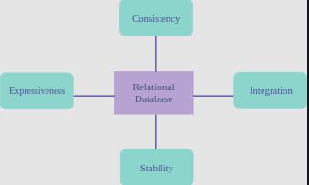
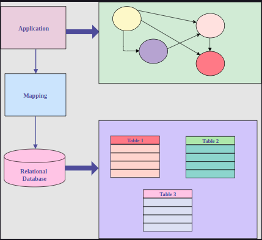

# 1. Relational Database

Today we are facing a rapid expansion of data-driven businesses, especially businesses that are web-based and have an enormous amount of data being transferred every second. In fact, almost 90% of all data on the web has been created in the last several years. Usually this data has to be stored in a database. However, since every business is different, there are different needs that need to be taken into account when looking at ways to store the data. There are two routes we can take:

* Relational Databases

* NoSQL

## Relational Databases

The concept of relational database concept was first proposed in 1970 by Edgar F. Codd and has been ruling our world since the mid-1980s. Somewhere in the ’90s concepts like Object Databases threatened to take reign, but that never happened. There are many reasons why people love relational databases and why they have been so dominant for such a long time.

Why Use Relational Databases?

* Firstly, they are very close to the way we see the world. The entities in the application domain are modeled naturally using records and tables. Relationships between these tables are created based on the relationships that exist between the corresponding entities in the application domain.

* Relational databases also have strong consistency, meaning that once a change is made to some of the records, it can be seen by every application in that domain. This made relational databases an ideal integration mechanism, with multiple applications sharing a common database and data.

* Relational databases have the Transactions feature. This gives us a way to assign changes to multiple tables and roll back previous changes, in case one instruction fails. This is a fairly complex, but powerful, feature used in data-intensive systems to provide stability.

* They have the Joins feature.

* SQL has pretty much become the standard language for a wide range of relational databases. And since it is very expressive and easy to learn, this made it more accessible to relational databases. Hence, SQL provides expressiveness to the developer.

 

	

 

## Problems of Relational Databases

This doesn’t necessarily mean that the data lacks structure, but that structure (especially in tabular form) is hard to grasp and define. An example of an application using unstructured data would be customer analytics, where companies use collected data to analyze and improve customer relationship management.

We do not have as many standalone applications today, for which relational databases were made. However, these applications have changed with the introduction of social media, internet of things, microservices, etc. This advanced world, with distributed systems and a lot of data, has given space for the NoSQL database to blossom.

> Impedance mismatch is a term used, in general, to describe the difference between the relational model and the in-memory data structures.

For example, objects in application memory are often saved in the form of a graph, which is different from the tabular form that data is saved in, in the relational databases. This is why we always need to modify, cut and re-arrange our data before we save it to the relational database.

 

	

 

Why is this such a big problem?

Since these modifications are coupled with modifications in the application itself, it takes a long time to extend and maintain these databases and, today, applications and systems have a demand for 24/7 availability, which means that there is no longer time to turn these systems off for the weekend and update the database. Application users also demand rapid response times, so, the front-end can’t afford to slow down while the datastore is updating itself.

Another issue with relational databases is that they are not that cluster-oriented. When you try to have replicas, the writes will have to be replicated to all the nodes; since all of them need to be consistent before a transaction is allowed to commit, this makes the writes an expensive operation. In relational databases, replicas affect performance significantly. Since you don’t want to sacrifice consistency, you must wait for all the replicas to be consistent before you can read the data back.

The ability to manage data dynamically, to go to production quickly, and to develop software using agile methodologies all require more flexibility than relational databases can provide.

# 2. NoSQL Databases

The term NoSQL originated as a Twitter hashtag for a meet-up back in 2009. It is sometimes translated as an acronym for Not Only SQL, or short-hand for No SQL.

This term is pretty loose and is used to cover a wide range of databases that try to tackle problems that relational databases have with newer applications. These include:

* Flexibility

* Scalability

* Performance

Nevertheless, in order to do so, these databases have sacrificed some of the good things that relational databases provided, such as:

* Expressive query language

* Secondary indexes

* Transactional mechanisms

* Strong consistency

### Common NoSQL Characteristics

NoSQL databases have these common characteristics:

* They usually don’t use SQL. However, they do have their own querying languages which are often similar to SQL since SQL is easy to learn. For example, Cassandra’s querying language is called CQL, or Couchbase’s N1QL, and actually extends SQL for JSON.

* They are not relational databases; meaning that they don’t provide a set of formally described tables in which data should fit. Essentially, relational databases are named as they are because they are structured around tables and relations between those tables. NoSQL databases don’t have tables (at least not in the way that relational databases do) and, therefore, no relations.

* Most of them are cluster-friendly. The initial idea was to store databases on multiple machines; but, some NoSQL databases are Graph oriented just like many applications today (e.g, online social networks where people are nodes, who are connected to other nodes, with edges in a friendship, relationship, etc.).

* They don’t enforce a fixed scheme as strongly as relational databases do. Hence, it is possible to add a field into “record” without first making changes to the structure itself. Since, in the relational databases, you have to know in advance what you want to store, NoSQL databases make this process easier.

All the above are common characteristics, but certainly, by no means are they the definition of NoSQL. At this point, I don’t think we’ll ever have a full, proper definition of NoSQL databases. However, this may be for the best as it goes hand-in-hand with NoSQL’s “free spirit” identity.

# 3. Types of NoSQL Databases

## Data Model

As previously mentioned, NoSQL databases have shifted to separate themselves from relational databases, as they are no longer a part of them but what does this mean?

This means that they no longer use a relational data model.

> A database model is a model through which we perceive data in the database.

A relational database model can be visualized as a set of tables in which each row represents a different record, a different entity.

## Types of NoSQL Databases

### Key-Value Stores

Key-Value Store is effectively an associative array stored on a disk; it is a single key lookup, a dictionary so to speak.

The good thing about these databases is that they can be read very quickly, but these databases are not so good for reverse lookups or additional analytics.

An example of this type of database is Redis.

### Column Stores

Column Stores is the subset of NoSQL databases that kept, somewhat, to the tabular form.

So, what does this mean?

### Column Stores vs Relational Databases

<b>Relational Database Approach</b>

Well, as you probably know, relational databases keep all their data in tabular form (where every row represents one entity). Since every row is saved separately on the disk, we could say that rows align the data.

When reading this kind of database, it always reads the whole row, even if not all of the data is necessary (i.e., if we only want one column of values).

<b>Column Store Approach</b>

Column stores, on the other hand, change this approach a bit: they store data in so-called columned families (i.e., in column order).

For example:

* First, Ids of all records are saved.

* Then, all of their names, etc.

Why is this a big deal?

This is a big deal because it is possible to get the whole column in a more efficient manner than it was when you got all of the rows and had to pull specific values from each one

Basically, we can get more information from the database in a single seek. Also, these databases can be easily compressed and, it goes without saying that writes are very expensive.

A typical example of these databases is Cassandra.

## Graph Stores

Graph stores use graph structures for queries, with nodes, edges, and properties, to represent and store data.

They are used for storing a network of connections or relationships (e.g., social networks).

Graph stores are a bit different from other NoSQL databases since they originated from a different problem with relational databases–they have a number of small records with a lot of relationships between them.

An example of such a database is AllegroGraph.

### Document Stores

One of the most popular types of NoSQL databases is Document stores, which revolves around the concept of a document.

> <b>Documents</b> are self-describing structures and usually similar to each other, but they don’t have to be the same.

Unlike the rows in relational databases, where every row has to follow the same schema, documents can vary from each other and still belong to the same collection.

### Multi-Model Databases

Multi-model databases are designed to handle multiple data models against a single integrated backend.

They are a brand-new in the NoSQL world, and there will be much more buzz around this type of database in the future.

# 4. Polyglot Persistence

### Why Choose NoSQL?

There are two main reasons why engineers choose NoSQL databases for their problems:

* <b>Minimizing the Impedance Mismatch</b>

Since a lot of effort is spent on mapping in-memory to in-database, saving that effort improves developer productivity.

Sometimes, a NoSQL database has a data model that better suits the needs of our application, and thus simplifies the interaction of the application code with the database. This way, we have less code to develop and maintain.

For example, in MEAN stack (M is for Mongo DB) the whole stack uses JSON objects, and the interaction of application code and database is minimal.

* <b>Embracing large scale data</b>

Today it is very time-consuming to store a large amount of data in the relational databases. Businesses have a need to capture and process a lot of data more quickly because many NoSQL databases are designed to run on clusters, which are a better fit for this kind of problem.

Large scale clusters give us the ability to store larger data sets and process large amounts of analytic data. Also, NoSQL databases have different data models that may be better for processing huge amounts of data.

This way of looking at data storage will lead us to solutions with multiple databases, each of which will be used for a different purpose. For example, we can use:

* SQL for a financial part of the application

* MongoDB for products catalog

* Cassandra for large-scale analytics
