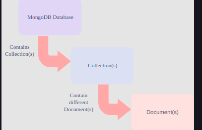

# 1. Core MongoDB Concepts

## A Basic Introduction

Before we see all the different ways that MongoDB can be used, let’s go through some of the basic concepts of this database.

Guys from MongoDB are very proud of what they call Nexus Architecture. This architecture gives the ability to combine proven concepts and abilities of relational databases with NoSQL innovations.

<br>
<div align="center">
	
</div>
<br>

## MongoDB Documents

MongoDB is a document-oriented database and, as previously mentioned, it has certain similarities to relational databases.

Instead of rows, MongoDB has documents. Unlike relational databases, where information for a given record is spread across many tables, all of the data for a given record is stored within a single document.

Under the hood, documents are BSON files, which are the bin­ary-en­coded seri­al­iz­a­tion of JSON files. Nevertheless, from a programmer’s point of view, MongoDB manipulates pure JSON files.

```json
{
    "_id" : ObjectId("58e28d41b1ad7d0c5cd27549"),
    "name" : "Nikola Zivkovic",
    "blog" : "rubikscode.net",
    "numberOfArticles" : 10,
    "Adress" : [
        "street" : "some street",
        "city" : "Novi Sad",
        "country" : "Serbia"
        ],
    "company" : "Vega IT Sourcing",
    "expertise" : [".NET", "JavaScript", "NoSQL", "Node.js"]
}
```

# 2. Collections in MongoDB

### What are Collections?

Documents are stored inside of collections.

> Collections are groups of somehow related documents, but these documents don’t need to have the same structure.

Here lies one of the biggest benefits of MongoDB: developers don’t need to know the schema of the database beforehand but can modify the schema, dynamically, during development. This is especially great in systems where we can’t get the schema quite right in the beginning, or there are plenty of edge cases to cover.

Well, let’s say that the previous document is stored in the collection called users; we could add another document into that collection which would contain fields that the previous document didn’t have, or we could add a document that may not have the fields that the previous document had.

<br>
<div align="center">
	
</div>
<br>

### Example

Document 1

```json
//Previous document
{
    "_id" : ObjectId("58e28d41b1ad7d0c5cd27549"),
    "name" : "Nikola Zivkovic",
    "blog" : "rubikscode.net",
    "numberOfArticles" : 10,
    "Adress" : [
        "street" : "some street",
        "city" : "Novi Sad",
        "country" : "Serbia"
        ],
    "company" : "Vega IT Sourcing",
    "expertise" : [".NET", "JavaScript", "NoSQL", "Node.js"]
}
```

Document 2

```json
//New document added
{                                                                                       
    "_id" : ObjectId("58e28da0b1ad7d0c5cd2754a"),
    "name" : "Vladimir Pecanac",
    "blog" : "code-maze.com",
    "Adress" : [
        "street" : "some street",
        "city" : "Novi Sad",
        "country" : "Serbia"
        ],
    "company" : "Vega IT Sourcing",
    "expertise" : [".NET", "Continous Integration", "REST"]
    "location" : [45, 19]
}
```

Adding documents to the collection
As you can see these documents are similar, but not the same. The new document doesn’t contain the `numberOfArticles` field, but it does contain an additional `location` field which the previously added document didn’t have.

Collection groups then, give you the ability to add indexes to these documents. Indexes are one of the concepts that MongoDB inherited from relational databases.

### Differences Between MongoDB & Relational Databases

It’s important to emphasize some of the differences between MongoDB and Relational databases.

Firstly, MongoDB doesn’t have foreign keys; but, it has a feature that looks quite like that – References.

Any object can have a reference to some other object, using its id, but this is not automatically updated, and it’s up to the application to keep track of these connections.

This is done in this way because once a foreign key is introduced in a relational database, it can be hard to unwind the database from it.

Thanks to the document data model, and due to the fact that all the necessary information for one “record” is stored inside one document, joins are not provided in MongoDB. However, a similar mechanism called Lookup is available.

Among other differences, it should be mentioned that there is no equivalent of multiple-table transactions in MongoDB.

# 3. Command Operations in MongoDB

## CRUD operations from the shell

Once the MongoDB server is up and running, one can connect to it using Mongo shell client. On the terminal, on our platform, the server automatically connects, so that you don’t have to set it up.

All the functionalities that are provided in the shell client are provided through MongoDB drivers too. Drivers are provided for all popular programming languages, which means that all features that are shown in this chapter can (and should) be done through the code. However, for demonstrative purposes, the shell client is used.

### Using `mongo`

```nodejs
mongo
```

### Creating Database

```nodejs
use DATABASE_NAME
```

#### Example

```nodejs
use blog 
db 
```

### Using `db.help()`

```nodejs
db.help()
```

### Collection Operations

Creating Collection

```nodejs
db.createCollection(COLLECTION_NAME, OPTIONS)
```

```nodejs
db.createCollection("users");
```

Showing Collections

```nodejs
show collections
```

Dropping Collections

```nodejs
db.COLLECTION_NAME.drop()
```

example 

```nodejs
db.users.drop();
show collections
```

### Inserting a Document

For adding a document to the collection, the

```nodejs
db.COLLECTION_NAME.insert(JSON_DATA)
```

method is provided.

Alternatively, the

```nodejs
db.COLLECTION_NAME.save(JSON_DATA)
```

function can be used.

Example 

```nodejs
db.users.insert({"name" : "Nikola Zivkovic", "blog" : "rubikscode.net", "numberofArticles" : 10, "company" : "Vega IT"});
```

### Querying Documents

For a user to query documents from the database, the following functions are provided:

```nodejs
db.COLLECTION_NAME.find(QUERY)
```

and

```nodejs
db.COLLECTION_NAME.findOne(QUERY)
```

Data can also be presented in a formatted manner by appending the following method:

```nodejs
pretty()
```

> A query that is passed into the function is a JSON object too.

Example

MongoDB has an additional query language that gives a user the ability to do something similar to the where clause.

For example, if we wanted to read all the users that have the blog name – rubikscode.net, we could do something like this on terminal:

```nodejs
db.users.findOne({"blog" : "rubikscode.net"});
db.users.find({"blog" : "rubikscode.net"});
db.users.find({"blog" : "rubikscode.net"}).pretty();
```

### Updating a Document

Every document in the database can be updated. This is achieved by using

```nodejs
db.COLLECTION_NAME.update(SELECTION_CRITERIA, UPDATED_DATA)
```

Example

Let’s increase the number of articles of our document.

Type out the following command in the terminal:

```nodejs
db.users.update({"blog" : "rubikscode.net"}, {$set : {"numberofArticles" : 11}});
db.users.find({"blog" : "rubikscode.net"}).pretty();  
```

### Removing a Document

If a user wants to remove a document from the collection, one can do it with the

```nodejs
db.collection_name.remove(query)
```

Example

Type out the following commands to implement this operation in the terminal:

```nodejs
db.users.find().pretty(); 
db.users.remove({"blog" : "rubikscode.net"});
db.users.find().pretty(); 
```

### Indexes

To achieve better performance, MongoDB provided indexes. They are not different from the traditional indexes of relational databases; however, without them, MongoDB must scan every document from a collection to select those documents that match the query statement.

> Indexes are data structures which store a small portion of the data that is easily accessible through MongoDB.

Creating an Index

In order to create an index on field of a collection, one should run:

```nodejs
db.COLLECTION_NAME.createIndex({ FIELD_NAME: 1})
```
example

```nodejs
db.users.createIndex({"blog" : 1});
```

# 4. MongoDB Compass

In order for this database to be more user-friendly, the folks at MongoDB have provided a GUI application called Compass.

This tool gives a simplified data presentation and gives the ability to a user to query data without knowing details of the MongoDB querying language. This way, the user is able to see databases, collections, and documents in a more human and readable way.

Another very nice feature of this tool is that it’s able to show server performances.

### Conclusion

At this point, we have learned that, by using the document data model in the right way, MongoDB was able to maintain and balance good relational database features with the innovations that the NoSQL databases provided. It is no wonder that it’s one of the most popular NoSQL databases out there.


