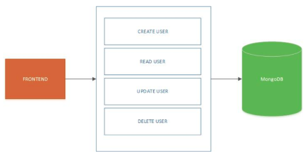

## What is Serverless Architecture

Serverless is quite the buzz word this year. It’s a shiny new term that has caused many debates, even conflicts, among developers. In fact, at the moment you are reading this, there are already many meet-ups and conferences dedicated to serverless architecture, its benefits, and pitfalls.

### Definition

Before we define what serverless architecture is, let’s first define what serverless architecture isn’t. This way we can skip the confusion that the word itself insinuates. Serverless architecture doesn’t mean that there are no servers, just the physical, as well as virtual infrastructure, is hidden from developers.

This means that the developer is basically using a third-party to handle infrastructure problems. Therefore, the developer expects that the third-party will enable the resources that are necessary for the application, or function, to be executed properly.

By now, we as a community have agreed that when an application is serverless, it uses one of two concepts:

* The Backend as a Service (BaaS) concept – This application depends on third-party service that is running on the cloud.

* The Function as a Service (Faas) concept – This application depends on a custom code that has been run in short-living containers.

These two concepts are converging; BaaS solutions usually have FaaS integrated somewhere in their architecture because of a need to create custom backend functionalities. For example, some of the solutions that started as a BaaS ended up being FaaS. An excellent real-life great example is Auth0.

# 1. Serverless Architecture

## Working of Serverless Architecture

Serverless architecture pushes towards further shredding of the back-end architecture. In a similar way that microservices broke down big monolith services into smaller ones, with a specific purpose, serverless architecture aims to break down microservices in even smaller units.

This collection contained a document for each user. In the solution, the back-end acted as a service which provided CRUD operations for the front-end part of the application.

 

	
	 
	`CRUD operations without Serverless`

 

The serverless architecture separates CRUD features into finer-grained parts with defined functionality.

Each of these features would still have exposed APIs, but they would be executed into a smaller “service”.

 

	
	 
	`CRUD operations with Serverless`

 

# 2. MongoDB Atlas-Creating a Cluster

### MongoDB Atlas: Definition

MongoDB Atlas is Mongo’s response to our advanced world. In its essence, MongoDB Atlas is a <b>Database as a Service (DaaS)</b>, i.e., MongoDB is hosted on the cloud.

The general idea is that the developer will no longer need to take care of database management and have an operating and distributed database cluster. Also, with Mongo AtlasDB, you can use all of the MongoDB features inside of serverless architecture.

### Create a Cluster

The first step on your MongoDB Atlas journey would be to create an account on MongoDB cloud service. Once you do that, the cluster creation dialogue will be automatically opened.

We were very inspired when we created our account, so we named our first cluster FirstCluster. Also, since the guys at MongoDB were cool, and gave us some free coupons, I created the cluster on one of the servers in Frankfurt for 0.09$ per hour.

> MongoDB allows you to create a Free Tier cluster if you want to test out MongoDB Atlas. You can deploy only one Free Tier cluster per Atlas project.

# 3. MongoDB Atlas-Connecting to Mongo Shell

## Connect to a Cluster from Mongo Shell

Now that you have created a cluster, the next thing that you want to do is to connect to the newly created cluster. There are multiple ways to connect to this cluster, from either Mongo Shell or the code.

In this example, I will show you how to connect to the Atlas cluster using Mongo Shell. Before we proceed, there are a few tasks we need to do.

### First Task: Installing Mongo

The first task is, of course, having Mongo installed. We have already provided you with the terminal that has the Mongo shell in it at the end of this lesson. In case you want to try it on your local machine, you can read how to do that here.

### Second Task: Adding WhiteList Entry

The second task is your IP address added to the clusters whitelist.

> In order to use the platform’s terminal, choose the “ALLOW ACCESS FROM ANYWHERE” option.

### Connect via Mongo Shell

After adding the whitelist entry:

* Click the “CONNECT” option available under your cluster.

* First, as shown above, you will be required to create a MongoDB User that you will use to access the deployment.

* Next, choose Connect with the Mongo Shell option.

