# 1 The Fundamentals of Statistics

### Basics

#### Mean

Арифметик дундаж утга

#### Median

Голч утга

#### Standard deviation

Std is a <b>Measure of how much the data is spread out</b>

In mathematical terms, standard deviation is the square root of the variance.

Variance is defined as the average of the squared differences from the mean.

#### Correlation Coefficient

When two sets of data are strongly linked together we say they have a high correlation.

* 1 is a perfect positive correlation
* 0 is no correlation meaning the values don’t seem linked at all
* -1 is a perfect negative correlation

```py
import numpy as np

# The dataset
learning_hours = [1, 2, 6, 4, 10]
scores = [3, 4, 6, 5, 6]

# Applying some stats methods to understand the data:
print("Mean learning time: ", np.mean(learning_hours))
print("Mean score: ", np.mean(scores))
print("Median learning time: ", np.median(learning_hours))
print("Standard deviation: ", np.std(learning_hours))
print("Correlation between learning hours and scores:", np.corrcoef(learning_hours, scores))
```

### Working With Box Plots

<br>
<div align="center">
  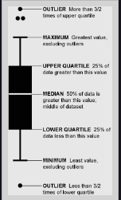
  <br>
  <code>How to read a box-plot</code>
</div>
<br>

### Basics of Probability

Probability is a type of ratio where we compare how many times an outcome can occur compared to all possible outcomes. Simply put:

<br>
<div align="center">
  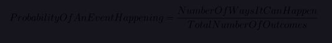
  <br>
</div>
<br>

#### a. Independent Events
```py
P(X and Y) = P(X) * P(Y)
```

#### b. Dependent Events
```py
P(X and Y) = P(X) * P(Y after X has occurred)
```
#### c. Mutually Exclusive Events
```py
P(A and B) = 0

P(X or Y) = P(X) + P(Y)
```
#### d. Inclusive Events
```py
P(X or Y) = P(X) + P(Y) − P(X and Y)
```

#### Conditional Probability
```py
P(Y|X) = P(X and Y) / P(X)
```

# 2. Machine Learning 101

### 1. Supervised Learning

In Supervised Learning, the training data provided as input to the algorithm includes the final solutions, called labels or class because the algorithm learns by “looking” at the examples with correct answers. In other words, the algorithm has a supervisor or a teacher who provides it with all the answers first, like whether it’s a cat in the picture or not. And the machine uses these examples to learn one by one.

<strong>Examples of Supervised Learning Algorithms: </strong>

* Linear Regression
* Logistic Regression
* Support Vector Machines
* Decision Trees and Random Forests
* k-Nearest Neighbors
* Neural networks

### 2. Unsupervised Learning

In Unsupervised Learning the data has no labels; the goal of the algorithm is to find relationships in the data. This system needs to learn without a teacher. For instance, say we have data about a website’s visitors and we want to use it to find groupings of similar visitors. We don’t know and can’t tell the algorithm which group a visitor belongs to; it finds those connections without help based on some hidden patterns in the data. This customer segmentation is an example of what is known as clustering, classification with no predefined classes and based on some unknown features.

<strong>Examples of Unsupervised Algorithms:</strong>

* Clustering: k-Means
* Visualization and dimensionality reduction
* Principal Component Analysis (PCA), t-distributed
* Stochastic Neighbor Embedding (t-SNE)
* Association rule learning: Apriori

### 3. Semi-supervised Learning

Semi-supervised learning deals with partially labeled training data, usually a lot of unlabeled data with some labeled data. Most semi-supervised learning algorithms are a combination of unsupervised and supervised algorithms.

### 4. Reinforcement Learning

Reinforcement Learning is a special and more advanced category where the learning system or agent needs to learn to make specific decisions. The agent observes the environment to which it is exposed, it selects and performs actions, and gets rewards or penalties in return. Its goal is to choose actions which maximize the reward over time. So, by trial and error, and based on past experience, the system learns the best strategy, called policy, on its own

<br>
<div align="center">
  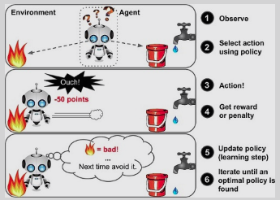
  <br>
</div>
<br>


<br>
<div align="center">
  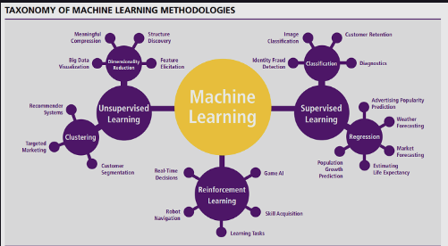
  <br>
</div>
<br>

## Machine Learning Algorithms

#### 1. Linear Regression

Linear Regression is probably the most popular machine learning algorithm.

Remember in high school when you had to plot data points on a graph with an X-axis and a Y-axis and then find the line of best fit? That was a very simple machine learning algorithm, linear regression. In more technical terms, linear regression attempts to represent the relationship between one or more independent variables (points on X axis) and a numeric outcome or dependent variable (value on Y axis) by fitting the equation of a line to the data:

<br>
<div align="center">
  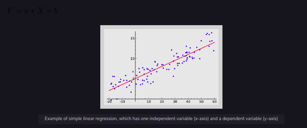
  <br>
</div>
<br>

#### 2. Logistic Regression

Logistic regression has the same main idea as linear regression. The difference is that this technique is used when the output or dependent variable is binary meaning the outcome can have only two possible values. For example, let’s say that we want to predict if age influences the probability of having a heart attack. In this case, our prediction is only a “yes” or “no”, only two possible values.

#### 3. Decision Trees

Decision Trees also belong to the category of supervised learning algorithms, but they can be used for solving both regression and classification tasks.

In this algorithm, the training model learns to predict values of the target variable by learning decision rules with a tree representation. A tree is made up of nodes corresponding to a feature or attribute. At each node we ask a question about the data based on the available features, e.g., Is it raining or not raining?. The left and right branches represent the possible answers. The final nodes, leaf nodes, correspond to a class label/predicted value. The importance for each feature is determined in a top-down approach — the higher the node, the more important its attribute/feature

<br>
<div align="center">
  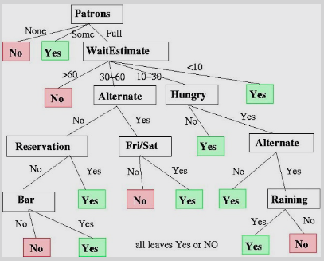
  <br>
</div>
<br>

#### 4. Naive Bayes

Naive Bayes is a simple yet widely used machine learning algorithm based on the Bayes Theorem Remember we talked about it in the Statistics section? It is called naive because the classifier assumes that the input variables are independent of each other, quite a strong and unrealistic assumption for real data!.

#### 5. Support Vector Machine (SVM)

Support Vector Machines is a supervised algorithm used mainly for classification problems. In this algorithm, we plot each data item as a point in n-dimensional space, where n is the number of input features. For example, with two input variables, we would have a two-dimensional space. Based on these transformations, SVM finds an optimal boundary, called a hyperplane, that best separates the possible outputs by their class label. In a two-dimensional space, this hyperplane can be visualized as a line although not necessarily a straight line.

<br>
<div align="center">
  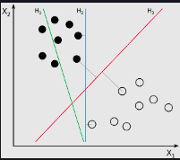
  <br>
</div>
<br>

#### 6. K-Nearest Neighbors (KNN)

KNN classifies an object by searching through the entire training set for the k most similar instances, the k neighbors, and assigning a common output variable to all those k instances. The figure below represents a classification example. The test sample (green dot) should be classified either to blue squares or to red triangles. If k = 3 (solid line circle) it is assigned to the red triangles because there are 2 triangles and only 1 square inside the inner circle. If k = 5 (dashed line circle) it is assigned to the blue squares (3 squares vs. 2 triangles inside the outer circle):

<br>
<div align="center">
  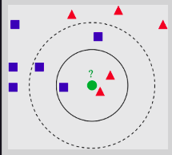
  <br>
</div>
<br>

#### 7. K-means

K-means is a type of unsupervised algorithm for data clustering. It follows a simple procedure to classify a given data set. It tries to find K number of clusters or groups in the dataset. Since we are dealing with unsupervised learning, all we have is our training data X and the number of clusters, K, that we want to identify, but no labelled training instances (i.e., no data with known final output category that we could use to train our model). For example, K-Means could be used to segment users into K groups based on their purchase history.

<br>
<div align="center">
  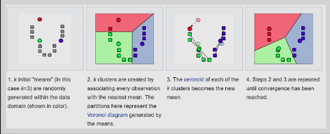
  <br>
</div>
<br>

#### 8. Random Forest

Random Forest is one of the most popular and powerful machine learning algorithms. It is a type of ensemble algorithm. The underlying idea for ensemble learning the is wisdom of crowds, the idea that the collective opinion of many is more likely to be accurate than that of one. The outcome of each of the models is combined and a prediction is made.

<br>
<div align="center">
  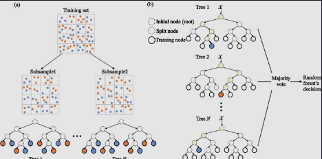
  <br>
</div>
<br>

#### 9. Dimensionality Reduction

In the last years, there has been an exponential increase in the amount of data captured. This means that many machine learning problems involve thousands or even millions of features for each training instance! This not only makes training extremely slow but makes finding a good solution much harder. This problem is often referred to as the curse of dimensionality. In real-world problems, it is often possible to reduce the number of features considerably, making problems tractable.

<br>
<div align="center">
  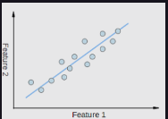
  <br>
</div>
<br>

#### 10. Artificial Neural Networks (ANN)

ANN are ideal for tackling large and highly complex machine learning tasks, such as recommending the best videos to watch to hundreds of millions of users every day (e.g., YouTube), powering speech recognition services (e.g., Siri, Cortana) or learning to beat the world champion at the game of Go (DeepMind’s AlphaGo).

<br>
<div align="center">
  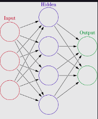
  <br>
</div>
<br>


<br>
<div align="center">
  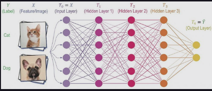
  <br>
</div>
<br>

<br>
<div align="center">
  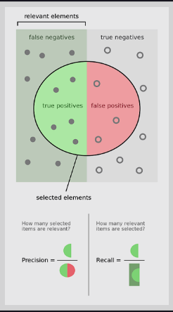
  <br>
</div>
<br>

<br>
<div align="center">
  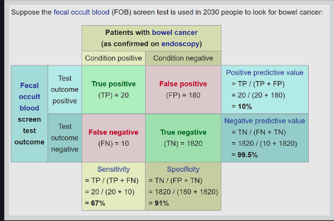
  <br>
</div>
<br>

<br>
<div align="center">
  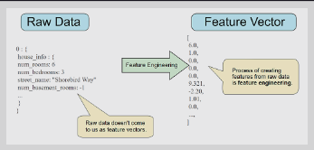
  <br>
</div>
<br>

# 3. End-to-End Machine Learning Project

<br>
<div align="center">
  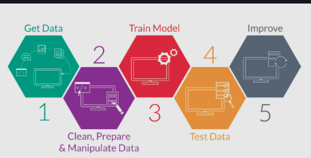
  <br>
</div>
<br>

## 1. Kaggle Challenge - Exploratory Data Analysis

### [Kaggle Housing Prices Competition](https://www.kaggle.com/c/house-prices-advanced-regression-techniques/data)
