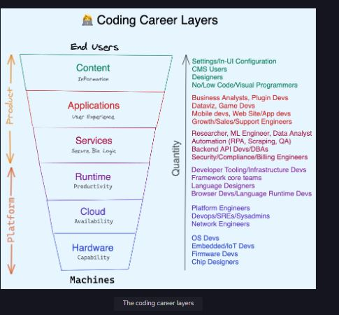

## Five stages of an early coding career

While there are many resources on how to code, from beginner to advanced, there aren’t enough covering everything else. This course is dedicated to addressing that. It will give you principles, strategies, and tactics for the five stages of your early coding career.

* Code Newbie: Just learning to code via a Bootcamp, college, online course, or self-teaching

* Job Hunter: Landing that first developer job

* Junior Developer: Surviving and thriving in your new job

* Junior to Senior: Getting promoted or hired as a Senior Developer

* Senior Developer: Growing into your own as a Senior in the industry

# Company Types

## 1. Startups (Especially before Series C)

You’ll have high autonomy and responsibility, but get ready for things to change on a dime. It’s rare for startup stock options to actually provide a [life-changing amount of money](https://danluu.com/startup-tradeoffs/). The career capital you’ll gain from doing great work at a high-growth startup is more bankable. The process is minimal, which is either a pro or a con depending on what you need to do your best work. Bootstrapped startups and indie hacking are increasingly popular alternatives to VC-backed startups, emphasizing profitability overgrowth.

## 2. Agencies

You’ll learn a lot by working on a diversity of projects, often with a handoff date. This affords you a lot of room for experimentation, especially since many projects will be greenfield. You’ll gain experience with project/client management but, sometimes, at the cost of long hours and high stress. Work can also be sensitive to economic cycles. Starting pay can be very low, and rates differ a lot by country ([see this agency survey](https://devquarterly.com/report/q2_2020/web)), until you start landing high-profile clients, winning industry awards, and building a reputation that can get you five to ten times the average. Freelancing and consulting are similar to this on an individual scale.

## 3. BigCos

You’ll have high pay and high impact (often impacting millions of users). You’ll encounter unique problems that show up only on a massive scale. People often talk about FAANG, but of course, there are thousands of great tech employers that are no longer startups.

# Career Layers

  

