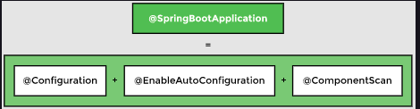

# 1. Creating a Project

<br>
<div align="center">
	
	<br>
	<code>Spring Boot removes the need of manual configuration and comes with an embedded server</code>
</div>
<br>

# 2. Decoupling Components

Right now, the RecommenderImplementation class is hard coded to use the ContentBasedFilter class. If we need to change the way our application recommends movies, we will need to change the code of the RecommenderImplementation class.

### Filter interface

One way to make the code loosely coupled is by using an interface called Filter. An interface contains abstract methods whose implementation is left to the classes using it.


<br>
<div align="center">
	
	<br>
	<code>`Filter` Interface removes tight coupling</code>
</div>
<br>

Now Filter is a dependency of RecommenderImplementation. We still have to create an object of RecommenderImplementation and an object of Filter and pass the objects to the constructor. In the next lesson, we will see how Spring takes over the job of managing dependencies.

# 3. Managing Beans and Dependencies

## 3.1 @Component

* If we want Spring to create and manage objects, we can do so by adding the @Component annotation at the beginning of the class and importing org.springframework.stereotype.Component.

<br>
<div align="center">
	
	<br>
	<code>Beans in the Spring container</code>
</div>
<br>

## 3.2 @Autowired

* The second thing Spring needs to know is the dependencies of each object. The @Autowired annotation is used for this purpose and we need to import org.springframework.beans.factory.annotation.Autowired to be able to use this annotation.


The @Autowired annotation tells Spring that `RecommenderImplementation` needs an object of type `Filter`. In other words, `Filter` is a dependency of `RecommenderImplementation`.

<br>
<div align="center">
	
	<br>
	<code>Identifying bean dependencies</code>
</div>
<br>

## 3.3 @ComponentScan

The third thing that Spring requires from the developer, is the location of the beans so that it can find them and autowire the dependencies. The `@ComponentScan` annotation is used for this purpose. This annotation can be used with or without arguments. It tells Spring to scan a specific package and all of its sub-packages. In our case, all the files that contain beans are in the same package, `io.datajek.springbasics`, so we want Spring to do a component scan on this package.

`@Configuration`, which declares a class as the source for bean definitions

`@EnableAutoConfiguration`, which allows the application to add beans using classpath definitions

`@ComponentScan`, which directs Spring to search for components in the path specified


<br>
<div align="center">
	
	<br>
	<code>`@SpringBootApplication` combines three annotations</code>
</div>
<br>

## 3.4 @SpringBootApplication

@SpringBootApplication tells Spring to scan all the files in the package where the class with this annotation is present. It also scans any sub-packages of the package where it is placed.

# 4. Autowiring By Type - @Primary

### NoUniqueBeanDefinitionException

<br>
<div align="center">
	
</div>
<br>

The `NoUniqueBeanDefinitionException` occurs. The error message says: Required a single bean but two were found.


### `@Primary` annotation

One way Spring can choose between two beans of the same type is by giving one bean priority over the other. The @Primary annotation is used for making a component the default choice when multiple beans of the same type are found.


<br>
<div align="center">
	
	<br>
	<code>Bean with `@Primary` annotation is injected</code>
</div>
<br>


# 6. Constructor and Setter Injection

So far, we have learnt that Spring framework identifies dependencies and wires them in. Spring framework gives the developer control over how beans are wired in. There are a variety of options to choose from. We will focus on constructor injection and _setter injection.

### Constructor injection

Autowiring the dependency using a constructor is called constructor injection. We will create a constructor in the `RecommenderImplementation` class that initializes the filter to be used for finding movie recommendations as follows:

```java
public RecommenderImplementation( Filter filter) {
    this.filter = filter;
    System.out.println("Constructor invoked...");
}
```

### Setter injection

Another way to wire in a dependency is by using a setter method. We will create a setter method in the `RecommenderImplementation2` class called setFilter as follows:

```java
public void setFilter(Filter filter) {
    this.filter = filter;
    System.out.println("Setter method invoked..");
}
```

### Field injection

We have seen two dependency injection methods above but Spring was already performing dependency injection without a constructor or setter method in the RecommenderImplementation class. We have been using @Autowired annotation directly on the Filter field. This is called field injectio

```java
public class RecommenderImplementation {
    @Autowired
    private Filter filter;
    
    //...    
}
```


<br>
<div align="center">
	
</div>
<br>


