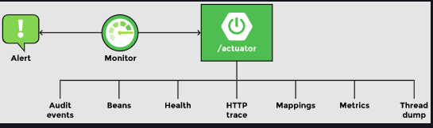

### Features of Spring Boot

Spring boot enables robust creation of applications. It provides features like servers, metrics, heath checks, etc. Spring Boot allows for integration with many different servers, but by itself, it is neither an application server nor a web server. Auto configuration is a great feature of Spring Boot whereby it provides all the required dependencies to start a particular project. For example, starter web automatically configures everything needed for a web application. Similarly, starter JPA automatically configures basic JPA along with Hibernate.

# Creating a REST Service

### @RestController

To create a controller, we will create a class called RecommendationsController and use an annotation @RestController to inform Spring that this is a controller class. A controller is a Java class that maps a URI to a method. When the method is executed, it returns a response. A @RestController is a specialized form of @Controller annotation which handles REST requests and responses. It automatically handles conversion to JSON.

### Mapping requests


```java
@RequestMapping(method=RequestMethod.GET, value="/movies")
//OR
@GetMapping("/movies")
public List<Movie> getAllMovies() {
    //...
}
```
# Developer Tools

### devtools dependency

To counter this problem, Spring Boot offers a Developer Tool that supports live reloads. This jar is provided by the Spring Boot framework and is useful for development-specific debugging. To use developer tools, add the following dependency to pom.xml file:

```xml
<dependency>
 <groupId>org.springframework.boot</groupId>
 <artifactId>spring-boot-devtools</artifactId>
</dependency>
```

### Automatic restart

One of the things that you will notice when running the application after making a change in the code is that the application automatically starts again. This is an efficient restart that takes way less time as compared to a typical restart. Spring knows that the Maven dependencies do not change, so only the application beans are loaded again, which is why it takes less time.

### LiveReload server

To save the time wasted in refreshing the browser after every code change, Spring Boot comes with a LiveReload embedded server which triggers an automatic browser refresh. The LiveReload extensions are available for different browsers. Once installed and enabled, any change in the code is detected by the LiveReload server and the browser is automatically refreshed to reflect the change.

# Actuator

Spring Boot Actuator is a feature that provides monitoring features for the application during development and after deployment. It provides metadata about the application like the beans configured, how autoconfiguration has worked, how many times a specific service is called, how many times a specific service has failed, etc.

<br>
	<div align="center">
		
	</div>
<br>

### Actuator endpoints

By default, only /health and /info are available. The other endpoints are disabled. To enable the web exposure of all management endpoints, add the following line to application.properties:
```xml
management.endpoints.web.exposure.include=*
```

* /auditevents shows audit information like which users were validated, or how many users failed the authentication test, etc.

* /beans shows all the spring beans that are configured. It shows the name of the bean as well as scope and type, and any dependencies that the bean might have. It can be used to analyze the application.

* /condition shows all the positive and negative matches for autoconfiguration similar to the report that is generated at application startup.

* /httptrace shows the last 100 requests that were executed along with the response that was sent back.

* /mappings shows all the URI’s for @RequestMapping.

* /metrics shows a list of valid metrics. Further information about any metric can be obtained by copying the metric and adding it to the url. For example, the jvm.memory.used will show the amount of memory used.

* /shutdown when enabled, lets the application gracefully shutdown. The feature can be enabled by making the following changes to the application.properties file:

```
management.endpoint.shutdown.enabled=true
```
