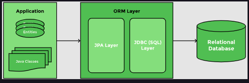

# 1. What is JPA?

In the previous section on Spring JDBC, we demonstrated how to perform CRUD operations using the `JdbcTemplate` class. JDBC requires the developer to write the queries, map values to the query, pass a set of parameters to execute the query, and map rows of the result set to a bean. For simple queries like the one we implemented in the Spring JDBC section, this task is manageable, but in large applications with hundreds of tables, the queries become complex. Writing and maintaining those queries requires expertise beyond the skillset of a Java developer. Java Persistence API (JPA) is designed to ease that task.

### How JPA works

JPA challenges the notion of writing queries and mapping the data back. It creates entities that are Java objects which map to a row in a database table. JPA creates a schema based on the entities and defines relationships between entities. The Object-Relational Mapping (ORM) layer maps the objects to a database table.

<br>
<div align="center">
	
	<br>
	<code>ORM maps Java objects to table rows</code>
</div>
<br>

Using JPA, we can map a Java class or bean to a table. The members of the class map columns in the table. When this mapping is defined, JPA can write queries on its own. It takes the responsibility of creating and executing queries for CRUD operations. This is due to the fact that the operations performed on a database are identical and can be generalized. The types of objects change based on the database schema but the operations remain the same.

### JPA implementations

Hibernate, the most popular ORM framework in the last decade, prompted the creation of the JPA standard. JPA is a standard of Object Relational Mapping. It is an interface that defines a set of annotations for creating the object relational mapping. There are numerous implementations of the JPA interface like Hibernate, EclipseLink, Apache OpenJPA, etc. Hibernate is by far the most popular implementation of JPA. It is a lightweight framework and can easily be integrated with Spring.

The benefit of using JPA instead of Hibernate is that JPA is a standard and one can switch to any other implementation later.

# 2. Defining an Entity

### @Entity

In our example, we have a Player class that lists attributes of a tennis player like his name, nationality, date of birth, and a number of titles won. We need to tell JPA that the objects of this class need to be mapped to a table in a database. JPA will create a table with the same name as the class and create columns for all the members of the class. Every instance of the Player class will become a row in the Player table. We will use the @Entity annotation to map this class to the Player table.

#### @Table

In case we want to map this class to a table with a different name, we can use the @Table annotation and provide the name of the table to which the bean maps to, as shown in the code above. Since the name of the entity and table match, we do not need the @Table annotation.

### @Id and @GeneratedValue

Every table in a relational database has a primary key. In our case, the Id attribute uniquely identifies each object. The @Id annotation is used to indicate the primary key. We can also let JPA generate the primary key value when we insert rows. The @GeneratedValue annotation will automatically generate Id values.


### @Column

Another annotation provided by the JPA API is @Column annotation, which is used to define column mappings. @Column annotation mentions the name of the column that matches an attribute of the class. For example:


# 3. Creating a Repository

## @Repository annotation

```
@Repository
public class PlayerRepository {

}   
```


## Enabling transaction management

Database queries contain multiple steps. We will also enable transaction management to allow all steps in a query to succeed. In case of an error or runtime exception, all steps will be rolled back. Transactions are implemented at the business layer, but in this example, we will implement them at the repository level. Spring provides all the boilerplate code to start, commit, and roll back a transaction, which can also be integrated with JPA’s transaction management. This is enabled using the @Transactional annotation on a method or a class.

```java
@Repository
@Transactional
public class PlayerRepository{

}   
``` 

## `EntityManager` and `@PersistenceContext` annotation

A JPA EntityManager manages connection to a database as well as to database operations. EntityManager is associated with a PersistenceContext. All operations that are performed in a specific session are stored inside the PersistenceContext. EntityManager is the interface to the Persistence Context. All operations on the entity go through the EntityManager. We will declare an EntityManager object in our class and mark it with the @PersistenceContext annotation.

```java
public class PlayerRepository{
    @PersistenceContext
    EntityManager entityManager;
    //...
}
```

# 4. CRUD Operations

### merge method for INSERT and UPDATE queries

The EntityManager offers a merge method for both INSERT and UPDATE operations. merge checks if the primary key value is being passed to it or not. If it finds the primary key, it updates the corresponding record. If the primary key is not passed, it generates a value and inserts a new record in the table. The merge method returns a Player object.

```java
public Player insertPlayer(Player player) 
{
   return entityManager.merge(player);
}

public Player updatePlayer(Player player) 
{
   return entityManager.merge(player);
}
```


### Executing a query

```java
@Autowired
PlayerRepository repo;

@Override
public void run(String... args) throws Exception {
    logger.info("\n\n>> Inserting Player: {}\n", repo.insertPlayer(
                 new Player("Djokovic", "Serbia", Date.valueOf("1987-05-22"), 81)));

    logger.info("\n\n>> Inserting Player: {}\n", repo.insertPlayer(
                 new Player("Monfils", "France", Date.valueOf("1986-09-01"), 10)));
}
```


### find method for SELECT query

Another way to confirm insert is to implement the getPlayerById method. This method will return a player based on the primary key value. EntityManager offers a number of find methods. We will pick the one that takes the name of the class and the primary key as arguments.

```java
public Player getPlayerById(int id) {
    return entityManager.find(Player.class, id);                
}
```

# 5. JPQL Named Query

### #NamedQuery

To create a named query, we will use the @NamedQuery annotation on the Player class. This annotation requires two parameters: the name of the query and the query itself. When using JPA, we will write the query in JPQL instead of SQL. JPQL uses entities in place of tables. Since we want to return a list of Player objects, the query will be "SELECT p FROM Player p".

```java
@Entity
@NamedQuery(name="get_all_players", query="select p from Player p")
public class Player {
    //...
}
```

### Using a named query for SELECT * query

In the getAllPlayers method, we will use the createNamedQuery method. We need to pass the name of the query and specify what the query will return. The name of the query as defined in the previous step is get_all_players. This query will return objects of the Player class. The createNamedQuery returns a TypedQuery, which we will assign to a variable called getAll. Then, we can use the getResultList method to return a list of players as follows:

```java
public List<Player> getAllPlayers() {
    TypedQuery<Player> getAll = entityManager.createNamedQuery(
                                                        "get_all_players", Player.class);
    return getAll.getResultList();
}
```

# 6. Spring Data JPA

The JpaRepository interface extends the Repository interface. It contains the API provided by CrudRespository as well as the PagingAndSortingRepository for CRUD operations along with pagination and sorting of records.

<br>
<div align="center">
	
</div>
<br>
