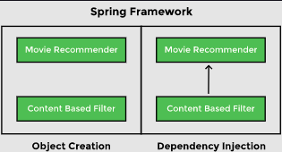
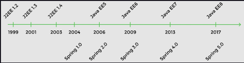
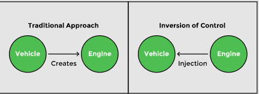
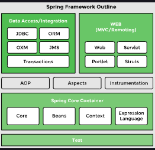

# 1. What is Spring?

The Spring framework is an open-source Java application framework, which is based on two key principles: `dependency injection` and `Inversion of Control`. Spring has the ability to autowire the dependency at run time, which allows the developer to write loosely coupled code.

Spring framework uses metadata in the form of xml file or java annotations to create objects and identifies dependencies, thereby producing a ready-to-use application.

A typical web application is divided into three layers: web, business, and the data layer. These layers have objects that collaborate with each other to make the application work. These collaborations are called dependencies. A typical application has a lot of classes and dependencies.

<br>
<div align="center">
	

</div>
<br>

# 2. History

<br>
<div align="center">
	
	<br>
	<code>Spring and Javaa EE timeline</code>
</div>
<br>

### Development timeline

Spring has gained a lot of momentum since the launch of Spring 1.0 in 2004. By the time Spring 2.0 was released in 2006, Spring had surpassed 1 million downloads! Spring 2.0 removed complexities from XML config files. The next version, Spring 2.5, introduced annotation configurations. Spring 3.0, released in 2009, set the minimum Java requirement to Java 5 and provided built-in REST support. Spring 3.2 introduced Java configuration and got rid of web.xml. In 2012, the Spring Mobile and Spring Android projects were released. In 2013, Spring 4.0 came around. This was the same year Spring Boot 1.0 was introduced to remove complexities associated with creating a web application. Spring Boot configures all the required Spring components and sets up dependencies in Gradle/Maven along with configuring the required beans using either xml, annotations, or Java code. The current version of the framework, Spring 5.0 came out in 2017. It sets the minimum Java requirement to Java 8.

Spring has simplified application development and its ease of use has led to widespread adoption of the framework. Spring Boot enables users to create a project with all required dependencies automatically wired in.

# 3. Terminology

### Beans

Beans are the objects of classes that are managed by Spring. Traditionally, objects used to create their own dependencies, but Spring manages all the dependencies of an object and instantiates the object after injecting the required dependencies. The @Component annotation is the most common method of defining beans.

```java
@Component
public class Vehicle {

}
```

### Autowiring

The process of identifying a dependency, looking for a match, and then populating the dependency is called autowiring. The @Autowired annotation tells Spring to find and inject a collaborating bean into another. If more than one bean of the same type is available, Spring throws an error. In the following scenario, two beans of type `Operator` are detected by Spring:

```java
@Component
class Arithmetic(){
    @Autowired
    private Operator operator;
    //...
}

@Component
class Addition implements Operator {

}

@Component
class Subtraction implements Operator {

}
```

## Dependency injection

Dependency injection is the process by which Spring looks up the beans that are needed for a particular bean to function and injects them as a dependency. Spring can perform dependency injection by using constructor or by using a setter method.

## Inversion of Control

Traditionally, the class which needed the dependency created an instance of the dependency. The class decided when to create the dependency and how to create it. For example, Engine class is a dependency of Vehicle class, which creates its object:

```java
class Vehicle{

    private Engine engine = new Engine();
    //...
}
```

```java
class Vehicle{

    private Engine engine;
    //...
}
```

<br>
	<div align="center">
	
	<br>
	<code>Traditional approach vs Inversion of control</code>
	</div>
<br>

### IoC container

An IoC container is a framework that provides the Inversion of Control functionality.

```java
class Vehicle {
    private Engine engine;
    //...   
}
```

IoC container is a generic term. It is not framework specific. Spring offers two implementations of the IoC container:

1. Bean factory

2. Application context


### Bean factory

The basic version of the Spring IoC container is bean factory. It is the legacy IoC container and provides basic management for beans and wiring of dependencies. In Spring, bean factory still exists to provide backward compatibility.

### Application context

Application context adds more features to the bean factory that are typically needed by an enterprise application. It is the most important part of the Spring framework. All the core logic of Spring happens here. It includes basic management of beans and wiring of dependencies as provided by the bean factory. Additional features in application context include Spring AOP features, internationalization, web application context, etc.

# 4. Spring Architecture

### Spring modules


<br>
<div align="center">

</div>
<br>

### Data access/ integration

Spring has very good integration with data and integration layers, and provides support to interact with databases. It contains modules like JDBC, ORM, OXM, JMS, and Transactions.

* The `JDBC` (Java Database Connectivity) module allows the data layer to interact with databases to get data or store data, or to interact with other systems without the need of cumbersome JDBC coding. Spring JDBC is very straightforward as compared to plain JDBC and makes the code very short.

* The `ORM` (Object Relational Mapping) module provides support to integrate with ORM frameworks including Hibernate and JPA.

* The `JMS` (Java Messaging Service) module talks to other applications through the queue to produce and consume messages.

* The `OXM` (object-XML mapping) module makes the object-to-XML transformation easy by providing useful features.

* The transaction management module provides support for successful rollback in case a transaction fails.

### Web (MVC/remoting)

It contains the Web, Servlets, Portlets, and Sockets modules to support the creation of a web application. Spring offers a web framework of its own called Spring MVC.

### Test

The Test module handles the cross cutting concern of unit testing. The Spring Test framework supports testing with JUnit, TestNG, as well as creating mock objects for testing the code in isolation.

### AOP

The AOP module provides Aspect Oriented Programming functionality like method interception and pointcuts as well as security and logging features. Spring has its own module called Spring AOP that offers basic, aspect-oriented programming functionality. Advanced AOP functionality can be implemented through integration with AspectJ. AOP features cross cutting concerns from business logic.

## Spring Projects

`Spring Boot` is used to develop micro services. It makes developing applications easy through features like startup projects, auto configuration, and actuator. Spring Boot has gained massive popularity since it was first released in 2014.

`Spring Cloud` allows the development of cloud native applications that can be dynamically configured and deployed. It provides functionality for handling common patterns in distributed systems.

`Spring Data` provides consistent access to SQL and NoSQL databases.

`Spring Integration` implements the patterns outlined by the book Enterprise Application Integration Patterns. It allows enterprise applications to be connected easily through messaging and declarative adapters.

`Spring Batch` provides functionality to handle large volumes of data like ability to restart, ability to read from and write to different systems, chunk processing, parallel processing, and transaction management.

`Spring Security` provides security solutions for different applications be it a web application or a REST service. It also provides authentication and authorization features.

`Spring Session` manages session information and makes it easier to share session data between services in the cloud regardless of the platform/container. It also supports multiple sessions in a single browser instance.

`Spring Mobile` offers device detection and progressive rendering options that make mobile web application development easy.

`Spring Android` facilitates the development of Android applications.
