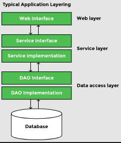
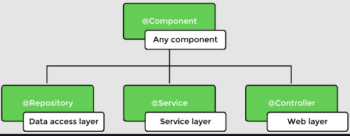
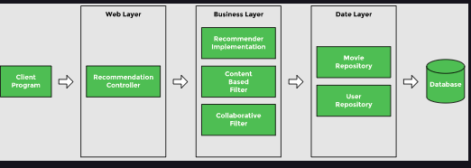

Beans can be declared using the @Bean annotation in a configuration class or by using the @Controller, @Service, and @Repository annotations. These annotations are used at different layers of an enterprise application. A typical application has the following layers:

 
	

		
	

 

 
	

		
		 
		<code>Stereotype annotations</code>
	

 

 
	

		
		 
		<code>Movie recommender system</code>
	

 
