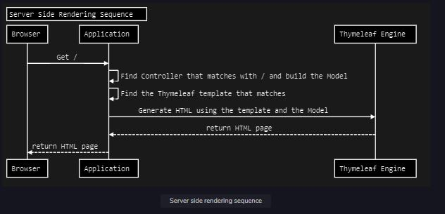

Thymeleaf is a Java-based template engine that uses server-side rendered HTML. It is best suited for views in an MVC application.

Spring, on the other hand, is a Java-based application framework and is best suited for making easily scalable applications on a production level. One of the major strengths of Spring Boot is its ability to prototype quickly. The smallest application can fit in a single [tweet](https://twitter.com/rob_winch/status/364871658483351552) (less than 280 characters) yet will scale to the internet with ease.

* Thymeleaf basics.
* Why to use Thymeleaf with Spring Boot.
* Learn how to build applications using Thymeleaf and Spring Boot.
* Build a fully working back-end application with Java, Spring Boot and Thymeleaf.

### Spring Boot

Spring Boot is an open-source Java-based framework which is mainly used to create microservices.

### Spring Data

Spring Data’s mission is to provide a familiar and consistent, Spring-based programming model for data access while retaining the unique traits of the underlying data store.

### Spring Security

Spring Security is a powerful and highly customizable authentication and access-control framework. It is the de-facto standard for securing Spring-based applications.

### Spring Web MVC

Spring Web MVC is Spring’s web framework, and is built on the Servlet API.

### Thymeleaf

Thymeleaf is a server-side Java template engine which uses natural templates to generate HTML pages. It is capable of not only processing HTML or CSS, but also XML, Javascript and more. The supported template types are:

* HTML
* CSS
* XMLMM
* Text
* Javascript
* Raw

#### Documentation

Thymeleaf’s official documentation is available on [its website](https://www.thymeleaf.org/doc/tutorials/3.0/usingthymeleaf.html).

Thymeleaf is a modern server-side Java template engine. In a Spring Boot application, we can find the templates under /src/main/resources/templates:

 

  

 

### Server-side rendering sequence

1. The browser starts with a GET request to the server running the application.
2. The application will match the requested path of the URL to a Controller.
3. The application finds the Thymeleaf template to use for rendering.
4. The application uses the Thymeleaf engine (also running inside the application) to combine the template with the Java objects in the model, resulting in an HTML page.
5. The application returns the generated HTML page to the browser where it is rendered.
