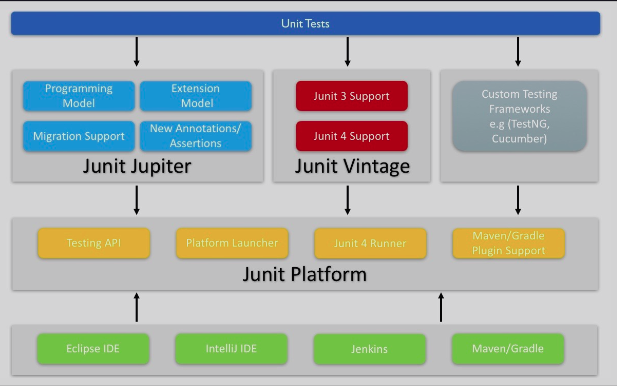

# JUnit 5 Introduction

### What is Junit 5?

Junit 5 is a powerful and popular Java testing framework. It is composed of many different modules. These different modules are parts of three sub-projects as follows:-

* Junit Platform

* Junit Jupiter

* Junit Vintage

In short it is represented as,

> JUnit 5 = JUnit Platform + JUnit Jupiter + JUnit Vintage

The above three projects are core to Junit 5. The architecture of JUnit 5 mostly comprises of these 3 components/sub-projects. In the next few lessons, we will take a look at more details of above three sub-projects.

### Junit5 Architecture 

 

	

 

* **Junit Platform**
It provides a core foundation to help launching testing frameworks on JVM. It acts as an interface between JUnit and its clients such as build tools (`Maven and Gradle`) and IDE's (`Eclipse and IntelliJ`). It introduces the concept of a `Launcher` which external tools use to discover, filter, and execute tests.

It also provides the `TestEngine API` for developing a testing framework that runs on the JUnit platform. Using `TestEngine API`, 3rd party testing libraries such as Spock, Cucumber, and FitNesse can directly plug in and provide their custom TestEngine.

* **Junit Jupiter**
It provides a new programming model and extension model for writing tests and extensions in Junit 5. It has a whole new annotation to write test cases in Junit 5. Some of the annotations are `@BeforeEach`, `@AfterEach`, `@AfterAll`, `@BeforeAll` etc. It implements TestEngine API provided by Junit Platform so that Junit 5 test can be run.

* **Junit Vintage**
The term `Vintage` basically means **classic**. Thus, this sub-project provides extensive support for writing test cases in JUnit 4 and JUnit 3. Thus, backward compatibility is been provided by this project.

