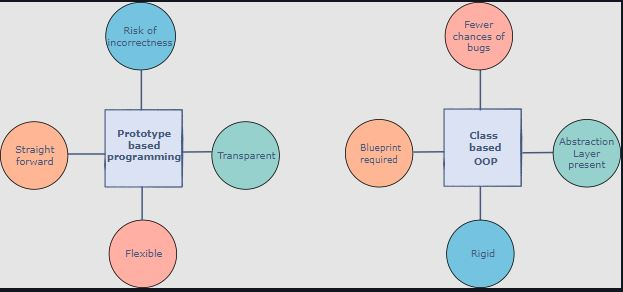

### Definition

Object-oriented programming is a style of programming, not a tool, which is why despite being old, it’s very popular and widely used. This style involves breaking a program into segments of objects that can communicate with each other. Each object is defined by its own set of properties. These properties can then be accessed and modified through various operations.

### OOP in JavaScript

However, we can also implement OOP without using classes, which is what JavaScript does. Before (and even after) introducing its ES2015 version, JavaScript relied on Prototype-based programming. In this programming style, the object encapsulates the properties, i.e., its methods and data, instead of a class. You can add new properties to this object whenever you feel like. So, an object can be an individual instead of an instance of the class; meaning, if you want an object, you can easily create one without having to create a class first.

 

    
     
    <code>Prototype-based vs Class-based programming</code>

 

### What does ES6 offer?

It provides new features as well as a cleaner approach for some of the existing features in ES5.

 

    
     
    <code>Features in ES6</code>

 

### <code>class</code> keyword

In the ES5 version, there are no classes; a function is used to make an object directly. However, the ES6 version uses the keyword <code>class</code> to define a class. The underlying concept is more or less the same. ES6 just cleans up the syntax. This will be discussed in detail in upcoming chapters.

### getter/setter syntax

The object properties require get/set methods to be called on them to access/modify their values. In the ES5 version, they were not widely used because the syntax was not that clean, thus making them challenging to use. However, the ES6 version provides an improved, easy to use, and clear syntax for Get and Set methods.

### constructor function syntax

In the ES5 version, constructor functions are declared using the <code>function</code> keyword, with the body of the code initializing the object properties upon its creation. The ES6 version, on the other hand, uses the <code>constructor</code> keyword to declare the constructor function which runs on object creation. This new syntax is clearer, hence making it easier to use.

### <code>extends</code> keyword

In the ES5 version, prototypal inheritance is not an easy task. The code is hard to follow and takes a lot of effort to write as well as understand. The ES6 version offers an improved and cleaner syntax by using the keyword <code>extends</code> for setting up the inheritance relationship between parent and child.

### <code>super</code> keyword

This is a new feature introduced in the ES6 version. <code>super</code> is used to call the constructor on the parent object that is being inherited by the child. It is used to avoid duplication of the parts of the constructor that are present in both the parent and child class.

### <code>static</code> keyword

JavaScript did allow for static members to be declared in the ES5 version. However, the ES6 version formalizes this by introducing the keyword <code>static</code>.
