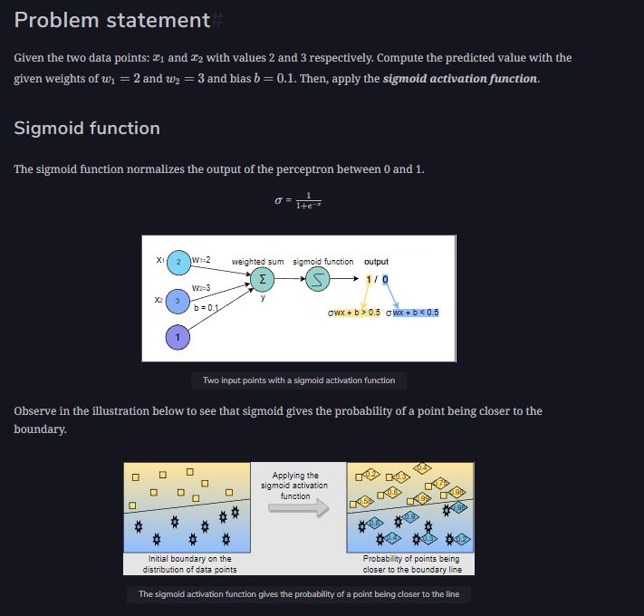

<br>
<div align="center">
  
</div>
<br>

### Sample input
```py
X = [2, 3]
bias = 0.1
weights = [2.0, 3.0]
```

### Sample output#

The perceptron output after applying the sigmoid activation function:
```py
0.9999979547735586
```
