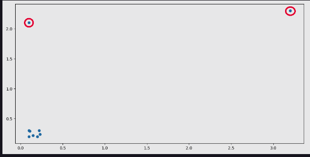

# 1. Standardizing Data

### A. Standard data format

Data can contain all sorts of different values. For example, Olympic 100m sprint times will range from 9.5 to 10.5 seconds, while calorie counts in large pepperoni pizzas can range from 1500 to 3000 calories. Even data measuring the exact same quantities can range in value (e.g. weight in kilograms vs. weight in pounds).

When data can take on any range of values, it makes it difficult to interpret. Therefore, data scientists will convert the data into a standard format to make it easier to understand. The standard format refers to data that has 0 mean and unit variance (i.e. standard deviation = 1), and the process of converting data into this format is called data standardization.

### B. NumPy and scikit-learn

```py
# predefined pizza data
# Newline to separate print statements
print('{}\n'.format(repr(pizza_data)))

from sklearn.preprocessing import scale
# Standardizing each column of pizza_data
col_standardized = scale(pizza_data)
print('{}\n'.format(repr(col_standardized)))

# Column means (rounded to nearest thousandth)
col_means = col_standardized.mean(axis=0).round(decimals=3)
print('{}\n'.format(repr(col_means)))

# Column standard deviations
col_stds = col_standardized.std(axis=0)
print('{}\n'.format(repr(col_stds)))
```

# 2. Data Range

### A. Range scaling

Apart from standardizing data, we can also scale data by compressing it into a fixed range. One of the biggest use cases for this is compressing data into the range [0, 1]. This allows us to view the data in terms of proportions, or percentages, based on the minimum and maximum values in the data.

### B. Range compression in scikit-learn

```py
# predefined data
print('{}\n'.format(repr(data)))

from sklearn.preprocessing import MinMaxScaler
default_scaler = MinMaxScaler() # the default range is [0,1]
transformed = default_scaler.fit_transform(data)
print('{}\n'.format(repr(transformed)))

custom_scaler = MinMaxScaler(feature_range=(-2, 3))
transformed = custom_scaler.fit_transform(data)
print('{}\n'.format(repr(transformed)))
```

# 3. Robust Scaling

### A. Data outliers

An important aspect of data that we have to deal with is outliers. In general terms, an outlier is a data point that is significantly further away from the other data points. For example, if we had watermelons of weights 5, 4, 6, 7, and 20 pounds, the 20 pound watermelon is an outlier.

<br>
<div align="center">
	
	<br>
	<code>A 2-D data plot with the outlier data points circled. Note that the outliers in this plot are exaggerated, and in real life outliers are not usually this far from the non-outlier data.</code>
</div>
<br>


### B. Robust scaling with scikit-learn

```py
# predefined data
print('{}\n'.format(repr(data)))

from sklearn.preprocessing import RobustScaler
robust_scaler = RobustScaler()
transformed = robust_scaler.fit_transform(data)
print('{}\n'.format(repr(transformed)))
```

# 4. Normalizing data

### L2 normalization

```py
# predefined data
print('{}\n'.format(repr(data)))

from sklearn.preprocessing import Normalizer
normalizer = Normalizer()
transformed = normalizer.fit_transform(data)
print('{}\n'.format(repr(transformed)))
```

# 5. Data Imputation

### A. Data imputation methods

```py
# predefined data
print('{}\n'.format(repr(data)))

from sklearn.impute import SimpleImputer
imp_mean = SimpleImputer()
transformed = imp_mean.fit_transform(data)
print('{}\n'.format(repr(transformed)))
```

# 6. PCA

### A. Dimensionality reduction

Most datasets contain a large number of features, some of which are redundant or not informative. For example, in a dataset of basketball statistics, the total points and points per game for a player will (most of the time) tell the same story about the player's scoring prowess.

### B. PCA in scikit-learn

```py
# predefined data
print('{}\n'.format(repr(data)))

from sklearn.decomposition import PCA
pca_obj = PCA() # The value of n_component will be 4. As m is 5 and default is always m-1
pc = pca_obj.fit_transform(data).round(3)
print('{}\n'.format(repr(pc)))

pca_obj = PCA(n_components=3)
pc = pca_obj.fit_transform(data).round(3)
print('{}\n'.format(repr(pc)))

pca_obj = PCA(n_components=2)
pc = pca_obj.fit_transform(data).round(3)
print('{}\n'.format(repr(pc)))
```

# 7. Labeled data

### A. Class labels

```py
from sklearn.datasets import load_breast_cancer
bc = load_breast_cancer()
print('{}\n'.format(repr(bc.data)))
print('Data shape: {}\n'.format(bc.data.shape))

# Class labels
print('{}\n'.format(repr(bc.target)))
print('Labels shape: {}\n'.format(bc.target.shape))

# Label names
print('{}\n'.format(list(bc.target_names)))

malignant = bc.data[bc.target == 0]
print('Malignant shape: {}\n'.format(malignant.shape))

benign = bc.data[bc.target == 1]
print('Benign shape: {}\n'.format(benign.shape))
```


