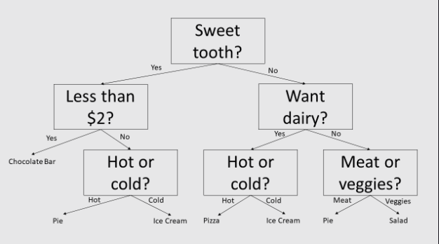

# 1. Linear Regression

### A. What is linear regression?

One of the main objectives in both machine learning and data science is finding an equation or distribution that best fits a given dataset. This is known as data modeling, where we create a model that uses the dataset's features as independent variables to predict output values for some dependent variable (with minimal error). However, it is incredibly difficult to find an optimal model for most datasets, given the amount of noise (i.e. random errors/fluctuations) in real world data.

### B. Basic linear regression

The simplest form of linear regression is called least squares regression. This strategy produces a regression model, which is a linear combination of the independent variables, that minimizes the sum of squared residuals between the model's predictions and actual values for the dependent variable.

```py
# predefined pizza data and prices
print('{}\n'.format(repr(pizza_data)))
print('{}\n'.format(repr(pizza_prices)))

from sklearn import linear_model
reg = linear_model.LinearRegression()
reg.fit(pizza_data, pizza_prices)
```

# 2. Ridge Regression

### B. Choosing the besst alpha

```py
from sklearn import linear_model
reg = linear_model.Ridge(alpha=0.1)
reg.fit(pizza_data, pizza_prices)
print('Coefficients: {}\n'.format(repr(reg.coef_)))
print('Intercept: {}\n'.format(reg.intercept_))
r2 = reg.score(pizza_data, pizza_prices)
print('R2: {}\n'.format(r2))
```

# 3. LASSO Regression

### A. Sparse regularization

LASSO regularization tends to prefer linear models with fewer parameter values. This means that it will likely zero-out some of the weight coefficients. This reduces the number of features that the model is actually dependent on (since some of the coefficients will now be 0), 

```py
# predefined dataset
print('Data shape: {}\n'.format(data.shape))
print('Labels shape: {}\n'.format(labels.shape))

from sklearn import linear_model
reg = linear_model.Lasso(alpha=0.1)
reg.fit(data, labels)
print('Coefficients: {}\n'.format(repr(reg.coef_)))
print('Intercept: {}\n'.format(reg.intercept_))
print('R2: {}\n'.format(reg.score(data, labels)))
```

# 4. Bayesian Regression

### A. Bayesian techniques

So far, we've discussed hyperparameter optimization through cross-validation. Another way to optimize the hyperparameters of a regularized regression model is with Bayesian techniques.

In Bayesian statistics, the main idea is to make certain assumptions about the probability distributions of a model's parameters before being fitted on data. These initial distribution assumptions are called priors for the model's parameters.

In a Bayesian ridge regression model, there are two hyperparameters to optimize: α and λ. The α hyperparameter serves the same exact purpose as it does for regular ridge regression; namely, it acts as a scaling factor for the penalty term.

### B. Hyperparameter priors

Both the α and λ hyperparameters have gamma distribution priors, meaning we assume both values come from a gamma probability distribution.

There's no need to know the specifics of a gamma distribution, other than the fact that it's a probability distribution defined by a shape parameter and scale parameter.

### C. Tuning the model

```py
# predefined dataset from previous chapter
print('Data shape: {}\n'.format(data.shape))
print('Labels shape: {}\n'.format(labels.shape))

from sklearn import linear_model
reg = linear_model.BayesianRidge()
reg.fit(data, labels)
print('Coefficients: {}\n'.format(repr(reg.coef_)))
print('Intercept: {}\n'.format(reg.intercept_))
print('R2: {}\n'.format(reg.score(data, labels)))
print('Alpha: {}\n'.format(reg.alpha_))
print('Lambda: {}\n'.format(reg.lambda_))
```

# 5. Logistic Regression

### A. Classification

Thus far we've learned about several linear regression models and implemented them with scikit-learn. The logistic regression model, despite its name, is actually a linear model for classification. It is called logistic regression because it performs regression on logits, which then allows us to classify the data based on model probability predictions.

```py
# predefined dataset
print('Data shape: {}\n'.format(data.shape))
# Binary labels
print('Labels:\n{}\n'.format(repr(labels)))

from sklearn import linear_model
reg = linear_model.LogisticRegression()
reg.fit(data, labels)

new_data = np.array([
  [  0.3,  0.5, -1.2,  1.4],
  [ -1.3,  1.8, -0.6, -8.2]])
print('Prediction classes: {}\n'.format(
  repr(reg.predict(new_data))))
```

### B. Solvers

The LogisticRegression object uses a solver to obtain the optimal weight settings based on the input data and labels. The five solvers and their various properties are shown in the table below (which comes from the scikit-learn official website):

```py
from sklearn import linear_model
reg = linear_model.LogisticRegression(
  solver='lbfgs', max_iter=1000)
```

### C. Cross-validated model

```py
from sklearn import linear_model
reg = linear_model.LogisticRegressionCV(
  solver='multinomial', max_iter=1000)
```

# 6. Decision Tress

Each model we've looked at so far is based on creating an optimal linear combination of dataset features for either regression or classification. However, another popular model in data science for both classification and regression is the decision tree. It is a binary tree where each node of the tree decides on a particular feature of the dataset, and we descend to the node's left or right child depending on the feature's value.

<br>
<div align="center">
	
	<br>
	<code>A decision tree for deciding what to eat. This is an example of multiclass classification.</code>
</div>
<br>

```py
from sklearn import tree
clf_tree1 = tree.DecisionTreeClassifier()
reg_tree1 = tree.DecisionTreeRegressor()
clf_tree2 = tree.DecisionTreeClassifier(
  max_depth=8)  # max depth of 8
reg_tree2 = tree.DecisionTreeRegressor(
  max_depth=5)  # max depth of 5

# predefined dataset
print('Data shape: {}\n'.format(data.shape))
# Binary labels
print('Labels:\n{}\n'.format(repr(labels)))
clf_tree1.fit(data, labels)
```

### B. Choosing features 

Since a decision tree makes decisions based on feature values, the question now becomes how we choose the features to decide on at each node. In general terms, we want to choose the feature value that "best" splits the remaining dataset at each node.

How we define "best" depends on the decision tree algorithm that's used. Since scikit-learn uses the CART algorithm, we use Gini Impurity, MSE (mean squared error), and MAE (mean absolute error) to decide on the best feature at each node.

Specifically, for classification trees we choose the feature at each node that minimizes the remaining dataset observations' Gini Impurity. For regression trees we choose the feature at each node that minimizes the remaining dataset observations' MSE or MAE, depending on which you choose to use (the default for DecisionTreeRegressor is MSE).

# 7. Training and Testing

### A. Training and testing sets

The training set is used for fitting the model on data (i.e. training the model), while the testing set is used for evaluating the model. Therefore, the training set is much larger than the testing set. Exactly how much larger depends on the application and requirements.

Increasing the size of the training set will give more data for the model to be fitted on, which can increase the model's performance. However, because this decreases the size of the testing set, there's a higher chance that the testing set may not be representative of the original dataset (which can lead to inaccurate evaluation).

In general, the testing set is around 10-30% of the original dataset, while the training set makes up the remaining 70-90%.

### B. Splitting the dataset

```py
data = np.array([
  [10.2 ,  0.5 ],
  [ 8.7 ,  0.9 ],
  [ 9.3 ,  0.8 ],
  [10.1 ,  0.4 ],
  [ 9.5 ,  0.77],
  [ 9.1 ,  0.68],
  [ 7.7 ,  0.9 ],
  [ 8.3 ,  0.8 ]])
labels = np.array(
  [1.4, 1.2, 1.6, 1.5, 1.6, 1.3, 1.1, 1.2])

from sklearn.model_selection import train_test_split
split_dataset = train_test_split(data, labels)
train_data = split_dataset[0]
test_data = split_dataset[1]
train_labels = split_dataset[2]
test_labels = split_dataset[3]

print('{}\n'.format(repr(train_data)))
print('{}\n'.format(repr(train_labels)))
print('{}\n'.format(repr(test_data)))
print('{}\n'.format(repr(test_labels)))
```

# 8. Cross-Validation

### A. Additional evaluation datasets

Sometimes, it's not enough to just have a single testing set for model evaluation. Having additional sets of data for evaluation gives us a more accurate measurement of how good the model is for the original dataset.

If the original dataset is big enough, we can actually split it into three subsets: training, testing, and validation. The validation set is about the same size as the testing set, and it is used for evaluating the model after training. The testing set is then used for final evaluation once the model is done training and tuning.

### B. Scored cross-validation

In scikit-learn, we can easily implement K-Fold cross-validation with the cross_val_score function (also part of the model_selection module). The function returns an array containing the evaluation score for each round.

```py
from sklearn import linear_model
from sklearn.model_selection import cross_val_score
# We can skip max_iter argument here, but it will produce a
# ConvergenceWarning. Therefore we explicity give a bigger value to
# avoid the warning.
clf = linear_model.LogisticRegression(max_iter=3000)
# Predefined data and labels
cv_score = cross_val_score(clf, data, labels, cv=3)  # k = 3

print('{}\n'.format(repr(cv_score)))
```

# 9. Applying CV to Decision Tress

### A. Decision tree depth

We've previously discussed cross-validation for tuning hyperparameters such as the α value for regularized regression. For decision trees, we can tune the tree's maximum depth hyperparameter (max_depth) by using K-Fold cross-validation.

K-Fold cross-validation gives an accurate measurement of how good the decision tree is for the dataset. We can use K-Fold cross-validation with different values of the max_depth hyperparameter and see which one gives the best cross-validation scores.

```py
is_clf = True  # for classification
for depth in range(3, 8):
  # Predefined data and labels
  scores = cv_decision_tree(
    is_clf, data, labels, depth, 5)  # k = 5
  mean = scores.mean()  # Mean acc across folds
  std_2 = 2 * scores.std()  # 2 std devs
  print('95% C.I. for depth {}: {} +/- {:.2f}\n'.format(
    depth, mean, std_2))
```

# 10. Evaluating Models

### A. Making predictions

```py
reg = tree.DecisionTreeRegressor()
# predefined train and test sets
reg.fit(train_data, train_labels)
predictions = reg.predict(test_data)
```

### B. Evaluation metrics

For classification models, we use the classification accuracy on the test set as the evaluation metric. For regression models, we normally use either the R2 value, mean squared error, or mean absolute error on the test set. The most commonly used regression metric is mean absolute error, since it represents the natural definition of error. We use mean squared error when we want to penalize really bad predictions, since the error is squared. We use the R2 value when we want to evaluate the fit of the regression model on the data.

```py
reg = tree.DecisionTreeRegressor()
# predefined train and test sets
reg.fit(train_data, train_labels)
predictions = reg.predict(test_data)

from sklearn import metrics
r2 = metrics.r2_score(test_labels, predictions)
print('R2: {}\n'.format(r2))
mse = metrics.mean_squared_error(
  test_labels, predictions)
print('MSE: {}\n'.format(mse))
mae = metrics.mean_absolute_error(
  test_labels, predictions)
print('MAE: {}\n'.format(mae))
```

# 11. Exhaustive Tuning

### A. Grid-search cross-validation

If our application requires us to absolutely obtain the best hyperparameters of a model, and if the dataset is small enough, we can apply an exhaustive grid search for tuning hyperparameters. For the grid search cross-validation, we specify possible values for each hyperparameter, and then the search will go through each possible combination of the hyperparameters and return the model with the best combination.

```py
reg = linear_model.BayesianRidge()
params = {
  'alpha_1':[0.1,0.2,0.3],
  'alpha_2':[0.1,0.2,0.3]
}
reg_cv = GridSearchCV(reg, params, cv=5)
# predefined train and test sets
reg_cv.fit(train_data, train_labels)
print(reg_cv.best_params_)
```


