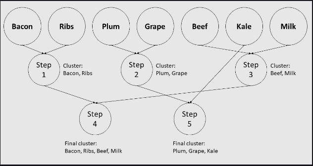

# 1. Cosine Similarity

### A. What defines similarity?

To find similarities between data observations, we first need to understand how to actually measure similarity. The most common measurement of similarity is the cosine similarity metric.

A data observation with numeric features is essentially just a vector of real numbers. Cosine similarity is used in mathematics as a similarity metric for real-valued vectors, so it makes sense to use it as a similarity metric for data observations. The cosine similarity for two data observations is a number between -1 and 1. It specifically measures the proportional similarity of the feature values between the two data observations (i.e. the ratio between feature columns).

### B. Calculating cosine similarity

In scikit-learn, cosine similarity is implemented via the cosine_similarity function (which is part of the metrics.pairwise module). It calculates the cosine similarities for pairs of data observations in a single dataset, or pairs of data observations between two datasets.

```py
from sklearn.metrics.pairwise import cosine_similarity
data = np.array([
  [ 1.1,  0.3],
  [ 2.1,  0.6],
  [-1.1, -0.4],
  [ 0. , -3.2]])
cos_sims = cosine_similarity(data)
print('{}\n'.format(repr(cos_sims)))
```

# 2. Nearest Neighbors

### A. Finding the nearest neighbors

```py
data = np.array([
  [5.1, 3.5, 1.4, 0.2],
  [4.9, 3. , 1.4, 0.2],
  [4.7, 3.2, 1.3, 0.2],
  [4.6, 3.1, 1.5, 0.2],
  [5. , 3.6, 1.4, 0.2],
  [5.4, 3.9, 1.7, 0.4],
  [4.6, 3.4, 1.4, 0.3],
  [5. , 3.4, 1.5, 0.2],
  [4.4, 2.9, 1.4, 0.2],
  [4.9, 3.1, 1.5, 0.1]])

from sklearn.neighbors import NearestNeighbors
nbrs = NearestNeighbors()
nbrs.fit(data)
new_obs = np.array([[5. , 3.5, 1.6, 0.3]])
dists, knbrs = nbrs.kneighbors(new_obs)

# nearest neighbors indexes
print('{}\n'.format(repr(knbrs)))
# nearest neighbor distances
print('{}\n'.format(repr(dists)))

only_nbrs = nbrs.kneighbors(new_obs,
                            return_distance=False)
print('{}\n'.format(repr(only_nbrs)))
```

# 3. K-Means Clustering

### A. K-means algorithm

The most well-known clustering method is K-means clustering. The K-means clustering algorithm will separate the data into K clusters (the number of clusters is chosen by the user) using cluster means, also known as centroids.

These centroids represent the "centers" of each cluster. Specifically, a cluster's centroid is equal to the average of all the data observations within the cluster.

```py
cluster = np.array([
  [ 1.2, 0.6],
  [ 2.4, 0.8],
  [-1.6, 1.4],
  [ 0. , 1.2]])
print('Cluster:\n{}\n'.format(repr(cluster)))

centroid = cluster.mean(axis=0)
print('Centroid:\n{}\n'.format(repr(centroid)))
```

### B. Mini-batch clustering

```py
from sklearn.cluster import MiniBatchKMeans
kmeans = MiniBatchKMeans(n_clusters=3, batch_size=10)
# predefined data
kmeans.fit(data)

# cluster assignments
print('{}\n'.format(repr(kmeans.labels_)))

# centroids
print('{}\n'.format(repr(kmeans.cluster_centers_)))

new_obs = np.array([
  [5.1, 3.2, 1.7, 1.9],
  [6.9, 3.2, 5.3, 2.2]])
# predict clusters
print('{}\n'.format(repr(kmeans.predict(new_obs))))
```

# 4. Hierarchical Clustering

### A. K-means vs. hierarchical clustering

A major assumption that the K-means clustering algorithm makes is that the dataset consists of spherical (i.e. circular) clusters. With this assumption, the K-means algorithm will create clusters of data observations that are circular around the centroids. However, real life data often does not contain spherical clusters, meaning that K-means clustering might end up producing inaccurate clusters due to its assumption.

<br>
<div align="center">
	
	<br>		
	<code>Agglomerative clustering for seven different food items into two final clusters. Each step the two most similar clusters are merged.</code>
</div>
<br>

### B. Agglomerative clustering

```py
from sklearn.cluster import AgglomerativeClustering
agg = AgglomerativeClustering(n_clusters=3)
# predefined data
agg.fit(data)

# cluster assignments
print('{}\n'.format(repr(agg.labels_)))
```

# 5. Mean Shift Clustering

### A. Choosing the number of clusters

One such algorithm is the mean shift clustering algorithm. Like the K-means clustering algorithm, the mean shift algorithm is based on finding cluster centroids. Since we don't provide the number of clusters, the algorithm will look for "blobs" in the data that can be potential candidates for clusters.

```py
from sklearn.cluster import MeanShift
mean_shift = MeanShift()
# predefined data
mean_shift.fit(data)

# cluster assignments
print('{}\n'.format(repr(mean_shift.labels_)))

# centroids
print('{}\n'.format(repr(mean_shift.cluster_centers_)))

new_obs = np.array([
  [5.1, 3.2, 1.7, 1.9],
  [6.9, 3.2, 5.3, 2.2]])
# predict clusters
print('{}\n'.format(repr(mean_shift.predict(new_obs))))
```

# 6. DBSCAN

### A. Clustering by denisty

The mean shift clustering algorithm in the previous chapter usually performs sufficiently well and can choose a reasonable number of clusters. However, it is not very scalable due to computation time and still makes the assumption that clusters have a "blob"-like shape (although this assumption is not as strong as the one made by K-means).

Another clustering algorithm that also automatically chooses the number of clusters is DBSCAN. DBSCAN clusters data by finding dense regions in the dataset. Regions in the dataset with many closely packed data observations are considered high-density regions, while regions with sparse data are considered low-density regions.

The DBSCAN algorithm treats high-density regions as clusters in the dataset, and low-density regions as the area between clusters (so observations in the low-density regions are treated as noise and not placed in a cluster).

High-density regions are defined by core samples, which are just data observations with many neighbors. Each cluster consists of several core samples and all the observations that are neighbors to a core sample.

Unlike the mean shift algorithm, the DBSCAN algorithm is both highly scalable and makes no assumptions about the underlying shape of clusters in the dataset.

### Neighbors and core sampless

```py
from sklearn.cluster import DBSCAN
dbscan = DBSCAN(eps=1.2, min_samples=30)
# predefined data
dbscan.fit(data)

# cluster assignments
print('{}\n'.format(repr(dbscan.labels_)))

# core samples
print('{}\n'.format(repr(dbscan.core_sample_indices_)))
num_core_samples = len(dbscan.core_sample_indices_)
print('Num core samples: {}\n'.format(num_core_samples))
```

# 7. Evaluating Clusters

### A. Evaluation metrics

The ARI value ranges from -1 to 1, inclusive. Negative scores represent bad labelings, random labelings will get a score near 0, and perfect labelings get a score of 1.

In scikit-learn, ARI is implemented through the adjusted_rand_score function (part of the metrics module). It takes in two required arguments, the true cluster labels and the predicted cluster labels, and returns the ARI score.

```py
from sklearn.metrics import adjusted_rand_score
true_labels = np.array([0, 0, 0, 1, 1, 1])
pred_labels = np.array([0, 0, 1, 1, 2, 2])

ari = adjusted_rand_score(true_labels, pred_labels)
print('{}\n'.format(ari))

# symmetric
ari = adjusted_rand_score(pred_labels, true_labels)
print('{}\n'.format(ari))

# Perfect labeling
perf_labels = np.array([0, 0, 0, 1, 1, 1])
ari = adjusted_rand_score(true_labels, perf_labels)
print('{}\n'.format(ari))

# Perfect labeling, permuted
permuted_labels = np.array([1, 1, 1, 0, 0, 0])
ari = adjusted_rand_score(true_labels, permuted_labels)
print('{}\n'.format(ari))

renamed_labels = np.array([1, 1, 1, 3, 3, 3])
# Renamed labels to 1, 3
ari = adjusted_rand_score(true_labels, renamed_labels)
print('{}\n'.format(ari))

true_labels2 = np.array([0, 1, 2, 0, 3, 4, 5, 1])
# Bad labeling
pred_labels2 = np.array([1, 1, 0, 0, 2, 2, 2, 2])
ari = adjusted_rand_score(true_labels2, pred_labels2)
print('{}\n'.format(ari))
```

# 8. Feature Clustering

### A. Agglomerative feature clustering

In the Data Preprocessing section, we used PCA to perform feature dimensionality reduction on datasets. We can also perform feature dimensionality reduction using agglomerative clustering. By merging common features into clusters, we reduce the number of total features while still maintaining most of the original information from the dataset.

```py
# predefined data
print('Original shape: {}\n'.format(data.shape))
print('First 10:\n{}\n'.format(repr(data[:10])))

from sklearn.cluster import FeatureAgglomeration
agg = FeatureAgglomeration(n_clusters=2)
new_data = agg.fit_transform(data)
print('New shape: {}\n'.format(new_data.shape))
print('First 10:\n{}\n'.format(repr(new_data[:10])))
```


