<br>
<div align="center">
  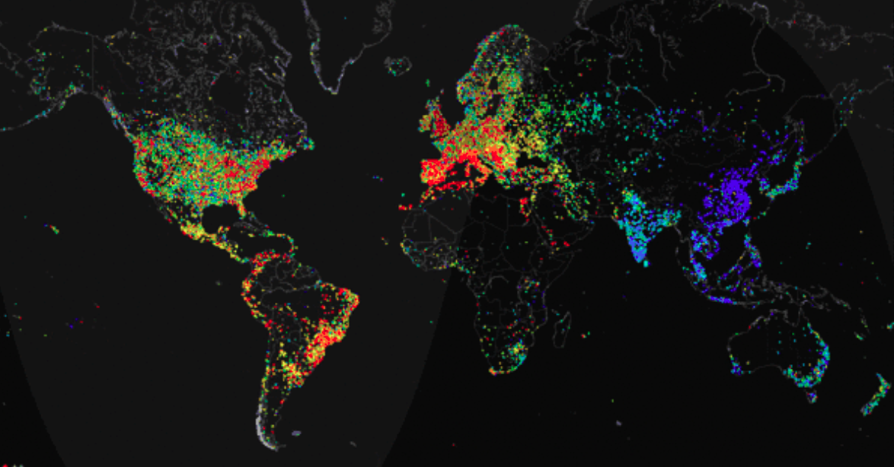
  <br>
  <code>A heat map of the usage of the internet over a 24-hour period</code>
</div>
<br>

### Communication Over the Internet

#### TCP

The <b>Transmission Control Protocol (TCP)</b> is one such protocol. It was created to allow end systems to communicate effectively. The distinguishing feature of TCP is that it ensures that data reaches the intended destination and is not corrupted along the way.

#### UDP

The <b>User Datagram Protocol (UDP)</b> is also one such key protocol. However, <b>it does not ensure</b> that data reaches the destination and that it remains incorrupt.

#### HTTP

<b>HyperText Transfer Protocol (HTTP)</b> is a web protocol that defines the format of messages to be exchanged between web clients, e.g., web browsers and web servers and what action is to be taken in response to the message. The World Wide Web uses this as its underlying protocol.


#### IP Addresses

Every device that is connected to the Internet has an address called an ‘IP Address’ which is much like a mailing address.

* IP addresses are 32 bit numbers (in IP version 4).

* The human readable way for looking at these numbers is the dotted decimal notation, whereby the number is considered one octet of bits (8 bits) at a time. Those octets are read out in decimals, then separated by dots.

	* Hence, each number can be from 0 to 255. For example, 1.2.3.4

* Some IP addresses are reserved for specific functions. We’ll discuss them in more depth in later lessons.

#### Ports

Any host connected to the Internet could be running many network applications. In order to distinguish these applications, all bound to the same IP address, from one another, another form of addressing, known as port numbers, is used. Each endpoint in a communication session is identified with a unique IP address and port combination. This combination is also known as a socket. So in essence, ports help to address the packet to specific applications on hosts.

* IP addresses identify end systems but ports identify an application on the end system.

* Every application has a 16-bit port number. So the port number could range from 0 to 2^{16}=65535

* The ports 0-1023 are reserved for specific applications and are called [well-known ports](https://en.wikipedia.org/wiki/List_of_TCP_and_UDP_port_numbers#Well-known_ports).

   * For instance, port 80 is reserved for HTTP traffic.

* The ports 1024-49152 are known as registered ports and they are used by specific, potentially proprietary, applications that are known but not system defined.

	* SQL server for example, uses port 1433

	* It is generally considered best practice not to use these ports for any user defined applications although there is no technical restriction on using them.

* The ports 49152–65535 can be used by user applications or for other purposes (dynamic port allocation for instance, but more on that later).

### Access Networks

<br>
<div align="center">
  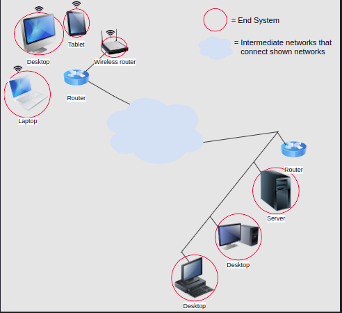
  <br>
  <code>The end systems out of them -- they reside on the "edge of the network"</code>
</div>
<br>

<br>
<div align="center">
  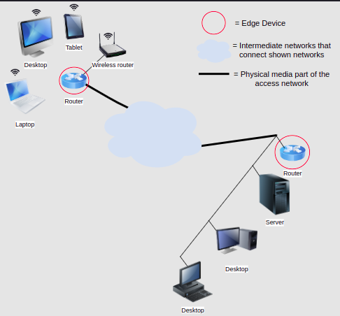
  <br>
  <code>Access Network</code>
</div>
<br>

# 1. Types of Computer Networks

## 1.1 Types by Physical Medium: Guided Physical Media

### Communication Media

Data needs to be transmitted from one end system to another over a medium. There are two kinds of media: guided and unguided. Each has its own advantages and disadvantages.

### Twisted Pair Copper Wire

This kind of wire is used in DSL and Dial-Up. It consists of pairs of copper wires that are twisted together to reduce electrical interference. Each wire is about a milimeter thick and is one communication link. Generally, several pairs are bundled together in a protective plastic or rubber wrapping.

### Coaxial Cable

Cable Internet runs on coaxial cables. A coaxial cable consists of one copper wire surrounded by an insulating material, followed by a mesh-like cylindrical metallic shield, followed by another insulating cover.

### Fiber Optics

Fiber optic cables carry light instead of electrical signals.

Metallic media suffer from electrical noise and interference from nearby electrical sources such as mains wiring. Since optical fiber carries signals in the form of light, it is not susceptible to the abundant electrical noise and interference.

#### Multimode

* Multimode uses LED to send signals.
* Therefore it’s, significantly cheaper than counterpart.
* It can work over several tens of kilometers.
* Multiple light signals travel through the same optic fiber while reflecting off the edges of the fiber at different angles.

#### Monomode

* Monomode uses laser for transmission.
* It’s more expensive than multimode.
* Monomode fibers can only work over a few kilometers.

[The Internet Is Under the Sea, Not in the Clouds!](https://www.youtube.com/watch?v=Ve810FHZ1CQ)

## 1.2 Types by Physical Medium: Unguided Physical Media

Means of transmission that are not bound by a confined pathway are called unguided media, such as radio waves. Let’s discuss them in more detail.

### Terrestrial Radio Channels

Radio waves encompass a certain band of the electromagnetic spectrum. They provide many advantages, such as not needing to be physically wired through a building, the ability to cross physical barriers like walls and other objects, and allowing for end systems to be mobile. However, they also have some disadvantages: they’re considered to be less secure since interception is relatively easy.

There are 3 kinds of terrestrial radio channels:

1. The kind that operate over very short distances 1-2 meters (Bluetooth)

2. The kind that operate over a few 10s to a few hundreds of meters (WiFi)

3. Those that operate over a range of kilometers (3G, 4G, and LTE)


### Third-Generation Wireless (3G)

Third-generation wireless, or 3G, allows wireless–wide area Internet access that utilizes existing telephone networks. It can provide speeds of in order of 1 Mbps.

### Long-Term Evolution (LTE)

Long-Term Evolution or LTE is rooted in 3G technology, but is faster and can achieve transmission rates of 10s of Mbps. Don’t let the name confuse you, it is not technologically very different from 3G.

## 1.3 Types by Geographical Distance

### Local Area Networks (LANs)

A Local Area Network, or a LAN, is a computer network in a small area like a home, office, or school.

### Ethernet

Most LANs consist of end hosts connected using Ethernet network adapters to Ethernet switches. Every Ethernet switch has a limited number of ports, and therefore can interconnect a limited number of end hosts. Larger networks within a building are built using multiple Ethernet switches interconnecting different sets of end hosts. These switches may then be connected to each other and the Internet

### WiFi

Increasingly, however, wireless Internet access has become very common. In Wireless LANs or WLANs, a wireless router interconnects different “subnets” and/or may have connectivity to the Internet, which it can extend to the hosts connected to it.

### Metropolitan Area Network (MAN)

A metropolitan area network (MAN) is a computer network that spans the geographical distance of a metropolitan area, such as a city. A MAN may also refer to a set of interconnected LANs via point-to-point links, for example, on a university network. Recently, wireless MANs have become increasingly common.

### Wide Area Networks (WAN)

Wide Area Networks or WANs refer to networks that allow interconnection across large distances. They may span over cities or even countries.

> Note The Internet itself is a whole lot of LANs, interconnected by means of MANs and WANs.

### SONET/SDH

<b>Synchronous optical networking (SONET)</b> and the international equivalent, <b>Synchronous Digital Hierarchy (SDH)</b> carries data as optical signals over optical fiber, which means that they can cover large distances. These technologies are incredibly prevalent today.

### Frame Relay

A frame relay was a popular way to connect your LAN to the Internet or to provide an interconnection between LANs at two or more company sites.

## 1.4 Types by Topology

### Bus

Every and system will recieve any signal that is sent on the main or <b>backbone</b> medium. The medium cna be guided or unguided

#### Limitations

* A break in the cable will disrupt the entire network

* Only one system can transmit at a time.

### Ring

In this topology, end systems communicate with each other through each other. So the message travels along the ring passing each system until the target system itself is reached. Theoretically, n/2 systems can be transmitting to their adjacent neighbor at the same time.

#### Limitations

* The basic ring topology is unidirectional so n - 1 end systems would have to transfer messages for end system #1 to talk to end system #n

* A break in the cable will disrupt the entire network.

### Star

All end systems talk to each other through one central device such as a router or switch. Routers and switches are discussed in-depth in the data link layer chapter!

#### Limitations

* Hosts can all be transmitting at the same time. However, if the central device fails, the network is completely down.

### Tree

This topology is also known as the star-bus topology. It essentially consists of a bunch of star networks connected together with a large bus.

### Mesh

In this topology, every end system is directly connected to every other end system.

#### Limitations

The mesh topology (if physically realized as a mesh):

* Is expensive
* Hard to scale
* Used in specialized applications only


# 2. Network Infrastructure: The OSI Model

## 2.1 Layered Architctures & Protocol Stacks

When building a large complex system, it helps to approach the problem at gradually increasing levels of abstraction. Thus, systems can be composed of layers, each performing a specific set of tasks.

<br>
<div align="center">
  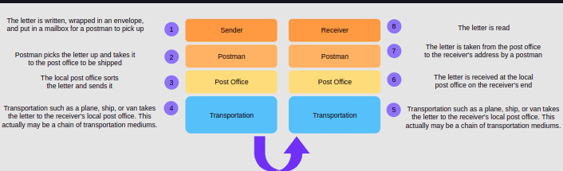
  <br>
  <code>Posting a letter</code>
</div>
<br>

## 2.2 The Open Systems Interconnection (OSI) Model

### Common Models

There are several models along which computer networks are organized. The two most common ones are the Open Systems Interconnection (OSI) model and the Transmission Control Protocol/Internet Protocol (TCP/IP) model.

### The OSI Model

The OSI Model was developed in the '70s by the Organization for Standardization (ISO). At this time, the Internet was in its infancy and its protocols had not fully matured. The OSI model provides a standard for different computer systems to be able to communicate with each other.

### The Layers of the OSI Model#

The model splits up a communication system into 7 abstract layers, stacked upon each other.

<br>
<div align="center">
  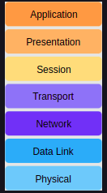
  <br>
  <code>The OSI Network Stack</code>
</div>
<br>

### Mnemonic

A good mnemonic device to help remember these layers is:

<br>
<div align="center">
  <b>Please Do Not Throw Sausage Pizza Away</b>
  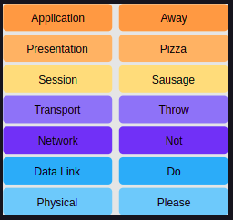
  <br>
  <code>Mnemonic to Memorize the Layers of The Network Stack</code>
</div>
<br>

#### Application Layer

* These applications or protocols are almost always implemented in software.

* End-users interact with the application layer.

* The application layer is where most end-user applications such as web browsing and email live.

* The application layer is where an outgoing message starts its journey so it provides data for the layer below.

#### Presentation Layer

* <code>Presents data</code> in a way that can be easily understood and displayed by the application layer.

      * <code>Encoding</code> is an example of such presentation. The underlying layers might use a different character encoding compared to the one used by the application layer. The presentation layer is responsible for the translation.

* <code>Encryption</code> (changing the data so that it is only readable by the parties it was intended for) is also usually done at this layer.

* <code>Abstracts:</code> the presentation layer assumes that a user session is being maintained by the lower layers and transforms content presentation to suit the application.

* <code>End-to-end Compression</code>: The presentation layer might also implement end to end compression to reduce the traffic in the network.

#### Session Layer

* The session layer’s responsibility is to take the services of the transport layer and build a service on top of it that manages user sessions.

    * As we will see shortly, the transport layer is responsible for transporting session layer messages across the network to the destination. The session layer must manage the mapping of messages delivered by the transport layer to the sessions.

* A session is an exchange of information between local applications and remote services on other end systems.

    * For example, one session spans a customer’s interaction with an e-commerce site whereby they search, browse and select products, then make the payment and logout.


* Abstracts: the session layer assumes that connections establishment and packet transportation is handled by the layers below it.

#### Transport Layer

* The transport layer also has protocols implemented largely in software.

* Since the application, presentation and session layers may be handing off large chunks of data, the transport layer segments it into smaller chunks.

  * These chunks are called datagrams or segments depending on the protocol used.

* Furthermore, sometimes some additional information is required to transmit the segment/datagram reliably. The transport layer adds this information to the segment/datagram.

#### Network layer

* Network layer messages are termed as <b>packets</b>.

* They facilitate the transportation of packets from one end system to another and help to determine the best routes that messages should take from one end system to another.

* <b>Routing protocols</b> are applications that run on the network layer and exchange messages with each other to develop information that helps them route transport layer messages.

* <b>Load Balancing</b> There are many links (copper wire, optical fiber, wireless) in a given network and one objective of the network layer is to keep them all roughly equally utilized. Otherwise, if some links are under-utilized, there will be concerns about the economic sense of deploying and managing them.

#### Data Link Layer

* Allows directly connected hosts to communicate. Sometimes these hosts are the only two things on a physical medium. In that case, the challenges that this layer addresses include flow control and error detection/correction.

* <b>Encapsulates packets</b> for transmission across a single link.

* Resolves transmission conflicts i.e., when two end systems send a message at the same time across one singular link.

* Handles addressing If the data link is a broadcast medium, addressing is another data link layer problem,

* Multiplexing & Demultiplexing:

    * Multiple data links can be multiplexed into something that appears like one, to integrate their bandwidths.

    * Likewise, sometimes we disaggregate a single data link into virtual data links which appear like separate network interfaces.

#### Physical Layer

* Consists largely of hardware.

* Provides a solid electrical and mechanical medium to transmit the data.

* Transmits bits. Not logical packets, datagrams, or segments.

* Also has to deal with mechanical specifications about the makeup of the cables and the design of the connectors.

<br>
<div align="center">
  <b>Please Do Not Throw Sausage Pizza Away</b>
  <br>
  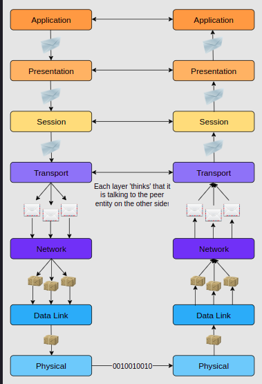
  <br>
  <code>How data conceptually travels through the layers</code>
</div>
<br>

## 2.3 The TCP/IP Model

* The TCP/IP Model, also known as the Internet protocol suite, was developed in 1989.

* Its development was funded by DARPA (Advanced Research Projects Agency (ARPA) was renamed to the Defense Advanced Research Projects Agency (DARPA)!)

* Its technical specifications are detailed in RFC 1122.

* This model is primarily based upon the most protocols of the Internet, namely the Internet Protocol (IP) and the Transmission Control Protocol (TCP).

* The protocols in each layer are clearly defined, unlike in the OSI model. In this course, we’ll largely adhere to the TCP/IP model and take a protocol-oriented approach.

<b>The TCP/IP model splits up a communication system into 5 abstract layers, stacked upon each other. Each layer performs a particular service and communicates with the layers above and below itself.</b>

<br>
<div align="center">
  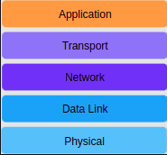
  <br>
  <code>The Network Stack</code>
</div>
<br>

| TCP/IP | OSI |
| :------------- | :------------- |
| Is used practically |The OSI model is conceptual and is not practically used for communication. |
|  Consists of five layers | Consists of seven layers |

### Differences in Layer Functionality

<br>
<div align="center">
  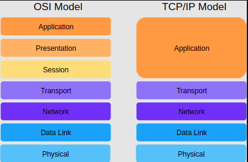
  <br>
</div>
<br>


# 3. The Application Layer

### Application Layer Protocols

Most would argue that user applications are the true purpose of the Internet. If useful applications did not exist, the Internet would not be what it is today.

* The development of the Internet in the last century started with text-based network apps such as e-mail.

* Then came the app: the World Wide Web which revolutionized everything.

* Instant messaging came at the end of the millennium, which has changed the way we communicate.

* Since then, we have come up with voice over IP, (WhatsApp calls), video chat (Skype), and video streaming (YouTube).

* Social media has also taken the world by storm resulting in complex human social networks and businesses building on top of these websites.

## 3.1 Network Application Architectures

In this architecture, a network application consists of two parts: client-side software and server-side software. These pieces of software are generally called processes, and they communicate with each other through messages.

### Servers

The server process controls access to a centralized resource or service such as a website.

Servers have two important characteristics:

1. Generally, an attempt is made to keep servers online all the time, although 100% availability is impossible to achieve. Furthermore, servers set up as a hobby or as an experiment may not need to be kept online. Nevertheless, the client must be able to find the server online when needed, otherwise, communication wouldn’t take place.

2. They have at least one reliable IP address with which they can be reached.

### Clients

Client processes use the Internet to consume content and use the services. Client processes almost always initiate connections to servers, while server processes wait for requests from clients.

<br>
<div align="center">
  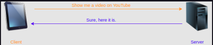
  <br>
  <code>Clients obtain content (such as videos) and/or services (such as an online calculator) from servers.</code>
</div>
<br>

### Peer-to-Peer Architecture (P2P)

In this architecture, applications on end-systems called ‘peers’ communicate with each other. No dedicated server or large data center is involved. Peers mostly reside on PCs like laptops and desktops in homes, offices, and universities.

<br>
<div align="center">
  
  <br>
  <code>Peers communicate with each other without a dedicated server</code>
</div>
<br>

## 3.2 How Processes Communicate

### Program vs. Process vs. Thread

* A program is simply an executable file. An application such as MS Word is one example.
* A process is any currently running instance of a program. So one program can have several copies of it running at once. One MS Word program can have multiple open windows.
* A thread is a lightweight process. One process can have multiple running threads. The difference between threads and processes is that threads do lightweight singular jobs.

Here’s the MS Word example illustrated:

<br>
<div align="center">
  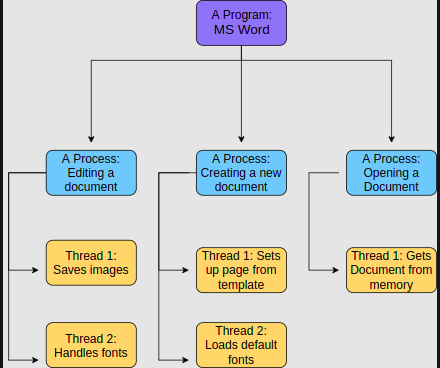
  <br>
  <code>Examples of programs, processes, and threads</code>
</div>
<br>

## 3.3 HTTP


<br>
<div align="center">
  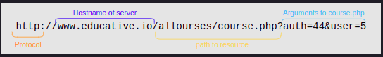
  <br>
</div>
<br>

There are two types of HTTP messages as discussed previously:

* HTTP request messages
* HTTP response messages

### HTTP Request Messages

```
GET /path/to/file/index.html HTTP/1.1
Host: www.educative.io
Connection: close
User-agent: Mozilla/5.0
Accept-language: fr
Accept: text/html
```

<br>
<div align="center">
  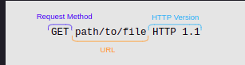
  <br>
</div>
<br>


#### The Anatomy of HTTP Header Lines

* The first header line specifies the <code>Host</code> that the request is for.

The second one defines the type of HTTP <code>Connection</code>. It’s Non-persistent in the case of the following drawing as the connection is specified to be closed.

The <code>user-agent</code> line specifies the client. This is useful when the server has different web pages that exist for different devices and browsers.

The <code>Accept-language</code> header specifies the language that is preferred. The server checks if a web page in that language exists and sends it if it does, otherwise the server sends the default page.

The <code>Accept</code> header defines the sort of response to accept. It can be anything like HTML files, images, and audio/video.

### HTTP: Response Messages

```
HTTP/1.1 200 OK
Connection: close
Date: Tue, 18 Aug 2015 15: 44 : 04 GMT
Server: Apache/2.2.3 (CentOS)
Last-Modified: Tue, 18 Aug 2015 15:11:03 GMT
Content-Length: 6821
Content-Type: text/html

[The object that was requested]
```
#### Header Lines

* <b>Connection type</b>. In this case, indicates that the server will close the TCP connection after it sends the response.

* <b>Date.</b> The date at which the response was generated.

* <b>Server.</b> Gives server software specification of the server that generated the message. Apache in this case.

* <b>Last-Modified.</b> The date on which the object being sent was last modified.

* <b>Content-Length.</b> The length of the object being sent in 8-bit bytes.

* <b>Content-Type.</b> The type of content. The type of the file is not determined by the file extension of the object, but by this header.

## 3.4 Cookies

You might have heard of the term ‘cookie’ used a lot in the context of computer networks and privacy. Let’s have a closer look at what they are.  HTTP is a stateless protocol, but we often see websites where session state is needed. For instance, imagine you are browsing for products on an e-commerce website. How does the server know if you are logged in or not, or if the protocol is stateless? How does the server know what’s in your shopping cart when checking out if the protocol is stateless? Cookies allow the server to keep track of this sort of information.

### How Cookies Work

* Cookies are <b>unique string identifiers</b> that can be stored on the client’s browser.

* These identifiers are <b>set by the server through HTTP headers</b> when the client first navigates to the website.

* After the cookie is set, it’s sent along with subsequent HTTP requests to the same server. This allows the server to know who is contacting it and hence serve content accordingly.

### <code>Set-cookie</code> Header

<br>
  <div align="center">
	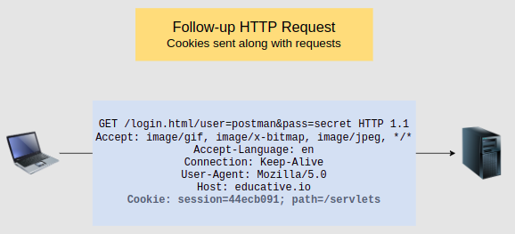
  </div>
<br>

## 3.5 Email: SMTP

There are many protocols associated with email. One popular choice is a combination of <b>POP3</b> and <b>SMTP</b>. One is used to send emails that are stored in a user’s inbox and the other is used to retrieve emails sent to you. However, the very core of electronic mail is the <b>Simple Mail Transfer Protocol (SMTP)</b>.

SMTP uses TCP, which means that transfers are reliable. The connection is established at <b>port 25</b>.

> 📝 Note A good mnemonic to remember what SMTP does is Sending Mail To People.


<br>
<div align="center">
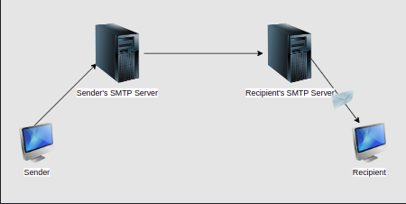
</div>
<br>

## 3.6 DNS: Introduction

* Addresses or locations that specify where something is.

    * Just like with a physical address, we still may need a map to get to the address. On the Internet, the addresses are typically IP addresses, and routers know the map.


* Names. In particular, domain names, or the unique name that identifies a websites, are mapped into IP addresses based on lookup service that uses a database. The most well-known lookup service is the <b>Domain Name System (DNS)</b>. So when you enter the URL ‘educative.io’ into your browser, it uses DNS to find the actual IP address of the server that hosts it.

* Content-based addressing.
  * The content itself is used to look up its location.

### Distributed Hierarchical Database

One single database on one single server does not scale for reasons such as:

* Single point of failure. If the server that has the database crashes, DNS would stop working entirely, which is too risky.

* Massive amounts of traffic. Everyone would be querying that one server. It will not be able to handle that amount of load.

* Maintenance. Maintaining the server would become critical to the operation of DNS.
Location. Where would the server be located?

<br>
  <div align="center">
	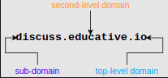
  </div>
<br>

### DNS Namespaces

The parts of the URL above roughly map to DNS servers. These servers manage the abstract space of domains. The servers all exist in a hierarchy. Have a look at the following diagram.

<br>
<div align="center">

<br>
<code>A fraction of the hierarchy of DNS servers</code>
</div>
<br>

### Top-Level Servers

Servers in the top-level domain hold mappings to DNS servers for certain domains. Each domain is meant to be used by specific organizations only. Here are some common domains:

* <code>com</code>: This TLD was initially meant for commercial organizations only - but it has now been opened for general use.

* <code>edu</code>: Used by educational institutions.
    *
* <code>gov</code>: Only used by the U.S. government.

    * Example: nasa.gov

* <code>mil</code>: Used by U.S. military organizations.

    * Example: army.mil

* <code>net</code>: It was initially intended for use by organizations working in network technology such as ISPs, but it is now a general purpose domain like com.

* <code>org</code>: This domain was intended for non-profit organizations but has been opened for general use now.

* pk, uk, us,…: Country suffixes. 244 two-letter ones exist.

* Some new and uncommon suffixes include: name, mobi, biz, pro.

* International domains: 中國

### DNS: Records and Messages

There are a few kinds of DNS messages, out of which the most common are query and reply, and both have the same format. Study the following slides for a detailed overview of a DNS message.

<br>
<div align="center">
  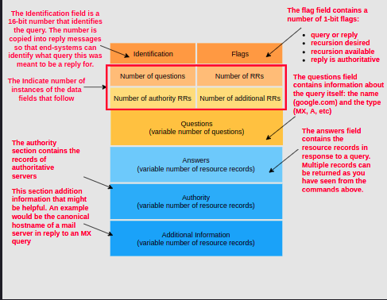
<br>
</div>
<br>

## 3.7 BitTorrent

<br>
<div align="center">
  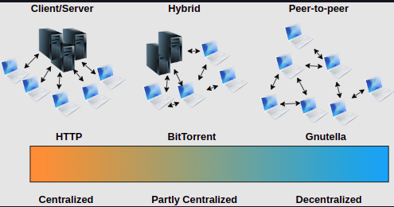
  <br>
  <code>On a spectrum of decentralization, BitTorrent falls in the middle.</code>
</div>
<br>

BitTorrent is a protocol for peer-to-peer file sharing. A BitTorrent Client is an application that uses this protocol.

Since BitTorrent is based on a hybrid architecture, it retains some centralized components.

* For example, a central controller that maintains a list of participating nodes is involved.

* But the centralized component is not involved in resource-intensive operations. So there will never be too much load on it.

* Data is instead downloaded or uploaded directly to and by peers.

* The file is first supplied to a peer in pieces called chunks, and then they also distribute the file to other peers.

* This is sometimes called a peer-assisted system.

# 4 The Transport Layer

### Key Responsibilities of the Transport Layer

* <code>Extends network to the applications</code>: the transport layer takes messages from the network to applications. In other words, while the network layer (directly below the transport layer) transports messages from one end-system to another, the transport layer delivers the message to and from the relevant application on an end-system.

### Transport Layer Protocols

The transport layer has two prominent protocols: the transmission control protocol and the user datagram protocol. In general, an application developer will have to choose between the two. We’ll discuss the intricacies of each in detail in upcoming chapters, but here is a quick overview.

| TCP  | UDP |
| :------------- | :------------- |
| Delivers messages that we call ‘segments’ reliably and in order. | Does not ensure in-order delivery of messages that we call ‘datagrams.’ |
| Detects any modifications that may have been introduced in the packets during delivery but does not correct them by default. | Detects any modifications that may have been introduced in the packets during delivery and corrects them. |
| Handles the volumes of traffic at one time within the network core by sending only an appropriate amount of data at one time. | Does not ensure reliable delivery.|
| Examples of applications/application protocols that use TCP are: HTTP, E-mail, File Transfers. | Generally faster than TCP because of the reduced overhead of ensuring uncorrupted delivery of packets in order. |
| | Applications that use UDP include: Domain Name System (DNS), live video streaming, and Voice over IP (VoIP). |

## 4.1 Multiplexing and Demultiplexing

End-systems typically run a variety of applications at the same time. For example, at any given time a browser, a music streaming service, and an email agent could be running.

### What is Demultiplexing

Demultiplexing is the process of delivering the correct packets to the correct applications from one stream.

Here’s a useful analogy: deciphering the mail that should be delivered to which houses after a large shipment of packages are received at a post office.

<br>
<div align="center">
  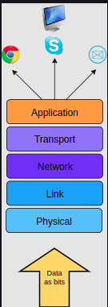
  <br>
  <code>End systems can be talking to many other applications at once which leaves us with the question: how to send messages such that they arrive to the correct process?</code>
</div>
<br>

### What is Multiplexing

Also, multiplexing allows messages to be sent to more than one destination host via a single medium.

An analogy would be when several packages to several different locations are mailed out from one house.

<br>
<div align="center">
  
  <br>
  <code>End systems can be talking to many other applications at once which leaves us with the question: how to send messages such that they arrive to the correct process?</code>
</div>
<br>

Multiplexing and demultiplexing are usually a concern when one protocol (TCP for example) is used by many others (HTTP, SMTP, FTP) in an upper layer.

Here’s a simplified view of what multiplexing and demultiplexing are.

<br>
<div align="center">
  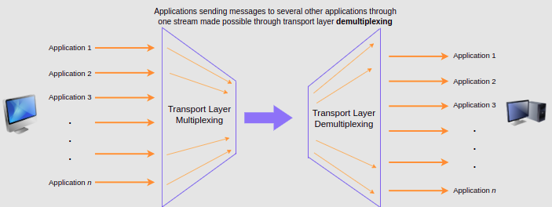
</div>
<br>

## 4.2 Introduction to Congestion Control

When more packets than the network has bandwidth for are sent through, some of them start getting dropped and others get delayed. This phenomenon leads to an overall drop in performance and is called <code>congestion</code>.

### How Do We Fix It

Congestion physically occurs at the network layer (i.e. in routers), however it’s mainly caused by the transport layer sending too much data at once. That means it will have to be dealt with or ‘controlled’ at the transport layer as well.

> 📝 Note Congestion control also occurs in the network layer, but we’re skipping over that detail for now since the focus of this chapter is the transport layer. So congestion control with TCP is end-to-end; it exists on the end-systems and not the network. Also note that in this lesson, the term delay means end-to-end message delay.

> 📝 Note: congestion collapse occurs when all end-systems are sending a lot of traffic but nothing is being received, for example, when all or most packets are dropped. There a few causes for this, including but not limited to Spurious retransmissions. Spurious retransmissions occur when a retransmission timer times out for packets that are not lost but have not yet reached the destination. So, much of the network’s bandwidth ends up being consumed by a small number of packets.

<br>
<div align="center">
  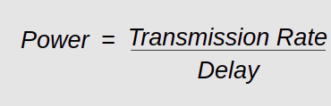
</div>
<br>

## 4.3 Reliable Data Transfer: Sliding Window

### Pipelining

Applications may generate data at a rate much higher than the network can transport it. Processor speed is generally much higher than the speed of writing out and reading data to/from the network (I/O).

### Sliding Window

The sliding window is the set of consecutive sequence numbers that the sender can use when transmitting segments without being forced to wait for an acknowledgment. At the beginning of a session, the sender and receiver agree on a sliding window size.

The figure below illustrates the operation of the sliding window. The sliding window shown contains three segments. The sender can thus transmit three segments before being forced to wait for an acknowledgment. The sliding window moves to the higher sequence numbers upon reception of acknowledgments. When the first acknowledgment (of segment 0) is received, it allows the sender to move its sliding window to the right, and sequence number 3 becomes available.

<br>
<div align="center">
  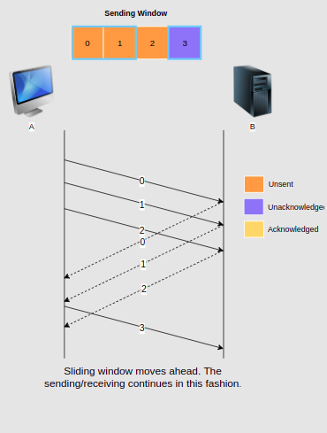
</div>
<br>

## 4.4 The User Datagram Protocol

UDP, or <code>User Datagram Protocol</code>, is a transport layer protocol that works over the network layer’s famous <code>Internet protocol</code> (which we’ll look at in-depth in the next chapter). RFC 768 is the official RFC for UDP.

#### How It Works

UDP does not involve any initial handshaking like TCP does, and is hence called a connectionless protocol. This means that there are no established ‘connections’ between hosts.

UDP prepends the source and destination ports to messages from the application layer and hands them off to the network layer. The Internet Protocol of the network layer is a best-effort attempt to deliver the message.

### Structure of A UDP Datagram

UDP prepends four 2-byte header fields to the data it receives from the application layer. So in total, a UDP header is 8 bytes long. The fields are:

1. Source port number
2. Destination port number
3. Length of the datagram (header and data in bytes)
4. Checksum to detect if errors have been introduced into the message. We’ll study this in detail in the next lesson!

<br>
<div align="center">
  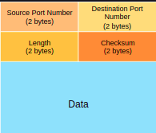
  <br>
  <code>A UDP Datagram. The header is a total of 8 bytes or 64 bits long.</code>
</div>
<br>

## 4.5 The Transmission Control Protocol

TCP, or the transmission control protocol, is one of the two key protocols of the transport layer. TCP is what makes most modern applications as enjoyable and reliable as they are. HTTP’s implementation, for example, would be very complex, if it weren’t for TCP.

TCP is a robust protocol meant to adapt to a diverse range of network topologies, bandwidths, delays, message sizes, and other varying factors that exist in the network layer.

### What TCP Does

1. <b>Send data</b> at an appropriate transmission rate. It should be a fast enough rate to make full use of the available capacity but it shouldn’t be so fast as to cause congestion.

2. <b>.Segment data</b>. The application layer sends the transport layer a continuous and unsegmented stream of data so that there’s no limit to how much data the application layer can give to the transport layer at once. Hence, the transport layer divides it into appropriately sized segments. Note that a segment is a collection of bytes. Furthermore, when a TCP segment is too big, the network layer may break it into multiple network layer messages, so the receiving TCP entity would have to re-assemble the network layer messages.

3. <b>End to end</b> flow control. Flow control means not overwhelming the receiver. It’s not the same as congestion control. Congestion control tries not to choke the network. However, if the receiving machine is slow, it might drown in data even if the network is not choked. Avoiding drowning the receiver in data is end to end flow control. There is also hop by hop flow control, which is done at the data link layer.

<br>
<div align="center">
  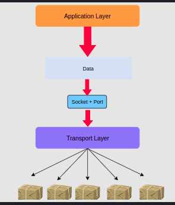
  <br>
</div>
<br>

### A TCP Three-way Handshake FSM

TCP connection establishment can be described with a four-state Finite State Machine (FSM) as shown below. In this FSM, X/Y indicates that segment X was transmitted and segment Y was received. Init is the initial state

<br>
<div align="center">
  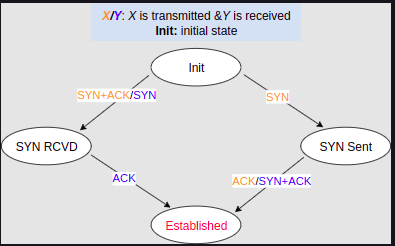
  <br>
  <code>TCP FSM for connection establishment</code>
</div>
<br>

### Simultaneous Connection Establishment

<br>
<div align="center">
  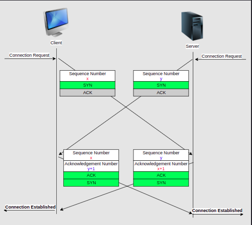
  <br>
</div>
<br>

# 5 Network Layer

The main objective of the network layer is to allow end systems to exchange information through intermediate systems called routers. The unit of information in the network layer is called a packet.

### Datagram Organization

The datagram organization has been very popular in computer networks. Datagram-based network layers include IPv4 and IPv6 in the global Internet, CLNP defined by the ISO, IPX defined by Novell or XNS defined by Xerox.

This organization is connectionless and hence each packet contains:

  * The network layer address of the destination host.
  * The network layer address of the sender.
  * The information to be sent.

To understand the datagram organization, let’s consider the slides below. A network layer address represented by a letter, has been assigned to each host and router. Host A wishes to send some information to host J.

<br>
<div align="center">
  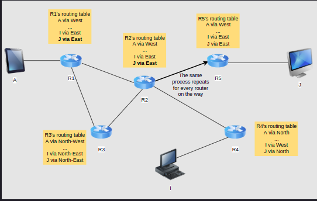
  <br>
</div>
<br>


<br>
<div align="center">
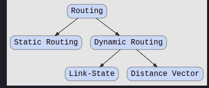
<br>
</div>
<br>

## 5.1 The Control Plane: Distance Vector - Routing Information Protocol

The Routing Information Protocol (RIP) based on the famous Belmman-Ford algorithm belongs to the distance vector class of routing algorithms and was used in ARPANET. While it used to be incredibly popular, it’s not used very much now. There are other distance vector routing algorithms too such as Ford-Fulkerson.

### Initial state

Each router or ‘node,’ maintains a routing table that initially contains the estimated cost to each of its neighbors.

Consider the following example of a small network where the yellow circles represent nodes, the black lines represent links, and the purple numbers represent the cost of each link.

<br>
<div align="center">
  
  <br>
</div>
<br>

## 5.2 The Control Plane: Route Calculation - Dijkstra's

Each router then computes the spanning tree rooted at itself and calculates the entries in the routing table by using Dijkstra’s shortest path algorithm. Dijkstra’s is a common algorithm that is usually taught in Algorithms or Data Structures classes. Let’s get a quick refresher of it.

<br>
<div align="center">
  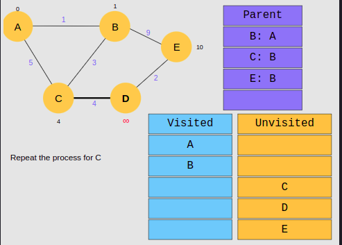
  <br>
</div>
<br>

## 5.3 The Internet Control Message Protocol (ICMP)

It’s sometimes necessary for intermediate routers or destination hosts to inform the sender of a packet about any problems that occur while processing it. In the TCP/IP protocol suite, this reporting is done by the Internet Control Message Protocol (ICMP). ICMP is defined in RFC 792.

### ICMP Headers

<br>
<div align="center">
  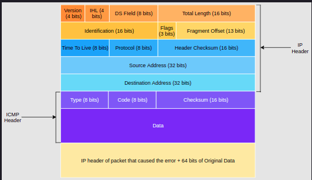
  <br>
</div>
<br>

## 5.4 Dynamic Host Configuration Protocol (DHCP)

In the early days of the Internet, IP addresses were manually configured on both hosts and routers and almost never changed. However, this manual configuration can be complex and often causes errors that can be difficult to debug.

To ease the attachment of hosts to subnets, most networks now support the Dynamic Host Configuration Protocol (DHCP) RFC 2131. DHCP allows a host to automatically retrieve its assigned IPv4 address. A DHCP client actually can retrieve other network parameters too, including subnet mask, default gateway and DNS server addresses from the DHCP server.

<br>
<div align="center">
  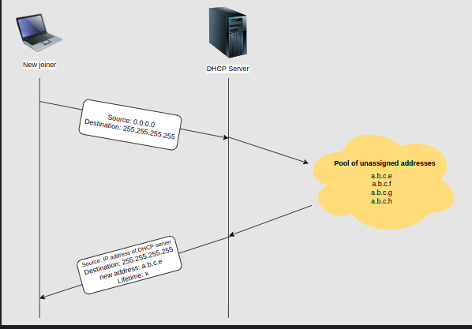
  <br>
</div>
<br>
