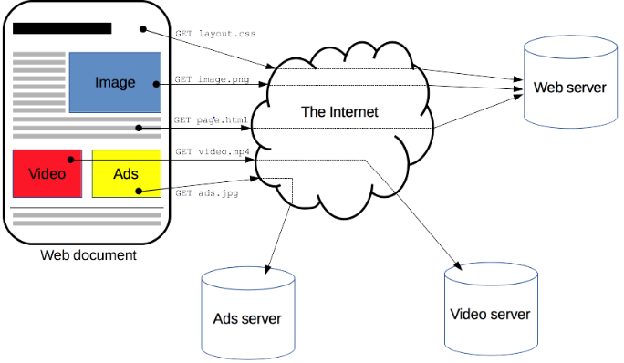
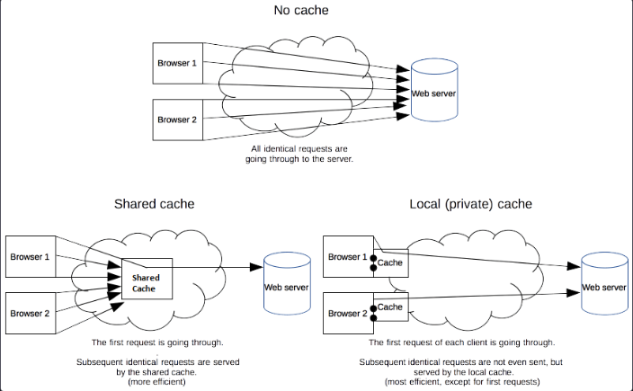
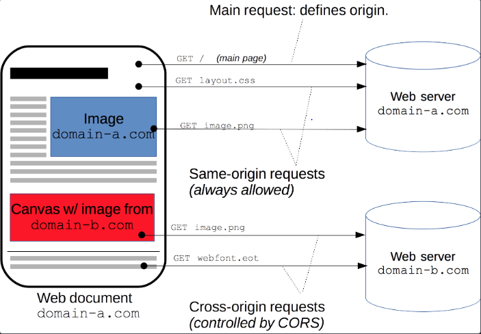
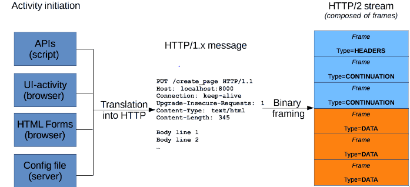

# HTTP (Hypertext Transfer Protocol)

* HTTP (HyperText Transfer Protocol): вэб хуудсууд болон вэбд агуулагдах зураг гэх мэт файлуудыг дамжуулахад хэрэглэгддэг.
* FTP (File Transfer Protocol): нэг машинаас нөгөө машинд файл дамжуулахад хэрэглэгддэг.
* SMTP (Simple Mail Transport Protocol): и-майл-д хэрэглэгддэг.
* Telnet Protocol: Телнэт хэсгийг нээхэд хэрэглэгддэг.

[Overview of HTTP](https://developer.mozilla.org/en-US/docs/Web/HTTP/Overview)
------------------------


[HTTP Cache](https://developer.mozilla.org/en-US/docs/Web/HTTP/Caching)
------------------------
Вэб кэш нь саатал болон сүлжээний урсгалыг багасгаж нөөцийн дүрслэлийг харуулахахд шаардагдах хугацааг багасагдаг
Жишээ нь: Өмнө орж байсан сайт-д өгөгдөл кэш-д хадаглагдсан бол хурдан уншина гэсэн үг. Санах ой гэж хэлж болно.



[HTTP Cookies](https://developer.mozilla.org/en-US/docs/Web/HTTP/Cookies)
------------------------
HTTP cookie(web cookie, browser cookie) нь серверээс хэрэглэгчийн вэө хөтөч рүү илгээдэг жижиг өгөгдлийн хэсэг юм. 
Хөтөч нь cookie-ийг хадгалж, дараа нь **request**-ийн хамт нэг сервер рүү буцааж илгээдэг.

[Cross-Origin Resource Sharing(CORS)](https://developer.mozilla.org/en-US/docs/Web/HTTP)
------------------------
HTTP header-д суурилсан механизм бөгөөд Тухайн Server-ийг ямар ч Origin - руу (домэйн, sceme эсвэл порт)-оор зааж өгөх боломжийг олгодог.



[HTTP Messages](https://developer.mozilla.org/en-US/docs/Web/HTTP/Messages)
-------------------------
HTTP мессеж нь server болон client хооронд өгөгдөл солилцохыг хэлнэ. 
* **request** : вэб дээр үйлдэл хийхийн тулд client - ээс сервер лүү хүсэлт илгээнэ.
* **response** : client - тээс ирсэн хүсэлтэд хариулах ийг хэлнэ.



[HTTP request methods](https://developer.mozilla.org/en-US/docs/Web/HTTP/Methods)
-----------------------
* GET : Одоогийн нөөц рүү нэвтрэх эрх авах зөвхөн өгөгдөл авах ёстой.
* HEAD : GET-тэй адилхан Гэхдээ зөвхөн толгой хэсгийг нь авна
* POST : Шинэ нөөцийг бий болгоход ашигладаг. 
* PUT : Одоогийн нөөцийг шинэчилэх, өөрчилөх.
* DELETE : Тухайн нөөцийг устгахад ашигладаг.
* TRACE : Олон тооны оролтын цэгүүд ба серверийн төлөөлөлүүдээр хүсэлт дамжих үед тус бүрдээ өөрийн мэдээлэлүүдийг өөртөө агуулж байдаг IP, DNS. Энэ аргаар бүх түр зуурын мэдээлэлүүдийг харж болно.
* OPTIONS : Тухайн нөөцөд тохирсон тохиргоо зэргийг тодорхойлоход ашиглагдана.

[HTTP response status code](https://developer.mozilla.org/en-US/docs/Web/HTTP/Status)
---------------------------
Тодорхой HTTP хүсэлтийг амжилттай гүйцэтгэсэн эсэхийг харуулдаг. Таван ангилалд хуваадаг.
1. **Informational responses** (100-199)
2. **Successful responses** (200-299)
3. **Redirection messages** (300-399)
4. **Client error responses** (400-499)
5. **Server error responses** (500-599)

Example code (Server response) 
--------------
```
HTTP/1.1 200 OK

Date: Mon, 23 JAN 2016 22:38:34 GMT

Content-Type: text/html; charset=UTF-8

Content-Encoding: UTF+8

Content-Length: 138 Last-Modified: Wed, 28 Jan 2016 23:11:55 GMT

Server: Apache/1.3.3.7 (Unix) (Red-Hat/Linux)

ETag: "3f80f-1b6-3e1cb03b"

Accept-Ranges: bytes

Connection: close

<html>
  <head>
    <title> 
      Жишээ хуудас
    </title>
  </head>
  <body> 
    Сайн байна уу? Энэ бол энгийн загвар юм.
  </body>
</html>
```


 
