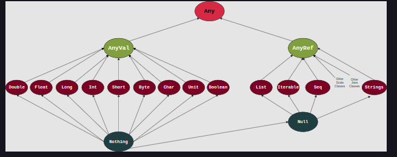

# 1. Variables in Scala

### Declaring a Variable 

`keyword variableName: DataType = Initial Value`

```scala
var myFirstScalaVariable: Int = 5
```

### Choosing the Right Keyword

For this chapter, we are only going to concern ourselves with two keywords: val and var.

Variables of type `val` are immutable variables; once they are initialized, they can never be reassigned.
Variables of type `var` are mutable variables; they can be reassigned throughout their lifetime as long as they are valid.

### Multiple Variables

```scala
val bookTitle: String = "Lord of the Rings: The Fellowship of the Ring"
val bookAuthor: String = "J. R. R. Tolkien"
val bookNoOfPages: Int = 423
```

# 2. Printing in Scala

### Hello World!

```scala
print("hello world!")
```

### Printing Methods in Scalaa

1. `print`

2. `println`

3. `printf`

# 3. Immutable Variables

### Declaring an Immutable Variable

```scala
val message: String = "Hello World"

println(message)
``` 

```scala
val message: String = "Hello World"
message = "Hello Educative"

println(message)
```

# 4. Mutable Variables

### Declaring a Mutable Variable

```scala
var message: String = "Hello World"

// Driver Code
println(message)
```

```scala
var message: String = "Hello World"
message = "Hello Educative"

// Driver Code
println(message)
```

# 4. Data Types

<br>
<div align="center">
	
	<br>
	<code>Scala Type Hierarchy</code>
</div>
<br>

### `Any` in Action

```scala
var anyInAction: Any = "A String" //String
println(anyInAction)

anyInAction = 5 //Int
println(anyInAction)

anyInAction = '☺' //Char
println(anyInAction)

anyInAction = 1.985 //Float
println(anyInAction)

anyInAction = true //Boolean
println(anyInAction)
```

### Using Value Types

```scala
val myDoubleVariable: Double = 2.75
val myFloatVariable: Float = 2.75f
val myLongVariable: Long = 275000000000L
val myIntVariable: Int = 275
val myShortVariable: Short = 1
val myByteVariable: Byte = 0xa
val myCharVariable: Char = '☺'
val myUnitVariable: Unit = ()
val myBooleanVariable: Boolean = true
```

# 5. Type Casting in Scala

### LONG => Float.

```scala
val oldType: Long = 926371285
val newType: Float = oldType

// Driver Code
println(oldType)
println(newType)
```

```scala
val oldType: Long = 926371285
val newType: Float = oldType
val newOldType: Long = newType

// Driver Code
println(oldType)
println(newType)
println(newOldType)
```

### Char => Int

```scala
val oldType: Char = 'A'
val newType: Int = oldType

// Driver Code
println(oldType)
println(newType)
```

# 6. String and Other Literals

### String Literals

```scala
val stringLiteral: String = "Hello"

// Driver Code
println(stringLiteral)
```

### Integer Literals

```scala
val hex: Int = 0x0F5
val dec: Int = 245

val hex1: Long = 0x0A3DE5L //The L at the end is for Long
val dec1: Long = 671205L

// Driver Code
println(hex)
println(dec)
println(hex1)
println(dec1)
```

### Floating-Point Literals

```scala
val floatLiteral: Float = 1.2345F // The F at the end is for Float
val somethingBigger: Double = 1.2345e1
val evenBigger: Double = 1.2345e4

// Driver Code
println(floatLiteral)
println(somethingBigger)
println(evenBigger)
```

### Character Literals

```scala
val charLiteral: Char = 'A'
val smile: Char = '☺'

// Driver Code
println(charLiteral)
println(smile)
```

### Boolean Literals

```scala
val theTruth: Boolean = true
val aLie: Boolean = false

// Driver Code
println(theTruth)
println(aLie)
```


