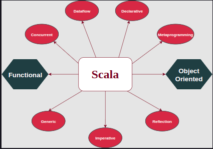

# 1. A Multi-Paradigm Programming Language

Scala is a multi-paradigm language, which is just as much object-oriented as it is functional. But what does it mean for a programming language to be multi-paradigm?

 

	
	 
	<code>Scala's Multiple Paradigms</code>

 

If a language is designed to allow programming in multiple paradigms and cannot be distinctively classified under one category, it is known as a multi-paradigm language. As Leda designer Timothy Budd puts it: “The idea of a multi-paradigm language is to provide a framework in which programmers can work in a variety of styles, freely intermixing constructs from different paradigms.” This equips the programmer with a larger number of tools to solve a wider range of problems.

### Scala: Through the Eyes of Java

Martin Odersky’s primary influence when developing Scala was the Java programming language, so much so that Scala is actually written to run in Java Virtual Machine. Scala programs compile to JVM bytecodes, and their runtime performance is mostly on par with Java programs. If you are not familiar with bytecode, that’s perfectly fine. All you need to know is that Java programs don’t compile into executable files; instead, they compile into bytecodes which are then executed during runtime.

Scala allows you to call Java methods, access Java fields, inherit from Java classes, and implement Java interfaces in your code without the added requirement of any special syntax. Programmers are not even aware of how heavily Scala code makes use of Java libraries.

While the parallels between Java and Scala are evident, Scala differs in many ways as well with its code being mmuch more conscise, clean, and with its own benfits.

# 2. Scalable Language

While there are many reasons for Scala’s scalability, the most prominent is its combination of being both object-oriented and functional. There are other languages that provide both functional and object-oriented programming, but none are able to fuse them together into one uniform language the way Scala does.

### Functional + Object-Oriented

# 3. A Featurette: Scala Features

### 1. Type Inference

Type inference is Scala’s ability to infer types without them being explicitly mentioned. The language is smart enough to deduce data types based on the context in which the object has been written.

### 2. Immutability

Immutability is the quality of being unchangeable. In Scala, variables are immutable by default; once assigned a value they cannot be modified by you or any other programmer. This might not be apparent now, but default immutability is one of Scala’s strongest features. It is primarily used for concurrency control which manages concurrent (simultaneous) operations so that they do not conflict with each other.

You can also create immutable variables by explicitly mentioning it in your code.

### 3. Lazy Computation

Scala only evaluates an expression when required. This increases performance by reducing compile time.

### 4. Case Classes & Pattern Matching

In Scala, case classes are regular classes with the added feature of being immutable. This makes them great for modeling immutable data.

Case classes are useful for pattern matching, which is used for checking a value against a pattern and deconstructing it into its constituent parts.

### 5. String Interpolation

Scala’s string interpolation methods allow you to embed variables directly inside a string literal allowing the creation of strings through data.

### 6. Higher-Order Functions

Higher-order functions are functions which take other functions as arguments. They can also return functions along with simple data types.

### 7. Traits

Traits are a collection of abstract and non-abstract methods. They are similar to Java’s interface. Simply put, while classes and objects can only inherit from a single class, those same classes and objects can inherit from multiple traits.

### 8. Extensive Collection

Scala provides an extensive collection of classes and traits which are used for collecting data. They are divided into two broad categories of mutable and immutable collections and are all contained in Scala’s package `Scala.collection.`

# 4. Who's Using Scala?

### LinkedIn

The LinkedIn Web site was launched in 2003 and is now the largest professional networking site in the world with more than 65 million members, representing 200 countries and executives from every Fortune 500 company. It switched to Scala in 2009.

### Twitter

Twitter is an extremely popular live message service with over 70 million users. As Twitter has scaled up its services, it has moved its main message queue from Ruby on Rails to Scala for better performance in 2009.

### Foursquare

Foursquare is a location technology platform which is constantly growing. As its user-base rapidly grew, it has moved all its services to Scala/Lift based servers.

### The Guardian

On the May 20th, The Guardian announced that their “Open Platform”, an API to access the vast repository of Guardian media with over a million articles, video clips, photographs, and audio tracks, was “open for business”. The API was implemented using Scala. With 36 million people making regular use of the repository, the Open Platform was created to service the rapidly growing demand and provide a high-performance interface for media application developers.

### Sony

Sony is an industry leader in the world of computer graphics. They have released five open-sourced projects, one which is the Scala Migrations, a library that manages updates, rollbacks, and changes to database schemas. The library is written in Scala and provides a database abstraction layer that allows migrations to target any supported database vendor.

These five companies along with Électricité de France Trading, Xerox, Novell, Xebia, Siemens, Thatcham, OPOWER, GridGain, AppJet, and Reaktor are just a few of the many companies moving to Scala.

