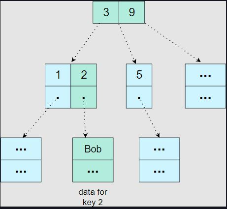
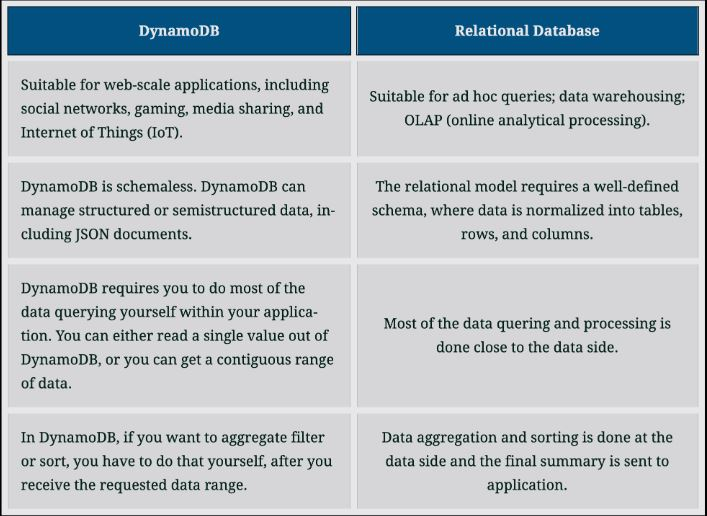
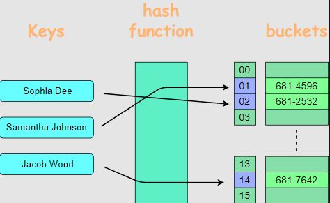
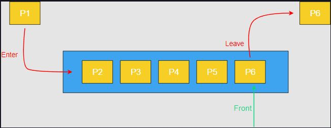
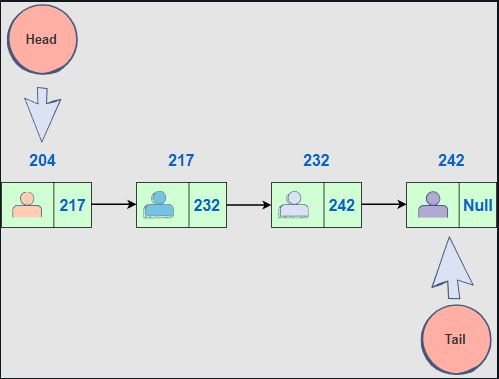

# 1. Database: DynamoDB

### Data structure in the cloud

<br>
Amazon describes DynamoDB as a database, but it’s best seen as a highly-durable data structure in the cloud. A partitioned B-tree data structure, to be precise.
<br>
<div align="center">
    
    <br>
    <code>B tree of customer data and their keys</code>
</div>
<br>

DynamoDB is much more similar to a <b>Redis</b> than it is to a <b>MySQL.</b> But, unlike <b>Redis</b>, it is immediately consistent and highly-durable, centered around that single data structure. If you put something into DynamoDB, you’ll be able to read it back immediately and, for all practical purposes, you can assume that what you have put will never get lost.

### DynamoDB vs relational database

<br>
<div align="center">
    
    <br>
</div>
<br>

### Query processing

Having to do most query processing on the application side isn’t just inconvenient. It also comes with performance implications. Relational databases run their queries close to the data, so if you’re trying to calculate the sum total value of orders per customer, then that rollup gets done while reading the data, and only the final summary (one row per customer) gets sent over the network. However, if you were to do this with DynamoDB, you’d have to get all the customer orders (one row per order), which involves a lot more data over the network, and then you have to do the rollup in your application, which is far away from the data. This characteristic will be one of the most important aspects of determining whether DynamoDB is a viable choice for your needs.

### Storage cost

| 1 TB in DynamoDB |   1 TB in S3 |
| :--------------- | -----------: |
| $256/month       | $23.55/month |

# 2. Storage: S3

### Hashtable in the Cloud

Fundamentally, you can think of S3 as a highly-durable hash table in the cloud. The key can be any string, and the value any blob of data up to 5 TB. When you upload or download S3 objects, there’s an initial delay of around 20 ms before the data gets streamed at a rate of around 90 MB/s. You can have as many parallel uploads and downloads as you want, thus, the infinite bandwidth. You can also store as many objects as you want and use as much volume as you need, without either having to provision capacity in advance or experiencing any performance degradation as the scale increases.

<br>
<div align="center">
    
    <br>
    <code>Hashtable of users and their phone numbers</code>
</div>
<br>

### Features of S3

```
1- Highly durable

2- Very easy to use

3- Infinite bandwidth

4- Infinite storage space

5- Zero capacity management
```

# 3. Compute: EC2

EC2 allows you to get a complete computer in the cloud in a matter of seconds. The nice thing about EC2 is that the computer you get will be very similar to the computer you use to develop your software. If you can run your software on your computer, you can almost certainly run it on EC2 without any changes. This is one of EC2’s main advantages compared to other types of compute platforms (such as Lambda): you don’t have to adapt your application to your host.

### Instance types

EC2 is a sophisticated service with dozens of options that you will likely never need. This is the result of the highly varied workloads and use cases serviced by EC2. Nevertheless, the defaults that EC2 comes with are good default choices, and the most consequential decision you will have to make is selecting an instance type. As of the time of writing, EC2 offers 256 different instance types, but they can be narrowed down to a few categories defined by what they’re optimized for:

- CPU
- Memory
- Network
- Storage
- etc.

| Instance Size | vCPU | Memory (GiB) | Instance Storage (GiB) | Network Bandwidth (Gbps) | EBS Bandwidth (Mbps) |
| :------------ | ---- | ------------ | ---------------------- | ------------------------ | -------------------: |
| m5.large      | 2    | 8            | EBS-Only               | Up to 10                 |          Up to 4,750 |
| m5.xlarge     | 4    | 16           | EBS-Only               | Up to 10                 |          Up to 4,750 |
| m5.2xlarge    | 8    | 32           | EBS-Only               | Up to 10                 |          Up to 4,750 |
| m5.4xlarge    | 16   | 64           | EBS-Only               | Up to 10                 |                4,750 |
| m5.8xlarge    | 32   | 128          | EBS-Only               | 10                       |                6,800 |
| m5.12xlarge   | 48   | 192          | EBS-Only               | 10                       |                9,500 |
| m5.16xlarge   | 64   | 256          | EBS-Only               | 20                       |               13,600 |
| m5.24xlarge   | 96   | 384          | EBS-Only               | 25                       |               19,000 |
| m5d.large     | 2    | 8            | 1 x 75 NVMe SSD        | Up to 10                 |          Up to 4,750 |
| m5d.xlarge    | 4    | 16           | 1 x 150 NVMe SSD       | Up to 10                 |          Up to 4,750 |
| m5d.2xlarge   | 8    | 32           | 1 x 300 NVMe SSD       | Up to 10                 |          Up to 4,750 |
| m5d.4xlarge   | 16   | 64           | 2 x 300 NVMe SSD       | Up to 10                 |                4,750 |
| m5d.8xlarge   | 32   | 128          | 2 x 600 NVMe SSD       | 10                       |                6,800 |
| m5d.12xlarge  | 48   | 192          | 2 x 900 NVMe SSD       | 10                       |                9,500 |
| m5d.16xlarge  | 64   | 256          | 4 x 600 NVMe SSD       | 20                       |               13,600 |
| m5d.24xlarge  | 96   | 384          | 4 x 900 NVMe SSD       | 25                       |               19,000 |
| m5d.24xlarge  | 96   | 384          | 4 x 900 NVMe SSD       | 25                       |               19,000 |

# 4. Compute: EC2 Auto Scaling

Amazon will tell you that Auto Scaling allows you to automatically add or remove EC2 instances based on the fluctuating demands of your application. This sounds great in theory, and while we’ve certainly seen that work successfully in a few places, it’s almost never useful except in very specific situations. You will almost never need to use the auto part of Auto Scaling for the reason it exists.

### Capacity headroom

You obviously need to have enough instances to meet your expected peak demand. But you probably don’t want your capacity to exactly match the demand with no leeway. You will want to have some headroom too. This headroom is not waste—it will act as a safety buffer that can absorb many types of unpredictable events. For example:

- If an availability zone were to go down and you lost half of your instances, the headroom in the remaining instances can compensate for the lost capacity.

- Or if there were to be a sudden increase in demand, the same headroom will be immediately available to take it.

- Or if for some reason the performance of your system were to degrade abruptly (due to a software bug, a bad instance, etc.), that same headroom may help compensate the excess load.

### Cost usage ratio

The main premise of Auto Scaling is that once you decide how much headroom you want, you’ll be able to make that headroom a constant size, even as the demand for your instances fluctuates. Therefore, a simpler way to look at Auto Scaling is to see it as just a cost reduction tool. Because what’s wrong with having excess headroom during off-peak periods? Absolutely nothing, except cost.

Therefore, the first question you should ask yourself is:

- Are your EC2 costs high enough that any reduction in usage will be materially significant?

- As a thought experiment, consider if your EC2 bill were to go down by 30%—would that be a big deal for your business?

# 5. Compute: Lambda

### Code runner in the cloud

If EC2 is a complete computer in the cloud, Lambda is a code runner in the cloud. With EC2 you get an operating system, a file system, access to the server’s hardware, etc. But with Lambda, you just upload some code and Amazon runs it for you. The beauty of Lambda is:

- It’s the simplest way to run code in the cloud.

- It abstracts away everything except for a function interface, which you get to fill in with the code you want to run.

### Misuse of Lambda

We think Lambda is great—definitely one of the good parts of AWS—as long as you treat it as the simple code runner that it is. A problem we often see is that people sometimes mistake Lambda for a general-purpose application host. Unlike EC2, it is very hard to run a sophisticated piece of software on Lambda without making some very drastic changes to your application and accepting some significant new limitations from the platform.

### Lambda as a plugin system for other AWS services

Lambda is most suitable for small snippets of code that rarely change. We like to think of Lambda functions as part of the infrastructure rather than part of the application. In fact, one of our favorite uses for Lambda is to treat it as a plugin system for other AWS services. Let’s look at a few examples of it.

#### S3

- S3 doesn’t come with an API to resize an image after uploading it to a bucket, but with Lambda, you can add that capability to S3.

### Application Load Balancer (ALB)

- Application load balancers come with an API to respond with a fixed response for a given route, but they can’t respond with an image. Lambda lets you make your load balancer do that.

### CloudFront

- CloudFront can’t rewrite a request URL based on request cookies (which is useful for A/B testing), but with Lambda, you can make CloudFront do that with just a little bit of code.

### CloudWatch

- CloudWatch doesn’t support regex-based alerting on application logs, but you can add that feature with a few lines of Lambda code.

### Kinesis

- Kinesis doesn’t come with an API to filter records and write them to DynamoDB, but this is very easy to do with Lambda.

### CloudFormation

- CloudFormation’s native modeling language has many limitations and, for example, it can’t create and validate a new TLS certificate from the AWS Certificate Manager. Using Lambda, you can extend the CloudFormation language to add (almost) any capability you want.

# 6. Networking & Content Delivery: ELB

ELB is a load balancer service and comes in three variants:

- <code>Classic</code>
- <code>Application (ALB)</code>
- <code>Network (NLB)</code>

### Classic

Classic is a legacy option and remains there only because it works with very old AWS accounts, where you can still run EC2 instances outside of a VPC. For any new setup, you should choose one of the other two variants.

### ALB

ALBs are proper reverse proxies that sit between the internet and your application. Every request to your application gets handled by the load balancer first. The load balancer then makes another request to your application and finally forwards the response from your application to the caller. ALBs have lots of features, and they support sophisticated routing rules, redirects, responses from Lambda functions, authentication, sticky sessions, and many other things.

### NLB

On the other hand, NLBs behave like load balancers, but they work by routing network packets rather than by proxying HTTP requests. An NLB is more like a very sophisticated network router. When a client connects to a server through an NLB, the server would see the client as if it were connected to the client directly.

### Support for TLS/HTTPS

Both ALBs and NLBs support TLS/HTTPS, and they integrate very well with the AWS Certificate Manager. This lets you set up TLS certificates and forget about them. The certificates get renewed automatically and deployed to your load balancers without any downtime. And all the certificates are free.

To have end-to-end TLS from the caller to your application, you will also have to enable TLS on your application. Otherwise, the traffic from the load balancer to your application will travel unencrypted on part of the network. Unfortunately, certificates from the Certificate Manager cannot be exported, so you can’t use them for your application. Instead, common practice is to create a self-signed certificate on your host and use that for your application. The load balancers do not validate the server’s certificate (neither the name, nor the expiry), so in this case, a self-signed certificate works fine.

### Amazon as a man-in-the-middle

The fact that ALBs and NLBs don’t validate certificates might seem concerning. However, since these load balancers run in a VPC, Amazon authenticates each network packet and guarantees that the packets go only to the hosts you configured in your load balancer. The protection from spoofing and man-in-the-middle is provided by Amazon.

That said, keep in mind that:

> by installing TLS certificates on your load balancers, you’re letting Amazon become a man-in-the-middle itself. Amazon’s hardware and software will be decrypting your network traffic and re-encrypting it when forwarding it to your application (if you enable TLS on your application).

If you’d rather not trust Amazon with this responsibility, you must use:

> an NLB with TCP passthrough (without enabling TLS on the load balancer). But in that case, you must keep a valid TLS certificate on your application host and deal with certificate renewals yourself.

### NLB vs ALB

#### TCP passthrough

Only NLBs support TCP passthrough, but since NLBs work on the network layer, they also lack support for many of the features found in ALBs. So, unless you need TCP passthrough, why would you ever want to use an NLB?

Well, ALBs have two main disadvantages:

- First, their proxy approach adds a few milliseconds to each request, so they’re slightly slower than NLBs.

- Second, they may not scale quickly enough to handle a big burst of traffic.

#### Single vs Multi-tenant system

An ALB behaves like a single-tenant system. AWS keeps track of your request rates and then automatically scales your ALB up or down based on the demand it sees. The exact logic of this behavior is opaque, so the only way to be assured that your ALB’s elasticity meets your demands is:

- To test it yourself.

- Or, if you know a certain amount of traffic is on the way, you can ask AWS (through a support ticket) to preemptively provide sufficient capacity for you.

# 7. Networking & Content Delivery: Route 53

### A DNS service

Route 53 is a DNS service. It lets you translate domain names to IP addresses.

### Limitations

There’s nothing particularly special about Route 53’s DNS capabilities. In fact, it has a few annoying (but mostly minor) limitations such as the lack of support for ALIAS records (unless they point to AWS resources).

### Benefits of using Route 53

However, the reason we stick to using Route 53 is that:

- First of all, it’s good enough.

- Secondly, it integrates very well with ELB.

> There is a significant benefit in having CloudFormation automatically set up your load balancer together with the DNS records for your custom domain. Route 53 makes this possible, whereas if you were to use a different DNS provider, you’d likely have to manage your DNS records manually.

# 8. Management & Governance: CloudFormation

When using AWS, you almost always want to use some CloudFormation (or a similar tool). It lets you create and update the things you have in AWS without having to click around on the console or write fragile scripts. It takes a while to get the hang of it, but the time savings pay off the initial investment almost immediately. Even for development, the ability to tear down everything cleanly and recreate your AWS set up in one click is extremely valuable

### Defining AWS resources with CloudFormation#

With CloudFormation;

- You define your AWS resources as a YAML script (or JSON, but we find YAML to be much easier to read and modify).

- Then you point CloudFormation to your AWS account, and it creates all the resources you defined.

- If you run the script again without making any changes, CloudFormation won’t do anything (it’s idempotent).
- If you make a change to one resource, it will change only that resource, plus any other resources that depend on the modified one (if necessary).

- If you change your mind about an update, you can safely tell CloudFormation to roll it back.

- You can also tell CloudFormation to tear down everything it created, and it will give you your AWS account back in the original state (with a few exceptions).

# 9. Application Integration: SQS

### A queue in the cloud

SQS is a highly-durable queue in the cloud. You put messages on one end, and a consumer takes them out from the other side. The messages are consumed in almost first-in-first-out order, but the ordering is not strict. The lack of strict ordering happens because your SQS queue is actually a bunch of queues behind the scenes. When you enqueue a message, it goes to a random queue, and when you poll, you also poll a random queue. In addition, duplicate messages can emerge within SQS, so your consumers should be prepared to handle this situation.

<br>
<div align="center">
    
    <br>
    <code>Queue of different processes</code>
</div>
<br>

### Zero capacity management

Like S3, SQS is one of the few AWS services that requires zero capacity management.

- There is no limit on the rate of messages enqueued or consumed, and you don’t have to worry about any throttling limits.

- The number of messages stored in SQS (the backlog size) is also unlimited.

As long as you can tolerate the lack of strict ordering and the possibility of duplicates, this property makes SQS a great default choice for dispatching asynchronous work.

If you really need strict ordering and exactly-once delivery (no duplicates):

- SQS has an option to enable this property by marking your queue as FIFO.

- But these FIFO queues come with a throughput limit of 300 messages per second, so they’re only viable if you’re certain that your message rate will remain well clear of that limit.

# 10. Media Service: Kinesis

### A linked list in the cloud

You can think of a Kinesis stream as a highly-durable linked list in the cloud. The use cases for Kinesis are often similar to those of SQS—you would typically use either Kinesis or SQS when you want to enqueue records for asynchronous processing.

<br>
<div align="center">
    
    <br>
    <code>Queue of different processes</code>
</div>
<br>

### Kinesis vs SQS

The main difference between the two services is:

- SQS can only have one consumer, while Kinesis can have many.

- Once an SQS message gets consumed, it gets deleted from the queue. But Kinesis records get added to a list in a stable order, and any number of consumers can read a copy of the stream by keeping a cursor over this never-ending list.

- Multiple consumers don’t affect each other, and if one falls behind, it doesn’t slow down the other consumers.

- Whenever consumers read data out of Kinesis, they will always get their records in the same order.

#### Cheaper/cost effective

In addition to supporting multiple consumers, another benefit of Kinesis over SQS is that it can be a lot cheaper. For example:

- Putting 1 KB messages in SQS at an average rate of 500 messages per second will cost you $34.56 per day. A Kinesis stream with 50% capacity headroom can handle that same volume for just $0.96 per day. So there can be about a massive difference in cost.

> Let’s do a fun exercise: Use the below widget to calculate the cost of putting a certain size (KB) message at an average rate of certain number of messages per second per day to a Kinesis stream. $0.02 is the cost of putting a million messages to a Kinesis stream per day. You just have to put the number of messages per second, and the size of each message in KB. It will automatically generate the cost per day in the next cell.
