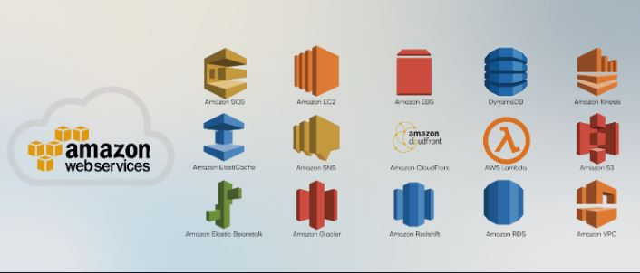

Making technical choices can be overwhelming. As developers, we have to make many choices from what seems like unlimited options. We have to choose:

- a programming language
- an application framework
- a database
- a cloud vendor
- software dependencies
- and many other things

AWS alone offers about 150 services, all with their own set of options and features, sometimes even overlapping with each other.

 

    
     
    <code>AWS Top 15 services</code>

 

## The Default Heuristic

### Optimization fallacy

Chasing the best tool for the job is a particularly insidious trap when it comes to making progress—especially at the beginning of a project. We consider the relentless search for the best tool to be an <code>optimization</code> fallacy—in the same category as any other premature optimization.

Searching for the optimal option is:

- Almost always expensive.

- Any belief that we can easily discover the best option by exhaustively testing each one is delusional.

To make matters worse:

- We developers tend to enjoy tinkering with new technology and figuring out how things work, and this only amplifies the vicious cycle of such a pursuit.

### The default heuristic

Instead of searching for the best option, we recommend a technique we call the default heuristic. The premise of this heuristic is that when the cost of acquiring new information is high and the consequence of deviating from a default choice is low, sticking with the default will likely be the optimal choice.

But what should your default choice be?

- It should be any option that gives you very high confidence that it will work.

- It is something you’ve used before.

- Something you understand well.

- Something that has proven itself to be a reliable way for getting things done in the space you’re operating in.

- It doesn’t necessarily have to be the theoretical best choice.

- It doesn’t have to be the most efficient. Or the latest and greatest.

- It simply needs to be a reliable option to get you to your ultimate desirable outcome.

- It should be very unlikely to fail you; you have to be confident that it’s a very safe bet. In fact, that’s the only requirement.
