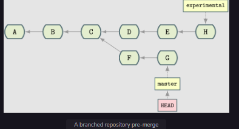
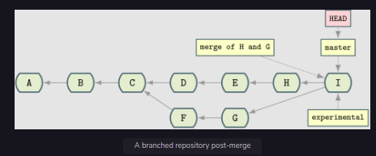

# Introduction to Git

### Source control

If you’re not familiar with source control, it solves a simple problem: how do you and your colleagues keep track of changes in your codebase?

You might start by:

* Sending each other updated files
* Emailing each other when files change
* Keeping tar files in a central location with version numbers

### Traditional source control

Traditional source control tools, such as CVS and SVN, had a centralized architecture. You communicated with a server that maintained the state of the source code. This could mean several things:

* The source control database could get very big
* The history could get very messy
* Managing your checkouts of code could get complicated and painful

In the old world, if you checked out source code, then that was a copy of some code that was inferior in status to the centralized version.

As far as the user was concerned, the code was in one of two states:

* Local changes (“dirty”)
* Committed

Committed was synonymous with “pushed to the server.” My local changes could not be shared with anyone else until I committed and pushed them to the server.

### Git

Git, by contrast, is fundamentally distributed. Each Git repository is a full copy of each Git repository it is copied from. It is not a “link” to a server or a “shadow” copy of another repository. You can make reference to the origin repository, but you do not have to do that. All code databases (in Git, CVS, or SVN) are known as repositories.

## Repository with no branch

```
A <- B <- C
```

### Adding branch to a repository

But let’s say someone wants to make an experimental change but does not want to affect the main line. They might branch the code at point C:

```
A <- B <- C <- D <- E
	  ^
	  |
	  F
	  ^
	  |
	  experimental
```

## How Git Differs from Other Version Control Systesm (VCS's)

### History is more malleable

You can change the history in your own copy of the repository and others’ assuming you have the appropriate permission to push to them

### Branching is cheap

In most traditional VCS’s (i.e., CVS and Subversion), it’s very slow to branch a repository (O(n)
O(n) (order n) to a number of files).

### Commits are made across the whole project

In contrast to other source control tools, changes are made across the whole project but not per file.

One consequence of this is that moving/renaming files does not involve loss of history for that file. For example, this is a massive win over CVS, which is file-oriented.

### No version numbers

Git does not automatically number versions of files/changes. Instead, it assigns a hash (effectively random) to the change to the repository (commits), which is then used to refer to those changes.

# 2. Git Basics 

## 2.1 Initializing Git Repository

To initialize a Git repository, run git init from within the root folder of the source that you want to manage.

```
mkdir lgthw_git_basics
cd lgthw_git_basics
git init
```

```
cd .git
ls
```
What is worth being aware of here are:

* The HEAD file

* The config file

### HEAD

The HEAD file is key: it points to the current branch or commit ID you are currently on within your Git repository.

If you look at the file, you will see its contents contain the string:

`refs/heads/maste`

```
cat HEAD
```

### Git configuration

The config file stores information about your repository’s local configuration. For example, the branches and remote repositories your repository is aware of. Again, it’s a plain text file with a basic config structure:

```
cat config
```

out:
```
[core]
	repositoryformatversion = 0
	filemode = true
	bare = false
	logallrefupdates = true
```

## 2.2 Looking at Repository's History

### The git log command

If you want to look at the history of this repository, then run the git log command:

```bash
cd ..
git log
```

## 2.3 Retrieving a Repository's Status

### The git status command

As is often the case, git status is your friend when retrieving a repository’s status:

```bash
git status
```

## 2.3 Add Files to a Repository

### The `git add` Command

```
git add mycode.py
git status
```
Remember the four stages you looked at before.

* You created your file ((1) local changes).
* You added/staged it to the index (2).

```
git log
```

## 2.4 Commiting Changes to a Repository

### The `git commit` command

The `git commit` command tells Git to take a snapshot of all added content at this point

```bash
git commit -m "Some message"
git log
```

### The `git diff` command
```bash
vim mycode.py
git diff
```
After typing the vim command, you will be taken to a text editor on the terminal. Vim has two modes: a command mode and an edit mode. By default, you will be taken into the command mode. To enter into the edit mode, press the key i. To exit the edit mode and enter into the command mode, press the escape key. To save your changes, close the editor, and go back to the terminal. Type :wq in the command mode, and press enter.

### Simultaneous addd and commit

You can commit changes to files and add at the same time by doing `git commit -a`:

```bash
git commit -a -m "Another message"
git status
```

### Checking history

```bash
git log
```

# 3. Clone a Repository

### The `git clone` command

The git clone command helps you create copies of Git repositories to work on.

### The git reset command

The `git reset` command helps you return to a previous or known state.

As you play with Git and learn it, you will often make mistakes in your local repositories. In these situations, many users delete the entire repository and re-clone. But often, all that’s needed is a hard reset.

## 3.1 Cloning a Remote Repository

### Cloning

```bash
mkdir lgtw_git_clone
cd lgthw_git_clone
git clone https://github.com/ianmiell/shutit
cd shutit
ls .git
```

> ALL GIT REPOSITORIES ARE BORN EQUAL!

### Local and remote repository

This is a Git repository. It is the same as the one you’ve cloned, and you own it. Its only connection with the repository that you cloned from can be seen if you run:

```bash
grep -a2 'remote "origin"' .git/config
```

## 3.2 Accidental Deletion

### The four stages of Git repositories

* `Changes to files in working directory`

* `Staging area/Added content/Git index`

* `Local git repository`

* `Remote git repository`


### Visualizing the repository's history

Run these commands in which you look at the repository, and then make a disastrous mistake.
```bash
1   git log
```

This shows you a default history of the repository. Page through it a few times by hitting space or down. You will see how far it goes back. Hit q to stop viewing it, and return to the command line.
```bash
2   git log --oneline
```

Another way to view the log is one line per commit, which is much more concise and useful for many purposes. Obviously, some information is lost here.

```bash
3   git log --oneline --graph
```
You’ve added the --graph flag, and now you get a visual representation of the history. Parsing this graph can be tricky; don’t worry about understanding it exactly. But keep it in mind. It is helpful if you ever have to figure out what went on in a repository’s past.

## 3.3 Recover Your Repository

### The `git reset` command

You can use `git reset` to recover the state of the Git repository in various ways.

By default, Git will recover whatever has been added to the index/staging area and place it in your working directory.

By contrast, a `git reset --hard` will blitz all local and added changes, reverting your checkout to a just-cloned and committed state.

### Restoring the previous state

In most versions, git status reports that the deleted files are ready to be committed, but there’s also a helpful message at the top about using git reset (this message may vary depending on Git version or it might not even be there at all). If there’s a message like that, then read it carefully and type:

```bash
git reset --mixed
git status
```

Yes, I know that’s not what git status told you to do. But it’s the same thing. --mixed is the default flag that git reset uses.


### The `--hard` flag

Now, do the same delete/add cycle over but `git reset --hard` this time rather than the default `--mixed`:

```bash
rm -rf ../cloned_shutit/*
git add .
git reset --hard
git status
```

# 4. Git branching 

## 4.1 Creating a Branch

### Creating a Git repository

You will create a Git repository with a single file. This file will have separate changes made on two branches: `master` and `newfeature`.

```bash
mkdir lgthw_git_branch_1
cd lgthw_git_branch_1
git init
echo newfile > file1
git add file1
git commit -m 'new file1'
git status
```

### The `git branch` command

To create a new branch, type the following commands:

```bash
git branch newfeature
git status
git branch
```

```bash
git checkout newfeature
cat file1
echo Line_feature1 >> file1
git commit -am 'feature change'
git log --decorate --graph --oneline --all
```

Back to the code. You have added a feature (i.e., a code change) to the newfeature branch. Go back to the master branch and check that the file1 doesn’t have the changes you made on the newfeature branch:

```bash
git checkout master
cat file1
```

## 4.2 Detached Heads

```bash
git status
HEAD detached at 76d43b6
```

### Detaching

The `HEAD` pointer can be moved to an arbitrary point. In fact, `git checkout` does exactly this. You can specify a reference (like `master` or `newfeature`) or a specific commit ID.

### Think ahead

Think about this and ponder the advice you’d give to someone in a detached HEAD state to reorient themselves, given what you’ve been taught so far about branches and git log. Answering questions like this is the best way to understand Git.

## 4.3 What about Tags?

### Tags

Tags are the same as branches, except they do not have history. They point to a particular commit, but it doesn’t change (unless you force a change, or delete it).

### How to apply tags?

You can tag something where you are:
```bash
git tag i_was_here
```
Or you can tag wherever a branch pointer is pointed at in your repository, even if you are not on it:

```bash
git checkout e36355ed00ac3af009d7113a9dd281c269a79afd
git branch -f newfeature
```

The `-f` flag means `--force.` If a branch of `newfeature` already exists, then Git will not allow you to override it unless you use the `-f flag`.

```bash
git checkout master
git tag remember_to_tell_bob_to_rewrite_this newfeature
```

# 5. Merging

### Merging vs. branching

In a sense, merging is the opposite of branching. When you merge, you take two separate points in your development tree and fuse them together.

It’s important to understand merging, as it’s a routine job of a repository maintainer to merge branches together.

It’s also really important to take this chapter slowly and make sure you understand every step. It’s quite painful to wrap your head around merging properly. But once you do, your Git skills will improve.

## 5.1 A toy Merging Example

### Pre-merge

<br>
<div align="center">
	
</div>
<br>

In this diagram, the repository is currently positioned at the tip of `master` (G). You know this because the `HEAD` is pointed at G.

### Post-merge

If you merge the `experimental` branch into `master` with a `git merge experimental command`, you end up with a tree that looks like this:


<br>
<div align="center">
	
</div>
<br>

A new change has been made (I). This change merges together the changes made on `experimental` with the changes made on `master`.


## 5.2 Merging Step by Step 

### Step 1: Creating a repository, adding some files, and committing them

```bash
mkdir -p lgthw_merging
cd lgthw_merging
git init
echo A > file1
git add file1
git commit -am 'A'
echo B >> file1
git commit -am 'B'
echo C >> file1
git commit -am 'C'
```

### Step 2: Creating a branch and checking it out

```bash
git branch experimental
git checkout experimental
git branch
echo E >> file1
git commit -am 'E'
echo H >> file1
git commit -am 'H'
```

### Step 3: Checking out master, and making more changes

Return to `master`, and make chacnges `D`, `F` and `G`:

```bash
git checkout master
git branch
echo D >> file1
git commit -am 'D'
echo F >> file1
git commit -am 'F'
echo G >> file1
git commit -am 'G'
```

### Step 4: Attempting to merge the `master` and `experiment` branch

```bash
git merge experimental
```

## Handling Merge Conflicts

### Merge conflict

When you run a merge, Git looks at the branch you are on (here it is master) and the branch you are merging in (experimental) and works out the first common ancestor. In this case, it’s point C, as that’s where you branched experimental.

It then takes the changes on the branch that you are merging in from that first common ancestor and applies them to the branch you are on in one go. These changes create a new commit, and the git log graph shows the branches joined back up.

Sometimes the changes made on the branches conflict with one another. That means the changes altered the same lines. In this case, the `D`, `F`, and `G` of the `master` changed the same lines as the `E` and `H` of experimental.

<br>
<div align="center">
	
</div>
<br>

Git doesn’t know what to do with these lines. Instead of putting the `D`, `F`, and `G` in, should it put the `E` and `H` in? Or should it put them all in? If it should put them all in, then what order should they go in?

Changing lines around the same area in code can have disastrous effects. By default, Git does not make a decision when this happens. Instead, it tells you that there was a conflict and asks you to “fix conflicts and then commit the result”.

### Resolving merge conflicts

What you choose to do here is up to you as maintainers of this repository. You could add or remove lines as you wish until you are happy the merge has been completed, or replace it with something completely different. Git doesn’t care.

When you are satisfied, you can commit your change, and the merge has been completed.

You could even leave the file as is (including the `=======` and `<<<<<<<` lines). But this is unlikely to be what you want! It’s surprising how easily you can forget to resolve all the conflicting sections in your codebase when doing a merge.

When you are done, you can commit the change, and view the history with the `git log` command.

```bash
git commit -am 'merged experimental in'
git log --all --oneline --graph --decorate
```


