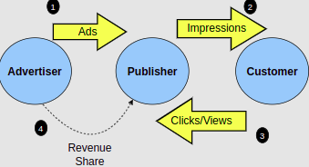

# 1. Domain Name

Once you have finalized the website design and implementation, then you would need a short and simple name to go with it. We refer to this name as “Domain Name”. But there is a procedure that you need to follow in order to link that name with your website.

<br>
<div align="center">
	
</div>
<br>

## Steps to Register a Domain Name

### Step1: BrainStorm a Name

Your domain name basically represents your company so make sure to find the one that goes perfectly with your business goals.

| Suffix | Intended Use |
| :----- | -----------: |
|.com |	For commercial purposes |
| .biz |	For business purposes |
| .net | An alternative for .com domain if it’s not available |
| .org |	For Non-Profit Organizations |
| .edu | 	For Educational institutes |

### Step2: Check for domain availability

### Step3: Register your domain name with a domain register

# 2. Web Hosting

At this point, we have picked the domain name for our website. However, our site still runs only on a local machine. To make it visible on the vast world of the internet, we need a <b>web hosting service</b>.

## 2.1 Types of Hosting

### Dedicated Servers

A dedicated server will place all of its resources to host our website only. We never need to share the server’s computing power with anyone else’s website as it is dedicated to us. A dedicated server is also referred to as a bare metal server as it is a piece of machinery which serves only one tenant.

### Virtual Private Servers (VPS)

The VPS model acts as a toned down version of dedicated hosting. A server will run multiple virtual servers, each dedicated to one website. So even though our website will work on a shared host, we would have our private environment with all the flexibilities of a dedicated server.

### Shared Hosting

In shared hosting, a server will divide its resources between our site and many others. We are neither in control of the server, nor do we have any association with the other sites running on it.

### Cloud Hosting

This is the latest development in the world of website hosting. In cloud hosting, the resources for our website are spread across multiple virtual servers which are part of the cloud. We can acquire as many virtual cloud servers as we need, and we call also specify their technical power (RAM, storage, etc.).

## 2.2 Critical Factor to Consider

### Reliablility and Uptime Rates

A good web host is one which is always running, making your site available to anyone at any time. We should steer clear of a server that shuts down frequently and has an unsatisfactory uptime rate. The more popular services like Bluehost or InMotion have uptime rates higher than 99.9%, which makes them extremely reliable.

### Bandwidth

Data transfer speed is one of the most important aspects of running a smooth website. In a situation where a lot of traffic is trying to access our website, the hosting service needs to provide us with a high bandwidth so that the users’ experience is not hampered.

Dedicated servers and VPSs solve this problem better than shared servers. Cloud services provide very high bandwidth, with the option of acquiring more if needed.

### Security and Maintenance

A web hosting service needs to have security measures in place to fight against cyber attacks. In case a server is physically damaged, our site needs to be stored on backup servers.

### Necessary Utilities

* PHP, Perl, JavaScript (web development languages)

* File Transfer Protocol (file accessibility)

* .htaccess (Apache server configuration)

* Server Side Includes

* MySQL or MongoDB (database management)

* SSH (remote server communication)

* Cron (job scheduler)

### Control Panel

Every decent web host provides us with a control panel from which we can manage our account. Here, we can change our account settings and view information about our website. Popular panels like cPanel or the AWS management console offer many more features.

### Good Reviews

In this age, the web hosting industry has become extremely saturated. As a result, it can be hard to guess the reliability of a company. Customer reviews can tell us about the quality of the service.

### Domain Emails

We should be able to create email addresses for our domains and define their purposes (auto-response, admin accounts, etc.).

### Domain Name Purchasing

Even though we’ve learned how to buy a domain independently, good web hosting services also offer the option of buying domains and sub-domains.

### Pricing

We should always compare the prices of different hosts. Signup prices are very cheap but don’t be fooled. In almost every case, subscription renewal prices are significantly higher than the initial cost.

### Free Hosts vs. Paid Hosts

We can find both types on the market. Paid hosting services are much more reliable. Free hosting could be our last resort but it is a risky step to take in terms of safety and reliability. Furthermore, a free host will put up its own ads on our website to generate revenue.

### SSL Certificates

It is an added bonus if the web hosting company allows us to order an SSL certificate. Simply put, SSL encrypts client-server communication on our web site, making transactions and file transfers much safer. We’ll learn more about it in the SSL Certificate lesson.


# 3. Publish Your Website

## 3.1 Working with SecureShell

Secure Shell, popularly known as SSH, is a platform which allows us to remotely control our server over an internet connection. It is a terminal based protocol system which is available on macOS, Linux and Windows.

SSH was originally developed because of the security concerns regarding its predecessor, Telnet. Server communication is now much more secure because of the data encryption methods used by the SSH protocol. In terms of functional power, SSH allows us to basically control every aspect of the server running our website.


### The SSH Environment

SSH comes in-built with Linux and macOS. We can access it using the terminal. For Windows, there are several SSH clients like PuTTY which allow us to work with SSH.

Basic commands:

```ssh
<user>@<domain name or IP address>
```

```ssh
root@192.1.1.1
```

### Port number

```ssh
ssh -p port user@server
```

## 3.2 Creating a Project on Google Cloud Platform

## 3.3 Cloning a Repository

## 3.4 Firewall Access

Right now, if our app is running on the VM, no one can access it. Why is this the case? Let’s find out.

In the VM instance section, click on the instance name. This will show all the information about our server.

## 3.5 Ephemarel and Static IP Addresses

## 3.7 SSL Certificate

We’ve finally implemented client-server communication by deploying our website on the web. Till now, our domain name has been preceded by http://. However, you might have noticed that many sites follow the https:// protocol instead. This is because HTTPS, or Hyper Text Transfer Protocol Secure, is the safer form of the HTTP protocol.

### Types of SSL Certificates

There are three main types of certifications provided by Certified Authors. Let’s discuss them one by one.

<strong>Domain Validation</strong>

This is the simplest and least expensive form of certification. The Certified Author (CA) confirms that we have control over our domain. This can be done by altering our site’s domain name in front of the CA, so that it can verify that the domain name is indeed ours. The process isn’t very long and we end up with an HTTPS connection.

<strong>Organization Validation</strong>

This is a step higher since the CA validates our basic information as well including the person or company’s name and location. These details are displayed on the certificate.

<strong>Extended Validation</strong>

An extended validation certificate is the highest form of validation our website can receive. Along with all the details verified in the previous methods, the CA will also confirm our legal status.

<strong> Wildcard Certificates</strong>

These certificates provide the HTTPS functionality for all subdomains of our domain.

<strong>Unified Communications/Subject Alternative Names</strong>

These two types of certifications lets us extend the HTTPS tag over multiple domains which we own.

<strong>Best Certified Authors</strong>

GlobalSign
Cloud Flare (Free)
Comodo (Paid/Free)
GeoTrust (Free Trial)
DigiCert

## 3.8 Comparing Different Cloud Hosts

| Features	| AWS|  Heroku	| GCP |
| :------------ | ----------------------| -------------------- | ------------------: |
| Deployment |	Requires some technical knowledge about server configuration. |	Does everything at the backend. We do not need to worry about maintenance.| Requires some technical knowledge about server configuration.|
| Control	| Offers the widest range of features.| Isn’t very flexible as it handles everything for us.	| There is a huge growing library of dev tools. |
| Learning Curve | High |  Low	| High |
| Pricing | Fairly low. Pay for what you need. | Very expensive | Very economical. A great free plan as well. |
| Scalability	| High | High and simple | High |
| Speed	| Usually efficient, but does slow down in high traffic.| Can slow down in high traffic. | Fairly reliable speed, but this is also a result of GCP having less users than AWS and Heroku. |

# 4. Testing & Maintenance


## 4.1 Server Maintenance

Now that our website is live, our task is to make sure that it runs smoothly. The server acts as a home for our product, so it only makes sense to keep our house clean. Not doing so may lead to grave situations. A server shutdown can cause major financial and informational losses, which is something we can’t afford if our site generates heavy traffic.

Whether we choose to appoint all maintenance jobs to a trusted web/cloud host or we do it ourselves, there are some fundamental practices we need to be aware of. Let’s have a look at them now.

### Regular Updates

We need to make sure that all our software is up to date because older versions are at the risk of losing technical support from their vendors.

In case of a web host, we should always have an updated control panel.

### Make Backups

Our application software and database should be regularly backed up. This will be useful in case of a server failure.

### Monitor and Manage Disk Space

A lot of creators do not pay attention to the obsolete data lurking in the recesses of their servers. While it may not be evident at first, the accumulating garbage information can take a toll on our server’s performance.

### Check for Hardware Problems

We have to monitor hardware performance and take care of any abnormal behavior. Faulty components should be replaced or fixed as soon as possible.

### Security Measures

There should be security checks in place to resist cyber attacks. Vulnerability detecting softwares like Nessus and Qualys are very suitable for this job.

## 4.2 Website Maintenance

In the previous lesson, we briefly discussed the concept of server maintenance. Now, let’s focus on the site itself. In order to efficiently handle traffic and provide the ultimate user experience, we need to keep it clean and safe.

### Frequent Backups

We must make sure that the latest version of our site is backed up in case of data loss. The optimal solution would be to have a history of all the previous states of the website.

### Statistical Analysis

We must be observant of the activity that happens on our site. We can use this data to estimate growth and figure out what needs to be improved. The popular Google Analytics is a master in representing all sorts of statistical data for websites.

### Usability Testing

A great way to refine our website is to take user feedback through periodic usability tests. We should try to spread our user sample over a diverse range of people, from those are familiar with the purpose of the application, to the users who are using it for the first time.

Having a usability test every couple of years or so can keep us up to date with the changing preferences of the customers and can also point our any underlying problems in the system.

### Performance Testing

We must ensure that the performance and the response speed of our application is not hampered by high user traffic. We can perform stress tests using Loadrunner.

Another good practice is to keep compressed and cached data at our server. This would reduce load time.

### Security Maintenance

We should make sure that the security software in charge of every component in our application is updated regularly. Cyber attacks have brought down giant websites in the past, so we must take all measures to secure ourselves from malicious hackers. Burp Suite and Grabber are excellent web application scanners.

### Component Maintenance

A good website is one which provides the functionality it is built for. We must test out all links, images and input forms to search for any faulty components which could hamper the user experience.

Sometimes, updating the code of our application can make some old components incompatible with the new changes. Hence, component testing is a fundamental of website maintenance.


## 4.3 Frontent Testing

### Automated Frontend Testing

It is always possible to execute frontend testing manually by ourselves, but using automated frontend testing softwares is a wiser idea. This is because automated tests take into account a much wider ranger of test cases, some of which may be missed by a human tester.

### Role in DevOps / Continuous Integration

DevOps and continuous integration are development approaches which smoothen out the delivery and maintenance of our application. Changes and fixes can be integrated faster. Automated tools play an important role in these approaches as the testing phase becomes faster.


### Frontend Testing Tools

#### Selenium

Selenium carries out web application tests on browsers. It comes as an in-built extension for Mozilla and Chrome, and can be used on all other browsers as well. We can make complex automated test suites in several languages such as Java, Perl, C#, Python etc.


#### CircleCI

CircleCI is a great tool for implementing Continuous Integration (testing code before it is pushed into a repository). It is a cloud hosted service which allows us to integrate new code into our application safely and quick.

It also uses the Rest API, which gives it a high degree of flexibility. However, we may need to install third party software to acquire some complex functionalities.


#### Jasmine

This is a browser testing tool for JavaScript. Jasmine boasts a clean and simple syntax, which makes it easy to use. It can test our application using matchers which return a boolean value based on a the success/failure of the test. Specs can be used to describe a test.

Jasmine does not depend on any other JS packages.

## 4.4 API Testing

### Postman

Postman is a great app for testing APIs using HTTP requests and getting responses. Designed by Google, Postman provides a simple and easy interface, along with tons of features to help us perform integration testing for applications backend APIs.

### SoapUI

SoapUI is perhaps the most popular backing testing automation tool. It supports load testing by running simulated traffic on our website. Functionality testing is also possible in various environments such as Development, Production, etc.

## 4.5 Database Testing

Databases are fundamental to our website as the communication between us and the user depends on data manipulation on the databases. Users retrieve and store data through the user interface. Hence, frontend testing for the UI is pointless if the backend database doesn’t work properly.

### Relational Databases

* The database must follow the ACID and CRUD principles.

* Our database must appropriately store and retrieve data. Queries must consistently return the correct results across all users. TOAD and phpMyAdmin are very convenient automated query tools.

* The fields in our database must correctly match the fields in the frontend interface. This is called mapping. DBUnit with Ant tests database-frontend mapping. Field constraints must be consistent at both ends.

* The database must not collapse under load or stress (several multiple read/write operations). HammerDB is a good option to carry out load tests.

* If information in one table is modified, all linked tables must update themselves accordingly. If there is a fault in interconnectivity, the whole site’s functionality is at stake.

* The DB must be resistant against SQL injections. Vega and Wapiti are open source tools suitable for SQL injection testing.

* Unauthorized access is a common attack on SQL databases. This can be avoided by fortifying user authentication checks.

* We must perform penetration testing to check for vulnerabilities in the logic of our DB system. One of the most popular penetration testing tools is Zed Attack Proxy.

* Denial of Service attacks can make databases unusable, which is really bad for our website! However, these attacks have to be prevented on the network layer.


### Non-Relational Databases

Non-relational (NoSQL) databases are simpler in terms of structure, and hence, require a lower degree of testing. However, there are still some crucial factors that need to be tested in order to make our website’s backend free of flaws.

* The format of the data objects should be consistent. We can check this by performing a few queries. This sort of unit testing can be done using NoSQLUnit, which supports several languages including MongoDB.

* We must test data conversions between the backend and the frontend.

* For continuous integration in databases, Travis CI is a wonderful option as it supports several NoSQL languages. Testing is also isolated and does not affect the original state of the application.

### Security Testing

* We must make sure that our data objects are encrypted.

* User authentication should be thorough and secure.

* NoSQL databases can also be subject to injection attacks by providing a JSON file in a field (assuming our backend stores JSON files). For more details on JSON injections, check out the examples mentioned here.

# 5. Post Launch Checklist

## 5.1 Web Analythics

### 1. Traffic

The number of new and returning visitors to your website. Plus the number of sessions and views of your website also come under traffic.

### 2. Conversions#

Conversion means that a user has successfully signed up on your website and is performing an action that is basically the goal of your website. For example, purchasing something or downloading the content etc. You need to track the conversion rate of your website in order to find out how many users find your website useful and how many users just visit it and then abandon it without doing anything.

### 3. Session Time#

Sessions are maintained for the returning users which are always considered a positive sign. You also need to log how much time the users spend on your website. The longer time they spend, the more their is a chance of conversion! If the user is not spending much time on your website then there is clearly a problem with your website. It is observed that if the website is user friendly and easy to navigate then the user is more likely to stay longer.

### 4. Bounce Rates#

On the other hand, if the users leave the site immediately (bounces) then you need to log this too and find out what web page causes the most bounces!

### 5. Traffic Sources#

Tracking the number of visits to your site is not enough. You also need to analyze how the audience is getting to your website. Through an ad? Through Google or some social media website? You need to determine that which traffic sources users come from the most so you can make better marketing strategies.

Google Analytics is a tool that groups all these visitors into multiple categories based on their traffic source. Here the different terms that Google Analytics uses as categories:

* Organic: Traffic that visits by typing a relevant keyword on search engine.

* Paid Traffic: Traffic that generates due to ads etc.

* Email Marketing: Traffic that visits due to email campaigns.

* Direct Traffic: The traffic that enters the URL of your website directly to their browsers.

* Social Media: Traffic that visits due your website through social ads or your social media accounts.

* Referrals: The traffic that visits due to backlinks

### 6. ROI

This is the most critical factor of all! ROI means Return over Investment. If you are spending more as an investment than you are actually receiving as profit then it’s definitely not a good strategy. By taking into account all of the other metrics you can eventually learn how to get this ROI measure in positive figures.

## 5.2 Search Engine Optimization

Once your website starts to appear online, the next thing that you need to take care of is to help more and more people find your website. According to the recent researches, most people only skim through the first page of search results and never bother going on the next pages. Moreover, it has also been studied that usually people only visit the first three links that appear on the search engine. This should be enough to show how important it is to make your website reach there!

### How search engines work?

Ever wondered how the search engines find pages relevant to the user’s search when there are millions of websites available on the internet? A short and simple answer to this question would be that it runs a complex algorithm and finds if the keywords entered by user are present in those websites and the number of times that keyword appears on the website, the more relevant it becomes.

But it’s not that simple!

Even if we filter the results based on just this approach, the results would still be in millions. Moreover, people would add extra keywords in their web pages just to appear on the top. Today’s search engines have been made so smart that they even capture this repetition and ban your page from appearing in the results. This is why it has become a necessity to optimize your website through SEO. To understand SEO, you need to be familiar with a few terms first. Let’s have a look!

### Web Crawling

Web Crawling is the process when a bot visits your website in order to track the web pages and fetch useful information like keywords in the pages, links etc. and feed it to the search engine for indexing.

### Web Indexing

After the crawling process, the search engine calculates the score of each webpage according to the given keywords entered by the user. This process is called indexing.

### Web Ranking

Every website has a ranking based on user’s searched keywords, this ranking is called “Page Rank”.

### What is SEO?

SEO is a set of strategies used to obtain a high-ranking on the search engines to increase traffic to your site.

Nobody knows what exact algorithm Google is following now or what factors they consider while ranking a web-page but we do know few of the ranking factors so we are able to make some optimizations. To do that, we need to take care of two things.

### On-site SEO:
Make sure the search engines easily understand what your website is about, and find and create content that matches the searcher’s intent to help search engine best identify that your website is relevant to user’s search. Given below are a few tips you need to keep in mind while optimizing your website content:

1. Optimize titles, tags and meta description: Make them specific and relevant to user’s keywords. Make sure to add the meat of the content in the first 150 characters of your meta descriptions.
2. Optimize the actual content on your website: Add Contact Us section, add testimonials etc.
3. Optimize main elements: By adding the primary keywords in the main elements of your site like headings, titles, footer etc.
4. Optimize URLs: Make sure to include primary keywords in the URLs of your website and keep them as simple and shorter as possible.
5. Avoid keyword stuffing: Don’t add the same keyword too many times, in the long run it always causes trouble.

### Off-site SEO:

The next part and the most important one is to show search engines that our website is worthy enough to appear in the top rankings. This is done by adding backlinks to your website from other sources such as social media, articles, blogs etc. The more influential the website is that links your website, the more weightage it is going to add in the search results ranking. Basically links act as votes. The more citations to a source exist, the more trustable it becomes in the eyes of the search engine and hence the higher it ranks!

The point that needs to be emphasized here is that in order to get a higher ranking on search page, you must generate quality backlinks. To generate quality backlinks, look up for websites that already link your competitors. You can do that by using any free tool online, Google Adwords and Ahrefs are the most popular ones. Then you will need to get in touch with them and offer them a pitch that benefits them or their website in any way… lets say giving copyrights to your designs? This outreach campaign would help you get a lot of backlinks and would eventually help you get a higher ranking on search engines!

So in a nutshell, off-site SEO boils down to two strategies:

1. Use Social Media: To create blogposts, articles and videos that direct to your website.
2. Get influential Backlinks: By getting in touch with influential websites and offering them some sort of benefit.

## 5.3 Generate Revenue from Ads

<br>
<div align="center">
	
	<br>
	<code>How Internet Ads Work?</code>
</div>
<br>

### Types of Advertisement Strategies#

#### Ad Space

In this approach, you allow an advertising company to use a particular section on your website to display their ads. This approach is rarely used anymore as the advertisers have to pay a constant amount of money no matter how many clicks and views the publisher’s site is able to generate.

#### Pay-Per-Click Advertising

This modern approach is by far the most popular approach as it benefits the publisher and the advertiser equally. In this approach, the advertiser is only obliged to pay you when a visitor clicks through their ad. Every time a visitor clicks on the ad, a small deposit will be made in the publisher’s account from advertising company.

#### Popups

No matter how much people dislike them, they are still a good source to make money online. The popup ads can be made less annoying if we design them professionally, for example, don’t disappear the close button to annoy the users, then the popups can get us a lot of conversions!

#### Affiliate Advertising

If you have a huge traffic on your website, then you can affiliate products of other brand on your website. A user might get attracted to it and make a purchase, if he does, you will get a certain percentage of the profit the other brand will make. This is what we call “Affiliate Marketing”.

#### Publish Paid Reviews

This approach is similar to affiliate advertising, but instead of promoting it directly on your website, you write paid reviews about the product and get paid accordingly. The price of the review depends on the traffic that your website gets.

#### Payment Models

As discussed above, Pay-Per-Click (PPC), also called Cost Per Click (CPC), follows a payment model in which publisher only gets paid when a click is made on the ad. In addition to this model, there are two other models that needs to be discussed here:

* CPM: This is the oldest model used in the world of marketing and advertisement. In this model, you can paid for every 1000 views on the ad, no clicks needed this time. Only large websites with very heavy traffic can earn some decent amount of money through this model.

* CPA: Stands for Cost-Per-Action. This model is similar to “Affiliate Marketing”. “Action” can be referred as a “purchase” or “lead”, so the ad publisher only gets paid when a lead is made.
