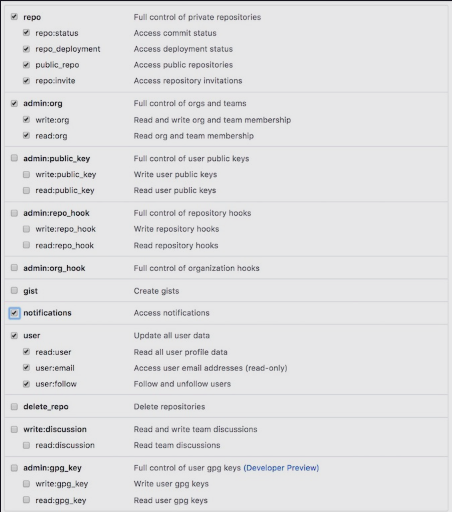
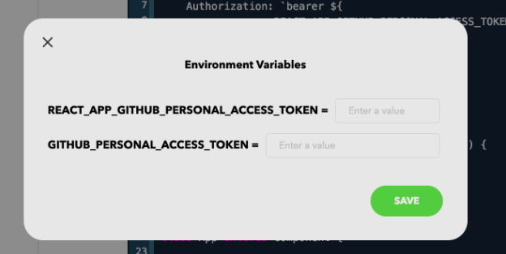

# 1. Generating a Personlized Access Token

### Read/Write Data with GitHub's Personal Access Token

To use GitHub’s GraphQL API, you need to generate a <b>personal access token</b> on their website. The access token authorizes users to interact with data, and to read and write it under their username. You can follow these [step by step instructions](https://docs.github.com/en/authentication/keeping-your-account-and-data-secure/creating-a-personal-access-token) to generate the personal access token and be sure to check its necessary scopes (permissions),

 

	

 

# 2. Usin our Personlized Access Token

For this course, we need to enter our personal access token into the environments for our projects. To do this, we simply have to enter the personalized access token which we generated in the previous lesson when prompted to do so. The prompt in the image below will pop up whenever an access token is required to run the code, i.e. when you ‘run’ a code snippet.

 

	

 

Enter your token in both the input fields named <b>REACT_APP_GITHUB_PERSONAL_ACCESS_TOKEN and GITHUB_PERSONAL_ACCESS_TOKEN.</b>

# 3. Interacting with GitHub's GraphQL API

# 4. Getting Started with GitHub's GraphQL API

GitHub is one of the first major tech brands to adopt GraphQL. The released public GraphQL API [(official documentation)](https://docs.github.com/en/graphql), is quite popular among developers who are already familiar with GitHub.

You must be familiar with the common GitHub terminologies and how to consume GitHub account data using its GraphQL API. We will build multiple applications throughout this course using this API so make sure to give this lesson a thorough read to avoid any confusions.

