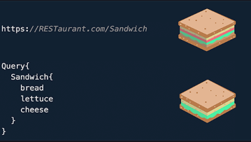
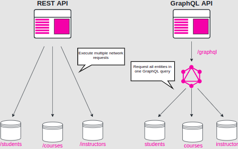

### GraphQL: A history

[GraphQL](https://graphql.org/) is an open source query language created by Facebook. Before GraphQL went open source in 2015, Facebook had used it internally for their mobile applications since 2012 as an alternative to the common REST architecture. As a result, network usage was reduced dramatically for Facebook’s mobile applications because GraphQL made it more efficient with data transfers.

### How is GraphQL Different?

Instead of an API where you hit a URL and accept whatever data comes back, GraphQL allows you to ask for specific data, giving clients more control over what information is sent.

#### 1. The Sandwich Comparison

Think of it like this; you want a sandwich with only bread, cheese, cucumbers, and lettuce. You walk into a RESTaurant where the only option on the menu is ‘sandwich’; you place an order and receive a sandwich with bread, salami, lettuce, tomatoes, cucumbers, and cheese. You then remove everything you don’t want, to be able to eat the sandwich you wanted; this is how the REST API works. However, when you visit GraphQL cafe, you realize you can specify which toppings you want in your sandwich and receive exactly what you wanted.

<br>
<div align="center">
	
</div>
<br>

#### 2. Overfetching

In the RESTful architecture, the backend defines what data is available for each resource on each URL, while the frontend always has to request all the information in a resource, even if only a part of it is needed.

In the worst case scenario, a client application has to read multiple resources through multiple network requests. This is called overfetching. A query language like GraphQL on the server-side and client-side lets the client decide which data it needs by making a single request to the server.


#### 3. Specification…NOT Implementation

GraphQL is a query language, it is a way to get data from an API to your application hence, it is a specification rather than an implementation. Initially, Facebook open-sourced the GraphQL specification and its reference implementation in JavaScript. Now, along with Javascript, several libraries have been incorporated in implementation. The ecosystem around GraphQL is growing horizontally by offering multiple programming languages, but also vertically, with libraries on top of GraphQL like Apollo and Relay.

#### 4. Queries & Mutations 

Currently, GraphQL operations can be divided into two broad categories, a query (read) and mutation (write). Each of these operations is only a string that needs to be constructed according to the GraphQL query language specification.

A sample query

```Graphql
//GraphQL Query:

query{
  course(id: "5"){
    id
    name
    author
  }
}

//Result of above Query:

"data":{
  "course":{
    "id": "5",
    "name": "Learn GraphQL with React",
    "author": "Robin Wieruch"
  }
}
```

#### 5. Relational Queries

With GraphQL, we can make relational queries of multiple fields which results in us getting all the data required in one trip (query), unlike the REST architecture in which we would need to make multiple requests (one for each field).

<br>
<div align="center">
	
</div>
<br>

```Graphql
// GraphQL Query:
author(id: "7") {
  id
  name
  avatarUrl
  articles(limit: 2) {
    name
    urlSlug
  }
}

// Result of Above Query:
{
  "data": {
    "author": {
      "id": "7",
      "name": "Robin Wieruch",
      "avatarUrl": "https://domain.com/authors/7",
      "articles": [
        {
          "name": "The Road to learn React",
          "urlSlug": "the-road-to-learn-react"
        },
        {
          "name": "React Testing Tutorial",
          "urlSlug": "react-testing-tutorial"
        }
      ]
    }
  }
}
```

## GraphQL Server and GraphQL Client

Now that we have an idea of what GraphQL is, let’s delve deeper into its implementation.

GraphQL’s implementation can be divided into two components:

1. Server Component

2. Client Component


### GraphQL Server

A GraphQL server essentially takes in your API and exposes your GraphQL API via an endpoint. It has two core parts:

* <b>A Schema</b>

* <b>Resolve functions</b>

#### Schema

The schema is a model of the data that can be retrieved through the GraphQL server. It specifies what queries clients are allowed to make, what types (scalar, object, query, mutation) of data can be fetched from the server, and what the relationships between these types are.

That being said, there is one critical piece of information that the schema doesn’t provide: where the data for each type comes from.

This is where resolve functions come in.

#### Resolve Functions

Resolve functions are like little routers. They specify how the types and fields in the schema are connected to various backends. Through these functions, you are able to answer questions such as “How do I get the data regarding Course Authors?” and “Which backend do I need to call with what arguments to get the data regarding Courses?”.

Perhaps the greatest feature of GraphQL is that it hides all of the backend complexity from the clients. Even if your app uses multiple backends, all the client will see is a single GraphQL endpoint with a simple, self-documenting API for your application.

### GraphQL Client

A GraphQL client is the front end component where you are actually able to accept queries, connect to the GraphQL endpoint, and make queries to collect data. The GraphQL client is straightforward and will be our main focus throughout this course.

<br>
<div align="center">
	
</div>
<br>


