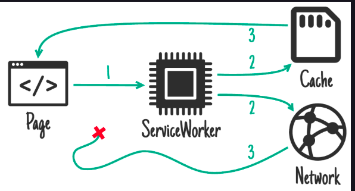

# The Progressive Approach

### Advantages of PWAs

* <code>No dedicated team needed</code>: The same existing web team can be used to implement a mobile version of the company website or a brand new PWA. This translates to reduced expenses planned for the application. Meanwhile, implementing native apps, using a specific technology stack often requires a dedicated team of developers.

* <code>Immediately online</code>: The new version of a PWA can be deployed online at any time without having to fulfill Apple or Play Store checks; they do not run the risk of having the app rejected because some of the requirements are not fulfilled.

* <code>Progressive</code>: If the user has an old browser (e.g., IE 11), the application will still work as a normal web app without delivering any advanced functionality. In this sense, a PWA delivers progressively features to the target system and gracefully skips the unsupported ones.

* <code>Only one version to maintain</code>: There is only one live version available. Therefore, no added complexity for maintaining multiple versions of the app is required.

* <code>Responsive</code>: PWAs fit any device, including desktop, mobile, or tablet, as well as resolution.

* <code>Available offline</code>: Thanks to service workers, it is possible to cache data locally and make it available even without a valid network connection. There are different caching strategies available, and each of them is suited for a specific scenario, which maximizes the performance and response time.

* <code>Re-engage</code>: PWAs increase users’ re-engagement through web notifications. They work in the background, allowing you to reach your users even if the application is closed.

* <code>Installable</code>: Thanks to the web app manifest, a PWA can be installed on the users’ devices’ home screens.

* <code>Small footprint</code>: PWAs typically have a small size because they use the browser functionality and Web APIs (whenever supported). Therefore, unlike native apps, they don’t require further modules or packages.

<b>More resources include: </b>

* [PWA Gallery](https://appsco.pe/)
* [PWA Stats](https://www.pwastats.com/)
* [PWA examples](https://pamp.rocks/)
* [Hacker News PWA](https://hnpwa.com/)

### PWA definition

> PWAs are web applications developed using modern technologies to provide an improved user experience as close as possible to a native app.

 
	

		
		 
		<code>source caniuse.com</code>
	

 

# 1. Service Workers

> A service worker is a JavaScript file acting as a proxy between our web application an the network.

> Web workers are scripts with a generic purpose, commonly used to lift heavy tasks from the main thread and run them in a separate context

### Secure

Service workers only function on secure connections (HTTPS). This is a safe decision, because otherwise you easily expose your application to man-in-the-middle attacks. Let’s just imagine what might happen if anybody could substitute your SW with a manipulated one and be capable of sniffing ALL the network requests… you for sure don’t want that!

A service worker can also be uninstalled manually using the <code>unregister</code> link in the browsser DevTools:

 
	

		
		 
	

 

 
	

		
		 
	

 

# 2. Caching Strategies

### Benefits of caching strategies

In fact, if a data request is cached, we can deliver it without the need to access the network at all. This brings the following advantages: on one side the response is much faster, and on the other side we can provide the data even when the client is offline because we already have it available locally.

### Cache only

 
	

		
		 
	

 

### Network only

 
	

		
		 
	

 

> Network-only strategy is best suited for logs or anything we don't need while offline

## More Advanced Caching Strategies

> This strategy is adapted for resources that do not change often, like the user profile images. In these cases. we want to provide the user withe the fastest response, without worrying about potentially delivering obsolete data.

 
	

			
		 
	

 

> A typical use of this strategy is when we need to deliver the most up to date information that changes frequently. like stock prices or blog articles.

 
	

			
		 
	

 

## Caching Limitations

### Cache interface

The Cache API allows us to store request/response pairs on a local device. It is typically used in the context of service workers, but it can also be accessed from the window scope. Therefore, Cache API can also be used in a normal web app without a service worker enabled.

# 3. PWA Tools and Libraries

1. [PWA Builder - Analyse an existing app](https://www.pwabuilder.com/)

2. Workbox

Workbox is an open source project from Google, and it is currently the most widely used tool to develop PWAs.

It consists of a set of libraries and Node modules to abstract the complexity of service workers and caching strategies. This allows us to focus on the application business logic, without having to worry about the underlying PWA details.

Workbox gives developers more powerful and granular control compared to PWA Builder, but, on the other side, it also expects a minimum JavaScript and service workers know how from the developer.

3. Google Lighthouse

Lighthouse is an extraordinary tool that is constantly evolving and upgrading its offered set of features. We can use it to audit any web page, even if the page requires authentication.

There are different audits categories we can choose from:

* Performance
* Accessibility
* SEO
* Best practices
* Progressive web apps

It is also possible to run Lighthouse in different contexts. The simplest one is from Chrome DevTools, but it is also possible from the command line, or as a Node module.

Once the page analysis process is finished, the output becomes a series of audits, passed or not, providing warnings and suggestions based on best practices in order to improve our web app under different aspects. Each suggestion point comes with a reference to Google documentation about a topic, so that we can learn more details about it.

# 4. Angular PWA

## Why Angular?

Angular is an open-source JavaScript framework developed by Google for creating dynamic and scalable web apps.

### Angular evolution

* The first version of Angular was called AngularJS (version 1.x), released in October 2010.

* The goal was to make developing and testing web applications easier through a model–view–controller (MVC) architecture. Directives were first citizens in AngularJs as they were allowed to manipulate DOM elements dynamically and without code duplication, according to the DRY concept (Don’t Repeat Yourself).

* However, even if Angular JS brought huge improvements to the web development scene, the real revolution happened with Angular 2. Angular was completely rewritten in Typescript, supporting types and helping detect errors already while writing the code and not only on runtime.

* Angular is now backed up by the Observable API with RxJs and introduced a series of great features like lazy loading, optimized bundling process, animations, and re-engineered change detection mechanisms, and all within the same framework. No need to import multiple external libraries.

* Another important aspect to keep in mind is that increasing the consumption of web content through portable devices is a focus that has been reserved for the mobile world. This was achieved by reducing generated bundles and constantly optimizing the memory footprint in order to create fast applications for mobile devices.

* Unfortunately, the first releases of the new version were not very stable and often developers had to face changes between one minor release and the following one, creating a lot of dissatisfaction among framework users.

* That’s why the Angular team changed the schedule to releasing two major versions per year, with stability and back compatibility as the main goals for the latest two versions. This was, indeed, the right decision, and it allowed developers to trust Angular again. Since back compatibility is guaranteed, developers have two release times, or one year, to adapt their code and refactor the deprecated functionalities. After two releases, the deprecated features are not valid anymore, and they generate errors during the code compilation.

* Since it was difficult to keep up with the version numbering changing so quickly, Angular 2, 3, 4…, the Angular 2+ versions simply became Angular to differentiate from the first framework version, AngularJS.

### Angular schematics

> A schematic is a template-based code generator that supports complex logic. It is a set of instructions for transforming a software project by generating or modifying code. Schematics are packaged into collections and installed with npm.
