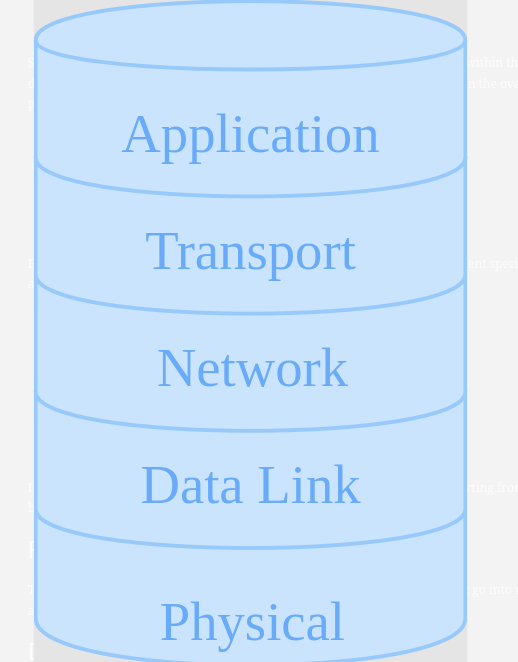
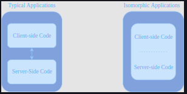
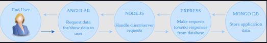
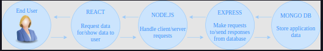
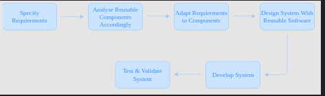
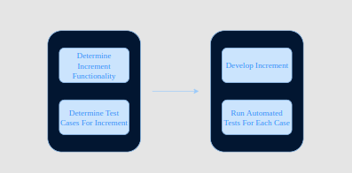

# 1. Networks

 

	

 

### Physical layer

The physical layer of a machine refers to the physical wiring and circuits that go into making the machine available on the network.

### Data link layer

The data link layer is responsible for transmitting data from any given machine to a device or machine that is exactly one link away.

### Network layer

The network layer is responsible for connecting any two machines on the Internet. It provides global connectivity and allows for end-systems to communicate with one another on a large scale, beyond what the data link layer has to offer.

### Transport layer

The transport layer is responsible for connecting applications on the Internet. It demultiplexes data coming in from a single source and transmits it to the application it is intended for. The basic purpose of the transport layer in the context of the web is that it provides process-to-process communication; it allows two individual processes on either the same machine or separate machines to send messages to each other. To do so, it uses sockets, which are essentially just the gateway to a process. In other words, sockets are the means through which messages are received and sent out by a process.

### Application layer

The application layer is responsible for process-to-process communication across the Internet. It is the topmost layer in the hierarchy, and the application itself is built on top of this. The application layer provides a communication interface and end-user services to the application for its communication with single processes.

# 2. Databases

### DBMS in web applications

DBMiS, short for Database Management System, is essentially a sort of nuance added to web development that allows data to be separated from the logic of the application and stored separately to be retrieved and processed when required. What this means is that the data is stored in a database that has an entirely autonomous system governing it. The application then makes calls to this database for any required data without having to integrate large amounts of handling code within the application code itself. Database management systems are, therefore, important to developers because they provide a highly efficient method for handling multiple types of data, without interfering with the application’s code.

## SQL databases

### MySQL

MySQL is amongst the most commonly used database management systems, and it has formed an integral part of most web applications in the past. MySQL is backed by Oracle and uses Standard Query Language (SQL) to store data in the form of a table, and to retrieve data requires making queries in SQL. MySQL, unlike SQL itself, works across all platforms, including Linux, iOS, and Windows and it has all the simplicity of SQL as it does not require any new syntax to be learned once you know SQL. Let’s look at an example of a MySQL query that creates a new table:

### PostgreSQL

PostgreSQL, also known as Postgres, is an open-source object-relational database management system that can handle large amounts of data and can provide seamless support for web applications that handle multiple concurrent users. It is the default database for macOS and provides efficient data management across platforms. Moreover, it also supports concurrent database accesses and allows users to add custom functions developed using several programming languages, including C, C++, and Java.

### MariaDB

MariaDB is a fork of MySQL, which was created by the original developers of MySQL after MySQL’s acquisition. It is meant to be a replacement of MySQL and includes a wide selection of storage engines so it can easily work with data from other relational data management systems. MariaDB, like MySQL, uses a standard querying language, which makes it just as simple to use as MySQL. Moreover, MariaDB runs on a number of operating systems and supports a wide variety of programming languages. In particular, it offers support for PHP, which, as we will later learn, is one of the most popular web development languages.

## NoSql Databases

### MongoDB

MongoDB, which is perhaps the most popular NoSQL DBMS, is an open-source non-relational database management system that has come to be known as the leading option when it comes to developing modern web applications. The reason for this is that MongoDB uses a document-based storage system that stores key-value pairs and allows for highly efficient lookups, making data retrieval much faster and easier than any typical SQL DBMS. To add to this, the document model ensures that data can be mapped directly to objects within the application code, and is, therefore, makes data handling significantly easy by eliminating the need for adding code to process queried data. In addition to this, MongoDB stores data in a highly flexible manner, thus allowing for fields to vary from document to document and the structure of data to be open to change over time. Data can also be indexed and queried according to specific user requirements and then updated in real-time. This makes MongoDB an exceptionally powerful system for data analysis, and that shows in its popularity. However, the most important aspect of quality that MongoDB covers is reliability; MongoDB is a distributed database at its core which means that it is available, scalable, and easily distributable across locations, thus making it well equipped for modern applications that require quick access to data at all times.

### Apache CouchDB#

CouchDB is an open-source NoSQL database management system that aims primarily to provide ease of use. CouchDB combines an intuitive document storage model with a powerful query engine to allow users to store their data safely on personal servers or with any leading cloud provider. In addition to this, CouchDB not only has the ability to store all types of data, but it also allows web applications to conveniently extract this data without having to add translational commands since CouchDB supports the formatting web applications typically use.

### Redis

Redis is an open-source in-memory data structure store that is often used as a database. It supports all kinds of data structures ranging from strings, hashes, lists, and sets to sorted sets with range queries, bitmaps, hyperloglogs, and geospatial indexes with radius queries and streams. This means that Redis provides a wide variety of data structures that can be used to store your application data in the most optimal way according to how the data is structured. In addition to this, because Redis stores data in-memory, it allows for fast data retrievals and, therefore, significantly speeds up the process of responding to user requests.

## Web Caching

<strong>Benefits of caching</strong>

There are multiple benefits of web caching, each of which has been enumerated below:

1. Data can be cached at several different points in the path between the client and the server. When the required data is cached closer to the client, requests do not increase network traffic too much since they are resolved much earlier along the path.
2. Extending on the first point, since requests are resolved earlier along the path, responses are sent back quicker as well, thus improving the responsiveness of web applications.
3. Aggressive caching along the network can also allow the application to sustain higher loads of data since a significant chunk of the data can be stored within caches.
4. In case the server has trouble accessing the database for some reason, data that has been stored in caches can still be served to end-users.

<strong>MongoDB</strong>

MongoDB has inbuilt mechanisms to handle caching and keeps the most recently used data in the RAM. If users have created indexes for their queries and the working data set fits in the RAM, MongoDB serves all queries from memory. However, MongoDB does not cache query results in order to return results from the cache for all future identical queries.

<strong>Redis</strong>

Redis, as we have already learned, stores all data in memory by default, and it is often used as a cache itself. It is, therefore, optimal to use as a database system in modern web applications.

<strong>CouchDB</strong>

CouchDB, like the other two NoSQL databases we have discussed, aims to cache all the data it possibly can. The smaller the file size, the more of the file can be cached by CouchDB. It is, therefore, a good idea to think about the data you want to store when it comes to NoSQL databases so that your web application can run seamlessly and unburdened by unnecessary amounts of data.

<strong>Memcached</strong>

Memcached is an open-source, high-performance, distributed memory object caching system that is intended to speed up dynamic web applications by alleviating database load. Memcached stores key-value pairs of data from database calls in memory in order to speed up the database lookup process. The underlying idea of Memcached is that it allows you to take memory from parts of your system where you have more than you need and make it accessible to areas where you have less than you need. Memcached is, therefore, a highly useful tool.

# 3. The Front End

### Client-side

The source code of a website can be broken down into two parts: client-side and server-side. The code on the ‘client’ side runs on the client computer’s browser and handles what the website looks like, how it requests data from the server, and how it interacts with temporary and local storage on the client machine. This includes but is not limited to selecting and styling user interface components, creating layouts, navigation, form validation, and cache handling. It’s okay if you don’t understand what these mean, we’ll define them in later lessons! Client-side languages include HTML, CSS, and JavaScript.

### Server-side

Server-side programming is used to deliver information that is queried from websites to clients.

Companies like Amazon use server-side programming to construct search results for products and make targeted product suggestions based on client preferences and previous buying habits. Banks use server-side programming to store account information and restrict access from unauthorized accounts. Social media sites such as Facebook, Twitter, and Instagram, use server-side programming to highlight, share, and control access to content that is relevant to each user. Server-side programming includes but is not limited to,

* Delivering and storing information efficiently
* Providing a custom experience for each user
* Controlling access to content
* Storing session/state information
* Notifying and communicating
* Analyzing data

# 4. The Back End

### Web server operating systems

Just like your personal computer has an operating system, Windows, Mac OS, or Linux, servers require an operating system to function too. Although, most server operating systems are specialized for servers and so slightly different from desktop operating systems.

<strong>Linux</strong>

Linux is not one operating system. It is a group of free and open-source operating systems. Typically, Linux is packaged in a form known as a Linux distribution (or distro for short) for both desktop and server use. There are many flavors or distros of Linux for server use. For example,

<strong>CentOS</strong>

The benefit of using CentOS is that it is stable and seldom crashes. It is also the most popular distro for servers as of now, so it also has the benefit of great support from the web, which means you won’t be stuck on any issue for long.

<strong>Debian</strong>

Like CentOS, Debian does not update as frequently as well. Debian is also a community distro, which means that new versions of Debian are released only when the community arrives at a consensus. So every Debian release is thoroughly tested and reliable. There is only one kind of Debian available for you to download and install, which works on both server and desktop.

<strong>Ubuntu</strong>

Ubuntu is the most popular Linux distro for the desktop. You might want to go with Ubuntu on your server if you want the advantage of being familiar with it!

## Back-end programming

### What do backend engineers do?

Backend engineers program servers to process user requests and respond with the requested resource correctly. They also write code to process and store user data.

### Efficient storage and delivery of information

Data that pertains to a website has to be stored in a database and delivered upon request. Consider Amazon’s database of items; if their database query system becomes inefficient at any point, they’ll lose customers.

### Customized user experience

Servers often store and use information about clients to provide a tailored user experience. For example, many sites store credit card details so that the information doesn’t have to be entered again.

### Controlled access to content

Backend programming entails restricting access to information appropriately. For example, in a ride-hailing application such as Uber, one user should not be able to view another’s car travel history.

### Store session/state information

Backend engineers also do user session handling, i.e., a string is associated with each user that visits the website, and data associated with the string such as their emails or order history are saved and displayed when the user visits again. Another example is saving the state of a simple game so that the user can go to the site again and carry on from where they left it.

### Notifications

Servers can be programmed to send general or user-specific notifications through the website itself or via email, SMS, instant messaging, video conversations, or other communications services.

A few examples include:

* Facebook and Twitter send emails and SMS messages to notify you of new communications.
* Amazon regularly sends product emails that suggest products similar to those already bought or viewed that you might be interested in.
* A web server might send warning messages to site administrators, alerting them to low memory on the server or suspicious user activity.

### Data analysis

A website may collect a lot of data about users: what they search for, what they buy, what they recommend, how long they stay on each page. Server-side programming can be used to refine responses based on an analysis of this data.

# 5. Web Development Frameworks

A web framework is defined as a package made up of a structure of files and folders of standardized code (HTML, CSS, JS documents, etc.), which can be used to support the development of websites as a basis to start building a site. Essentially, frameworks provide some basic, standard starter code that allows developers to build the meat of their website on.

## 5.1 Front-end frameworks

### Angular

Angular is a JavaScript framework created by Google that has been designed specifically for creating dynamic web applications. AngularJS addresses the limitations of HTML dynamic views in web applications and allows you to extend HTML vocabulary for your application. The resulting environment is highly expressive, readable, and quick to develop. Angular is used primarily to update the user interface in real time and provide a highly interactive website.

### Bootstrap

Bootstrap, which can easily be categorized as the most used open-source framework in the world, was created by Twitter developers and primarily served to ease up the process of adding CSS to HTML. Bootstrap, like any other front-end framework, includes CSS, HTML, and JavaScript components. It adheres to responsive web design standards, and thus, allows users to develop responsive websites of all complexities and sizes.

### React.js

React is a JavaScript library for building user interfaces. While there are doubts about whether it is an actual framework, it is a highly popular library that is used to build the View layer of an MVC application and warrants discussion in the context of front-end development. React is a component-based library that allows users to build encapsulated components, each of which manages its own state, and then compose them to make complex User Interfaces. The benefit of this is that when data changes, React makes sure that only the concerned components are updated. Given below is an example of what a simple React component looks like:

### Backbone

Backbone.js is an extremely light framework that allows you to structure your JavaScript code in an MVC (Model, View, Controller) form. Backbone makes use of models, views, and collections to ensure that your program does not become entangled in a myriad of callbacks and other extraneous pieces of code that make changes complicated. Instead, the models represent the data of the application and Backbone ensures that any changes to these models automatically trigger changes to any views that display these models.

### Semantic-UI

While Semantic-UI is a relatively new framework, it stands out in a number of ways. The primary distinction this particular framework enjoys is its simplicity. Semantic-UI uses natural language, and the code is, therefore, largely self-explanatory, thus making it highly desirable for beginners, particularly those with little or no coding experience. In addition to this, Semantic-UI is also integrated with a myriad of third-party libraries. This means that the development process becomes much easier because, for simpler applications, all the libraries you might require might already be integrated with the framework. Semantic-UI, therefore, is a great starting point for developing the front-end of beginner level websites. However, its package sizes are considerably larger than those of Foundation and Bootstrap, and it may not be a viable option when developing websites with more complex structures.

## 5.2 Back-end frameworks

### Express (JavaScript)

Express.js often referred to as the “de facto standard server framework” for Node.js, is a minimal and highly flexible Node.js web application framework that provides a robust set of features for web applications. The idea behind Express is to simplify the back-end development process enough to reduce basic back-end features such as creating an HTTP server from multiple, unintelligible lines of Node.js code, to a single instruction, while simultaneously keeping the core syntactical and logical characteristics of Node.js intact.

### Symfony (PHP)

Symfony is a web development framework for PHP. The key idea behind Symfony is that it is essentially a set of reusable components. The benefits of this are obvious; with over 30 standalone components at your disposal, the process of writing an application becomes considerably simplified and, consequently, much easier and more efficient. Symfony, like the previous frameworks we have discussed, allows for more compact, readable, and simple code. This is beneficial because it allows you to focus on the higher-level functionality you want to implement as the more mundane tasks become confined to much smaller pieces of code that do not need to be thought about from scratch.

### Django (Python)

Django is a high-level Python web framework that enables the rapid development of secure and maintainable websites. Django, like Express, takes care of reducing code for basic functionalities to simple instructions, so you can focus on writing your application and implementing more specific functionality without needing to reinvent the wheel and getting caught up in needlessly long bouts of code in doing so!

### Ruby on Rails (Ruby)

Ruby on Rails, also known as Rails, is a server-side web application framework written in Ruby. Rails is built on the Model View Controller architecture that we have previously studied, and it provides default structures for everything that goes into each component, including databases, several common web services as well as web pages themselves. Ruby on Rails, therefore, separates the process of web development into simplified components and provides a basic structure for each element any given component comprises of, thus making it immensely convenient for users to build their own specific functionality on top of these provisional structures without having to worry about starting from the very basics.

### ASP .NET (C#)

ASP.NET is an open-source, server-side web development framework for building modern web applications and services using .NET or any language supported by .NET. ASP .NET was developed by Microsoft to facilitate the process of developing dynamic web pages, and it has, therefore, considerably simplified the process of creating websites based on HTML5, CSS, and JavaScript. As a result, it has made it possible for users to create websites that are not only simple and fast but also have the capacity to scale to millions of users.

## 5.3 Isomorphic Frameworks

 

	
	 
	<code>Typical client/server frameworks vs. client-server frameworks</code>

 

### Meteor JS

Meteor, or Meteor JS, is an open-source client-server JavaScript framework that has been written in Node.js. In addition to having the benefit of being a stand-alone framework that allows for development on both the front and back end of an application, Meteor also allows for prototyping, which means that it allows for versions of the same application to be stored and tested. In addition to this, Meteor also produces code that can span multiple platforms including Android, iOS, and the web itself.

On the server-side, Meteor integrates with MongoDB and follows protocols to create a database management mechanism that enables data changes to be propagated directly to the client-side without having to write any synchronization code on both ends explicitly.

On the client-side, Meteor has its own templating engine called Blaze that allows users to choose from templates for the user interface to customize, thus making the front end development much easier. Alternatively, Meteor can also be used with some of the front-end frameworks we have already studied. It can be integrated with the Angular or React frameworks to seamlessly produce user interfaces that don’t require too much work.

### Lazo.js

Lazo.js is a client-server web development framework built on Node.js that has the benefit of providing front-end developers with a simple, and relatively familiar syntactical structure that they can use to create MVC structured web applications that are separated as multiple sophisticated components that come together to form the complete front-end. LazoJS has the added benefit of providing an optimized first-page load, something that is often a key determinant of user experience. These benefits are achieved using a combination of tools comprised of Backbone.js, RequireJS, and jQuery.

Lazo was initially created to address the issues that spring from creating an entire website front ends as a single unit or single page applications instead of separating the user interface into mutually exclusive components. Lazo, in turn, not only provides front-end engineers with a familiar environment for creating complete web applications but also ensures that components are separated as such to avoid overly complicated application logic. Pages are constructed via reusable, testable components that have their own life cycles, thus allowing developers to easily create complex views for the interface while providing excellent encapsulation and separation of concerns.

### Rendr

Rendr is a small library that allows you to run your Backbone.js applications on both the client and the server, depending on the specific needs of the web application you are developing. This means that Rendr provides users with mechanisms to build entire applications on either the client or server end in addition to the ability to distribute the code on both the client and server and using Rendr on both ends. Essentially, Rendr allows your web server to serve fully-formed HTML pages to any link within your application, while simultaneously preserving the feel of a traditional Backbone.js client-side MVC application.

In recent times the bulk of applications have been moving increasingly to the client side. However, this is not always suitable and may cause some problems. As a solution to this, Rendr is intended to be a building block along the way to create web applications that can be run on either side of the wire according to the specific needs of your application.

## 5.4 Software Stacks

### History and LAMP stack

LAMP Stack entails using Linux, Apache, MySQL, and PHP together to build an application. Linux is the operating system, Apache acts as the HTTP server, MySQL provides the relational database to persist the application’s information, and PHP is the programming language in which the application is built. LAMP was amongst the earliest software stacks that web applications were typically built using.

In recent times, however, Single Page Applications have grown in popularity in that they provide a more seamless user experience where lightweight server calls change what is rendered on the screen without having to refresh the entire page. Consequently, front-end frameworks are increasingly being used to achieve the benefits that SPAs pose. Similarly, NoSQL databases have also gained popularity due to the simplicity and efficiency they provide. As a result, modern software stacks have evolved to include front-end frameworks such as Angular and NoSQL databases such as MongoDB. The most common types include MEANStack and MERNStack, both of which we will be discussing in the following sections.

 

	
	 
	<code>Structure of a MEANStack application</code>

 

 

	
	 
	<code>Structure of a MERNStack application</code>

 

 

	
	 
	<code>Reuse-oriented Software Engineering Process</code>

 

## Test Driven Development

 

	
	 
	<code>Test Driven Development</code>

 

#### Automated testing

The core idea in test-driven development is to simultaneously develop automated tests with each increment and ensure the tests are passed. Tests are automated using APIs that automate browsers and execute test cases without human intervention. Test cases refer to the multiple features a web application intends to cater to, and testing requires a test to be developed for each test case. In the rest of the lesson, we will be discussing some popular testing tools that may be helpful.

#### Selenium

Selenium is one of the most commonly used tools for web application testing. Its primary purpose is to automate browsers, which means that Selenium allows for tests that can automatically access the application being developed and check if the intended functionality has been implemented correctly. The gist of Selenium is that it allows users to define a set of activities for a web browser to carry out so applications can automatically be opened and tested through the tool, just like a human would test functionality manually.

#### Jest

Jest is an integrated, “zero-configuration” JavaScript testing tool that is often used by Facebook to test all of its JavaScript code, including React applications. Jest works with every compile-to-JavaScript language and integrates seamlessly with Babel which means you can write React, TypeScript, and much more without configuration.

#### PyUnit

PyUnit refers to the Python unit testing framework. A unit test targets a small unit of code, such as a method that implements a particular functionality. Also known as unittest, PyUnit supports test automation, the ability to share setup and shutdown code for tests, aggregation of tests into collections, as well as the ability to keep tests independent from the reporting framework. PyUnit is, therefore, an essential tool in testing the intended functionality of a given web application.

#### JUnit

JUnit is the Java equivalent of PyUnit, and it enables users to write unit test cases in the Java programming language.

JUnit, like PyUnit, has been important in the development of test-driven development and is one of a family of unit testing frameworks collectively known as xUnit.
